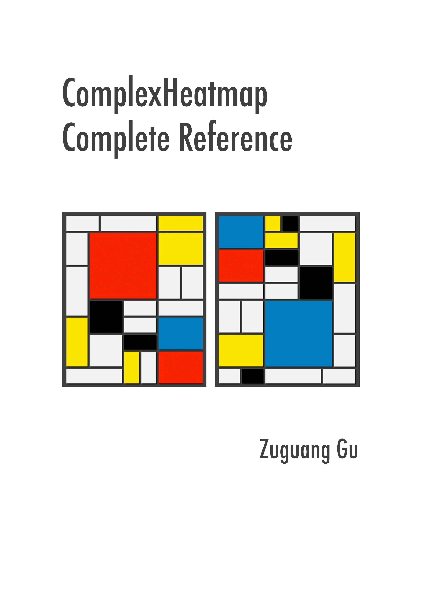

--- 
title: "ComplexHeatmap Complete Reference"
author: "Zuguang Gu"
date: "last revised on 2020-04-28"
site: bookdown::bookdown_site
output: bookdown::gitbook
documentclass: book
bibliography: [book.bib]
biblio-style: apalike
link-citations: yes
github-repo: jokergoo/ComplexHeatmap-reference
cover-image: complexheatmap-cover.jpg
url: 'https\://jokergoo.github.io/ComplexHeatmap-reference/book'
description: "Complex heatmaps are efficient to visualize associations between different sources of data sets and reveal potential patterns. Here the ComplexHeatmap R package provides a highly flexible way to arrange multiple heatmaps and supports various annotation graphics. This book is the complete reference to ComplexHeatmap pacakge."
---

# About {-}

This is the documentation of the
[**ComplexHeatmap**](https://github.com/jokergoo/ComplexHeatmap) package. Examples in the book
are generated under version 2.3.5.

You can get a stable Bioconductor version from http://bioconductor.org/packages/release/bioc/html/ComplexHeatmap.html, but the most up-to-date version is always on Github and you can install it by:


```r
library(devtools)
install_github("jokergoo/ComplexHeatmap")
```

The [development branch on Bioconductor](http://bioconductor.org/packages/devel/bioc/html/ComplexHeatmap.html) is
basically synchronized to Github repository. 

The **ComplexHeatmap** package is inspired from the [**pheatmap**](https://CRAN.R-project.org/package=pheatmap) package. You can find many arguments in **ComplexHeatmap** have the same names as in **pheatmap**. Also you
can find [this old package](https://github.com/jokergoo/pheatmap2) that I tried to develop by modifying **pheatmap**.

**Please note, this documentation is not completely compatible with older versions (< 1.99.0, before
Oct, 2018), but the major functionality keeps the same.**

If you use **ComplexHeatmap** in your publications, I am appreciated if you can cite:

Gu, Z. (2016) Complex heatmaps reveal patterns and correlations in multidimensional genomic data.
DOI: [10.1093/bioinformatics/btw313](https://doi.org/10.1093/bioinformatics/btw313)





Session info:


```r
sessionInfo()
```

```
## R version 3.6.2 (2019-12-12)
## Platform: x86_64-apple-darwin15.6.0 (64-bit)
## Running under: macOS Catalina 10.15.4
## 
## Matrix products: default
## BLAS:   /Library/Frameworks/R.framework/Versions/3.6/Resources/lib/libRblas.0.dylib
## LAPACK: /Library/Frameworks/R.framework/Versions/3.6/Resources/lib/libRlapack.dylib
## 
## locale:
## [1] en_GB.UTF-8/en_GB.UTF-8/en_GB.UTF-8/C/en_GB.UTF-8/en_GB.UTF-8
## 
## attached base packages:
## [1] grid      stats     graphics  grDevices utils     datasets  methods  
## [8] base     
## 
## other attached packages:
## [1] dendsort_0.3.3       dendextend_1.13.4    circlize_0.4.9      
## [4] ComplexHeatmap_2.3.5
## 
## loaded via a namespace (and not attached):
##  [1] Rcpp_1.0.4.6        compiler_3.6.2      pillar_1.4.3       
##  [4] RColorBrewer_1.1-2  viridis_0.5.1       tools_3.6.2        
##  [7] digest_0.6.25       evaluate_0.14       viridisLite_0.3.0  
## [10] lifecycle_0.2.0     tibble_3.0.0        gtable_0.3.0       
## [13] clue_0.3-57         pkgconfig_2.0.3     png_0.1-7          
## [16] rlang_0.4.5         cli_2.0.2           yaml_2.2.1         
## [19] parallel_3.6.2      xfun_0.13           gridExtra_2.3      
## [22] stringr_1.4.0       dplyr_0.8.5         cluster_2.1.0      
## [25] knitr_1.28          GlobalOptions_0.1.2 vctrs_0.2.4        
## [28] tidyselect_1.0.0    glue_1.4.0          R6_2.4.1           
## [31] GetoptLong_0.1.8    fansi_0.4.1         rmarkdown_2.1      
## [34] bookdown_0.18       ggplot2_3.3.0       purrr_0.3.3        
## [37] magrittr_1.5        htmltools_0.4.0     scales_1.1.0       
## [40] ellipsis_0.3.0      assertthat_0.2.1    shape_1.4.4        
## [43] colorspace_1.4-1    stringi_1.4.6       munsell_0.5.0      
## [46] crayon_1.3.4        rjson_0.2.20
```


<!--chapter:end:index.Rmd-->


# Introduction {#introduction}

Complex heatmaps are efficient to visualize associations between different
sources of data sets and reveal potential patterns. Here the
**ComplexHeatmap** package provides a highly flexible way to arrange multiple
heatmaps and supports self-defined annotation graphics.

## General design {#general-design}


A single heatmap is composed of the heatmap body and the heatmap components.
The heatmap body can be split by rows and columns. The heatmap components are
titles, dendrograms, matrix names and heatmap annotations, which are put on
the four sides of the heamap body. The heatmap components are reordered or
split according to the heatmap body.


A heatmap list is concatenation of a list of heatmaps and heatmap annotations.
Surrounding the heatmap list, there are global-level titles and legends.

One important things for the heatmap list is that rows for all heatmaps and
annotations (it is row annotation if the heatmap list is horizontal.) are all
adusted so that the same row in all heatmaps and annotations corresponds to a
same feature.


The heatmaps and annotations (now it is column annotation) can also be
arranged vertically.


And the heatmap list can also be split by rows and by columns.

The **ComplexHeatmap** package is implemented in an object-oriented way. To
describe a heatmap list, there are following classes:

- `Heatmap` class: a single heatmap containing heatmap body, row/column names,
  titles, dendrograms and row/column annotations.
- `HeatmapList` class: a list of heatmaps and heatmap annotations.
- `HeatmapAnnotation` class: defines a list of row annotations and column
  annotations. The heatmap annotations can be components of heatmap, also they
  can be independent as heatmaps.

There are also several internal classes:

- `SingleAnnotation` class: defines a single row annotation or column
  annotation. The `HeatmapAnnotation` object contains a list of
  `SingleAnnotation` objects.
- `ColorMapping` class: mapping from values to colors. The color mappings of
  the main matrix and the annotations are controlled by `ColorMapping` class.
- `AnnotationFunction` class: constructs user-defined annotations. This is the
  base of creating user-defined annotation graphics.

**ComplexHeatmap** is implemented under **grid** system, so users need to know
basic **grid** functionality to get full use of the package.


## A brief description of following chapters {#a-brief-description-of-following-chapters}

- [**A Single Heatmap**](a-single-heatmap.html)

This chapter describes the configurations of a single heatmap.

- [**Heatmap Annotations**](#heatmap-annotations.html)

This chapter describes the concept of the heatmap annotation and demonstrates
how to make simple annotations as well as complex annotations. Also, the
chapter explains the difference between column annotations and row
annotations.

- [**A List of Heatmaps**](a-list-of-heatmaps.html)

This chapter describes how to concatenate a list of heatmaps and annotations
and how adjustment is applied to keep the correspondence of the heatmaps.

- [**Legends**](legends.html)

This chapter describes how to configurate the heatmap legends and annotation
legends, also how to create self-defined legends.

- [**Heatmap Decoration**](heatmap-decoration.html)

This chapter describes methods to add more self-defined graphics to the
heatmaps after the heatmaps are generated.

- [**OncoPrint**](oncoprint.html)

This chapter describes how to make oncoPrints and how to integrate other
functionalities from **ComplexHeatmap** to oncoPrints.

- [**UpSet plot**](upset-plot.html)

This chapter describes how to make enhanced UpSet plots.

- [**Other High-level Plots**](other-high-level-plots.html)

This chapter describes functions implemented in **ComplexHeatmap** for
specific use, e.g. visualizing distributions.

- [**More Examples**](more-examples.html)

More simulated and real-world examples are demonstrated in this chapter.

<!--chapter:end:01-introduction.Rmd-->


# A Single Heatmap {#a-single-heatmap}

A single heatmap is the most used approach for visualizing the data. Although
"the shining point" of the **ComplexHeatmap** package is it can visualize a
list of heatmaps in parallel, as the basic unit of the heatmap list, it is
still very important to have the single heatmap nicely configured.

First let's generate a random matrix where there are three groups by columns
and three groups by rows:


```r
set.seed(123)
nr1 = 4; nr2 = 8; nr3 = 6; nr = nr1 + nr2 + nr3
nc1 = 6; nc2 = 8; nc3 = 10; nc = nc1 + nc2 + nc3
mat = cbind(rbind(matrix(rnorm(nr1*nc1, mean = 1,   sd = 0.5), nr = nr1),
          matrix(rnorm(nr2*nc1, mean = 0,   sd = 0.5), nr = nr2),
          matrix(rnorm(nr3*nc1, mean = 0,   sd = 0.5), nr = nr3)),
    rbind(matrix(rnorm(nr1*nc2, mean = 0,   sd = 0.5), nr = nr1),
          matrix(rnorm(nr2*nc2, mean = 1,   sd = 0.5), nr = nr2),
          matrix(rnorm(nr3*nc2, mean = 0,   sd = 0.5), nr = nr3)),
    rbind(matrix(rnorm(nr1*nc3, mean = 0.5, sd = 0.5), nr = nr1),
          matrix(rnorm(nr2*nc3, mean = 0.5, sd = 0.5), nr = nr2),
          matrix(rnorm(nr3*nc3, mean = 1,   sd = 0.5), nr = nr3))
   )
mat = mat[sample(nr, nr), sample(nc, nc)] # random shuffle rows and columns
rownames(mat) = paste0("row", seq_len(nr))
colnames(mat) = paste0("column", seq_len(nc))
```

Following command contains the minimal argument for the `Heatmap()` function
which just visualizes the matrix as a heatmap with default settings. Very
similar as other heatmap tools, it draws the dendrograms, the row/column names
and the heatmap legend. The default color schema is "blue-white-red" which is
mapped to the minimal-mean-maximal values in the matrix. The title for the
legend is assigned with an internal index number.


```r
Heatmap(mat)
```


The title for the legend is taken from the "name" of the heatmap by default.
Each heatmap has a name which is like a unique identifier for the heatmap and
it is important when you have a list of heatmaps. In later chapters, you will
find the heatmap name is used for setting the "main heatmap" and is used for
decoration of heatmaps. If the name is not assigned, an internal name is
assigned to the heatmap in a form of `matrix_%d`. In following examples in
this chapter, we give the name `mat` to the heatmap (for which you will see
the change of the legend in the next plot).

If you put `Heatmap()` inside a function or a `for`/`if`/`while` chunk, you
won't see the heatmap after executing `Heatmap()`. In this case, you need to
use `draw()` function explicitly as follows. We will explain this point in
more detail in Section \@ref(plot-the-heatmap).


```r
ht = Heatmap(mat)
draw(ht)
```

## Colors {#colors}

For heatmap visualization, colors are the major representation of the data
matrix. In most cases, the heatmap visualizes a matrix with continuous numeric
values. In this case, users should provide a color mapping function. A color
mapping function should accept a vector of values and return a vector of
corresponding colors. **Users should always use `circlize::colorRamp2()`
function to generate the color mapping function** with using `Heatmap()`. The
two arguments for `colorRamp2()` is a vector of break values and a vector of
corresponding colors. `colorRamp2()` linearly interpolates colors in every
interval through LAB color space. Also using `colorRamp2()` helps to generate
a legend with proper tick marks.

In following example, values between -2 and 2 are linearly interpolated to get
corresponding colors, values larger than 2 are all mapped to red and values
less than -2 are all mapped to green.


```r
library(circlize)
col_fun = colorRamp2(c(-2, 0, 2), c("green", "white", "red"))
col_fun(seq(-3, 3))
```

```
## [1] "#00FF00FF" "#00FF00FF" "#B1FF9AFF" "#FFFFFFFF" "#FF9E81FF" "#FF0000FF"
## [7] "#FF0000FF"
```

```r
Heatmap(mat, name = "mat", col = col_fun)
```


As you can see, the color mapping function exactly maps negative values to
green and positive values to red, even when the distribution of negative
values and positive values are not centric to zero. Also this color mapping
function is not affected by outliers. In following plot, the clustering is
heavily affected by the outlier but not the color mapping.


```r
mat2 = mat
mat2[1, 1] = 100000
Heatmap(mat2, name = "mat", col = col_fun)
```


More importantly, `colorRamp2()` makes colors in multiple heatmaps comparible
if they are set with a same color mapping function. In following three
heatmaps, a same color always corresponds to a same value.


```r
Heatmap(mat, name = "mat", col = col_fun, column_title = "mat")
Heatmap(mat/4, name = "mat", col = col_fun, column_title = "mat/4")
Heatmap(abs(mat), name = "mat", col = col_fun, column_title = "abs(mat)")
```


If the matrix is continuous, you can also simply provide a vector of colors
and colors will be linearly interpolated. But remember this method is not
robust to outliers because the mapping starts from the minimal value in the
matrix and ends with the maximal value. Following color mapping setting is
identical to `colorRamp2(seq(min(mat), max(mat), length = 10), rev(rainbow(10)))`.


```r
Heatmap(mat, name = "mat", col = rev(rainbow(10)))
```


If the matrix contains discrete values (either numeric or character), colors
should be specified as a named vector to make it possible for the mapping from
discrete values to colors. If there is no name for the color, the order of
colors corresponds to the order of `unique(mat)`. Note now the legend is
generated from the color mapping vector.

Following sets colors for a discrete numeric matrix (you don't need to convert
it to a character matrix).


```r
discrete_mat = matrix(sample(1:4, 100, replace = TRUE), 10, 10)
colors = structure(1:4, names = c("1", "2", "3", "4")) # black, red, green, blue
Heatmap(discrete_mat, name = "mat", col = colors)
```


Or a character matrix:


```r
discrete_mat = matrix(sample(letters[1:4], 100, replace = TRUE), 10, 10)
colors = structure(1:4, names = letters[1:4])
Heatmap(discrete_mat, name = "mat", col = colors)
```


As you see in the two examples above, for the numeric matrix (no matter the
color is continuous mapping or discrete mapping), by default clustering is
applied on both dimensions while for character matrix, clustering is turned
off (but you can still cluster a character matrix if you provide a proper
distance metric for two character vectors, see example in Section
\@ref(distance-methods)).

``NA`` is allowed in the matrix. You can control the color of `NA` by `na_col`
argument (by default it is grey for `NA`). **The matrix that contains `NA` can
be clustered by `Heatmap()`.**

Note the `NA` value is not presented in the legend.


```r
mat_with_na = mat
na_index = sample(c(TRUE, FALSE), nrow(mat)*ncol(mat), replace = TRUE, prob = c(1, 9))
mat_with_na[na_index] = NA
Heatmap(mat_with_na, name = "mat", na_col = "black")
```


Color space is important for interpolating colors. By default, colors are
linearly interpolated in [LAB color
space](https://en.wikipedia.org/wiki/Lab_color_space), but you can select the
color space in `colorRamp2()` function. Compare following two plots. Can you
see the difference?


```r
f1 = colorRamp2(seq(min(mat), max(mat), length = 3), c("blue", "#EEEEEE", "red"))
f2 = colorRamp2(seq(min(mat), max(mat), length = 3), c("blue", "#EEEEEE", "red"), 
    space = "RGB")
Heatmap(mat, name = "mat1", col = f1, column_title = "LAB color space")
Heatmap(mat, name = "mat2", col = f2, column_title = "RGB color space")
```


In following plots, corresponding values change evenly on the folded lines,
you can see how colors change under different color spaces (top plots:
green-black-red, bottom plots: blue-white-red. The plot is made by
[**HilbertCurve**package](https://bioconductor.org/packages/release/bioc/html/HilbertCurve.html)).


Last but not the least, colors for the heatmap borders can be set by the
`border` and `rect_gp` arguments. `border` controls the global border of the
heatmap body and `rect_gp` controls the border of the grids in the heatmap.

The value of `border` can be logical (`TRUE` corresponds to `black`) or a
character of color (e.g. `red`).

`rect_gp` is a `gpar` object which means you can only set it by
`grid::gpar()`. Since the filled color is already controlled by the heatmap
color mapping, you can only set the `col` parameter in `gpar()` to control the
border of the heatmap grids.


```r
Heatmap(mat, name = "mat", border = TRUE)
```


```r
Heatmap(mat, name = "mat", rect_gp = gpar(col = "white", lwd = 2))
```


If `col` is not set, the default color mapping by `Heatmap()` is designed with
trying to be as convinient and meaningful as possible. Following are the rules
for the default color mapping (by `ComplexHeatmap:::default_col()`):

- If the values are characters, the colors are generated by
  `circlize::rand_color()`;
- If the values are from the heatmap annotation and are numeric, colors are
  mapped between white and one random color by linearly interpolating to the
  mininum and maxinum.
- If the values are from the matrix (let's denote it as $M$) which corresponds
  to the heatmap body:
    * If the fraction of positive values in $M$ is between 25% and 75%, colors
      are mapped to blue, white and red by linearly interpolating to $-q$, 0
      and $q$, where $q$ is the maximum of $|M|$ if the number of unique
      values is less than 100, or $q$ is the 99^th percentile of $|M|$. This
      color mapping is centric to zero.
    * Or else the colors are mapped to blue, white and red by linearly
      interpolating to $q_1$, $(q_1 + q_2)/2$ and $q_2$, where $q_1$ and $q_2$
      are mininum and maxinum if the number of unique values is $M$ is less
      than 100, or $q1$ is the 1^th percentile and $q2$ is the 99^th
      percentile in $M$.

`rect_gp` allows a non-standard parameter `type`. If it is set to `"none"`,
the clustering is still applied but nothing in drawn on the heatmap body. The
customized graphics on heatmap body can be added via a self-defined `cell_fun`
or `layer_fun` (see Section \@ref(customize-the-heatmap-body)).


```r
Heatmap(mat, name = "mat", rect_gp = gpar(type = "none"))
```


## Titles {#heatmap-titles}

The title of the heatmap basically tells what the plot is about. In
**ComplexHeatmap** package, you can set heatmap title either by the row or/and
by the column. Note at a same time you can only put e.g. column title either
on the top or at the bottom of the heatmap.

The graphic parameters can be set by `row_title_gp` and `column_title_gp`
respectively. Please remember you should use `gpar()` to specify graphic
parameters.


```r
Heatmap(mat, name = "mat", column_title = "I am a column title", 
    row_title = "I am a row title")
```


```r
Heatmap(mat, name = "mat", column_title = "I am a column title at the bottom", 
    column_title_side = "bottom")
```


```r
Heatmap(mat, name = "mat", column_title = "I am a big column title", 
    column_title_gp = gpar(fontsize = 20, fontface = "bold"))
```


Rotations for titles can be set by `row_title_rot` and `column_title_rot`, but
only horizontal and vertical rotations are allowed.


```r
Heatmap(mat, name = "mat", row_title = "row title", row_title_rot = 0)
```


Row or column title supports as a template which is used when rows or columns
are split in the heatmap (because there will be multiple row/column titles).
This functionality is introduced in Section \@ref(heatmap-split). A quick
example would be:


```r
# code only for demonstration
# row title would be cluster_1 and cluster_2
Heatmap(mat, name = "mat", row_km = 2, row_title = "cluster_%s")
```

You can set `fill` parameter in `row_title_gp` and `column_title_gp` to set
the background color of titles. Since `col` in e.g. `row_title_gp` controls the 
color of text, `border` is used to control the color of the background border.


```r
Heatmap(mat, name = "mat", column_title = "I am a column title", 
    column_title_gp = gpar(fill = "red", col = "white", border = "red"))
```


If the graphic elements are texts, they can be set as mathematical formulas.


```r
Heatmap(mat, name = "mat", 
    column_title = expression(hat(beta) == (X^t * X)^{-1} * X^t * y)) 
```


## Clustering {#clustering}

Clustering might be the key component of the heatmap visualization. In
**ComplexHeatmap** package, hierarchical clustering is supported with great
flexibility. You can specify the clustering either by:

- a pre-defined distance method (e.g. `"euclidean"` or `"pearson"`),
- a distance function,
- a object that already contains clustering (a `hclust` or `dendrogram` object
  or object that can be coerced to `dendrogram` class),
- a clustering function.

It is also possible to render the dendrograms with different colors and styles
for different branches for better revealing structures of the dendrogram (e.g.
by `dendextend::color_branches()`).

First, there are general settings for the clustering, e.g. whether apply
clustering or show dendrograms, the side of the dendrograms and heights of the
dendrograms.


```r
Heatmap(mat, name = "mat", cluster_rows = FALSE) # turn off row clustering
```


```r
Heatmap(mat, name = "mat", show_column_dend = FALSE) # hide column dendrogram
```


```r
Heatmap(mat, name = "mat", row_dend_side = "right", column_dend_side = "bottom")
```


```r
Heatmap(mat, name = "mat", column_dend_height = unit(4, "cm"), 
    row_dend_width = unit(4, "cm"))
```


### Distance methods {#distance-methods}

Hierarchical clustering is performed in two steps: calculate the distance
matrix and apply clustering. There are three ways to specify distance metric
for clustering:

- specify distance as a pre-defined option. The valid values are the supported
  methods in `dist()` function and in `"pearson"`, `"spearman"` and
  `"kendall"`. The correlation distance is defined as `1 - cor(x, y, method)`.
  All these built-in distance methods allow `NA` values.
- a self-defined function which calculates distance from a matrix. The
  function should only contain one argument. Please note for clustering on
  columns, the matrix will be transposed automatically.
- a self-defined function which calculates distance from two vectors. The
  function should only contain two arguments. Note this might be slow because
  it is implemented by two nested `for` loop.


```r
Heatmap(mat, name = "mat", clustering_distance_rows = "pearson",
    column_title = "pre-defined distance method (1 - pearson)")
```


```r
Heatmap(mat, name = "mat", clustering_distance_rows = function(m) dist(m),
    column_title = "a function that calculates distance matrix")
```


```r
Heatmap(mat, name = "mat", clustering_distance_rows = function(x, y) 1 - cor(x, y),
    column_title = "a function that calculates pairwise distance")
```


Based on these features, we can apply clustering which is robust to outliers
based on the pairwise distance. Note here we set the color mapping function
because we don't want outliers affect the colors.


```r
mat_with_outliers = mat
for(i in  1:10) mat_with_outliers[i, i] = 1000
robust_dist = function(x, y) {
    qx = quantile(x, c(0.1, 0.9))
    qy = quantile(y, c(0.1, 0.9))
    l = x > qx[1] & x < qx[2] & y > qy[1] & y < qy[2]
    x = x[l]
    y = y[l]
    sqrt(sum((x - y)^2))
}
```

We can compare the two heatmaps with or without the robust distance method:


```r
Heatmap(mat_with_outliers, name = "mat", 
    col = colorRamp2(c(-2, 0, 2), c("green", "white", "red")),
    column_title = "dist")
Heatmap(mat_with_outliers, name = "mat", 
    col = colorRamp2(c(-2, 0, 2), c("green", "white", "red")),
    clustering_distance_rows = robust_dist,
    clustering_distance_columns = robust_dist,
    column_title = "robust_dist")
```


If there are proper distance methods (like methods in [**stringdist**
package](https://cran.r-project.org/web/packages/stringdist/)), you can also
cluster a character matrix. `cell_fun` argument will be introduced in Section
\@ref(customize-the-heatmap-body).


```r
mat_letters = matrix(sample(letters[1:4], 100, replace = TRUE), 10)
# distance in the ASCII table
dist_letters = function(x, y) {
    x = strtoi(charToRaw(paste(x, collapse = "")), base = 16)
    y = strtoi(charToRaw(paste(y, collapse = "")), base = 16)
    sqrt(sum((x - y)^2))
}
Heatmap(mat_letters, name = "letters", col = structure(2:5, names = letters[1:4]),
    clustering_distance_rows = dist_letters, clustering_distance_columns = dist_letters,
    cell_fun = function(j, i, x, y, w, h, col) { # add text to each grid
        grid.text(mat_letters[i, j], x, y)
    })
```


### Clustering methods {#clustering-methods}

Method to perform hierarchical clustering can be specified by
`clustering_method_rows` and `clustering_method_columns`. Possible methods are
those supported in `hclust()` function.


```r
Heatmap(mat, name = "mat", clustering_method_rows = "single")
```


If you already have a clustering object or a function which directly returns a
clustering object, you can ignore the distance settings and set `cluster_rows`
or `cluster_columns` to the clustering objects or clustering functions. If it
is a clustering function, the only argument should be the matrix and it should
return a `hclust` or `dendrogram` object or a object that can be coerced to
the `dendrogram` class.

In following example, we perform clustering with methods from **cluster**
package either by a pre-calculated clustering object or a clustering function:


```r
library(cluster)
Heatmap(mat, name = "mat", cluster_rows = diana(mat),
   cluster_columns = agnes(t(mat)), column_title = "clustering objects")
```


```r
# if cluster_columns is set as a function, you don't need to transpose the matrix
Heatmap(mat, name = "mat", cluster_rows = diana,
   cluster_columns = agnes, column_title = "clustering functions")
```


The last command is as same as :


```r
# code only for demonstration
Heatmap(mat, name = "mat", cluster_rows = function(m) as.dendrogram(diana(m)),
    cluster_columns = function(m) as.dendrogram(agnes(m)), 
    column_title = "clutering functions")
```

Please note, when `cluster_rows` is set as a function, the argument `m` is the
input `mat` itself, while for `cluster_columns`, `m` is the transpose of
`mat`.

`fastcluster::hclust` implements a faster version of `hclust()`. You can set
it to `cluster_rows` and `cluster_columns` to use the faster version of
`hclust()`.


```r
# code only for demonstration
fh = function(x) fastcluster::hclust(dist(x))
Heatmap(mat, name = "mat", cluster_rows = fh, cluster_columns = fh)
```

To make it more convinient to use the faster version of `hclust()` (assuming
you have many heatmaps to construct), it can be set as a global option. The
usage of `ht_opt` is introduced in Section
\@ref(change-parameters-globally).


```r
# code only for demonstration
ht_opt$fast_hclust = TRUE
# now fastcluster::hclust is used in all heatmaps
```

This is one specific scenario that you might already have a subgroup
classification for the matrix rows or columns, and you only want to perform
clustering for the features in the same subgroup. There is one way that you
can split the heatmap by the subgroup variable (see Section
\@ref(heatmap-split)), or you can use `cluster_within_group()` clustering
function to generate a special dendrogram.


```r
group = kmeans(t(mat), centers = 3)$cluster
Heatmap(mat, name = "mat", cluster_columns = cluster_within_group(mat, group))
```


In above example, columns in a same group are still clustered, but the
dendrogram is degenerated as a flat line. The dendrogram on columns shows the
hierarchy of the groups.

### Render dendrograms {#render-dendrograms}

If you want to render the dendrogram, normally you need to generate a
`dendrogram` object and render it in the first place, then send it to the
`cluster_rows` or `cluster_columns` argument.

You can render your `dendrogram` object by the **dendextend** package to make
a more customized visualization of the dendrogram. Note **ComplexHeatmap**
only allows rendering on the dendrogram lines.


```r
library(dendextend)
row_dend = as.dendrogram(hclust(dist(mat)))
row_dend = color_branches(row_dend, k = 2) # `color_branches()` returns a dendrogram object
Heatmap(mat, name = "mat", cluster_rows = row_dend)
```


`row_dend_gp` and `column_dend_gp` control the global graphic setting for
dendrograms. Note e.g. graphic settings in `row_dend` will be overwritten by
`row_dend_gp`.


```r
Heatmap(mat, name = "mat", cluster_rows = row_dend, row_dend_gp = gpar(col = "red"))
```


### Reorder dendrograms {#reorder-dendrograms}

In the `Heatmap()` function, dendrograms are reordered to make features with
larger difference more separated from each others (please refer to the
documentation of `reorder.dendrogram()`). Here the difference (or it is called
the weight) is measured by the row means if it is a row dendrogram or by the
column means if it is a column dendrogram. `row_dend_reorder` and
`column_dend_reorder` control whether to apply dendrogram reordering if the
value is set as logical. The two arguments also control the weight for the
reordering if they are set to numeric vectors (it will be sent to the `wts`
argument of `reorder.dendrogram()`). The reordering can be turned off by
setting e.g. `row_dend_reorder = FALSE`.

By default, dendrogram reordering is turned on if
`cluster_rows`/`cluster_columns` is set as logical value or a clustering
function. It is turned off if `cluster_rows`/`cluster_columns` is set as
clustering object.

Compare following two heatmaps:


```r
m2 = matrix(1:100, nr = 10, byrow = TRUE)
Heatmap(m2, name = "mat", row_dend_reorder = FALSE, column_title = "no reordering")
Heatmap(m2, name = "mat", row_dend_reorder = TRUE, column_title = "apply reordering")
```


There are many other methods for reordering dendrograms, e.g. the **dendsort**
package. Basically, all these methods still return a dendrogram that has been
reordered, thus, we can firstly generate the row or column dendrogram based on
the data matrix, reorder it by some method, and assign it back to
`cluster_rows` or `cluster_columns`.

Compare following two reorderings. Can you tell which is better?


```r
Heatmap(mat, name = "mat", column_title = "default reordering")

library(dendsort)
dend = dendsort(hclust(dist(mat)))
Heatmap(mat, name = "mat", cluster_rows = dend, column_title = "reorder by dendsort")
```


## Set row and column orders {#row-and_column_orders}

Clustering is used to adjust row orders and column orders of the heatmap, but
you can still set the order manually by `row_order` and `column_order`. If
e.g. `row_order` is set, row clustering is turned off by default.


```r
Heatmap(mat, name = "mat", row_order = order(as.numeric(gsub("row", "", rownames(mat)))), 
    column_order = order(as.numeric(gsub("column", "", colnames(mat)))))
```


The orders can be character vectors if they are just shuffles of the matrix row names or column names.


```r
Heatmap(mat, name = "mat", row_order = sort(rownames(mat)), 
    column_order = sort(colnames(mat)))
```


Note `row_dend_reorder` and `row_order` are two different things.
`row_dend_reorder` is applied on the dendrogram. For any node in the
dendrogram, rotating its two branches actually gives an identical dendrogram,
thus, reordering the dendrogram by automatically rotating sub-dendrogram at
every node can help to separate elements further from each other which show
more difference. As a comparison, `row_order` is simply applied on the matrix
and normally dendrograms should be turned off.

## Seriation {#heatmap-seriation}

Seriation is an interesting technique for ordering the matrix (see this
interesting post: http://nicolas.kruchten.com/content/2018/02/seriation/). The
powerful [**seriation**
package](https://cran.r-project.org/web/packages/seriation/index.html)
implements quite a lot of methods for seriation. Since it is easy to extract
row orders and column orders from the object returned by the core function
`seriate()` from **seriation** package. They can be directly assigned to
`row_order` and `column_order` to make the heatmap.

The first example demonstrates to directly apply `seriate()` on the matrix.
Since the `"BEA_TSP"` method only allows a non-negative matrix, we modify the
matrix to `max(mat) - mat`.


```r
library(seriation)
o = seriate(max(mat) - mat, method = "BEA_TSP")
Heatmap(max(mat) - mat, name = "mat", 
    row_order = get_order(o, 1), column_order = get_order(o, 2))
```


Or you can apply `seriate()` to the distance matrix. Now the order for rows
and columns needs to be calcualted separatedly because the distance matrix
needs to be calculated separatedly for columns and rows.


```r
o1 = seriate(dist(mat), method = "TSP")
o2 = seriate(dist(t(mat)), method = "TSP")
Heatmap(mat, name = "mat", row_order = get_order(o1), column_order = get_order(o2))
```


Some seriation methods also contain the hierarchical clustering information.
Let's try:


```r
o1 = seriate(dist(mat), method = "GW")
o2 = seriate(dist(t(mat)), method = "GW")
```

`o1` and `o2` are actually mainly composed of `hclust` objects:


```r
class(o1[[1]])
```

```
## [1] "ser_permutation_vector" "hclust"
```

And the orders are the same by using `hclust$order` or `get_order()`.


```r
o1[[1]]$order
```

```
##  [1]  5  2 10 17  4 16 18  7 15 14 11  8  1  3 12  6 13  9
```

```r
# should be the same as the previous one
get_order(o1)
```

```
##  [1]  5  2 10 17  4 16 18  7 15 14 11  8  1  3 12  6 13  9
```

And we can add the dendrograms to the heatmap.


```r
Heatmap(mat, name = "mat", cluster_rows = as.dendrogram(o1[[1]]), 
    cluster_columns = as.dendrogram(o2[[1]]))
```


For more use of the `seriate()` function, please refer to the [**seriation**
package](https://cran.r-project.org/web/packages/seriation/index.html).

## Dimension names {#dimension-names}

The row names and column names are drawn on the right and bottom sides of the
heatmap by default. Side, visibility and graphic parameters for dimension
names can be set as follows:


```r
Heatmap(mat, name = "mat", row_names_side = "left", row_dend_side = "right", 
    column_names_side = "top", column_dend_side = "bottom")
```


```r
Heatmap(mat, name = "mat", show_row_names = FALSE)
```


```r
Heatmap(mat, name = "mat", row_names_gp = gpar(fontsize = 20))
```


```r
Heatmap(mat, name = "mat", row_names_gp = gpar(col = c(rep("red", 10), rep("blue", 8))))
```


```r
Heatmap(mat, name = "mat", row_names_centered = TRUE, column_names_centered = TRUE)
```


The rotation of column names can be set by `column_names_rot`:


```r
Heatmap(mat, name = "mat", column_names_rot = 45)
Heatmap(mat, name = "mat", column_names_rot = 45, column_names_side = "top",
    column_dend_side = "bottom")
```


If you have row names or column names which are too long,
`row_names_max_width` or `column_names_max_height` can be used to set the
maximal space for them. The default maximal space for row names and column
names are all 6 cm. In following code, `max_text_width()` is a helper function
to quick calculate maximal width from a vector of text.


```r
mat2 = mat
rownames(mat2)[1] = paste(c(letters, LETTERS), collapse = "")
Heatmap(mat2, name = "mat")
Heatmap(mat2, name = "mat", 
    row_names_max_width = max_text_width(
        rownames(mat2), 
        gp = gpar(fontsize = 12)
    ))
```


Instead of directly using the row/column names from the matrix, you can also
provide another character vector which corresponds to the rows or columns and
set it by `row_labels` or `column_labels`. This is useful because you don't
need to change the dimension names of the matrix to change the labels on the
heatmap while you can directly provide the new labels.

There is one typical scenario that `row_labels` and `column_labels` are
useful. For the gene expression analysis, we might use Ensembl ID as the gene
ID which is used as row names of the gene expression matrix. However, the
Ensembl ID is for the indexing of the Ensembl database but not for the human
reading. Instead, we would prefer to put gene symbols on the heatmap as the
row names which is easier to read. To do this, we only need to assign the
corresponding gene symbols to `row_labels` without modifying the original
matrix.

The second advantage is `row_labels` or `column_labels` allows duplicated
labels, while duplicated row names or column names are not allowed in the
matrix.

Following gives a simple example that we put letters as row labels and column
labels:


```r
# use a named vector to make sure the correspondance between 
# row names and row labels is correct
row_labels = structure(paste0(letters[1:24], 1:24), names = paste0("row", 1:24))
column_labels = structure(paste0(LETTERS[1:24], 1:24), names = paste0("column", 1:24))
row_labels
```

```
##  row1  row2  row3  row4  row5  row6  row7  row8  row9 row10 row11 row12 row13 
##  "a1"  "b2"  "c3"  "d4"  "e5"  "f6"  "g7"  "h8"  "i9" "j10" "k11" "l12" "m13" 
## row14 row15 row16 row17 row18 row19 row20 row21 row22 row23 row24 
## "n14" "o15" "p16" "q17" "r18" "s19" "t20" "u21" "v22" "w23" "x24"
```

```r
Heatmap(mat, name = "mat", row_labels = row_labels[rownames(mat)], 
    column_labels = column_labels[colnames(mat)])
```


The third advantage is mathematical expression can be used as row names in the
heatmap.


```r
Heatmap(mat, name = "mat", row_labels = expression(alpha, beta, gamma, delta, epsilon, 
    zeta, eta, theta, iota, kappa, lambda, mu, nu, xi, omicron, pi, rho, sigma))
```


`anno_text()` (Section \@ref(text-annotation)) can be used to add more customized
labels for heatmap rows and columns.

## Heatmap split {#heatmap-split}

One major advantage of **ComplexHeatmap** package is it supports splitting the
heatmap by rows and columns to better group the features and additionally
highlight the patterns.

Following arguments control the splitting: `row_km`, `row_split`, `column_km`,
`column_split`. In following, we call the sub-clusters generated by splitting
"_slices_".

### Split by k-means clustering {#split-by-kmeans-clustering}

`row_km` and `column_km` apply k-means partitioning.


```r
Heatmap(mat, name = "mat", row_km = 2)
```


```r
Heatmap(mat, name = "mat", column_km = 3)
```


Row splitting and column splitting can be performed simultaneously.


```r
Heatmap(mat, name = "mat", row_km = 2, column_km = 3)
```


You might notice there are dashed lines in the row and column dendrograms,
it will be explained in Section \@ref(split-by-categorical-variables) (last paragraph).

`Heatmap()` internally calls `kmeans()` with random start points, which
results in, for some cases, generating different clusters from repeated runs.
To get rid of this problem, `row_km_repeats` and `column_km_repeats` can be
set to a number larger than 1 to run `kmeans()` multiple times and a final
consensus k-means clustering is used. Please note the final number of clusters
form consensus k-means might be smaller than the number set in `row_km` and
`column_km`.


```r
Heatmap(mat, name = "mat", 
    row_km = 2, row_km_repeats = 100,
    column_km = 3, column_km_repeats = 100)
```

### Split by categorical variables {#split-by-categorical-variables}

More generally, `row_split` or `column_split` can be set to a categorical
vector or a data frame where different combinations of levels split the
rows/columns in the heatmap. How to control the order of the slices is
introduced in Section \@ref(order-of-slices).


```r
# split by a vector
Heatmap(mat, name = "mat", 
    row_split = rep(c("A", "B"), 9), column_split = rep(c("C", "D"), 12))
```


```r
# split by a data frame
Heatmap(mat, name = "mat", 
    row_split = data.frame(rep(c("A", "B"), 9), rep(c("C", "D"), each = 9)))
```


```r
# split on both dimensions
Heatmap(mat, name = "mat", row_split = factor(rep(c("A", "B"), 9)),
    column_split = factor(rep(c("C", "D"), 12)))
```


Actually, k-means clustering just generates a vector of cluster classes and
appends to `row_split` or `column_split`. `row_km`/`column_km` and be used
mixed with `row_split` and `column_split`.


```r
Heatmap(mat, name = "mat", row_split = rep(c("A", "B"), 9), row_km = 2)
```


which is the same as:


```r
# code only for demonstration
cl = kmeans(mat, centers = 2)$cluster
# classes from k-means are always put as the first column in `row_split`
Heatmap(mat, name = "mat", row_split = cbind(cl, rep(c("A", "B"), 9)))
```

If you are not happy with the default k-means partition, it is easy to use
other partition methods by just assigning the partition vector to
`row_split`/`column_split`.


```r
pa = cluster::pam(mat, k = 3)
Heatmap(mat, name = "mat", row_split = paste0("pam", pa$clustering))
```


If `row_order` or `column_order` is set, in each row/column slice, it is still
ordered.


```r
# remember when `row_order` is set, row clustering is turned off
Heatmap(mat, name = "mat", row_order = 18:1, row_km = 2)
```


Character matrix can only be split by `row_split`/`column_split` argument.


```r
# split by the first column in `discrete_mat`
Heatmap(discrete_mat, name = "mat", col = 1:4, row_split = discrete_mat[, 1])
```


If `row_km`/`column_km` is set or `row_split`/`column_split` is set as a
vector or a data frame, hierarchical clustering is first applied to each slice
(of course, clustering should be turned on) which generates `k` dendrograms,
then a parent dendrogram is generated based on the mean values of each slice.
**The height of the parent dendrogram is adjusted by adding the maximal height
of the dendrograms in all children slices and the parent dendrogram is added
on top of the children dendrograms to form a single global dendrogram.** This
is why you see dashed lines in the dendrograms in previous heatmaps. They are
used to mark the parent dendrogram and the children dendrograms, and alert
users they are calculated in different ways. These dashed lines can be removed
by setting `show_parent_dend_line = FALSE` in `Heatmap()`, or set it as a
global option: `ht_opt$show_parent_dend_line = FALSE`.


```r
Heatmap(mat, name = "mat", row_km = 2, column_km = 3, show_parent_dend_line = FALSE)
```


### Split by dendrogram {#spilt-by-dendrogram}

A second scenario for splitting is that users may still want to keep the
global dendrogram **which is generated from the complete matrix** while not
split it in the first place. In this case, `row_split`/`column_split` can be
set to a single number which will apply `cutree()` on the row/column
dendrogram. This works when `cluster_rows`/`cluster_columns` is set to `TRUE`
or is assigned with a `hclust`/`dendrogram` object.

For this case, the dendrogram is still as same as the original one, expect the
positions of dendrogram leaves are slightly adjusted by the gaps between
slices. (There is no dashed lines, because here the dendrogram is calcualted
as a complete one and there is no parent dendrogram or children dendrograms.)


```r
Heatmap(mat, name = "mat", row_split = 2, column_split = 3)
```


```
## Called from: make_cluster(object, "row")
## debug: if (which == "row") {
##     reorder = -rowMeans(mat, na.rm = TRUE)
## } else {
##     reorder = -colMeans(mat, na.rm = TRUE)
## }
## debug: reorder = -rowMeans(mat, na.rm = TRUE)
## debug: if (do_reorder) {
##     if (which == "row") {
##         if (length(reorder) != nrow(mat)) {
##             stop_wrap("weight of reordering should have same length as number of rows.\n")
##         }
##     }
##     else {
##         if (length(reorder) != ncol(mat)) {
##             stop_wrap("weight of reordering should have same length as number of columns\n")
##         }
##     }
##     for (i in seq_along(dend_list)) {
##         if (length(order_list[[i]]) > 1) {
##             sub_ind = sort(order_list[[i]])
##             dend_list[[i]] = reorder(dend_list[[i]], reorder[sub_ind], 
##                 mean)
##             order_list[[i]] = order.dendrogram(dend_list[[i]])
##         }
##     }
## }
## debug: if (which == "row") {
##     if (length(reorder) != nrow(mat)) {
##         stop_wrap("weight of reordering should have same length as number of rows.\n")
##     }
## } else {
##     if (length(reorder) != ncol(mat)) {
##         stop_wrap("weight of reordering should have same length as number of columns\n")
##     }
## }
## debug: if (length(reorder) != nrow(mat)) {
##     stop_wrap("weight of reordering should have same length as number of rows.\n")
## }
## debug: for (i in seq_along(dend_list)) {
##     if (length(order_list[[i]]) > 1) {
##         sub_ind = sort(order_list[[i]])
##         dend_list[[i]] = reorder(dend_list[[i]], reorder[sub_ind], 
##             mean)
##         order_list[[i]] = order.dendrogram(dend_list[[i]])
##     }
## }
## debug: if (length(order_list[[i]]) > 1) {
##     sub_ind = sort(order_list[[i]])
##     dend_list[[i]] = reorder(dend_list[[i]], reorder[sub_ind], 
##         mean)
##     order_list[[i]] = order.dendrogram(dend_list[[i]])
## }
## debug: sub_ind = sort(order_list[[i]])
## debug: dend_list[[i]] = reorder(dend_list[[i]], reorder[sub_ind], mean)
## debug: order_list[[i]] = order.dendrogram(dend_list[[i]])
## debug: if (length(order_list[[i]]) > 1) {
##     sub_ind = sort(order_list[[i]])
##     dend_list[[i]] = reorder(dend_list[[i]], reorder[sub_ind], 
##         mean)
##     order_list[[i]] = order.dendrogram(dend_list[[i]])
## }
## debug: sub_ind = sort(order_list[[i]])
## debug: dend_list[[i]] = reorder(dend_list[[i]], reorder[sub_ind], mean)
## debug: order_list[[i]] = order.dendrogram(dend_list[[i]])
## debug: dend_list = lapply(dend_list, adjust_dend_by_x)
## debug: slot(object, paste0(which, "_order")) = unlist(order_list)
## debug: slot(object, paste0(which, "_order_list")) = order_list
## debug: slot(object, paste0(which, "_dend_list")) = dend_list
## debug: slot(object, paste0(which, "_dend_param")) = dend_param
## debug: slot(object, paste0(which, "_dend_slice")) = dend_slice
## debug: if (!is.null(split)) {
##     split = data.frame(rep(seq_along(order_list), times = sapply(order_list, 
##         length)))
##     object@matrix_param[[paste0(which, "_split")]] = split
##     for (i in seq_along(names_param$gp)) {
##         if (length(names_param$gp[[i]]) == length(order_list)) {
##             gp_temp = NULL
##             for (j in seq_along(order_list)) {
##                 gp_temp[order_list[[j]]] = names_param$gp[[i]][j]
##             }
##             names_param$gp[[i]] = gp_temp
##         }
##     }
##     if (!is.null(names_param$anno)) {
##         names_param$anno@var_env$gp = names_param$gp
##     }
##     slot(object, paste0(which, "_names_param")) = names_param
##     n_slice = length(order_list)
##     if (length(gap) == 1) {
##         gap = rep(gap, n_slice)
##     }
##     else if (length(gap) == n_slice - 1) {
##         gap = unit.c(gap, unit(0, "mm"))
##     }
##     else if (length(gap) != n_slice) {
##         stop_wrap(qq("Length of `gap` should be 1 or number of @{which} slices."))
##     }
##     object@matrix_param[[paste0(which, "_gap")]] = gap
##     title = slot(object, paste0(which, "_title"))
##     if (!is.null(split)) {
##         if (length(title) == 0 && !is.null(title)) {
##             title = apply(unique(split), 1, paste, collapse = ",")
##         }
##         else if (length(title) == 1) {
##             if (grepl("%s", title)) {
##                 title = apply(unique(split), 1, function(x) {
##                   lt = lapply(x, function(x) x)
##                   lt$fmt = title
##                   do.call(sprintf, lt)
##                 })
##             }
##             else if (grepl("@\\{.+\\}", title)) {
##                 title = apply(unique(split), 1, function(x) {
##                   x = x
##                   envir = environment()
##                   title = get("title")
##                   op = parent.env(envir)
##                   calling_env = object@heatmap_param$calling_env
##                   parent.env(envir) = calling_env
##                   title = GetoptLong::qq(title, envir = envir)
##                   parent.env(envir) = op
##                   return(title)
##                 })
##             }
##             else if (grepl("\\{.+\\}", title)) {
##                 if (!requireNamespace("glue")) {
##                   stop_wrap("You need to install glue package.")
##                 }
##                 title = apply(unique(split), 1, function(x) {
##                   x = x
##                   envir = environment()
##                   title = get("title")
##                   op = parent.env(envir)
##                   calling_env = object@heatmap_param$calling_env
##                   parent.env(envir) = calling_env
##                   title = glue::glue(title, envir = calling_env)
##                   parent.env(envir) = op
##                   return(title)
##                 })
##             }
##         }
##     }
##     slot(object, paste0(which, "_title")) = title
## }
## debug: split = data.frame(rep(seq_along(order_list), times = sapply(order_list, 
##     length)))
## debug: object@matrix_param[[paste0(which, "_split")]] = split
## debug: for (i in seq_along(names_param$gp)) {
##     if (length(names_param$gp[[i]]) == length(order_list)) {
##         gp_temp = NULL
##         for (j in seq_along(order_list)) {
##             gp_temp[order_list[[j]]] = names_param$gp[[i]][j]
##         }
##         names_param$gp[[i]] = gp_temp
##     }
## }
## debug: if (length(names_param$gp[[i]]) == length(order_list)) {
##     gp_temp = NULL
##     for (j in seq_along(order_list)) {
##         gp_temp[order_list[[j]]] = names_param$gp[[i]][j]
##     }
##     names_param$gp[[i]] = gp_temp
## }
## debug: if (!is.null(names_param$anno)) {
##     names_param$anno@var_env$gp = names_param$gp
## }
## debug: names_param$anno@var_env$gp = names_param$gp
## debug: slot(object, paste0(which, "_names_param")) = names_param
## debug: n_slice = length(order_list)
## debug: if (length(gap) == 1) {
##     gap = rep(gap, n_slice)
## } else if (length(gap) == n_slice - 1) {
##     gap = unit.c(gap, unit(0, "mm"))
## } else if (length(gap) != n_slice) {
##     stop_wrap(qq("Length of `gap` should be 1 or number of @{which} slices."))
## }
## debug: gap = rep(gap, n_slice)
## debug: object@matrix_param[[paste0(which, "_gap")]] = gap
## debug: title = slot(object, paste0(which, "_title"))
## debug: if (!is.null(split)) {
##     if (length(title) == 0 && !is.null(title)) {
##         title = apply(unique(split), 1, paste, collapse = ",")
##     }
##     else if (length(title) == 1) {
##         if (grepl("%s", title)) {
##             title = apply(unique(split), 1, function(x) {
##                 lt = lapply(x, function(x) x)
##                 lt$fmt = title
##                 do.call(sprintf, lt)
##             })
##         }
##         else if (grepl("@\\{.+\\}", title)) {
##             title = apply(unique(split), 1, function(x) {
##                 x = x
##                 envir = environment()
##                 title = get("title")
##                 op = parent.env(envir)
##                 calling_env = object@heatmap_param$calling_env
##                 parent.env(envir) = calling_env
##                 title = GetoptLong::qq(title, envir = envir)
##                 parent.env(envir) = op
##                 return(title)
##             })
##         }
##         else if (grepl("\\{.+\\}", title)) {
##             if (!requireNamespace("glue")) {
##                 stop_wrap("You need to install glue package.")
##             }
##             title = apply(unique(split), 1, function(x) {
##                 x = x
##                 envir = environment()
##                 title = get("title")
##                 op = parent.env(envir)
##                 calling_env = object@heatmap_param$calling_env
##                 parent.env(envir) = calling_env
##                 title = glue::glue(title, envir = calling_env)
##                 parent.env(envir) = op
##                 return(title)
##             })
##         }
##     }
## }
## debug: if (length(title) == 0 && !is.null(title)) {
##     title = apply(unique(split), 1, paste, collapse = ",")
## } else if (length(title) == 1) {
##     if (grepl("%s", title)) {
##         title = apply(unique(split), 1, function(x) {
##             lt = lapply(x, function(x) x)
##             lt$fmt = title
##             do.call(sprintf, lt)
##         })
##     }
##     else if (grepl("@\\{.+\\}", title)) {
##         title = apply(unique(split), 1, function(x) {
##             x = x
##             envir = environment()
##             title = get("title")
##             op = parent.env(envir)
##             calling_env = object@heatmap_param$calling_env
##             parent.env(envir) = calling_env
##             title = GetoptLong::qq(title, envir = envir)
##             parent.env(envir) = op
##             return(title)
##         })
##     }
##     else if (grepl("\\{.+\\}", title)) {
##         if (!requireNamespace("glue")) {
##             stop_wrap("You need to install glue package.")
##         }
##         title = apply(unique(split), 1, function(x) {
##             x = x
##             envir = environment()
##             title = get("title")
##             op = parent.env(envir)
##             calling_env = object@heatmap_param$calling_env
##             parent.env(envir) = calling_env
##             title = glue::glue(title, envir = calling_env)
##             parent.env(envir) = op
##             return(title)
##         })
##     }
## }
## debug: title = apply(unique(split), 1, paste, collapse = ",")
## debug: slot(object, paste0(which, "_title")) = title
## debug: return(object)
## Called from: make_cluster(object, "column")
## debug: if (which == "row") {
##     reorder = -rowMeans(mat, na.rm = TRUE)
## } else {
##     reorder = -colMeans(mat, na.rm = TRUE)
## }
## debug: reorder = -colMeans(mat, na.rm = TRUE)
## debug: if (do_reorder) {
##     if (which == "row") {
##         if (length(reorder) != nrow(mat)) {
##             stop_wrap("weight of reordering should have same length as number of rows.\n")
##         }
##     }
##     else {
##         if (length(reorder) != ncol(mat)) {
##             stop_wrap("weight of reordering should have same length as number of columns\n")
##         }
##     }
##     for (i in seq_along(dend_list)) {
##         if (length(order_list[[i]]) > 1) {
##             sub_ind = sort(order_list[[i]])
##             dend_list[[i]] = reorder(dend_list[[i]], reorder[sub_ind], 
##                 mean)
##             order_list[[i]] = order.dendrogram(dend_list[[i]])
##         }
##     }
## }
## debug: if (which == "row") {
##     if (length(reorder) != nrow(mat)) {
##         stop_wrap("weight of reordering should have same length as number of rows.\n")
##     }
## } else {
##     if (length(reorder) != ncol(mat)) {
##         stop_wrap("weight of reordering should have same length as number of columns\n")
##     }
## }
## debug: if (length(reorder) != ncol(mat)) {
##     stop_wrap("weight of reordering should have same length as number of columns\n")
## }
## debug: for (i in seq_along(dend_list)) {
##     if (length(order_list[[i]]) > 1) {
##         sub_ind = sort(order_list[[i]])
##         dend_list[[i]] = reorder(dend_list[[i]], reorder[sub_ind], 
##             mean)
##         order_list[[i]] = order.dendrogram(dend_list[[i]])
##     }
## }
## debug: if (length(order_list[[i]]) > 1) {
##     sub_ind = sort(order_list[[i]])
##     dend_list[[i]] = reorder(dend_list[[i]], reorder[sub_ind], 
##         mean)
##     order_list[[i]] = order.dendrogram(dend_list[[i]])
## }
## debug: sub_ind = sort(order_list[[i]])
## debug: dend_list[[i]] = reorder(dend_list[[i]], reorder[sub_ind], mean)
## debug: order_list[[i]] = order.dendrogram(dend_list[[i]])
## debug: if (length(order_list[[i]]) > 1) {
##     sub_ind = sort(order_list[[i]])
##     dend_list[[i]] = reorder(dend_list[[i]], reorder[sub_ind], 
##         mean)
##     order_list[[i]] = order.dendrogram(dend_list[[i]])
## }
## debug: sub_ind = sort(order_list[[i]])
## debug: dend_list[[i]] = reorder(dend_list[[i]], reorder[sub_ind], mean)
## debug: order_list[[i]] = order.dendrogram(dend_list[[i]])
## debug: if (length(order_list[[i]]) > 1) {
##     sub_ind = sort(order_list[[i]])
##     dend_list[[i]] = reorder(dend_list[[i]], reorder[sub_ind], 
##         mean)
##     order_list[[i]] = order.dendrogram(dend_list[[i]])
## }
## debug: sub_ind = sort(order_list[[i]])
## debug: dend_list[[i]] = reorder(dend_list[[i]], reorder[sub_ind], mean)
## debug: order_list[[i]] = order.dendrogram(dend_list[[i]])
## debug: dend_list = lapply(dend_list, adjust_dend_by_x)
## debug: slot(object, paste0(which, "_order")) = unlist(order_list)
## debug: slot(object, paste0(which, "_order_list")) = order_list
## debug: slot(object, paste0(which, "_dend_list")) = dend_list
## debug: slot(object, paste0(which, "_dend_param")) = dend_param
## debug: slot(object, paste0(which, "_dend_slice")) = dend_slice
## debug: if (!is.null(split)) {
##     split = data.frame(rep(seq_along(order_list), times = sapply(order_list, 
##         length)))
##     object@matrix_param[[paste0(which, "_split")]] = split
##     for (i in seq_along(names_param$gp)) {
##         if (length(names_param$gp[[i]]) == length(order_list)) {
##             gp_temp = NULL
##             for (j in seq_along(order_list)) {
##                 gp_temp[order_list[[j]]] = names_param$gp[[i]][j]
##             }
##             names_param$gp[[i]] = gp_temp
##         }
##     }
##     if (!is.null(names_param$anno)) {
##         names_param$anno@var_env$gp = names_param$gp
##     }
##     slot(object, paste0(which, "_names_param")) = names_param
##     n_slice = length(order_list)
##     if (length(gap) == 1) {
##         gap = rep(gap, n_slice)
##     }
##     else if (length(gap) == n_slice - 1) {
##         gap = unit.c(gap, unit(0, "mm"))
##     }
##     else if (length(gap) != n_slice) {
##         stop_wrap(qq("Length of `gap` should be 1 or number of @{which} slices."))
##     }
##     object@matrix_param[[paste0(which, "_gap")]] = gap
##     title = slot(object, paste0(which, "_title"))
##     if (!is.null(split)) {
##         if (length(title) == 0 && !is.null(title)) {
##             title = apply(unique(split), 1, paste, collapse = ",")
##         }
##         else if (length(title) == 1) {
##             if (grepl("%s", title)) {
##                 title = apply(unique(split), 1, function(x) {
##                   lt = lapply(x, function(x) x)
##                   lt$fmt = title
##                   do.call(sprintf, lt)
##                 })
##             }
##             else if (grepl("@\\{.+\\}", title)) {
##                 title = apply(unique(split), 1, function(x) {
##                   x = x
##                   envir = environment()
##                   title = get("title")
##                   op = parent.env(envir)
##                   calling_env = object@heatmap_param$calling_env
##                   parent.env(envir) = calling_env
##                   title = GetoptLong::qq(title, envir = envir)
##                   parent.env(envir) = op
##                   return(title)
##                 })
##             }
##             else if (grepl("\\{.+\\}", title)) {
##                 if (!requireNamespace("glue")) {
##                   stop_wrap("You need to install glue package.")
##                 }
##                 title = apply(unique(split), 1, function(x) {
##                   x = x
##                   envir = environment()
##                   title = get("title")
##                   op = parent.env(envir)
##                   calling_env = object@heatmap_param$calling_env
##                   parent.env(envir) = calling_env
##                   title = glue::glue(title, envir = calling_env)
##                   parent.env(envir) = op
##                   return(title)
##                 })
##             }
##         }
##     }
##     slot(object, paste0(which, "_title")) = title
## }
## debug: split = data.frame(rep(seq_along(order_list), times = sapply(order_list, 
##     length)))
## debug: object@matrix_param[[paste0(which, "_split")]] = split
## debug: for (i in seq_along(names_param$gp)) {
##     if (length(names_param$gp[[i]]) == length(order_list)) {
##         gp_temp = NULL
##         for (j in seq_along(order_list)) {
##             gp_temp[order_list[[j]]] = names_param$gp[[i]][j]
##         }
##         names_param$gp[[i]] = gp_temp
##     }
## }
## debug: if (length(names_param$gp[[i]]) == length(order_list)) {
##     gp_temp = NULL
##     for (j in seq_along(order_list)) {
##         gp_temp[order_list[[j]]] = names_param$gp[[i]][j]
##     }
##     names_param$gp[[i]] = gp_temp
## }
## debug: if (!is.null(names_param$anno)) {
##     names_param$anno@var_env$gp = names_param$gp
## }
## debug: names_param$anno@var_env$gp = names_param$gp
## debug: slot(object, paste0(which, "_names_param")) = names_param
## debug: n_slice = length(order_list)
## debug: if (length(gap) == 1) {
##     gap = rep(gap, n_slice)
## } else if (length(gap) == n_slice - 1) {
##     gap = unit.c(gap, unit(0, "mm"))
## } else if (length(gap) != n_slice) {
##     stop_wrap(qq("Length of `gap` should be 1 or number of @{which} slices."))
## }
## debug: gap = rep(gap, n_slice)
## debug: object@matrix_param[[paste0(which, "_gap")]] = gap
## debug: title = slot(object, paste0(which, "_title"))
## debug: if (!is.null(split)) {
##     if (length(title) == 0 && !is.null(title)) {
##         title = apply(unique(split), 1, paste, collapse = ",")
##     }
##     else if (length(title) == 1) {
##         if (grepl("%s", title)) {
##             title = apply(unique(split), 1, function(x) {
##                 lt = lapply(x, function(x) x)
##                 lt$fmt = title
##                 do.call(sprintf, lt)
##             })
##         }
##         else if (grepl("@\\{.+\\}", title)) {
##             title = apply(unique(split), 1, function(x) {
##                 x = x
##                 envir = environment()
##                 title = get("title")
##                 op = parent.env(envir)
##                 calling_env = object@heatmap_param$calling_env
##                 parent.env(envir) = calling_env
##                 title = GetoptLong::qq(title, envir = envir)
##                 parent.env(envir) = op
##                 return(title)
##             })
##         }
##         else if (grepl("\\{.+\\}", title)) {
##             if (!requireNamespace("glue")) {
##                 stop_wrap("You need to install glue package.")
##             }
##             title = apply(unique(split), 1, function(x) {
##                 x = x
##                 envir = environment()
##                 title = get("title")
##                 op = parent.env(envir)
##                 calling_env = object@heatmap_param$calling_env
##                 parent.env(envir) = calling_env
##                 title = glue::glue(title, envir = calling_env)
##                 parent.env(envir) = op
##                 return(title)
##             })
##         }
##     }
## }
## debug: if (length(title) == 0 && !is.null(title)) {
##     title = apply(unique(split), 1, paste, collapse = ",")
## } else if (length(title) == 1) {
##     if (grepl("%s", title)) {
##         title = apply(unique(split), 1, function(x) {
##             lt = lapply(x, function(x) x)
##             lt$fmt = title
##             do.call(sprintf, lt)
##         })
##     }
##     else if (grepl("@\\{.+\\}", title)) {
##         title = apply(unique(split), 1, function(x) {
##             x = x
##             envir = environment()
##             title = get("title")
##             op = parent.env(envir)
##             calling_env = object@heatmap_param$calling_env
##             parent.env(envir) = calling_env
##             title = GetoptLong::qq(title, envir = envir)
##             parent.env(envir) = op
##             return(title)
##         })
##     }
##     else if (grepl("\\{.+\\}", title)) {
##         if (!requireNamespace("glue")) {
##             stop_wrap("You need to install glue package.")
##         }
##         title = apply(unique(split), 1, function(x) {
##             x = x
##             envir = environment()
##             title = get("title")
##             op = parent.env(envir)
##             calling_env = object@heatmap_param$calling_env
##             parent.env(envir) = calling_env
##             title = glue::glue(title, envir = calling_env)
##             parent.env(envir) = op
##             return(title)
##         })
##     }
## }
## debug: title = apply(unique(split), 1, paste, collapse = ",")
## debug: slot(object, paste0(which, "_title")) = title
## debug: return(object)
```

```r
dend = hclust(dist(mat))
dend = color_branches(dend, k = 2)
Heatmap(mat, name = "mat", cluster_rows = dend, row_split = 2)
```


If you want to combine splitting from `cutree()` and other categorical
variables, you need to generate the classes from `cutree()` in the first
place, append to e.g. `row_split` as a data frame and then send it to
`row_split` argument.


```r
# code only for demonstration
split = data.frame(cutree(hclust(dist(mat)), k = 2), rep(c("A", "B"), 9))
Heatmap(mat, name = "mat", row_split = split)
```

### Order of slices {#order-of-slices}

When `row_split`/`column_split` is set as categorical variable (a vector or a
data frame) or `row_km`/`column_km` is set, by default, there is an additional
clustering applied to the mean of slices to show the hierarchy in the slice
level. Under this scenario, you cannot precisely control the order of slices
because it is controlled by the clustering of slices.

Nevertheless, you can set `cluster_row_slices` or `cluster_column_slices` to
`FALSE` to turn off the clustering on slices, and now you can precisely
control the order of slices.

When there is no slice clustering, the order of each slice can be controlled
by `levels` of each variable in `row_split`/`column_split` (in this case, each
variable should be a factor). If all variables are characters, the default
order is `unique(row_split)` or `unique(column_split)`. Compare following
heatmaps:


```r
Heatmap(mat, name = "mat", 
  row_split = rep(LETTERS[1:3], 6),
    column_split = rep(letters[1:6], 4))
```


```r
# clustering is similar as previous heatmap with branches in some nodes in the dendrogram flipped
Heatmap(mat, name = "mat", 
  row_split = factor(rep(LETTERS[1:3], 6), levels = LETTERS[3:1]),
    column_split = factor(rep(letters[1:6], 4), levels = letters[6:1]))
```


```r
# now the order is exactly what we set
Heatmap(mat, name = "mat", 
  row_split = factor(rep(LETTERS[1:3], 6), levels = LETTERS[3:1]),
    column_split = factor(rep(letters[1:6], 4), levels = letters[6:1]),
    cluster_row_slices = FALSE, 
    cluster_column_slices = FALSE)
```


### Titles for splitting {#titles-for-splitting} 

When `row_split`/`column_split` is set as a single number, there is only one
categorical variable, while when `row_km`/`column_km` is set and/or
`row_split`/`column_split` is set as categorical variables, there will be
multiple categorical variables. By default, the titles are in a form of
`"level1,level2,..."` which corresponds to every combination of levels in all
categorical variables. The titles for splitting can be controlled by "a title
template".

**ComplexHeatmap** supports three types of templates. The first one is by
`sprintf()` where the `%s` is replaced by the corresponding level. In
following example, since all combinations of `split` are `A,C`, `A,D`, `B,C`
and `B,D`, if `row_title` is set to `%s|%s`, the four row titles will be
`A|C`, `A|D`, `B|C`, `B|D`.


```r
split = data.frame(rep(c("A", "B"), 9), rep(c("C", "D"), each = 9))
Heatmap(mat, name = "mat", row_split = split, row_title = "%s|%s")
```


For the `sprintf()` template, you can only put the levels which are `A,B,C,D`
in the title, and `C,D` is always after `A,B`. However, when making the
heatmap, you might want to put more meaningful text instead of the internal
levels. Once you know how to correspond the text to the level, you can add it
by following two template methods.

In the following two template methods, special marks are used to mark the R
code which is executable (it is called variable interpolation where the code
is extracted and executed and the returned value in put back to the string).
There are two types of template marks `@{}` and `{}`. The first one is from
**GetoptLong** package which should already be installed when you install the
**ComplexHeatmap** package and the second one is from **glue** package which
you need to install first.

There is an internal variable `x` you should use when you use the latter two
templates. `x` is just a simple vector which contains current category levels
(e.g. `c("A", "C")`).


```r
# We only run the code for the first heatmap
map = c("A" = "aaa", "B" = "bbb", "C" = "333", "D" = "444")
Heatmap(mat, name = "mat", row_split = split, row_title = "@{map[ x[1] ]}|@{map[ x[2] ]}")
Heatmap(mat, name = "mat", row_split = split, row_title = "{map[ x[1] ]}|{map[ x[2] ]}")
```


The row title is rotated by default, you can set `row_title_rot = 0` to make
it horizontal:


```r
Heatmap(mat, name = "mat", row_split = split, row_title = "%s|%s", row_title_rot = 0)
```


When `row_split`/`column_split` is set as a number, you can also use template
to adjust the titles for slices.


```r
Heatmap(mat, name = "mat", row_split = 2, row_title = "cluster_%s")
```


```
## Called from: make_cluster(object, "row")
## debug: if (which == "row") {
##     reorder = -rowMeans(mat, na.rm = TRUE)
## } else {
##     reorder = -colMeans(mat, na.rm = TRUE)
## }
## debug: reorder = -rowMeans(mat, na.rm = TRUE)
## debug: if (do_reorder) {
##     if (which == "row") {
##         if (length(reorder) != nrow(mat)) {
##             stop_wrap("weight of reordering should have same length as number of rows.\n")
##         }
##     }
##     else {
##         if (length(reorder) != ncol(mat)) {
##             stop_wrap("weight of reordering should have same length as number of columns\n")
##         }
##     }
##     for (i in seq_along(dend_list)) {
##         if (length(order_list[[i]]) > 1) {
##             sub_ind = sort(order_list[[i]])
##             dend_list[[i]] = reorder(dend_list[[i]], reorder[sub_ind], 
##                 mean)
##             order_list[[i]] = order.dendrogram(dend_list[[i]])
##         }
##     }
## }
## debug: if (which == "row") {
##     if (length(reorder) != nrow(mat)) {
##         stop_wrap("weight of reordering should have same length as number of rows.\n")
##     }
## } else {
##     if (length(reorder) != ncol(mat)) {
##         stop_wrap("weight of reordering should have same length as number of columns\n")
##     }
## }
## debug: if (length(reorder) != nrow(mat)) {
##     stop_wrap("weight of reordering should have same length as number of rows.\n")
## }
## debug: for (i in seq_along(dend_list)) {
##     if (length(order_list[[i]]) > 1) {
##         sub_ind = sort(order_list[[i]])
##         dend_list[[i]] = reorder(dend_list[[i]], reorder[sub_ind], 
##             mean)
##         order_list[[i]] = order.dendrogram(dend_list[[i]])
##     }
## }
## debug: if (length(order_list[[i]]) > 1) {
##     sub_ind = sort(order_list[[i]])
##     dend_list[[i]] = reorder(dend_list[[i]], reorder[sub_ind], 
##         mean)
##     order_list[[i]] = order.dendrogram(dend_list[[i]])
## }
## debug: sub_ind = sort(order_list[[i]])
## debug: dend_list[[i]] = reorder(dend_list[[i]], reorder[sub_ind], mean)
## debug: order_list[[i]] = order.dendrogram(dend_list[[i]])
## debug: if (length(order_list[[i]]) > 1) {
##     sub_ind = sort(order_list[[i]])
##     dend_list[[i]] = reorder(dend_list[[i]], reorder[sub_ind], 
##         mean)
##     order_list[[i]] = order.dendrogram(dend_list[[i]])
## }
## debug: sub_ind = sort(order_list[[i]])
## debug: dend_list[[i]] = reorder(dend_list[[i]], reorder[sub_ind], mean)
## debug: order_list[[i]] = order.dendrogram(dend_list[[i]])
## debug: dend_list = lapply(dend_list, adjust_dend_by_x)
## debug: slot(object, paste0(which, "_order")) = unlist(order_list)
## debug: slot(object, paste0(which, "_order_list")) = order_list
## debug: slot(object, paste0(which, "_dend_list")) = dend_list
## debug: slot(object, paste0(which, "_dend_param")) = dend_param
## debug: slot(object, paste0(which, "_dend_slice")) = dend_slice
## debug: if (!is.null(split)) {
##     split = data.frame(rep(seq_along(order_list), times = sapply(order_list, 
##         length)))
##     object@matrix_param[[paste0(which, "_split")]] = split
##     for (i in seq_along(names_param$gp)) {
##         if (length(names_param$gp[[i]]) == length(order_list)) {
##             gp_temp = NULL
##             for (j in seq_along(order_list)) {
##                 gp_temp[order_list[[j]]] = names_param$gp[[i]][j]
##             }
##             names_param$gp[[i]] = gp_temp
##         }
##     }
##     if (!is.null(names_param$anno)) {
##         names_param$anno@var_env$gp = names_param$gp
##     }
##     slot(object, paste0(which, "_names_param")) = names_param
##     n_slice = length(order_list)
##     if (length(gap) == 1) {
##         gap = rep(gap, n_slice)
##     }
##     else if (length(gap) == n_slice - 1) {
##         gap = unit.c(gap, unit(0, "mm"))
##     }
##     else if (length(gap) != n_slice) {
##         stop_wrap(qq("Length of `gap` should be 1 or number of @{which} slices."))
##     }
##     object@matrix_param[[paste0(which, "_gap")]] = gap
##     title = slot(object, paste0(which, "_title"))
##     if (!is.null(split)) {
##         if (length(title) == 0 && !is.null(title)) {
##             title = apply(unique(split), 1, paste, collapse = ",")
##         }
##         else if (length(title) == 1) {
##             if (grepl("%s", title)) {
##                 title = apply(unique(split), 1, function(x) {
##                   lt = lapply(x, function(x) x)
##                   lt$fmt = title
##                   do.call(sprintf, lt)
##                 })
##             }
##             else if (grepl("@\\{.+\\}", title)) {
##                 title = apply(unique(split), 1, function(x) {
##                   x = x
##                   envir = environment()
##                   title = get("title")
##                   op = parent.env(envir)
##                   calling_env = object@heatmap_param$calling_env
##                   parent.env(envir) = calling_env
##                   title = GetoptLong::qq(title, envir = envir)
##                   parent.env(envir) = op
##                   return(title)
##                 })
##             }
##             else if (grepl("\\{.+\\}", title)) {
##                 if (!requireNamespace("glue")) {
##                   stop_wrap("You need to install glue package.")
##                 }
##                 title = apply(unique(split), 1, function(x) {
##                   x = x
##                   envir = environment()
##                   title = get("title")
##                   op = parent.env(envir)
##                   calling_env = object@heatmap_param$calling_env
##                   parent.env(envir) = calling_env
##                   title = glue::glue(title, envir = calling_env)
##                   parent.env(envir) = op
##                   return(title)
##                 })
##             }
##         }
##     }
##     slot(object, paste0(which, "_title")) = title
## }
## debug: split = data.frame(rep(seq_along(order_list), times = sapply(order_list, 
##     length)))
## debug: object@matrix_param[[paste0(which, "_split")]] = split
## debug: for (i in seq_along(names_param$gp)) {
##     if (length(names_param$gp[[i]]) == length(order_list)) {
##         gp_temp = NULL
##         for (j in seq_along(order_list)) {
##             gp_temp[order_list[[j]]] = names_param$gp[[i]][j]
##         }
##         names_param$gp[[i]] = gp_temp
##     }
## }
## debug: if (length(names_param$gp[[i]]) == length(order_list)) {
##     gp_temp = NULL
##     for (j in seq_along(order_list)) {
##         gp_temp[order_list[[j]]] = names_param$gp[[i]][j]
##     }
##     names_param$gp[[i]] = gp_temp
## }
## debug: if (!is.null(names_param$anno)) {
##     names_param$anno@var_env$gp = names_param$gp
## }
## debug: names_param$anno@var_env$gp = names_param$gp
## debug: slot(object, paste0(which, "_names_param")) = names_param
## debug: n_slice = length(order_list)
## debug: if (length(gap) == 1) {
##     gap = rep(gap, n_slice)
## } else if (length(gap) == n_slice - 1) {
##     gap = unit.c(gap, unit(0, "mm"))
## } else if (length(gap) != n_slice) {
##     stop_wrap(qq("Length of `gap` should be 1 or number of @{which} slices."))
## }
## debug: gap = rep(gap, n_slice)
## debug: object@matrix_param[[paste0(which, "_gap")]] = gap
## debug: title = slot(object, paste0(which, "_title"))
## debug: if (!is.null(split)) {
##     if (length(title) == 0 && !is.null(title)) {
##         title = apply(unique(split), 1, paste, collapse = ",")
##     }
##     else if (length(title) == 1) {
##         if (grepl("%s", title)) {
##             title = apply(unique(split), 1, function(x) {
##                 lt = lapply(x, function(x) x)
##                 lt$fmt = title
##                 do.call(sprintf, lt)
##             })
##         }
##         else if (grepl("@\\{.+\\}", title)) {
##             title = apply(unique(split), 1, function(x) {
##                 x = x
##                 envir = environment()
##                 title = get("title")
##                 op = parent.env(envir)
##                 calling_env = object@heatmap_param$calling_env
##                 parent.env(envir) = calling_env
##                 title = GetoptLong::qq(title, envir = envir)
##                 parent.env(envir) = op
##                 return(title)
##             })
##         }
##         else if (grepl("\\{.+\\}", title)) {
##             if (!requireNamespace("glue")) {
##                 stop_wrap("You need to install glue package.")
##             }
##             title = apply(unique(split), 1, function(x) {
##                 x = x
##                 envir = environment()
##                 title = get("title")
##                 op = parent.env(envir)
##                 calling_env = object@heatmap_param$calling_env
##                 parent.env(envir) = calling_env
##                 title = glue::glue(title, envir = calling_env)
##                 parent.env(envir) = op
##                 return(title)
##             })
##         }
##     }
## }
## debug: if (length(title) == 0 && !is.null(title)) {
##     title = apply(unique(split), 1, paste, collapse = ",")
## } else if (length(title) == 1) {
##     if (grepl("%s", title)) {
##         title = apply(unique(split), 1, function(x) {
##             lt = lapply(x, function(x) x)
##             lt$fmt = title
##             do.call(sprintf, lt)
##         })
##     }
##     else if (grepl("@\\{.+\\}", title)) {
##         title = apply(unique(split), 1, function(x) {
##             x = x
##             envir = environment()
##             title = get("title")
##             op = parent.env(envir)
##             calling_env = object@heatmap_param$calling_env
##             parent.env(envir) = calling_env
##             title = GetoptLong::qq(title, envir = envir)
##             parent.env(envir) = op
##             return(title)
##         })
##     }
##     else if (grepl("\\{.+\\}", title)) {
##         if (!requireNamespace("glue")) {
##             stop_wrap("You need to install glue package.")
##         }
##         title = apply(unique(split), 1, function(x) {
##             x = x
##             envir = environment()
##             title = get("title")
##             op = parent.env(envir)
##             calling_env = object@heatmap_param$calling_env
##             parent.env(envir) = calling_env
##             title = glue::glue(title, envir = calling_env)
##             parent.env(envir) = op
##             return(title)
##         })
##     }
## }
## debug: if (length(title) == 1) {
##     if (grepl("%s", title)) {
##         title = apply(unique(split), 1, function(x) {
##             lt = lapply(x, function(x) x)
##             lt$fmt = title
##             do.call(sprintf, lt)
##         })
##     }
##     else if (grepl("@\\{.+\\}", title)) {
##         title = apply(unique(split), 1, function(x) {
##             x = x
##             envir = environment()
##             title = get("title")
##             op = parent.env(envir)
##             calling_env = object@heatmap_param$calling_env
##             parent.env(envir) = calling_env
##             title = GetoptLong::qq(title, envir = envir)
##             parent.env(envir) = op
##             return(title)
##         })
##     }
##     else if (grepl("\\{.+\\}", title)) {
##         if (!requireNamespace("glue")) {
##             stop_wrap("You need to install glue package.")
##         }
##         title = apply(unique(split), 1, function(x) {
##             x = x
##             envir = environment()
##             title = get("title")
##             op = parent.env(envir)
##             calling_env = object@heatmap_param$calling_env
##             parent.env(envir) = calling_env
##             title = glue::glue(title, envir = calling_env)
##             parent.env(envir) = op
##             return(title)
##         })
##     }
## }
## debug: if (grepl("%s", title)) {
##     title = apply(unique(split), 1, function(x) {
##         lt = lapply(x, function(x) x)
##         lt$fmt = title
##         do.call(sprintf, lt)
##     })
## } else if (grepl("@\\{.+\\}", title)) {
##     title = apply(unique(split), 1, function(x) {
##         x = x
##         envir = environment()
##         title = get("title")
##         op = parent.env(envir)
##         calling_env = object@heatmap_param$calling_env
##         parent.env(envir) = calling_env
##         title = GetoptLong::qq(title, envir = envir)
##         parent.env(envir) = op
##         return(title)
##     })
## } else if (grepl("\\{.+\\}", title)) {
##     if (!requireNamespace("glue")) {
##         stop_wrap("You need to install glue package.")
##     }
##     title = apply(unique(split), 1, function(x) {
##         x = x
##         envir = environment()
##         title = get("title")
##         op = parent.env(envir)
##         calling_env = object@heatmap_param$calling_env
##         parent.env(envir) = calling_env
##         title = glue::glue(title, envir = calling_env)
##         parent.env(envir) = op
##         return(title)
##     })
## }
## debug: title = apply(unique(split), 1, function(x) {
##     lt = lapply(x, function(x) x)
##     lt$fmt = title
##     do.call(sprintf, lt)
## })
## debug: slot(object, paste0(which, "_title")) = title
## debug: return(object)
```

If you know the final number of row slices, you can directly set a vector of
titles to `row_title`. Be careful the number of row slices is not always
identical to `nlevel_1*nlevel_2*...`.


```r
Heatmap(mat, name = "mat", row_split = split, 
    row_title = c("top_slice", "middle_top_slice", "middle_bottom_slice", "bottom_slice"),
    row_title_rot = 0)
```


If the length of `row_title` is specified as a single string, it will be like
a single title for all slices.


```r
Heatmap(mat, name = "mat", row_split = split, row_title = "there are four slices")
```


If you still want titles for each slice, but also a global title, you can do
as follows.


```r
ht = Heatmap(mat, name = "mat", row_split = split, row_title = "%s|%s")
draw(ht, row_title = "I am a row title")
```


Actually the `row_title` used in `draw()` function is the row title of the
heatmap list, although in the example there is only one heatmap. The `draw()`
function and the heatmap list will be introduced in Chapter
\@ref(a-list-of-heatmaps).

If `row_title` is set to `NULL`, no row title will be drawn.


```r
Heatmap(mat, name = "mat", row_split = split, row_title = NULL)
```


All these rules also work for column titles for slices.

### Graphic parameters for splitting {#graphic-parameters-for-splitting}

When splitting is applied on rows/columns, graphic parameters for row/column
title and row/column names can be specified as same length as number of
slices.


```r
Heatmap(mat, name = "mat", 
    row_km = 2, row_title_gp = gpar(col = c("red", "blue"), font = 1:2),
    row_names_gp = gpar(col = c("green", "orange"), fontsize = c(10, 14)),
    column_km = 3, column_title_gp = gpar(fill = c("red", "blue", "green"), font = 1:3),
    column_names_gp = gpar(col = c("green", "orange", "purple"), fontsize = c(10, 14, 8)))
```


### Gaps between slices {#gaps-between-slices}

The space of gaps between row/column slices can be controlled by
`row_gap`/`column_gap`. The value can be a single unit or a vector of units.


```r
Heatmap(mat, name = "mat", row_km = 3, row_gap = unit(5, "mm"))
```


```r
Heatmap(mat, name = "mat", row_km = 3, row_gap = unit(c(2, 4), "mm"))
```


```r
Heatmap(mat, name = "mat", row_km = 3, row_gap = unit(c(2, 4), "mm"),
    column_km = 3, column_gap = unit(c(2, 4), "mm"))
```


When heatmap border is added by setting `border = TRUE`, the border of every
slice is added.


```r
Heatmap(mat, name = "mat", row_km = 2, column_km = 3, border = TRUE)
```


If you set gap size to zero, the heatmap will look like it is partitioned by
vertical and horizontal lines.


```r
Heatmap(mat, name = "mat", row_km = 2, column_km = 3, 
    row_gap = unit(0, "mm"), column_gap = unit(0, "mm"), border = TRUE)
```


### Split heatmap annotations {#split-heatmap-annotations}

When the heatmap is split, all the heatmap components are split accordingly.
Following gives you a simple example and the heatmap annotation will be
introduced in Chapter \@ref(heatmap-annotations).


```r
Heatmap(mat, name = "mat", row_km = 2, column_km = 3,
    top_annotation = HeatmapAnnotation(foo1 = 1:24, bar1 = anno_points(runif(24))),
    right_annotation = rowAnnotation(foo2 = 18:1, bar2 = anno_barplot(runif(18)))
)
```


## Heatmap as raster image {#heatmap-as-raster-image}

Saving plots in PDF format is kind like best parctice to preserve the quality
of the plots. However, when there are too many rows (say, > 10000), the output
PDF file would be huge and it takes long time and memory to read the whole
plot. On the other hand, details of the huge matrix will not be seen in
limited size of PDF file. Rendering heatmaps (the heatmap body) as raster
images will effectively reduce the file size while the plot looks exactly the
same for your screen or if you print it out. In `Heatmap()` function, there
are four options which control how to generate the raster image: `use_raster`,
`raster_device`, `raster_quality`, `raster_device_param`.

You can choose graphic device (`png`, `jpeg` and `tiff`) by `raster_device`,
control the quality of the raster image by `raster_quality`, and pass further
parameters for a specific device by `raster_device_param`.

If `raster_quality` is set to 1, internally, a PNG (if `raster_device` is set
to `png`) file is generated with the same physical size as the heatmap body
and refit into the heatmap body as a raster image. The png file generated has
the size of `raster_quality*width` and `raster_quality*height`. So a larger
`raster_quality` value gives you a better reservation of the original
resolution.


```r
# code only for demonstration
Heatmap(mat, use_raster = TRUE, raster_quality = 2)
```

In **Complexheatmap**, `use_raster` is by default turned on if the number of
rows or columns is more than 2000.

Following example compares the PDF file size with raster image by different
devices.


```r
set.seed(123)
mat2 = matrix(rnorm(10000*100), ncol = 100)
pdf("heatmap.pdf", width = 8, height = 8)
Heatmap(mat2, cluster_rows = FALSE, cluster_columns = FALSE, use_raster = FALSE)
dev.off()

pdf("heatmap_raster_by_png.pdf", width = 8, height = 8)
Heatmap(mat2, cluster_rows = FALSE, cluster_columns = FALSE, use_raster = TRUE, 
    raster_device = "png")
dev.off()

pdf("heatmap_raster_by_jpeg.pdf", width = 8, height = 8)
Heatmap(mat2, cluster_rows = FALSE, cluster_columns = FALSE, use_raster = TRUE, 
    raster_device = "jpeg")
dev.off()

pdf("heatmap_raster_by_tiff.pdf", width = 8, height = 8)
Heatmap(mat2, cluster_rows = FALSE, cluster_columns = FALSE, use_raster = TRUE, 
    raster_device = "tiff")
dev.off()

pdf("heatmap_raster_by_CairoPNG.pdf", width = 8, height = 8)
Heatmap(mat2, cluster_rows = FALSE, cluster_columns = FALSE, use_raster = TRUE, 
    raster_device = "CairoPNG")
dev.off()

pdf("heatmap_raster_by_CairoJPEG.pdf", width = 8, height = 8)
Heatmap(mat2, cluster_rows = FALSE, cluster_columns = FALSE, use_raster = TRUE, 
    raster_device = "CairoJPEG")
dev.off()
```


```r
all_files = c("heatmap.pdf", "heatmap_raster_by_png.pdf", 
              "heatmap_raster_by_jpeg.pdf", "heatmap_raster_by_tiff.pdf",
              "heatmap_raster_by_CairoPNG.pdf", "heatmap_raster_by_CairoJPEG.pdf")
fs = file.size(all_files)
names(fs) = all_files
sapply(fs, function(x) paste(round(x/1024), "KB"))
```

```
##                     heatmap.pdf       heatmap_raster_by_png.pdf 
##                       "6583 KB"                        "374 KB" 
##      heatmap_raster_by_jpeg.pdf      heatmap_raster_by_tiff.pdf 
##                       "2845 KB"                        "374 KB" 
##  heatmap_raster_by_CairoPNG.pdf heatmap_raster_by_CairoJPEG.pdf 
##                        "307 KB"                       "2975 KB"
```


## Customize the heatmap body {#customize-the-heatmap-body}

The heatmap body can be self-defined to add more types of graphics. By default
the heatmap body is composed by a matrix of small rectangles (it might be
called grids in other parts of this documentation, but let's call it "_cells_"
here) with different filled colors. However, it is also possible to add more
graphics or symbols as additional layers on the heatmap. There are two
arguments `cell_fun` and `layer_fun` which both should be user-defined
functions.

### cell_fun {#cell-fun}

`cell_fun` draws in each cell repeatedly, which is internally executed in two
nested `for` loops, while `layer_fun` is the vectorized version of `cell_fun`.
`cell_fun` is easier to understand but `layer_fun` is much faster to execute
and more customizable.

`cell_fun` expects a function with 7 arguments (the argument names can be
different from following, but the order must be the same), which are:

- `j`: column index in the matrix. Column index corresponds to the x-direction
  in the viewport, that's why `j` is put as the first argument.
- `i`: row index in the matrix.
- `x`: x coordinate of middle point of the cell which is measured in the
  viewport of the heatmap body.
- `y`: y coordinate of middle point of the cell which is measured in the
  viewport of the heatmap body.
- `width`: width of the cell. The value is `unit(1/ncol(sub_mat), "npc")`
  where `sub_mat` correspond to the sub-matrix by row splitting and column
  splitting.
- `height`: height of the cell. The value is `unit(1/nrow(sub_mat), "npc")`.
- `fill`: color of the cell.

The values for the seven arguments are automatically sent to the function when
executed in each cell.

The most common use is to add values in the matrix onto the heatmap:


```r
small_mat = mat[1:9, 1:9]
col_fun = colorRamp2(c(-2, 0, 2), c("green", "white", "red"))
Heatmap(small_mat, name = "mat", col = col_fun,
    cell_fun = function(j, i, x, y, width, height, fill) {
        grid.text(sprintf("%.1f", small_mat[i, j]), x, y, gp = gpar(fontsize = 10))
})
```


and we can also choose only to add text for the cells with positive values:


```r
Heatmap(small_mat, name = "mat",  col = col_fun,
    cell_fun = function(j, i, x, y, width, height, fill) {
        if(small_mat[i, j] > 0)
            grid.text(sprintf("%.1f", small_mat[i, j]), x, y, gp = gpar(fontsize = 10))
})
```


You can split the heatmap without doing anything extra to `cell_fun`:


```r
Heatmap(small_mat, name = "mat", col = col_fun,
    row_km = 2, column_km = 2,
    cell_fun = function(j, i, x, y, width, height, fill) {
        grid.text(sprintf("%.1f", small_mat[i, j]), x, y, gp = gpar(fontsize = 10))
})
```


In following example, we make a heatmap which shows correlation matrix similar
as the **corrplot** package:


```r
cor_mat = cor(small_mat)
od = hclust(dist(cor_mat))$order
cor_mat = cor_mat[od, od]
nm = rownames(cor_mat)
col_fun = circlize::colorRamp2(c(-1, 0, 1), c("green", "white", "red"))
# `col = col_fun` here is used to generate the legend
Heatmap(cor_mat, name = "correlation", col = col_fun, rect_gp = gpar(type = "none"), 
    cell_fun = function(j, i, x, y, width, height, fill) {
        grid.rect(x = x, y = y, width = width, height = height, 
            gp = gpar(col = "grey", fill = NA))
        if(i == j) {
            grid.text(nm[i], x = x, y = y)
        } else if(i > j) {
            grid.circle(x = x, y = y, r = abs(cor_mat[i, j])/2 * min(unit.c(width, height)), 
                gp = gpar(fill = col_fun(cor_mat[i, j]), col = NA))
        } else {
            grid.text(sprintf("%.1f", cor_mat[i, j]), x, y, gp = gpar(fontsize = 10))
        }
    }, cluster_rows = FALSE, cluster_columns = FALSE,
    show_row_names = FALSE, show_column_names = FALSE)
```


As you may see in previous plot, when setting the non-standard parameter
`rect_gp = gpar(type = "none")`, the clustering is performed but nothing is
drawn on the heatmap body.

One last example is to visualize a [GO
game](https://en.wikipedia.org/wiki/Go_%28game%29). The input data takes
records of moves in the game.


```r
str = "B[cp];W[pq];B[dc];W[qd];B[eq];W[od];B[de];W[jc];B[qk];W[qn]
;B[qh];W[ck];B[ci];W[cn];B[hc];W[je];B[jq];W[df];B[ee];W[cf]
;B[ei];W[bc];B[ce];W[be];B[bd];W[cd];B[bf];W[ad];B[bg];W[cc]
;B[eb];W[db];B[ec];W[lq];B[nq];W[jp];B[iq];W[kq];B[pp];W[op]
;B[po];W[oq];B[rp];W[ql];B[oo];W[no];B[pl];W[pm];B[np];W[qq]
;B[om];W[ol];B[pk];W[qp];B[on];W[rm];B[mo];W[nr];B[rl];W[rk]
;B[qm];W[dp];B[dq];W[ql];B[or];W[mp];B[nn];W[mq];B[qm];W[bp]
;B[co];W[ql];B[no];W[pr];B[qm];W[dd];B[pn];W[ed];B[bo];W[eg]
;B[ef];W[dg];B[ge];W[gh];B[gf];W[gg];B[ek];W[ig];B[fd];W[en]
;B[bn];W[ip];B[dm];W[ff];B[cb];W[fe];B[hp];W[ho];B[hq];W[el]
;B[dl];W[fk];B[ej];W[fp];B[go];W[hn];B[fo];W[em];B[dn];W[eo]
;B[gp];W[ib];B[gc];W[pg];B[qg];W[ng];B[qc];W[re];B[pf];W[of]
;B[rc];W[ob];B[ph];W[qo];B[rn];W[mi];B[og];W[oe];B[qe];W[rd]
;B[rf];W[pd];B[gm];W[gl];B[fm];W[fl];B[lj];W[mj];B[lk];W[ro]
;B[hl];W[hk];B[ik];W[dk];B[bi];W[di];B[dj];W[dh];B[hj];W[gj]
;B[li];W[lh];B[kh];W[lg];B[jn];W[do];B[cl];W[ij];B[gk];W[bl]
;B[cm];W[hk];B[jk];W[lo];B[hi];W[hm];B[gk];W[bm];B[cn];W[hk]
;B[il];W[cq];B[bq];W[ii];B[sm];W[jo];B[kn];W[fq];B[ep];W[cj]
;B[bk];W[er];B[cr];W[gr];B[gk];W[fj];B[ko];W[kp];B[hr];W[jr]
;B[nh];W[mh];B[mk];W[bb];B[da];W[jh];B[ic];W[id];B[hb];W[jb]
;B[oj];W[fn];B[fs];W[fr];B[gs];W[es];B[hs];W[gn];B[kr];W[is]
;B[dr];W[fi];B[bj];W[hd];B[gd];W[ln];B[lm];W[oi];B[oh];W[ni]
;B[pi];W[ki];B[kj];W[ji];B[so];W[rq];B[if];W[jf];B[hh];W[hf]
;B[he];W[ie];B[hg];W[ba];B[ca];W[sp];B[im];W[sn];B[rm];W[pe]
;B[qf];W[if];B[hk];W[nj];B[nk];W[lr];B[mn];W[af];B[ag];W[ch]
;B[bh];W[lp];B[ia];W[ja];B[ha];W[sf];B[sg];W[se];B[eh];W[fh]
;B[in];W[ih];B[ae];W[so];B[af]"
```

We convert it into a matrix:


```r
str = gsub("\\n", "", str)
step = strsplit(str, ";")[[1]]
type = gsub("(B|W).*", "\\1", step)
row = gsub("(B|W)\\[(.).\\]", "\\2", step)
column = gsub("(B|W)\\[.(.)\\]", "\\2", step)

go_mat = matrix(nrow = 19, ncol = 19)
rownames(go_mat) = letters[1:19]
colnames(go_mat) = letters[1:19]
for(i in seq_along(row)) {
    go_mat[row[i], column[i]] = type[i]
}
go_mat[1:4, 1:4]
```

```
##   a   b   c   d  
## a NA  NA  NA  "W"
## b "W" "W" "W" "B"
## c "B" "B" "W" "W"
## d "B" "W" "B" "W"
```

Black and white stones are put based on the values in the matrix:


```r
Heatmap(go_mat, name = "go", rect_gp = gpar(type = "none"),
    cell_fun = function(j, i, x, y, w, h, col) {
        grid.rect(x, y, w, h, gp = gpar(fill = "#dcb35c", col = NA))
        if(i == 1) {
            grid.segments(x, y-h*0.5, x, y)
        } else if(i == nrow(go_mat)) {
            grid.segments(x, y, x, y+h*0.5)
        } else {
            grid.segments(x, y-h*0.5, x, y+h*0.5)
        }
        if(j == 1) {
            grid.segments(x, y, x+w*0.5, y)        
        } else if(j == ncol(go_mat)) {
            grid.segments(x-w*0.5, y, x, y)
        } else {
            grid.segments(x-w*0.5, y, x+w*0.5, y)
        }

        if(i %in% c(4, 10, 16) & j %in% c(4, 10, 16)) {
            grid.points(x, y, pch = 16, size = unit(2, "mm"))
        }
                
        r = min(unit.c(w, h))*0.45
        if(is.na(go_mat[i, j])) {
        } else if(go_mat[i, j] == "W") {
            grid.circle(x, y, r, gp = gpar(fill = "white", col = "white"))
        } else if(go_mat[i, j] == "B") {
            grid.circle(x, y, r, gp = gpar(fill = "black", col = "black"))
        }
    },
    col = c("B" = "black", "W" = "white"),
    show_row_names = FALSE, show_column_names = FALSE,
    column_title = "One famous GO game",
    heatmap_legend_param = list(title = "Player", at = c("B", "W"), 
        labels = c("player1", "player2"), border = "black")
)
```


### layer_fun {#layer-fun}

`cell_fun` adds graphics cell by cell, while `layer_fun` adds graphics in a
block-wise manner. Similar as `cell_fun`, `layer_fun` also needs seven
arguments, but they are all in vector form (`layer_fun` can also have a eighth and
ninth arguments which is introduced later this section):


```r
# code only for demonstration
Heatmap(..., layer_fun = function(j, i, x, y, w, h, fill) {...})
# on you can capitalize the arguments to mark they are vectors
Heatmap(..., layer_fun = function(J, I, X, Y, W, H, F) {...})
```

``j`` and ``i`` still contain the column and row indices corresponding to the
original matrix, but since now `layer_fun` applies to a block of cells (or a
block of heatmap if the heatmap is split), ``j`` and ``i`` are vectors for all
the cells in the current heatmap slice. Similarlly, `x`, `y`, `w`, `h` and
`fill` are all vectors corresponding to all cells in the current heatmap
slice.

Since `j` and `i` now are vectors, to get corresponding values in the matrix, we
cannot use the form as `mat[j, i]` because it gives you a sub-matrix with
`length(i)` rows and `length(j)` columns. Instead we can use `pindex()`
function from **ComplexHeatmap** which is like pairwise indexing for a matrix.
See follow example:


```r
mfoo = matrix(1:9, nr = 3)
mfoo[1:2, c(1, 3)]
```

```
##      [,1] [,2]
## [1,]    1    7
## [2,]    2    8
```

```r
# but we actually want mfoo[1, 1] and mfoo[2, 3]
pindex(mfoo, 1:2, c(1, 3))
```

```
## [1] 1 8
```

Next example shows the `layer_fun` version of adding text on heatmap. It's
basically the same as the `cell_fun` version.


```r
col_fun = colorRamp2(c(-2, 0, 2), c("green", "white", "red"))
Heatmap(small_mat, name = "mat", col = col_fun,
    layer_fun = function(j, i, x, y, width, height, fill) {
        # since grid.text can also be vectorized
        grid.text(sprintf("%.1f", pindex(small_mat, i, j)), x, y, gp = gpar(fontsize = 10))
})
```


And only add text to cells with positive values:


```r
Heatmap(small_mat, name = "mat", col = col_fun, 
    layer_fun = function(j, i, x, y, width, height, fill) {
        v = pindex(small_mat, i, j)
        l = v > 0
        grid.text(sprintf("%.1f", v[l]), x[l], y[l], gp = gpar(fontsize = 10))
})
```


When the heatmap is split, `layer_fun` is applied in every slice.


```r
Heatmap(small_mat, name = "mat", col = col_fun,
    row_km = 2, column_km = 2,
    layer_fun = function(j, i, x, y, width, height, fill) {
        v = pindex(small_mat, i, j)
        grid.text(sprintf("%.1f", v), x, y, gp = gpar(fontsize = 10))
        if(sum(v > 0)/length(v) > 0.75) {
            grid.rect(gp = gpar(lwd = 2, fill = "transparent"))
        }
})
```


`layer_fun` can also have two more arguments which are the index for the
current row slice and column slice. E.g. we want to add borders for the top
right and bottom left slices.


```r
Heatmap(small_mat, name = "mat", col = col_fun,
    row_km = 2, column_km = 2,
    layer_fun = function(j, i, x, y, width, height, fill, slice_r, slice_c) {
        v = pindex(small_mat, i, j)
        grid.text(sprintf("%.1f", v), x, y, gp = gpar(fontsize = 10))
        if(slice_r != slice_c) {
            grid.rect(gp = gpar(lwd = 2, fill = "transparent"))
        }
})
```


The advantage of `lay_fun` is it is not only fast to add graphics, but also it
provides more possibilities to customize the heatmap. Consider following
visualization: For each row in the heatmap, if values in the neighbouring two
columns have the same sign, we add a red line or a green line depending on the
sign of the two values. (Don't be frightened by following code. They are explained
after the code.)


```r
Heatmap(small_mat, name = "mat", col = col_fun,
    row_km = 2, column_km = 2,
    layer_fun = function(j, i, x, y, w, h, fill) {
        # restore_matrix() is explained after this chunk of code
        ind_mat = restore_matrix(j, i, x, y)
        for(ir in seq_len(nrow(ind_mat))) {
            # start from the second column
            for(ic in seq_len(ncol(ind_mat))[-1]) {
                ind1 = ind_mat[ir, ic-1] # previous column
                ind2 = ind_mat[ir, ic]   # current column
                v1 = small_mat[i[ind1], j[ind1]]
                v2 = small_mat[i[ind2], j[ind2]]
                if(v1 * v2 > 0) { # if they have the same sign
                    col = ifelse(v1 > 0, "darkred", "darkgreen")
                    grid.segments(x[ind1], y[ind1], x[ind2], y[ind2],
                        gp = gpar(col = col, lwd = 2))
                    grid.points(x[c(ind1, ind2)], y[c(ind1, ind2)], 
                        pch = 16, gp = gpar(col = col), size = unit(4, "mm"))
                }
            }
        }
    }
)
```


The values that are sent to `layer_fun` are all vectors (for the vectorization
of the **grid** graphic functions), however, the heatmap slice where
`layer_fun` is applied to, is still represented by a matrix, thus, it would be
very convinient if all the arguments in `layer_fun` can be converted to the
sub-matrix for the current slice. Here, as shown in above example,
`restore_matrix()` does the job. `restore_matrix()` directly accepts the first
four argument in `layer_fun` and returns an index matrix, where rows and
columns correspond to the rows and columns in the current slice, from top to
bottom and from left to right. The values in the matrix are the natural order
of e.g. vector `j` in current slice.

If you run following code:


```r
Heatmap(small_mat, name = "mat", col = col_fun,
    row_km = 2, column_km = 2,
    layer_fun = function(j, i, x, y, w, h, fill) {
        ind_mat = restore_matrix(j, i, x, y)
        print(ind_mat)
    }
)
```

The first output which is for the top-left slice:

```
     [,1] [,2] [,3] [,4] [,5]
[1,]    1    4    7   10   13
[2,]    2    5    8   11   14
[3,]    3    6    9   12   15
```

As you see, this is a three-row and five-column index matrix where the first
row corresponds to the top row in the slice. The values in the matrix
correspond to the natural index (i.e. 1, 2, ...) in `j`, `i`, `x`, `y`,
... in `layer_fun`. Now, if we want to add values on the second column in the
top-left slice, the code which is put inside `layer_fun` would look like:


```r
for(ind in ind_mat[, 2]) {
    grid.text(small_mat[i[ind], j[ind]], x[ind], y[ind], ...)
}
```

Now it is easier to understand the second example: we want to add points to
the second row and the third column in every slice:


```r
Heatmap(small_mat, name = "mat", col = col_fun,
    row_km = 2, column_km = 2,
    layer_fun = function(j, i, x, y, w, h, fill) {
        ind_mat = restore_matrix(j, i, x, y)
        ind = unique(c(ind_mat[2, ], ind_mat[, 3]))
        grid.points(x[ind], y[ind], pch = 16, size = unit(4, "mm"))
    }
)
```


## Size of the heatmap {#size-of-the-heatmap}

`width`, `heatmap_width`, `height` and `heatmap_height` control the size of
the heatmap. By default, all heatmap components have fixed width or height,
e.g. the width of row dendrogram is `1cm`. The width or the height of the
heatmap body fill the rest area of the final plotting region, which means, if
you draw it in an interactive graphic window and you change the size of the
window by draging it, the size of the heatmap body is automatically adjusted.

`heatmap_width` and `heatmap_height` control the width/height of the complete
heatmap including all heatmap components (excluding the legends) while `width`
and `height` only control the width/height of the heamtap body. All these four
arguments can be set as absolute units.


```r
Heatmap(mat, name = "mat", width = unit(8, "cm"), height = unit(8, "cm"))
```


```r
Heatmap(mat, name = "mat", heatmap_width = unit(8, "cm"), heatmap_height = unit(8, "cm"))
```


These four arguments are more important when adjust the size in a list of
heatmaps (see Section
\@ref(size-of-heatmaps)).

When the size of the heatmap is set as absolute units, it is possible that the
size of the figure is larger than the size of the plot, which gives blank
areas around the plot. The size of the heatmap can be retrieved by `width()`
and `height()` functions.


```r
ht = Heatmap(mat, name = "mat", width = unit(8, "cm"), height = unit(8, "cm"))
ht = draw(ht)
ComplexHeatmap:::width(ht)
```

```
## [1] 118.985533333333mm
```

```r
ComplexHeatmap:::height(ht)
```

```
## [1] 114.8515mm
```

```r
ht = Heatmap(mat, name = "mat", heatmap_width = unit(8, "cm"), 
    heatmap_height = unit(8, "cm"))
ht = draw(ht)
ComplexHeatmap:::width(ht)
```

```
## [1] 95.0216666666667mm
```

```r
ComplexHeatmap:::height(ht)
```

```
## [1] 84mm
```

## Plot the heatmap {#plot-the-heatmap}

`Heatmap()` function actually is only a constructor, which means it only puts
all the data and configurations into the object in the `Heatmap` class. The
clustering will only be performed when the `draw()` method is called. Under
interactive mode (e.g. the interactive R terminal where you can type your R
code line by line), directly calling `Heatmap()` without returning to any
object prints the object and the print method (or the S4 `show()` method) for
the `Heatmap` class object calls `draw()` internally. So if you type
`Heatmap(...)` in your R terminal, it looks like it is a plotting function
like `plot()`, you need to be aware of that it is actually not true and in the
following cases you might see nothing plotted.

- you put `Heatmap(...)` inside a function,
- you put `Heatmap(...)` in a code chunk like `for` or `if-else`
- you put `Heatmap(...)` in an Rscript and you run it under command line.

The reason is in above three cases, the `show()` method WILL NOT be called and
thus `draw()` method is not executed either. So, to make the plot, you need to
call `draw()` explicitly: `draw(Heatmap(...))` or:


```r
# code only for demonstration
ht = Heatmap(...)
draw(ht)
```

The `draw()` function actually is applied to a list of heatmaps in
`HeatmapList` class. The `draw()` method for the single `Heatmap` class
constructs a `HeatmapList` with only one heatmap and call `draw()` method of
the `HeatmapList` class. The `draw()` function accpets a lot of more arguments
which e.g. controls the legends. It will be discussed in Chapter
\@ref(a-list-of-heatmaps).


```r
draw(ht, heatmap_legend_side, padding, ...)
```

## Get orders and dendrograms {#get-orders-and-dendrograms-from-heatmap}

The row/column orders of the heatmap can be obtained by
`row_order()`/`column_order()` functions. You can directly apply to the
heatmap object returned by `Heatmap()` or to the object returned by `draw()`.
In following, we take `row_order()` as example.


```r
small_mat = mat[1:9, 1:9]
ht1 = Heatmap(small_mat)
row_order(ht1)
```

```
## [1] 5 7 2 4 9 6 8 1 3
```

```r
ht2 = draw(ht1)
row_order(ht2)
```

```
## [1] 5 7 2 4 9 6 8 1 3
```

As explained in previous section, `Heatmap()` function does not perform
clustering, thus, when directly apply `row_order()` on `ht1`, clustering will
be first performed. Later when making the heatmap by `draw(ht1)`, the
clustering will be applied again. This might be a problem that if you set
k-means clustering in the heatmap. Since the clustering is applied twice,
k-means might give you different clusterings, which means, you might have
different results from `row_order()` and you might have different heatmap.

In following chunk of code, `o1`, `o2` and `o3` might be different because
each time, k-means clustering is performed.


```r
# code only for demonstration
ht1 = Heatmap(small_mat, row_km = 2)
o1 = row_order(ht1)
o2 = row_order(ht1)
ht2 = draw(ht1)
o3 = row_order(ht2)
o4 = row_order(ht2)
```

`draw()` function returns the heatmap (or more precisely, the heatmap list)
which has already been reordered, and applying `row_order()` just extracts the
row order from the object, which ensures the row order is exactly the same as
the one shown in the heatmap. In above code, `o3` is always identical to `o4`.

So, the preferable way to get row/column orders is as follows.


```r
# code only for demonstration
ht = Heatmap(small_mat)
ht = draw(ht)
row_order(ht)
column_order(ht)
```

If rows/columns are split, row order or column order will be a list.


```r
ht = Heatmap(small_mat, row_km = 2, column_km = 3)
ht = draw(ht)
row_order(ht)
```

```
## $`1`
## [1] 9 6 8 1 3
## 
## $`2`
## [1] 5 7 2 4
```

```r
column_order(ht)
```

```
## $`1`
## [1] 6 2 7
## 
## $`2`
## [1] 8 9
## 
## $`3`
## [1] 1 3 4 5
```

Similarly, the `row_dend()`/`column_dend()` functions return the dendrograms.
It returns a single dendrogram or a list of dendrograms depending on whether
the heatmap is split.


```r
ht = Heatmap(small_mat, row_km = 2)
ht = draw(ht)
row_dend(ht)
```

```
## $`1`
## 'dendrogram' with 2 branches and 5 members total, at height 2.681351 
## 
## $`2`
## 'dendrogram' with 2 branches and 4 members total, at height 2.946428
```

```r
column_dend(ht)
```

```
## 'dendrogram' with 2 branches and 9 members total, at height 4.574114
```

`row_order()`, `column_order()`, `row_dend()` and `column_dend()` also work
for a list of heatmaps, it will be introduced in Section
\@ref(get-orders-and-dendrograms-from-a-list-of-heatmaps).

## Subset a heatmap {#subset-a-heatmap}

Since heatmap is a representation of a matrix, there is also a subset method
for the `Heatmap` class.


```r
ht = Heatmap(mat, name = "mat")
dim(ht)
```

```
## [1] 18 24
```

```r
ht[1:10, 1:10]
```


The annotations are subsetted accordingly as well.


```r
ht = Heatmap(mat, name = "mat", row_km = 2, column_km = 3,
    col = colorRamp2(c(-2, 0, 2), c("green", "white", "red")),
    top_annotation = HeatmapAnnotation(foo1 = 1:24, bar1 = anno_points(runif(24))),
    right_annotation = rowAnnotation(foo2 = 18:1, bar2 = anno_barplot(runif(18)))
)
ht[1:9*2 - 1, 1:12*2] # odd rows, even columns
```


The heatmap components are subsetted if they are vector-like. Some
configurations in the heatmap keep the same when subsetting, e.g. if `row_km`
is set in the original heatmap, the configuration of k-means is kept and it is
performed in the sub-heatmap. So in following example, k-means clustering is
only performed when making heatmap for `ht2`.


```r
ht = Heatmap(mat, name = "mat", row_km = 2)
ht2 = ht[1:10, 1:10]
ht2
```


**The implementation of subsetting heatmaps is very experimental.** It is not
always working, e.g. if `cell_fun` is defined and uses an external matrix, or
clustering objects are assigned to `cluster_rows` or `cluster_columns`.

There are also subset methods for the `HeatmapAnnotation` class (Section
\@ref(heatmap-annotation-utility-function)) and the `HeatmapList` class (Section \@ref(subset-heatmap-list)),
but both are very experimental as well.


<!--chapter:end:02-single_heatmap.Rmd-->


# Heatmap Annotations {#heatmap-annotations}

Heatmap annotations are important components of a heatmap that it shows
additional information that associates with rows or columns in the heatmap.
**ComplexHeatmap** package provides very flexible supports for setting
annotations and defining new annotation graphics. The annotations can be put
on the four sides of the heatmap, by `top_annotation`, `bottom_annotation`,
`left_annotation` and `right_annotation` arguments.

The value for the four arguments should be in the `HeatmapAnnotation` class
and should be constructed by `HeatmapAnnotation()` function, or by
`rowAnnotation()` function if it is a row annotation. (`rowAnnotation()` is
just a helper function which is identical to `HeatmapAnnotation(..., which =
"row")`) A simple usage of heatmap annotations is as follows.


```r
set.seed(123)
mat = matrix(rnorm(100), 10)
rownames(mat) = paste0("R", 1:10)
colnames(mat) = paste0("C", 1:10)
column_ha = HeatmapAnnotation(foo1 = runif(10), bar1 = anno_barplot(runif(10)))
row_ha = rowAnnotation(foo2 = runif(10), bar2 = anno_barplot(runif(10)))
Heatmap(mat, name = "mat", top_annotation = column_ha, right_annotation = row_ha)
```


Or assign as bottom annotation and left annotation.


```r
Heatmap(mat, name = "mat", bottom_annotation = column_ha, left_annotation = row_ha)
```


In above examples, `column_ha` and `row_ha` both have two annotations where
`foo1` and `foo2` are numeric vectors and `bar1` and `bar2` are barplots. The
vector-like annotation is called _"simple annotation"_ here and the barplot
annotation is called _"complex annotation"_. You can already see the
annotations must be defined as name-value pairs (e.g. `foo = ...`).

Heatmap annotations can also be independent of the heatmaps. They can be
concatenated to the heatmap list by `+` if it is horizontal or `%v%` if it is
vertical. Chapter \@ref(a-list-of-heatmaps) will discuss how to concatenate
heatmaps and annotations.


```r
# code only for demonstration
Heatmap(...) + rowAnnotation() + ...
Heatmap(...) %v% HeatmapAnnotation(...) + ...
```

`HeatmapAnnotation()` returns a `HeatmapAnnotation` class object. The object
is usually composed of several annotations. If following sections of this
chapter, we first introduce settings for individal annotation, and later we
show how to put them toghether.

You can see the information of the `column_ha` and `row_ha` objects:


```r
column_ha
```

```
## A HeatmapAnnotation object with 2 annotations
##   name: heatmap_annotation_0 
##   position: column 
##   items: 10 
##   width: 1npc 
##   height: 15.3514598035146mm 
##   this object is subsetable
##   0mm extension on the bottom 
##   5.92288888888889mm extension on the left 
##   0mm extension on the top 
##   9.4709mm extension on the right 
## 
##  name   annotation_type color_mapping height
##  foo1 continuous vector        random    5mm
##  bar1    anno_barplot()                 10mm
```

```r
row_ha
```

```
## A HeatmapAnnotation object with 2 annotations
##   name: heatmap_annotation_1 
##   position: row 
##   items: 10 
##   width: 15.3514598035146mm 
##   height: 1npc 
##   this object is subsetable
##   9.96242222222223mm extension on the bottom 
##   0mm extension on the left 
##   0mm extension on the top 
##   0mm extension on the right 
## 
##  name   annotation_type color_mapping width
##  foo2 continuous vector        random   5mm
##  bar2    anno_barplot()                10mm
```

In following examples in this chapter, we will only show the graphics for the
annotations with no heatmap, unless it is necessary. If you want to try it
with a heatmap, you just assign the `HeatmapAnnotation` object which we always
name as `ha` to `top_annotation`, `bottom_annotation`, `left_annotation` or
`right_annotation` arguments.

Settings are basically the same for column annotations and row annotations. If
there is nothing specicial, we only show the column annotation as examples. If
you want to try row annotation, just add `which = "row"` to
`HeatmapAnnotation()` or directly change to `rowAnnotation()` function.

## Simple annotation {#simple-annotation}

A so-called _"simple annotation"_ is the most used style of annotations which
is heatmap-like or grid-like graphics where colors are used to map to the
anntation values. To generate a simple annotation, you just simply put the
annotation vector in `HeatmapAnnotation()` with a specific name.


```r
ha = HeatmapAnnotation(foo = 1:10)
```


Or a discrete annotation:


```r
ha = HeatmapAnnotation(bar = sample(letters[1:3], 10, replace = TRUE))
```


You can use any strings as annotation names except those pre-defined arguments
in `HeatmapAnnotation()`.

If colors are not specified, colors are randomly generated. To set the colors
for annotation, `col` needs to be set as a named list. For continuous values,
the color mapping should be a color mapping function generated by
`circlize::colorRamp2()`.


```r
library(circlize)
col_fun = colorRamp2(c(0, 5, 10), c("blue", "white", "red"))
ha = HeatmapAnnotation(foo = 1:10, col = list(foo = col_fun))
```


And for discrete annotations, the color should be a named vector where names
correspond to the levels in the annotation.


```r
ha = HeatmapAnnotation(bar = sample(letters[1:3], 10, replace = TRUE),
    col = list(bar = c("a" = "red", "b" = "green", "c" = "blue")))
```


If you specify more than one vectors, there will be multiple annotations
(`foo` and `bar` in following example). Also you can see how `col` is set when
`foo` and `bar` are all put into a single `HeatmapAnnotation()`. Maybe now you
can understand the names in the color list is actually used to map to the
annotation names. Values in `col` will be used to construct legends for simple
annotations.


```r
ha = HeatmapAnnotation(
    foo = 1:10, 
    bar = sample(letters[1:3], 10, replace = TRUE),
    col = list(foo = col_fun,
               bar = c("a" = "red", "b" = "green", "c" = "blue")
    )
)
```


The color for `NA` value is controlled by `na_col` argument.


```r
ha = HeatmapAnnotation(
    foo = c(1:4, NA, 6:10), 
    bar = c(NA, sample(letters[1:3], 9, replace = TRUE)),
    col = list(foo = col_fun,
               bar = c("a" = "red", "b" = "green", "c" = "blue")
    ),
    na_col = "black"
)
```


`gp` mainly controls the graphic parameters for the borders of the grids.


```r
ha = HeatmapAnnotation(
    foo = 1:10, 
    bar = sample(letters[1:3], 10, replace = TRUE),
    col = list(foo = col_fun,
               bar = c("a" = "red", "b" = "green", "c" = "blue")
    ),
    gp = gpar(col = "black")
)
```


The simple annotation can also be a matrix (numeric or character) that all the
columns in the matrix share a same color mapping schema. **Note columns in the
matrix correspond to the rows in the column annotation.** Also the column
names of the matrix are used as the annotation names.


```r
ha = HeatmapAnnotation(foo = cbind(a = runif(10), b = runif(10)))
```


If the matrix has no column name, the name of the annotation is still used, but drawn
in the middle of the annotation.


```r
ha = HeatmapAnnotation(foo = cbind(runif(10), runif(10)))
```


As simple annotations can be in different modes (e.g. numeric, or character),
they can be combined as a data frame and send to `df` argument. Imaging in your
project, you might already have an annotation table, you can directly set it by
`df`.


```r
anno_df = data.frame(foo = 1:10,
    bar = sample(letters[1:3], 10, replace = TRUE))
ha = HeatmapAnnotation(df = anno_df,
    col = list(foo = col_fun,
               bar = c("a" = "red", "b" = "green", "c" = "blue")
    )
)
```


Single annotations and data frame can be mixed. In following example, colors
for `foo2` is not specified, random colors will be used.


```r
ha = HeatmapAnnotation(df = anno_df,
    foo2 = rnorm(10),
    col = list(foo = col_fun,
               bar = c("a" = "red", "b" = "green", "c" = "blue")
    )
)
```


`border` controls the border of every single annotation.


```r
ha = HeatmapAnnotation(
    foo = cbind(1:10, 10:1),
    bar = sample(letters[1:3], 10, replace = TRUE),
    col = list(foo = col_fun,
               bar = c("a" = "red", "b" = "green", "c" = "blue")
    ),
    border = TRUE
)
```


The height of the simple annotation is controlled by `simple_anno_size`
argument. Since all single annotations have same height, the value of
`simple_anno_size` is a single `unit` value. Note there are arguments like
`width`, `height`, `annotation_width` and `annotation_height`, but they are
used to adjust the width/height for the complete heamtap annotations (which
are always mix of several annotations). The adjustment of these four arguments
will be introduced in Section \@ref(multiple-annotations).


```r
ha = HeatmapAnnotation(
    foo = cbind(a = 1:10, b = 10:1), 
    bar = sample(letters[1:3], 10, replace = TRUE),
    col = list(foo = col_fun,
               bar = c("a" = "red", "b" = "green", "c" = "blue")
    ),
    simple_anno_size = unit(1, "cm")
)
```


When you have multiple heatmaps and it is better to keep the size of simple
annotations on all heatmaps with the same size. `ht_opt$simple_anno_size` can
be set to control the simple annotation size globally (It will be introduced
in Section \@ref(change-parameters-globally)).

## Simple annotation as an annotation function {#simple-annotation-as-an-annotation-function}

`HeatmapAnnotation()` supports _"complex annotation"_ by setting the
annotation as a function. The annotation function defines how to draw the
graphics at a certain position corresponding to the column or row in the
heatmap. There are quite a lot of annotation functions predefined in
**ComplexHeatmap** package. In the end of this chapter, we will introduce how
to construct your own annotation function by the `AnnotationFunction` class.

For all the annotation functions in forms of `anno_*()`, if it is specified in
`HeatmapAnnotation()` or `rowAnnotation()`, you don't need to do anything
explicitly on `anno_*()` to tell whether it should be drawn on rows or
columns. `anno_*()` automatically detects whether it is a row annotation
environment or a column annotation environment.

The simple annotation shown in previous section is internally constructed by
`anno_simple()` annotation function. Directly using `anno_simple()` will not
automatically generate legends for the final plot, but, it can provide more
flexibility for more annotation graphics (note In Chapter
\@ref(legends) we will show, although `anno_simple()` cannot automatically generate the
legends, the legends can be controlled and added to the final plot manually).

For an example in previous section:


```r
# code only for demonstration
ha = HeatmapAnnotation(foo = 1:10)
```

is actually identical to:


```r
# code only for demonstration
ha = HeatmapAnnotation(foo = anno_simple(1:10))
```

`anno_simple()` makes heatmap-like annotations (or the simple annotations).
Basically if users only make heatmap-like annotations, they do not need to
directly use `anno_simple()`, but this function allows to add more symbols on
the annotation grids.

`anno_simple()` allows to add "points" or single-letter symbols on top of the
annotation grids. `pch`, `pt_gp` and `pt_size` control the settings of the
points. The value of `pch` can be a vector with possible `NA` values.


```r
ha = HeatmapAnnotation(foo = anno_simple(1:10, pch = 1, 
    pt_gp = gpar(col = "red"), pt_size = unit(1:10, "mm")))
```


Set `pch` as a vector:


```r
ha = HeatmapAnnotation(foo = anno_simple(1:10, pch = 1:10))
```


Set `pch` as a vector of letters:


```r
ha = HeatmapAnnotation(foo = anno_simple(1:10, 
    pch = sample(letters[1:3], 10, replace = TRUE)))
```


Set `pch` as a vector with `NA` values (nothing is drawn for `NA` pch values):


```r
ha = HeatmapAnnotation(foo = anno_simple(1:10, pch = c(1:4, NA, 6:8, NA, 10, 11)))
```


`pch` also works if the value for `anno_simple()` is a matrix. The length of
`pch` should be as same as the number of matrix rows or columns or even the
length of the matrix (the length of the matrix is the length of all data
points in the matrix).

Length of `pch` corresponds to matrix columns:


```r
ha = HeatmapAnnotation(foo = anno_simple(cbind(1:10, 10:1), pch = 1:2))
```


Lenght of `pch` corresponds to matrix rows:


```r
ha = HeatmapAnnotation(foo = anno_simple(cbind(1:10, 10:1), pch = 1:10))
```


`pch` is a matrix:


```r
pch = matrix(1:20, nc = 2)
pch[sample(length(pch), 10)] = NA
ha = HeatmapAnnotation(foo = anno_simple(cbind(1:10, 10:1), pch = pch))
```


Till now, you might wonder how to set the legends of the symbols you've added
to the simple annotations. Here we will only show you a simple example and
this functionality will be discussed in Chapter \@ref(legends). In following
example, we assume the simple annotations are kind of p-values and we add `*`
for p-values less than 0.01.


```r
set.seed(123)
pvalue = 10^-runif(10, min = 0, max = 3)
is_sig = pvalue < 0.01
pch = rep("*", 10)
pch[!is_sig] = NA
# color mapping for -log10(pvalue)
pvalue_col_fun = colorRamp2(c(0, 2, 3), c("green", "white", "red")) 
ha = HeatmapAnnotation(
    pvalue = anno_simple(-log10(pvalue), col = pvalue_col_fun, pch = pch),
    annotation_name_side = "left")
ht = Heatmap(matrix(rnorm(100), 10), name = "mat", top_annotation = ha)
# now we generate two legends, one for the p-value
# see how we define the legend for pvalue
lgd_pvalue = Legend(title = "p-value", col = pvalue_col_fun, at = c(0, 1, 2, 3), 
    labels = c("1", "0.1", "0.01", "0.001"))
# and one for the significant p-values
lgd_sig = Legend(pch = "*", type = "points", labels = "< 0.01")
# these two self-defined legends are added to the plot by `annotation_legend_list`
draw(ht, annotation_legend_list = list(lgd_pvalue, lgd_sig))
```


The height of the simple annotation can be controled by `height` argument or
`simple_anno_size` inside `anno_simple()`. `simple_anno_size` controls the
size for single-row annotation and `height`/`width` controls the total
height/width of the simple annotations. If `height`/`width` is set,
`simple_anno_size` is ignored.


```r
ha = HeatmapAnnotation(foo = anno_simple(1:10, height = unit(2, "cm")))
```


```r
ha = HeatmapAnnotation(foo = anno_simple(cbind(1:10, 10:1), 
    simple_anno_size = unit(2, "cm")))
```


**For all the annotation functions we introduce later, the height or the width
for individual annotations should all be set inside the `anno_*()`
functions.**


```r
# code only for demonstration
anno_*(..., width = ...)
anno_*(..., height = ...)
```

Again, the `width`, `height`, `annotation_width` and `annotation_height`
arguments in `HeatmapAnnotation()` are used to adjust the size of multiple
annotations.


## Empty annotation {#empty-annotation}

`anno_empty()` is a place holder where nothing is drawn. Later user-defined
graphics can be added by `decorate_annotation()` function.


```r
ha = HeatmapAnnotation(foo = anno_empty(border = TRUE))
```


In Chapter \@ref(heatmap-decoration), we will introduce the use of the
decoration functions, but here we give a quick example. In gene expression
expression analysis, there are senarios that we split the heatmaps into
several groups and we want to highlight some key genes in each group. In this
case, we simply add the gene names on the right side of the heatmap without
aligning them to the their corresponding rows. (`anno_mark()` can align the
labels correclty to their corresponding rows, but in the example we show here,
it is not necessray).

In following example, since rows are split into four slices, the empty
annotation is also split into four slices. Basically what we do is in each
empty annotation slice, we add a colored segment and text.


```r
random_text = function(n) {
    sapply(1:n, function(i) {
        paste0(sample(letters, sample(4:10, 1)), collapse = "")
    })
}
text_list = list(
    text1 = random_text(4),
    text2 = random_text(4),
    text3 = random_text(4),
    text4 = random_text(4)
)
# note how we set the width of this empty annotation
ha = rowAnnotation(foo = anno_empty(border = FALSE, 
    width = max_text_width(unlist(text_list)) + unit(4, "mm")))
Heatmap(matrix(rnorm(1000), nrow = 100), name = "mat", row_km = 4, right_annotation = ha)
for(i in 1:4) {
    decorate_annotation("foo", slice = i, {
        grid.rect(x = 0, width = unit(2, "mm"), gp = gpar(fill = i, col = NA), just = "left")
        grid.text(paste(text_list[[i]], collapse = "\n"), x = unit(4, "mm"), just = "left")
    })
}
```


A second use of the empty annotation is to add complex annotation graphics
where the empty annotation pretends to be a virtual plotting region. You can
construct an annotation function by `AnnotationFunction` class for complex
annotation graphics, which allows subsetting and splitting, but still, it can
be a secondary choice to directly draw inside the empty annotation, which is
easier and faster for implementing (but less flexible and does not allow
splitting).

In following we show how to add a "complex version" of points annotation. The
only thing that needs to be careful is the location on x-axis (y-axis if it is
a row annotation) should correspond to the column index after column
reordering.


```r
ha = HeatmapAnnotation(foo = anno_empty(border = TRUE, height = unit(3, "cm")))
ht = Heatmap(matrix(rnorm(100), nrow = 10), name = "mat", top_annotation = ha)
ht = draw(ht)
co = column_order(ht)
value = runif(10)
decorate_annotation("foo", {
    # value on x-axis is always 1:ncol(mat)
    x = 1:10
    # while values on y-axis is the value after column reordering
    value = value[co]
    pushViewport(viewport(xscale = c(0.5, 10.5), yscale = c(0, 1)))
    grid.lines(c(0.5, 10.5), c(0.5, 0.5), gp = gpar(lty = 2),
        default.units = "native")
    grid.points(x, value, pch = 16, size = unit(2, "mm"),
        gp = gpar(col = ifelse(value > 0.5, "red", "blue")), default.units = "native")
    grid.yaxis(at = c(0, 0.5, 1))
    popViewport()
})
```


## Block annotation {#block-annotation}

The block annotation is more like a color block which identifies groups when
the rows or columns of the heatmap are split.


```r
Heatmap(matrix(rnorm(100), 10), name = "mat",
    top_annotation = HeatmapAnnotation(foo = anno_block(gp = gpar(fill = 2:4))),
    column_km = 3)
```


Labels can be added to each block.


```r
Heatmap(matrix(rnorm(100), 10), 
    top_annotation = HeatmapAnnotation(foo = anno_block(gp = gpar(fill = 2:4),
        labels = c("group1", "group2", "group3"), 
        labels_gp = gpar(col = "white", fontsize = 10))),
    column_km = 3,
    left_annotation = rowAnnotation(foo = anno_block(gp = gpar(fill = 2:4),
        labels = c("group1", "group2", "group3"), 
        labels_gp = gpar(col = "white", fontsize = 10))),
    row_km = 3)
```


Note the length of `labels` or graphic parameters should have the same length
as the number of slices.

## Image annotation {#image-annotation}

Images can be added as annotations. `anno_image()` supports image in `png`,
`svg`, `pdf`, `eps`, `jpeg/jpg`, `tiff` formats. How they are imported as
annotations are as follows:

- `png`, `jpeg/jpg` and `tiff` images are imported by `png::readPNG()`,
  `jpeg::readJPEG()` and `tiff::readTIFF()`, and drawn by
  `grid::grid.raster()`.
- `svg` images are firstly reformatted by `rsvg::rsvg_svg()` and then imported
  by `grImport2::readPicture()` and drawn by `grImport2::grid.picture()`.
- `pdf` and `eps` images are imported by `grImport::PostScriptTrace()` and
  `grImport::readPicture()`, later drawn by `grImport::grid.picture()`.

The free icons for following examples are from
https://github.com/Keyamoon/IcoMoon-Free. A vector of image paths are set as
the first argument of `anno_image()`.


```r
image_png = sample(dir("IcoMoon-Free-master/PNG/64px", full.names = TRUE), 10)
image_svg = sample(dir("IcoMoon-Free-master/SVG/", full.names = TRUE), 10)
image_eps = sample(dir("IcoMoon-Free-master/EPS/", full.names = TRUE), 10)
image_pdf = sample(dir("IcoMoon-Free-master/PDF/", full.names = TRUE), 10)

# we only draw the image annotation for PNG images, while the others are the same
ha = HeatmapAnnotation(foo = anno_image(image_png))
```


Different image formats can be mixed in the input vector.


```r
# code only for demonstration
ha = HeatmapAnnotation(foo = anno_image(c(image_png[1:3], image_svg[1:3], 
    image_eps[1:3], image_pdf[1:3])))
```

Border and background colors (if the images have transparent background) can
be set by `gp`.


```r
ha = HeatmapAnnotation(foo = anno_image(image_png, 
    gp = gpar(fill = 1:10, col = "black")))
```


`border` controls the border of the whole annotation.


```r
# code only for demonstration
ha = HeatmapAnnotation(foo = anno_image(image_png, border = "red"))
```

Padding or space around the images is set by `space`.


```r
ha = HeatmapAnnotation(foo = anno_image(image_png, space = unit(3, "mm")))
```


If only some of the images need to be drawn, the other elements in the `image`
vector can be set to `''` or `NA`.


```r
image_png[1:2] = ""
ha = HeatmapAnnotation(foo = anno_image(image_png))
```


## Points annotation {#points-annotation}

Points annotation implemented as `anno_points()` shows distribution of a list
of data points. The data points object `x` can be a single vector or a matrix.
If it is a matrix, the graphic settings such as `pch`, `size` and `gp` can
correpspond to matrix columns. Note again, if `x` is a matrix, rows in `x`
correspond to columns in the heatmap matrix.


```r
ha = HeatmapAnnotation(foo = anno_points(runif(10)))
```


```r
ha = HeatmapAnnotation(foo = anno_points(matrix(runif(20), nc = 2), 
    pch = 1:2, gp = gpar(col = 2:3)))
```


`ylim` controls the range on "y-axis" or the "data axis" (if it is a row
annotation, the data axis is horizontal), `extend` controls the extended space
on the data axis direction. `axis` controls whether to show the axis and
`axis_param` controls the settings for axis. The default settings for axis are:


```r
default_axis_param("column")
```

```
## $at
## NULL
## 
## $labels
## NULL
## 
## $labels_rot
## [1] 0
## 
## $gp
## $fontsize
## [1] 8
## 
## 
## $side
## [1] "left"
## 
## $facing
## [1] "outside"
## 
## $direction
## [1] "normal"
```
 
And you can overwrite some of them:


```r
ha = HeatmapAnnotation(foo = anno_points(runif(10), ylim = c(0, 1),
    axis_param = list(
        side = "right",
        at = c(0, 0.5, 1), 
        labels = c("zero", "half", "one")
    ))
)
```


One thing that might be useful is you can control the rotation of the axis
labels.


```r
ha = rowAnnotation(foo = anno_points(runif(10), ylim = c(0, 1),
    width = unit(2, "cm"),
    axis_param = list(
        side = "bottom",
        at = c(0, 0.5, 1), 
        labels = c("zero", "half", "one"),
        labels_rot = 45
    ))
)
```


The configuration of axis is same for other annotation functions which have
axes.

The default size of the points annotation is 5mm. It can be controlled by
`height`/`width` argument in `anno_points()`.


```r
# code only for demonstration
ha = HeatmapAnnotation(foo = anno_points(runif(10), height = unit(2, "cm")))
```


## Lines annotation {#lines-annotation}

`anno_lines()` connects the data points by a list of segments. Similar as
`anno_points()`, the data variable can be a numeric vector:


```r
ha = HeatmapAnnotation(foo = anno_lines(runif(10)))
```


Or a matrix:


```r
ha = HeatmapAnnotation(foo = anno_lines(cbind(c(1:5, 1:5), c(5:1, 5:1)), 
    gp = gpar(col = 2:3), add_points = TRUE, pt_gp = gpar(col = 5:6), pch = c(1, 16)))
```


As shown above, points can be added to the lines by setting `add_points = TRUE`.

Smoothed lines (by `loess()`) can be added instead of the original lines by
setting `smooth = TRUE`, but it should be used with caution because the order of
columns in the heatmap is used as "x-value" for the fitting and only if you think
the fitting against the reordered order makes sense.

Smoothing also works when the input data variable is a matrix that the smoothing
is performed for each column separately.

If `smooth` is `TRUE`, `add_points` is set to `TRUE` by default.


```r
ha = HeatmapAnnotation(foo = anno_lines(runif(10), smooth = TRUE))
```


The default size of the lines annotation is 5mm. It can be controlled by
`height`/`width` argument in `anno_lines()`.


```r
# code only for demonstration
ha = HeatmapAnnotation(foo = anno_lines(runif(10), height = unit(2, "cm")))
```

## Barplot annotation {#barplot_annotation}

The data points can be represented as barplots. Some of the arguments in
`anno_barplot()` such as `ylim`, `axis`, `axis_param` are the same as
`anno_points()`.


```r
ha = HeatmapAnnotation(foo = anno_barplot(1:10))
```


The width of bars is controlled by `bar_width`. It is a relative value to the 
width of the cell in the heatmap.


```r
ha = HeatmapAnnotation(foo = anno_barplot(1:10, bar_width = 1))
```


Graphic parameters are controlled by `gp`.


```r
ha = HeatmapAnnotation(foo = anno_barplot(1:10, gp = gpar(fill = 1:10)))
```


You can choose the baseline of bars by `baseline`.


```r
ha = HeatmapAnnotation(foo = anno_barplot(seq(-5, 5), baseline = "min"))
```


```r
ha = HeatmapAnnotation(foo = anno_barplot(seq(-5, 5), baseline = 0))
```


If the input value is a matrix, it will be stacked barplots.


```r
ha = HeatmapAnnotation(foo = anno_barplot(matrix(nc = 2, c(1:10, 10:1))))
```


And length of parameters in `gp` can be the number of the columns in the matrix:


```r
ha = HeatmapAnnotation(foo = anno_barplot(cbind(1:10, 10:1), 
    gp = gpar(fill = 2:3, col = 2:3)))
```


The default size of the barplot annotation is 5mm. It can be controlled by
`height`/`width` argument in `anno_barplot()`.


```r
# code only for demonstration
ha = HeatmapAnnotation(foo = anno_barplot(runif(10), height = unit(2, "cm")))
```

Following example shows a barplot annotation which visualizes a proportion
matrix (for which row sums are 1).


```r
m = matrix(runif(4*10), nc = 4)
m = t(apply(m, 1, function(x) x/sum(x)))
ha = HeatmapAnnotation(foo = anno_barplot(m, gp = gpar(fill = 2:5), 
    bar_width = 1, height = unit(6, "cm")))
```


The direction of the axis can be reversed which is useful when the annotation
is put on the left of the heatmap.


```r
ha_list = rowAnnotation(axis_reverse = anno_barplot(m, gp = gpar(fill = 2:5), 
    axis_param = list(direction = "reverse"), 
    bar_width = 1, width = unit(4, "cm"))) +
rowAnnotation(axis_normal = anno_barplot(m, gp = gpar(fill = 2:5), 
    bar_width = 1, width = unit(4, "cm")))
draw(ha_list, ht_gap = unit(4, "mm"))
```


`direction = "reverse"` also works for other annotation functions which have
axes, but it is more commonly used for barplot annotations.

## Boxplot annotation {#box-annotation}

Boxplot annotation as well as the annotation functions which are introduced
later are more suitable for small matrice. I don't think you want to put
boxplots as column annotation for a matrix with 100 columns.

For `anno_boxplot()`, the input data variable should be a matrix or a list. If
`x` is a matrix and if it is a column annotation, statistics for boxplots are
calculated by columns, and if it is a row annotation, the calculation is done
by rows.


```r
set.seed(12345)
m = matrix(rnorm(100), 10)
ha = HeatmapAnnotation(foo = anno_boxplot(m, height = unit(4, "cm")))
```


Graphic parameters are controlled by `gp`.


```r
ha = HeatmapAnnotation(foo = anno_boxplot(m, height = unit(4, "cm"), 
    gp = gpar(fill = 1:10)))
```


Width of the boxes are controlled by `box_width`. `outline` controls whether to
show outlier points.


```r
ha = HeatmapAnnotation(foo = anno_boxplot(m, height = unit(4, "cm"), 
    box_width = 0.9, outline = FALSE))
```


`anno_boxplot()` only draws one boxplot for one single row. Section
\@ref(add-multiple-boxplots-for-single-row) demonstrates how to define an annotation function which
draws multiple boxplots for a single row, and Section \@ref(zoom-annotation)
demonstrates how to draw one single boxplot for a group of rows.

## Histogram annotation {#histogram-annotation}

Annotations as histograms are more suitable to put as row annotations. The
setting for the data variable is the same as `anno_boxplot()` which can be a
matrix or a list.


Similar as `anno_boxplot()`, the input data variable should be a matrix or a list. If
`x` is a matrix and if it is a column annotation, histograms are
calculated by columns, and if it is a row annotation, histograms are calculated
by rows.


```r
m = matrix(rnorm(1000), nc = 100)
ha = rowAnnotation(foo = anno_histogram(m)) # apply `m` on rows
```


Number of breaks for histograms is controlled by `n_breaks`.


```r
ha = rowAnnotation(foo = anno_histogram(m, n_breaks = 20))
```


Colors are controlled by `gp`.


```r
ha = rowAnnotation(foo = anno_histogram(m, gp = gpar(fill = 1:10)))
```


## Density annotation {#density-annotation}

Similar as histogram annotations, `anno_density()` shows the distribution
as a fitted curve.


```r
ha = rowAnnotation(foo = anno_density(m))
```


The height of the density peaks can be controlled to make the distribution
look like a ["joyplot"](http://blog.revolutionanalytics.com/2017/07/joyplots.html).


```r
ha = rowAnnotation(foo = anno_density(m, joyplot_scale = 2, 
    gp = gpar(fill = "#CCCCCC80")))
```


Or visualize the distribution as violin plot.


```r
ha = rowAnnotation(foo = anno_density(m, type = "violin", 
    gp = gpar(fill = 1:10)))
```


When there are too many rows in the input variable, the space for normal
density peaks might be too small. In this case, we can visualize the
distribution by heatmaps.


```r
m2 = matrix(rnorm(50*10), nrow = 50)
ha = rowAnnotation(foo = anno_density(m2, type = "heatmap", width = unit(6, "cm")))
```


THe color schema for heatmap distribution is controlled by `heatmap_colors`.


```r
ha = rowAnnotation(foo = anno_density(m2, type = "heatmap", width = unit(6, "cm"), 
    heatmap_colors = c("white", "orange")))
```


In **ComplexHeatmap** package, there is a `densityHeatmap()` function which
visualizes distribution as a heatmap. It will be introduced in Section
\@ref(density-heatmap).

## Joyplot annotation {#joyplot-annotation}

`anno_joyplot()` is specific for so-called joyplot (http://blog.revolutionanalytics.com/2017/07/joyplots.html).
The input data should be a matrix or a list.

Note `anno_joyplot()` is always applied to columns if the input is a matrix.
Because joyplot visualizes parallel distributions and the matrix is not a
necessary format while a list is already enough for it, if you are not sure
about how to set as a matrix, just convert it to a list for using it.


```r
m = matrix(rnorm(1000), nc = 10)
lt = apply(m, 2, function(x) data.frame(density(x)[c("x", "y")]))
ha = rowAnnotation(foo = anno_joyplot(lt, width = unit(4, "cm"), 
    gp = gpar(fill = 1:10), transparency = 0.75))
```


Or only show the lines (`scale` argument controls the relative height of the
curves).


```r
m = matrix(rnorm(5000), nc = 50)
lt = apply(m, 2, function(x) data.frame(density(x)[c("x", "y")]))
ha = rowAnnotation(foo = anno_joyplot(lt, width = unit(4, "cm"), gp = gpar(fill = NA), 
    scale = 4))
```


The format of the input variable is special. It can be one of the following
two:

1. a matrix (remember `anno_joyplot()` is always applied to columns of the
   matrix) where x coordinate corresponds to `1:nrow(matrix)` and each column
   in the matrix corresponds to one distribution in the joyplot.
2. a list of data frames where each data frame has two columns which
   correspond to x coordinate and y coordinate.

## Horizon chart annotation {#horizon-chart-annotation}

[Horizon
chart](https://flowingdata.com/2015/07/02/changing-price-of-food-items-and-horizon-graphs/)
as annotation can only be added as row annotation. The format of the input
variable for `anno_horizon()` is the same as `anno_joyplot()` which is
introduced in previous section.

The default style of horizon chart annotation is:


```r
lt = lapply(1:20, function(x) cumprod(1 + runif(1000, -x/100, x/100)) - 1)
ha = rowAnnotation(foo = anno_horizon(lt))
```


Values in each track are normalized by `x/max(abs(x))`.

Colors for positive values and negative values are controlled by `pos_fill`
and `neg_fill` in `gpar()`.


```r
ha = rowAnnotation(foo = anno_horizon(lt, 
    gp = gpar(pos_fill = "orange", neg_fill = "darkgreen")))
```


`pos_fill` and `neg_fill` can be assigned as a vector.


```r
ha = rowAnnotation(foo = anno_horizon(lt, 
    gp = gpar(pos_fill = rep(c("orange", "red"), each = 10),
              neg_fill = rep(c("darkgreen", "blue"), each = 10))))
```


Whether the peaks for negative values start from the bottom or from the top.


```r
ha = rowAnnotation(foo = anno_horizon(lt, negative_from_top = TRUE))
```


The space between every two neighbouring charts.


```r
ha = rowAnnotation(foo = anno_horizon(lt, gap = unit(1, "mm")))
```


## Text annotation {#text-annotation}

Text can be used as annotations by `anno_text()`. Graphic parameters are controlled
by `gp`.


```r
ha = rowAnnotation(foo = anno_text(month.name, gp = gpar(fontsize = 1:12+4)))
```


Locationsn are controlled by `location` and `just`. Rotation is controlled by `rot`.


```r
ha = rowAnnotation(foo = anno_text(month.name, location = 1, rot = 30, 
    just = "right", gp = gpar(fontsize = 1:12+4)))
```


```r
ha = rowAnnotation(foo = anno_text(month.name, location = 0.5, just = "center"))
```


`location` and `just` are automatically calculated according the the position
of the annotations put to the heatmap (e.g. text are aligned to the left if it
is a right annotation to the heatmap and are aligned to the right it it is a
left annotation).

The width/height are automatically calculated based on all the text. Normally
you don't need to manually set the width/height of it.

Background colors can be set by `gp`. Here `fill` controls the filled
background color, `col` controls the color of text and the non-standard
`border` controls the background border color.

You can see we explicitly set `width` as 1.2 times the width of the longest
text.


```r
ha = rowAnnotation(foo = anno_text(month.name, location = 0.5, just = "center",
    gp = gpar(fill = rep(2:4, each = 4), col = "white", border = "black"),
    width = max_text_width(month.name)*1.2))
```


## Mark annotation {#mark-annotation}

Sometimes there are many rows or columns in the heatmap and we want to mark
some of them. `anno_mark()` is used to mark subset of rows or columns and
connect to labels with lines.

`anno_mark()` at least needs two arguments where `at` are the indices to the
original matrix and `labels` are the corresponding text.


```r
m = matrix(rnorm(1000), nrow = 100)
ha = rowAnnotation(foo = anno_mark(at = c(1:4, 20, 60, 97:100), labels = month.name[1:10]))
Heatmap(m, name = "mat", cluster_rows = FALSE, right_annotation = ha)
```


## Summary annotation {#summary-annotation}

There is one special annotation `anno_summary()` which only works with
one-column heatmap or one-row heatmap (we can say the heatmap only contains a
vector). It shows summary statistics for the vector in the heatmap. If the
corresponding vector is discrete, the summary annotation is presented as
barplots and if the vector is continuous, the summary annotation is boxplot.
`anno_summary()` is always used when the heatmap is split so that statistics
can be compared between heatmap slices.

The first example shows the summary annotation for discrete heatmap. The
barplot shows the proportion of each level in each slice. The absolute values
can already be seen by the height of the heatmap slice.

The color schema for the barplots is automatically extracted from the heatmap.


```r
ha = HeatmapAnnotation(summary = anno_summary(height = unit(4, "cm")))
v = sample(letters[1:2], 50, replace = TRUE)
split = sample(letters[1:2], 50, replace = TRUE)

Heatmap(v, name = "mat", col = c("a" = "red", "b" = "blue"),
    top_annotation = ha, width = unit(2, "cm"), row_split = split)
```


The second example shows the summary annotation for continuous heatmap. The
graphic parameters should be manually set by `gp`. The legend of the boxplot
can be created and added as introduced in Section \@ref(discrete-legends),
last second paragraph.


```r
ha = HeatmapAnnotation(summary = anno_summary(gp = gpar(fill = 2:3), 
    height = unit(4, "cm")))
v = rnorm(50)
Heatmap(v, name = "mat", top_annotation = ha, width = unit(2, "cm"), 
    row_split = split)
```


Normally we don't draw this one-column heatmap along. It is always combined
with other "main heatmaps". E.g. A gene expression matrix with a one-column
heatmap which shows whether the gene is a protein coding gene or a linc-RNA
gene.

In following, we show a simple example of a "main heatmap" with two one-column
heatmaps. The functionality of heatmap concatenation will be introduced in
Chapter \@ref(a-list-of-heatmaps).


```r
m = matrix(rnorm(50*10), nrow = 50)
ht_list = Heatmap(m, name = "main_matrix")

ha = HeatmapAnnotation(summary = anno_summary(height = unit(3, "cm")))
v = sample(letters[1:2], 50, replace = TRUE)
ht_list = ht_list + Heatmap(v, name = "mat1", top_annotation = ha, width = unit(1, "cm"))

ha = HeatmapAnnotation(summary = anno_summary(gp = gpar(fill = 2:3), 
    height = unit(3, "cm")))
v = rnorm(50)
ht_list = ht_list + Heatmap(v, name = "mat2", top_annotation = ha, width = unit(1, "cm"))

split = sample(letters[1:2], 50, replace = TRUE)
lgd_boxplot = Legend(labels = c("group a", "group b"), title = "group",
    legend_gp = gpar(fill = c("red", "blue")))
draw(ht_list, row_split = split, ht_gap = unit(5, "mm"), 
    heatmap_legend_list = list(lgd_boxplot))
```


## Zoom/link annotation {#zoom-annotation}

It is very common scenario that we want to annotate subsets of rows/columns in
the heatmap. `anno_zoom()` helps to create plotting regions that correspond to
the original subsets of rows/columns in the heatmap. Since the height/width
are usually different from that from the orignal subsets in the heatmap, these
plotting regions created by `anno_zoom()` can be thought as "zoomings" of the
original heatmap.

Let's see following example where we make boxplot for each row group.


```r
set.seed(123)
m = matrix(rnorm(100*10), nrow = 100)
subgroup = sample(letters[1:3], 100, replace = TRUE, prob = c(1, 5, 10))
rg = range(m)
panel_fun = function(index, nm) {
    pushViewport(viewport(xscale = rg, yscale = c(0, 2)))
    grid.rect()
    grid.xaxis(gp = gpar(fontsize = 8))
    grid.boxplot(m[index, ], pos = 1, direction = "horizontal")
    popViewport()
}
anno = anno_zoom(align_to = subgroup, which = "row", panel_fun = panel_fun, 
    size = unit(2, "cm"), gap = unit(1, "cm"), width = unit(4, "cm"))
Heatmap(m, name = "mat", right_annotation = rowAnnotation(foo = anno), row_split = subgroup)
```


The important arguments for `anno_zoom()` are:

1. `align_to`: It defines how the plotting regions (or the boxes) correspond
   to the rows or the columns in the heatmap. If the value is a list of
   indices, each box corresponds to the rows or columns with indices in one
   vector in the list. If the value is a categorical variable (e.g. a factor
   or a character vector) that has the same length as the rows or columns in
   the heatmap, each box corresponds to the rows/columns in each level in the
   categorical variable.
2. `panel_fun`: A self-defined function that defines how to draw graphics in
   the box. The function must have a `index` argument which is the indices for
   the rows/columns that the box corresponds to. It can have a second argument
   `nm` which is the "name" of the selected part in the heatmap. The
   corresponding value for `nm` comes from `align_to` if it is specified as a
   categorical variable or a list with names.
3. `size`: The size of boxes. It can be pure numeric that they are treated as
   relative fractions of the total height/width of the heatmap. The value of
   `size` can also be absolute units.
4. `gap`: Gaps between boxes. It should be a `unit` object.

`anno_zoom()` also works for column annotations.

In previous example, box plots in the "zoom annotation" use the same data as in the
heatmap (they share using the same values in the matrix). In some other cases, the annotations 
do not have very strong relations to the matrix, except the information of which
rows from the matrix. In this case, the functionality is more proper
to be understanded as to provide linking between subsets of rows and
a list of graphic regions. Thus, there is an `anno_link()` function which is basically the same as `anno_zoom()`.
The two functions are exactly the same, just with different names, depends
how you understand. An example of using `anno_link()` is to correspond a list of text to a 
subset of rows, see examples from https://github.com/jokergoo/simplifyGO.

<br>

## Multiple annotations {#multiple-annotations}

As mentioned before, to put multiple annotations in `HeatmapAnnotation()`,
they just need to be specified as name-value pairs. In `HeatmapAnnotation()`,
there are some arguments which controls multiple annotations. For these
arguments, they are specified as a vector which has same length as number of
the annotations, or a named vector with subset of the annotations.

The simple annotations which are specified as vectors, matrices and data
frames will automatically have legends on the heatmap. `show_legend` controls
whether to draw the legends for them. Note here if `show_legend` is a vector,
the value of `show_legend` should be in one of the following formats:

- A logical vector with the same length as the number of simple annotations.
- A logical vector with the same length as the number of totla annotations. The
  values for complex annotations are ignored.
- A named vector to control subset of the simple annotations.

For customization on the annotation legends, please refer to Section \@ref(heatmap-and-annotation-legends).


```r
ha = HeatmapAnnotation(foo = 1:10, 
    bar = cbind(1:10, 10:1),
    pt = anno_points(1:10),
    show_legend = c("bar" = FALSE)
)
Heatmap(matrix(rnorm(100), 10), name = "mat", top_annotation = ha)
```


`gp` controls graphic parameters (except `fill`) for the simple annotatios,
such as the border of annotation grids.


```r
ha = HeatmapAnnotation(foo = 1:10, 
    bar = cbind(1:10, 10:1),
    pt = anno_points(1:10),
    gp = gpar(col = "red")
)
```


`border` controls the border of every single annotations.
`show_annotation_name` controls whether show annotation names. As mentioned,
the value can be a single value, a vector or a named vector.


```r
ha = HeatmapAnnotation(foo = 1:10, 
    bar = cbind(1:10, 10:1),
    pt = anno_points(1:10),
    show_annotation_name = c(bar = FALSE), # only turn off `bar`
    border = c(foo = TRUE) # turn on foo
)
```


`annotation_name_gp`, `annotation_name_offset`, `annotation_name_side` and
`annotation_name_rot` control the style and position of the annotation names.
The latter three can be specified as named vectors. If
`annotation_name_offset` is specified as a named vector, it can be specified
as characters while not `unit` objects: `annotation_name_offset = c(foo = "1cm")`.

`gap` controls the space between every two neighbouring annotations. The value
can be a single unit or a vector of units.


```r
ha = HeatmapAnnotation(foo = 1:10, 
    bar = cbind(1:10, 10:1),
    pt = anno_points(1:10),
    gap = unit(2, "mm"))
```


```r
ha = HeatmapAnnotation(foo = 1:10, 
    bar = cbind(1:10, 10:1),
    pt = anno_points(1:10),
    gap = unit(c(2, 10), "mm"))
```


### Size of annotations {#size-of-annotations}

`height`, `width`, `annotation_height` and `annotation_width` control the
height or width of the complete heatmap annotations. Normally you don't need
to set them because all the single annotations have fixed height/width and the
final height/width for the whole heatmap annotation is the sum of them.
Resizing these values will involve rather complicated adjustment depending on
whether it is a simple annotation or complex annotation. The resizing of
heatmap annotations will also happen when adjusting a list of heatmaps. In
following examples, we take column annotations as examples and demonstrate
some scenarios for the resizing adjustment.

First the default height of `ha`:


```r
# foo: 1cm, bar: 5mm, pt: 1cm
ha = HeatmapAnnotation(foo = cbind(1:10, 10:1), 
    bar = 1:10,
    pt = anno_points(1:10))
```


If `height` is set, the size of the simple annotation will not change, while
only the complex annotations are adjusted. If there are multiple complex
annotations, they are adjusted according to the ratio of their original size.


```r
# foo: 1cm, bar: 5mm, pt: 4.5cm
ha = HeatmapAnnotation(foo = cbind(1:10, 10:1), 
    bar = 1:10,
    pt = anno_points(1:10),
    height = unit(6, "cm"))
```


`simple_anno_size` controls the height of all simple annotations. Recall
`ht_opt$simple_anno_size` can be set to globally control the size of simple
annotations in all heatmaps.


```r
# foo: 2cm, bar:1cm, pt: 3cm
ha = HeatmapAnnotation(foo = cbind(1:10, 10:1), 
    bar = 1:10,
    pt = anno_points(1:10),
    simple_anno_size = unit(1, "cm"), height = unit(6, "cm"))
```


If `annotation_height` is set as a vector of absolute units, the height of all
three annotations are adjusted accordingly.


```r
# foo: 1cm, bar: 2cm, pt: 3cm
ha = HeatmapAnnotation(foo = cbind(1:10, 10:1), 
    bar = 1:10,
    pt = anno_points(1:10),
    annotation_height = unit(1:3, "cm"))
```


If `annotation_height` is set as pure numbers which is treated as relative
ratios for annotations, `height` should also be set as an absolute unit and
the size of every single annotation is adjusted by the ratios.


```r
# foo: 1cm, bar: 2cm, pt: 3cm
ha = HeatmapAnnotation(foo = cbind(1:10, 10:1), 
    bar = 1:10,
    pt = anno_points(1:10),
    annotation_height = 1:3, height = unit(6, "cm"))
```


`annotation_height` can be mixed with relative units (in `null` unit) and
absolute units.


```r
# foo: 1.5cm, bar: 1.5cm, pt: 3cm
ha = HeatmapAnnotation(foo = cbind(1:10, 10:1), 
    bar = 1:10,
    pt = anno_points(1:10),
    annotation_height = unit(c(1, 1, 3), c("null", "null", "cm")), height = unit(6, "cm")
)
```


```r
# foo: 2cm, bar: 1cm, pt: 3cm
ha = HeatmapAnnotation(foo = cbind(1:10, 10:1), 
    bar = 1:10,
    pt = anno_points(1:10),
    annotation_height = unit(c(2, 1, 3), c("cm", "null", "cm")), height = unit(6, "cm")
)
```


If there are only simple annotations, simply setting `height` won't change the
height.


```r
# foo: 1cm, bar: 5mm
ha = HeatmapAnnotation(foo = cbind(1:10, 10:1), 
    bar = 1:10,
    height = unit(6, "cm"))
```


unless `simple_anno_size_adjust` is set to `TRUE`.


```r
# foo: 4cm, bar: 2cm
ha = HeatmapAnnotation(foo = cbind(1:10, 10:1), 
    bar = 1:10,
    height = unit(6, "cm"),
    simple_anno_size_adjust = TRUE)
```


Section \@ref(annotations-as-components-are-adjusted) introduces how the
annotation sizes are adjusted among a list of heatmaps.

### Annotation labels

From version 2.3.3, alternative labels for annotations can be set by `annotation_label` argument:


```r
ha = HeatmapAnnotation(foo = 1:10, 
    bar = cbind(1:10, 10:1),
    pt = anno_points(1:10),
    annotation_label = c("Annotation_foo", "Annotation_bar", "Annotation_pt")
)
Heatmap(matrix(rnorm(100), 10), name = "mat", top_annotation = ha)
```


## Utility functions {#heatmap-annotation-utility-function}

There are some utility functions which make the manipulation of heatmap
annotation easier. Just see following examples.


```r
ha = HeatmapAnnotation(foo = 1:10, 
    bar = cbind(1:10, 10:1),
    pt = anno_points(1:10))
length(ha)
```

```
## [1] 3
```

```r
nobs(ha)
```

```
## [1] 10
```

Get or set the names of the annotations:


```r
names(ha)
```

```
## [1] "foo" "bar" "pt"
```

```r
names(ha) = c("FOO", "BAR", "PT")
names(ha)
```

```
## [1] "FOO" "BAR" "PT"
```

You can concatenate two `HeatmapAnnotation` objects if they contain same
number of observations and different annotation names.


```r
ha1 = HeatmapAnnotation(foo = 1:10, 
    bar = cbind(1:10, 10:1),
    pt = anno_points(1:10))
ha2 = HeatmapAnnotation(FOO = runif(10), 
    BAR = sample(c("a", "b"), 10, replace = TRUE),
    PT = anno_points(rnorm(10)))
ha = c(ha1, ha2)
names(ha)
```

```
## [1] "foo" "bar" "pt"  "FOO" "BAR" "PT"
```


`HeatmapAnnoation` object sometimes is subsettable. The row index corresponds
to observations in the annotation and column index corresponds to the
annotations. If the annotations are all simple annotations or the complex
annotation created by `anno_*()` functions in **ComplexHeatmap** package, the
`HeatmapAnnotation` object is always subsettable.


```r
ha_subset = ha[1:5, c("foo", "PT")]
ha_subset
```

```
## A HeatmapAnnotation object with 2 annotations
##   name: heatmap_annotation_96 
##   position: column 
##   items: 5 
##   width: 1npc 
##   height: 15.3514598035146mm 
##   this object is subsetable
##   5.21733333333333mm extension on the left 
##   6.75733333333333mm extension on the right 
## 
##  name   annotation_type color_mapping height
##   foo continuous vector        random    5mm
##    PT     anno_points()                 10mm
```


## Implement new annotation functions {#implement-new-annotation-functions}

All the annotation functions defined in **ComplexHeatmap** are constructed by
the `AnnotationFunction` class. The `AnnotationFunction` class not only stores
the "real R function" which draws the graphics, it also calculates the spaces
caused by the annotation axis, more importantly, it allows splitting the
annotation graphics according to the split of the main heatmap.

As expected, the main part of the `AnnotationFunction` class is a function
which defines how to draw at specific positions which correspond to rows or
columns in the heatmap. The function should have three arguments: `index`, `k`
and `n` (the names of the arguments can be arbitrary) where `k` and `n` are
optional. `index` corresponds to the indices of rows or columns of the
heatmap. The value of `index` is not necessarily to be the whole row indices
or column indices in the heatmap. It can also be a subset of the indices if
the annotation is split into slices according to the split of the heatmap.
`index` is reordered according to the reordering of heatmap rows or columns
(e.g. by clustering). So, `index` actually contains a list of row or column
indices for the current slice after row or column reordering.

As mentioned, annotation can be split into slices. `k` corresponds to the
current slice and `n` corresponds to the total number of slices. The
annotation function draws in every slice repeatedly. The information of `k`
and `n` sometimes can be useful, for example, we want to add axis in the
annotation, and if it is a column annotation and axis is drawn on the very
right of the annotation area, the axis is only drawn when `k == n`.

Since the function only allows `index`, `k` and `n`, the function sometimes
uses several external variables which can not be defined inside the function,
e.g. the data points for the annotation. These variables should be imported
into the `AnnotationFunction` class by `var_import` so that the function can
correctly find these variables.

One important feature for `AnnotationFunction` class is it can be subsetable,
which is the base for splitting. To allow subsetting of the object, users need
to define the rule for the imported variables if there is any. The rules are
simple functions which accpet the variable and indices, and return the subset
of the variable. The subset rule functions implemented in this package are
`subset_gp()`, `subset_matrix_by_row()` and `subset_vector()`. If the
subsetting rule is not provided, it is inferred by the type of the object.

We first construct an `AnnotationFunction` object which needs external
variable and supports subsetting.


```r
x = 1:10
anno1 = AnnotationFunction(
    fun = function(index, k, n) {
        n = length(index)
        pushViewport(viewport(xscale = c(0.5, n + 0.5), yscale = c(0, 10)))
        grid.rect()
        grid.points(1:n, x[index], default.units = "native")
        if(k == 1) grid.yaxis()
        popViewport()
    },
    var_import = list(x = x),
    n = 10,
    subsetable = TRUE,
    height = unit(2, "cm")
)
anno1
```

```
## An AnnotationFunction object
##   function: user-defined
##   position: column 
##   items: 10 
##   width: 1npc 
##   height: 2cm 
##   imported variable: x 
##   this object is subsetable
```

Then we can assign `anno1` in `HeatmapAnnotation()` function. Since `anno1` is
subsettable, you can split columns of the heatmap.


```r
m = rbind(1:10, 11:20)
Heatmap(m, top_annotation = HeatmapAnnotation(foo = anno1))
Heatmap(m, top_annotation = HeatmapAnnotation(foo = anno1), 
    column_split = rep(c("A", "B"), each = 5))
```


The second way is to put all data variables inside the function and no need to
import other variables.


```r
# code only for demonstration
anno2 = AnnotationFunction(
    fun = function(index) {
        x = 1:10
        n = length(index)
        pushViewport(viewport())
        grid.points(1:n, x[index])
        popViewport()
    },
    n = 10,
    subsetable = TRUE
)
```

The most compact way to only specify the function to the constructor.


```r
# code only for demonstration
anno3 = AnnotationFunction(
    fun = function(index) {
        x = 1:10
        n = length(index)
        pushViewport(viewport())
        grid.points(1:n, x[index])
        popViewport()
    }
)
```

All the `anno_*()` functions introduced in this section actually are not
really annotation functions, while they are functions generating annotation
functions with specific configurations. However, users don't need to be that
aware of.


```r
anno_points(1:10)
```

```
## An AnnotationFunction object
##   function: anno_points()
##   position: column 
##   items: 10 
##   width: 1npc 
##   height: 1cm 
##   imported variable: data_scale, axis_param, border, size, value, pch_as_image, axis, gp, axis_grob, pch 
##   subsetable variable: gp, value, size, pch 
##   this object is subsetable
##   0mm extension on the bottom 
##   5.13831111111111mm extension on the left 
##   0mm extension on the top 
##   0mm extension on the right
```

In most cases, you don't need to manually construct your `AnnotationFunction`
objects. The annotation function `anno_*()` implemented in **ComplexHeatmap**
are already enough for most of the analysis tasks. On the other hand, users
can also use `anno_empty()` and `decorate_annotation()` to quickly add
self-defined annotation graphics. E.g. we can re-implement previous heatmap
as:


```r
ht = Heatmap(m, top_annotation = HeatmapAnnotation(foo = anno_empty(height = unit(2, "cm"))), 
    column_split = rep(c("A", "B"), each = 5))
ht = draw(ht)
co = column_order(ht)
decorate_annotation("foo", slice = 1, {
    od = co[[1]]
    pushViewport(viewport(xscale = c(0.5, length(od) + 0.5), yscale = range(x)))
    grid.points(seq_along(od), x[od])
    grid.yaxis()
    popViewport()
})
decorate_annotation("foo", slice = 2, {
    od = co[[2]]
    pushViewport(viewport(xscale = c(0.5, length(od) + 0.5), yscale = range(x)))
    grid.points(seq_along(od), x[od])
    popViewport()
})
```


<!--chapter:end:03-heatmap_annotations.Rmd-->


# A List of Heatmaps {#a-list-of-heatmaps}

The main feature of **ComplexHeatmap** package is it supports to concatenate a
list of heatmaps and annotations horizontally or vertically so that it makes
it possible to visualize the associations from various sources of information.
In this chapter, we mainly introduce the horizontal concatenation because this
is the major case we will use in the analysis. In the end we show some
examples of vertical concatenation. The concept behind for horizontal and
vertical concatenation basically is similar.

For the horizontal concatenation, the number of rows for all heatmaps and
annotations should be the same. In following we first introduce the
concatenation of heatmaps and later we will show how to concatenate heatmaps
with annotations.

In following example, there are three matrices where the third heatmap is a
vector and it will be transformed as a one-column matrix. The one-column
heatmap is sometimes useful when you concatenate a list of heatmaps that it
can show e.g. annotations for each row or some scores of each row. E.g. if
rows are genes, the type of the genes (i.e. protein coding or not) can be
represented as a one-column character matrix, and the p-value or the fold
change from differential expression analysis can be represented as a
one-column numeric matrix, and be concatenated to the main expression heatmap.


```r
set.seed(123)
mat1 = matrix(rnorm(80, 2), 8, 10)
mat1 = rbind(mat1, matrix(rnorm(40, -2), 4, 10))
rownames(mat1) = paste0("R", 1:12)
colnames(mat1) = paste0("C", 1:10)

mat2 = matrix(runif(60, max = 3, min = 1), 6, 10)
mat2 = rbind(mat2, matrix(runif(60, max = 2, min = 0), 6, 10))
rownames(mat2) = paste0("R", 1:12)
colnames(mat2) = paste0("C", 1:10)

le = sample(letters[1:3], 12, replace = TRUE)
names(le) = paste0("R", 1:12)

ind = sample(12, 12)
mat1 = mat1[ind, ]
mat2 = mat2[ind, ]
le = le[ind]
```

To concatenate heatmaps, simply use `+` operator.


```r
ht1 = Heatmap(mat1, name = "rnorm")
ht2 = Heatmap(mat2, name = "runif")
ht3 = Heatmap(le, name = "letters")

ht1 + ht2 + ht3
```


Under default mode, dendrograms from the second heatmap will be removed and
row orders will be the same as the first one. Also row names for the first two
heatmaps are removed as well.

The returned value of the concatenation is a `HeatmapList` object. Similar as
explained in Section \@ref(plot-the-heatmap), directly printing `ht_list` will
call `draw()` method with default settings. With explicitly calling `draw()`
method, you can have more controls on the heatmap list.


```r
ht_list = ht1 + ht2 + ht3
class(ht_list)
```

```
## [1] "HeatmapList"
## attr(,"package")
## [1] "ComplexHeatmap"
```

You can append any number of heatmaps to the heatmap list. Also you can append
a heatmap list to a heatmap list.


```r
# code only for demonstration
ht1 + ht_list
ht_list + ht1
ht_list + ht_list
```

`NULL` can be added to the heatmap list. It would be convinient when users
want to construct a heatmap list through a `for` loop.


```r
# code only for demonstration
ht_list = NULL  ## Heatmap(...) + NULL gives you a HeatmapList object
for(s in sth) {
    ht_list = ht_list + Heatmap(...)
}
```

You can also add heatmap annotations to the heatmap list, see more details in
Section \@ref(concatenate-with-annotations).

## Titles {#heatmap-list-titles}

A heatmap list also has title which is like a global title covering all
heatmaps. `row_title` and `column_title` should be set in the `draw()`
function.

From following example, we set different colors for each heatmap to make them
distinguishable.


```r
col_rnorm = colorRamp2(c(-3, 0, 3), c("green", "white", "red"))
col_runif = colorRamp2(c(0, 3), c("white", "orange"))
col_letters = c("a" = "pink", "b" = "purple", "c" = "blue")
ht1 = Heatmap(mat1, name = "rnorm", col = col_rnorm,
    row_title = "Heatmap 1", column_title = "Heatmap 1")
ht2 = Heatmap(mat2, name = "runif", col = col_runif,
    row_title = "Heatmap 2", column_title = "Heatmap 2")
ht3 = Heatmap(le, name = "letters", col = col_letters)
ht_list = ht1 + ht2 + ht3

draw(ht_list, row_title = "Three heatmaps, row title", row_title_gp = gpar(col = "red"),
    column_title = "Three heatmaps, column title", column_title_gp = gpar(fontsize = 16))
```


## Size of heatmaps {#size-of-heatmaps}

The width for some heatmaps can be set to absolute units. Note `width`
controls the width of the heatmap body.


```r
ht2 = Heatmap(mat2, name = "runif", col = col_runif, width = unit(4, "cm"))
ht3 = Heatmap(le, name = "letters", col = col_letters, width = unit(5, "mm"))
ht1 + ht2 + ht3
```


The width of all heatmaps can be set as absolute units.


```r
ht1 = Heatmap(mat1, name = "rnorm", col = col_rnorm, width = unit(4, "cm"))
ht2 = Heatmap(mat2, name = "runif", col = col_runif, width = unit(6, "cm"))
ht3 = Heatmap(le, name = "letters", col = col_letters, width = unit(1, "cm"))
ht1 + ht2 + ht3
```


If `width` is numeric, it is converted as a `null` unit.


```r
ht1 = Heatmap(mat1, name = "rnorm", col = col_rnorm, width = 6)
ht2 = Heatmap(mat2, name = "runif", col = col_runif, width = 4)
ht3 = Heatmap(le, name = "letters", col = col_letters, width = 1)
ht1 + ht2 + ht3
```


`heatmap_width` also can control the width of the heatmap, but it is the total
width of the heatmap body plus the heatmap components.

## Gap between heatmaps {#gap-between-heatmaps}

`ht_gap` controls the space between heatmaps. The value can be a single unit
or a vector of units.


```r
ht1 = Heatmap(mat1, name = "rnorm", col = col_rnorm)
ht2 = Heatmap(mat2, name = "runif", col = col_runif)
ht3 = Heatmap(le, name = "letters", col = col_letters)
ht_list = ht1 + ht2 + ht3
draw(ht_list, ht_gap = unit(1, "cm"))
```


```r
draw(ht_list, ht_gap = unit(c(3, 10), "mm"))
```


## Automatic adjustment to the main heatmap {#automatic-adjustment-to-the-main-heatmap}

There is always a main heatmap in the heatmap list that controls the global
row ordering. All the other heatmaps are automatically adjusted according to
the settings in the main heatmap. For these non-main heatmaps, the adjustments
are:

- No row clustering is performed and they all take the row ordering of the
  main heatmap.
- Row titles are removed.
- If the main heatmap is split by rows, all other heatmaps will also be split
  by same levels as the main heatmap.
- The height of the main heatmap are taken as the height of all heatmaps.

By default, the first heatmap is taken as the main heatmap.


```r
ht1 = Heatmap(mat1, name = "rnorm", col = col_rnorm, row_km = 2)
ht2 = Heatmap(mat2, name = "runif", col = col_runif)
ht3 = Heatmap(le, name = "letters", col = col_letters)
ht2 + ht1 + ht3 # ht2 is the main heatmap and row_km in ht1 is ignored
```


The main heatmap can be specified by `main_heatmap` argument. The value can be
a numeric index or the name of the heatmap (of course, you need to set the
heatmap name when you create the `Heatmap` object). In following example,
although `ht1` is the second heatmap, we can set it as the main heatmap.


```r
ht_list = ht2 + ht1 + ht3
draw(ht_list, main_heatmap = "rnorm")
```


By default, the dendrogram and the row title are plotted just beside the main
heatmap, just to emphasize the clustering or the splitting is calculated from
the main heatmap while not other heatmaps. However, the position of the
dendrogram and row title of the main heatmap can be controlled by
`row_dend_side` and `row_sub_title_side` in `draw()` function.


```r
ht_list = ht2 + ht1 + ht3
draw(ht_list, main_heatmap = "rnorm", row_dend_side = "right", row_sub_title_side = "left")
```


Similarly, if there is no row clustering in the main heatmap, all other
heatmaps are not clustered neither.


```r
ht1 = Heatmap(mat1, name = "rnorm", col = col_rnorm, cluster_rows = FALSE)
ht2 = Heatmap(mat2, name = "runif", col = col_runif)
ht3 = Heatmap(le, name = "letters", col = col_letters)
ht1 + ht2 + ht3
```


As you may have observed, all the row names between heatmaps are removed from
the plot. You can show them by setting `auto_adjust = FALSE`.


```r
ht1 = Heatmap(mat1, name = "rnorm", col = col_rnorm)
ht2 = Heatmap(mat2, name = "runif", col = col_runif)
ht3 = Heatmap(le, name = "letters", col = col_letters)
ht_list = ht1 + ht2 + ht3
draw(ht_list, auto_adjust = FALSE)
```


## Control main heatmap in draw() function {#control-main-heatmap-in-draw-function}

Settings of the main heatmap can be controlled in the main `Heatmap()`
function. To make it convinient, settings that affect heatmap rows can also be
directly set in `draw()`. If some of these settings are set, corresponding
settings in the main `Heatmap()` will be overwritten.

In `draw()` function, following main heatmap settings control row orders of
all heatmaps.

- `cluster_rows`
- `clustering_distance_rows`
- `clustering_method_rows`
- `row_dend_width`
- `show_row_dend`
- `row_dend_reorder`
- `row_dend_gp`
- `row_order`

Following settings control the row slices. 

- `row_gap`
- `row_km`
- `row_km_repeats`
- `row_split`

Following settings control the heatmap height.

- `height`
- `heatmap_height`

In following example, `row_km = 2, cluster_rows = FALSE` for `ht1` is
overwritten in `draw()`.


```r
ht1 = Heatmap(mat1, name = "rnorm", col = col_rnorm, row_km = 2, cluster_rows = FALSE)
ht2 = Heatmap(mat2, name = "runif", col = col_runif)
ht3 = Heatmap(le, name = "letters", col = col_letters)
ht_list = ht1 + ht2 + ht3
draw(ht_list, row_km = 1, row_split = le, cluster_rows = TRUE)
```


## Annotations as components are adjusted {#annotations-as-components-are-adjusted}

If some of the heatmaps in the heatmap list have annotations, in most of the
cases, the heights of the heatmap annotations are different for different
heatmaps. There are automatic adjustment for heatmap annotations, and this
adjustment will also involve adjustment of dendrograms.

Normally, the size of simple annotations will not change in the adjustment. In
following example, the dendrogram for the second heatmap is adjusted. Note you
still can change the size of simple annotation by setting `anno_simple_size`
in `HeatmapAnnotation()` or globally set `ht_opt$anno_simple_size`.


```r
ha1 = HeatmapAnnotation(foo1 = 1:10, annotation_name_side = "left")
ht1 = Heatmap(mat1, name = "rnorm", col = col_rnorm, top_annotation = ha1)
ht2 = Heatmap(mat2, name = "runif", col = col_runif)
ht3 = Heatmap(le, name = "letters", col = col_letters)
ht1 + ht2 + ht3
```


If the first two heatmaps all have annotations, since the size of simple
annotations keep unchanged, the size of complex annotations will be adjusted
to make the total heights of the two heatmap annotations the same.


```r
ha1 = HeatmapAnnotation(foo1 = 1:10, bar1 = anno_points(1:10), 
    annotation_name_side = "left")
ha2 = HeatmapAnnotation(bar2 = anno_barplot(1:10))
ht1 = Heatmap(mat1, name = "rnorm", col = col_rnorm, top_annotation = ha1)
ht2 = Heatmap(mat2, name = "runif", col = col_runif, top_annotation = ha2)
ht3 = Heatmap(le, name = "letters", col = col_letters)
ht_list = ht1 + ht2 + ht3
draw(ht_list, ht_gap = unit(c(6, 2), "mm"))
```


Similarly, if the first heatmap only contains simple annotatins, dendrogram
will be adjusted.


```r
ha1 = HeatmapAnnotation(foo1 = 1:10, annotation_name_side = "left")
ha2 = HeatmapAnnotation(bar2 = anno_barplot(1:10, height = unit(2, "cm")))
ht1 = Heatmap(mat1, name = "rnorm", col = col_rnorm, top_annotation = ha1)
ht2 = Heatmap(mat2, name = "runif", col = col_runif, top_annotation = ha2)
ht3 = Heatmap(le, name = "letters", col = col_letters)
ht_list = ht1 + ht2 + ht3
draw(ht_list, ht_gap = unit(c(6, 2), "mm"))
```


If the both heatmaps only contain simple annotations but with unequal number,
dendrogram will be adjusted.


```r
ha1 = HeatmapAnnotation(foo1 = 1:10, annotation_name_side = "left")
ha2 = HeatmapAnnotation(bar2 = cbind(b1 = 1:10, b2 = 11:20, b3 = 21:30))
ht1 = Heatmap(mat1, name = "rnorm", col = col_rnorm, top_annotation = ha1)
ht2 = Heatmap(mat2, name = "runif", col = col_runif, top_annotation = ha2)
ht3 = Heatmap(le, name = "letters", col = col_letters)
ht_list = ht1 + ht2 + ht3
draw(ht_list)
```


If you also want to automatically adjust the size of simple annotations, set
`simple_anno_size_adjust = TRUE` in every `HeatmapAnnotation()` calls.

If the second heatmap has no bottom annotation, column names for the second
heatmap are adjusted to be put directly below the heatmap body.


```r
ha1 = HeatmapAnnotation(foo1 = 1:10, bar1 = anno_points(1:10), annotation_name_side = "left")
ht1 = Heatmap(mat1, name = "rnorm", col = col_rnorm, bottom_annotation = ha1)
ht2 = Heatmap(mat2, name = "runif", col = col_runif)
ht3 = Heatmap(le, name = "letters", col = col_letters)
ht_list = ht1 + ht2 + ht3
draw(ht_list)
```


## Concatenate with annotations {#concatenate-with-annotations}

Row annotations can be concatenated to the horizontal heatmap list, while not
only a component of the heatmap. See following examples which are very
straightforward.


```r
ha1 = rowAnnotation(foo = 1:12, bar = anno_barplot(1:12, width = unit(4, "cm")))
ht1 = Heatmap(mat1, name = "rnorm", col = col_rnorm, row_km = 2)
ht1 + ha1
```


The `foo` and `bar` annotations can be defined in two separated
`rowAnnotation()` calls.


```r
Heatmap(mat1, name = "rnorm", col = col_rnorm, row_km = 2) + 
    rowAnnotation(foo = 1:12) +
    rowAnnotation(bar = anno_barplot(1:12, width = unit(4, "cm")))
```


Basically heatmaps and row annotations can be concatenated arbitarily.


```r
rowAnnotation(foo = 1:12) +
    Heatmap(mat1, name = "rnorm", col = col_rnorm, row_km = 2) + 
    rowAnnotation(bar = anno_barplot(1:12, width = unit(4, "cm"))) +
    Heatmap(mat2, name = "runif", col = col_runif)
```


As mentioned in previous chapters, row annotations can also be heatmap
components as left annotations or right annotations. The difference of row
annotations as independent ones and as heatmap components is discussed in
Section \@ref(vertical-concatenation).

## Concatenate only the annotations {#concatenate-only-the-annotations}

The concatenation can be done without any heatmap.


```r
rowAnnotation(foo = 1:12) +
    rowAnnotation(bar = anno_barplot(1:12, width = unit(4, "cm")))
```


If there is only one `HeatmapAnnotation` object, you must concatenated with `NULL`.


```r
rowAnnotation(bar = anno_barplot(1:12, width = unit(4, "cm"))) + NULL
```


The annotation list is actually also a `HeatmapList` object.


```r
anno_list = rowAnnotation(foo = 1:12) +
    rowAnnotation(bar = anno_barplot(1:12, width = unit(4, "cm")))
class(anno_list)
```

```
## [1] "HeatmapList"
## attr(,"package")
## [1] "ComplexHeatmap"
```

Thus, you can use some functionalities of the `draw()` function for the
annotation list, such as row splitting.


```r
draw(anno_list, row_split = rep(c("A", "B"), each = 6))
```


In Section \@ref(stacked-summary-plot), we will show how to use a list of
annotations to visualize multiple summary statistics.

## Vertical concatenation {#vertical-concatenation}

Heatmaps and annotations (now it is column annotation) can be concatenated
vertically by the `%v%` operator. All the relatated settings and adjustments
are very similar as the horizontal concatenation. Please check following
examples.


```r
mat1t = t(mat1)
mat2t = t(mat2)
ht1 = Heatmap(mat1t, name = "rnorm", col = col_rnorm, row_title = "rnorm")
ht2 = Heatmap(mat2t, name = "runif", col = col_runif, row_title = "runif")
ht3 = Heatmap(rbind(letters = le), name = "letters", col = col_letters)
ht_list = ht1 %v% ht2 %v% ht3
draw(ht_list)
```


```r
draw(ht_list, column_km = 2)
```


```r
ha = HeatmapAnnotation(foo = anno_barplot(1:12, height = unit(2, "cm")))
ht_list = ht1 %v% ha %v% ht2 %v% ht3
draw(ht_list, column_km = 2)
```


```r
ht1 = Heatmap(mat1t, name = "rnorm", col = col_rnorm, row_km = 2)
ht2 = Heatmap(mat2t, name = "runif", col = col_runif, row_km = 2)
ht3 = Heatmap(rbind(letters = le), name = "letters", col = col_letters)
ha = HeatmapAnnotation(foo = anno_barplot(1:12, height = unit(2, "cm")))
ht_list = ht1 %v% ha %v% ht2 %v% ht3
draw(ht_list, column_km = 2)
```


For the vertical heatmap list, now row annotations should be the heatmap
components (by `right_annotation` and `left_annotation`) and they are adjusted
just like column annotations for the horizontal heatmap list.


```r
ht1 = Heatmap(mat1t, name = "rnorm", col = col_rnorm, row_km = 2,
    left_annotation = rowAnnotation(foo1 = 1:10, bar1 = anno_barplot(1:10)))
ha = HeatmapAnnotation(foo = anno_barplot(1:12, height = unit(2, "cm"), 
    axis_param = list(side = "right")))
ht2 = Heatmap(mat2t, name = "runif", col = col_runif, row_km = 2,
    left_annotation = rowAnnotation(foo2 = 1:10))
ht3 = Heatmap(rbind(letters = le), name = "letters", col = col_letters)
ht_list = ht1 %v% ha %v% ht2 %v% ht3
draw(ht_list, column_km = 2)
```


Since `rowAnnotation()` allows arbitary number of annotations, the way showed
above is the only way to expand the heatmap list horizontally and vertically
at the same time.

## Subset the heatmap list {#subset-heatmap-list}

Similar as subsetting the `Heatmap` object (Section \@ref(subset-a-heatmap)),
the heatmap list can also be subsetted by providing row index and column
index. For horizontal heatmap list, row index correspond to rows in all
heatmaps and annotations, while column index only corresponds to a subset of
heatmaps and annotations. For vertical heatmap list, it's the other way
around.

In following we use horizontal heatmap list as example.


```r
ht1 = Heatmap(mat1, name = "rnorm", col = col_rnorm, 
    left_annotation = rowAnnotation(foo1 = 1:12, bar1 = anno_points(1:12)))
ht2 = Heatmap(mat2, name = "runif", col = col_runif)
ha = rowAnnotation(foo2 = anno_barplot(1:12), bar2 = 12:1)
ht_list = ht1 + ht2 + ha
names(ht_list)
```

```
## [1] "rnorm" "runif" "foo2"  "bar2"
```

```r
ht_list[1:6, c("rnorm", "bar2")]
```


`foo1` and `bar` are components of heatmap `rnorm`, so they can not be
selected in the subset function, while `foo2` and `bar2` are independent row
annotations and they can selected to take subset of them.

## Plot the heatmap list {#plot-the-heamtap-list}

Similar as described in Section \@ref(plot-the-heatmap), directly entering the
HeatmapList object in interactive R session calls the `show()` method which
calls the `draw()` method internally. When there is no plot after you entering
the object, you should use `draw()` explicitly:


```r
# code only for demonstration
draw(ht_list, ...)
```

## Get orders and dendrograms {#get-orders-and-dendrograms-from-a-list-of-heatmaps}

`row_order()`, `column_order()`, `row_dend()` and `column_dend()` can be used
to retrieve corresponding information from the heatmap list. The usage is
straightforward by following examples. But remember you need to apply these
functions on the object returned by `draw()`.


```r
ht1 = Heatmap(mat1, name = "rnorm", col = col_rnorm)
ht2 = Heatmap(mat2, name = "runif", col = col_runif)
ht_list = ht1 + ht2
ht_list = draw(ht_list)
row_order(ht_list)
```

```
##  [1] 10  4  8  2  1 12 11  6  7  3  9  5
```

```r
column_order(ht_list)
```

```
## $rnorm
##  [1]  5  2  7  6 10  1  9  8  4  3
## 
## $runif
##  [1]  4 10  2  5  7  6  1  3  8  9
```

If rows or columns are split, the returned values will also be a list.


```r
ht1 = Heatmap(mat1, name = "rnorm", col = col_rnorm)
ht2 = Heatmap(mat2, name = "runif", col = col_runif, column_km = 2)
ht_list = ht1 + ht2
ht_list = draw(ht_list, row_km = 2)
row_order(ht_list)
```

```
## $`1`
## [1] 7 3 9 5
## 
## $`2`
## [1] 10  4  8  2  1 12 11  6
```

```r
column_order(ht_list)
```

```
## $rnorm
## $rnorm[[1]]
##  [1]  5  2  7  6 10  1  9  8  4  3
## 
## 
## $runif
## $runif$`1`
## [1] 7 6 1 3 8 9
## 
## $runif$`2`
## [1]  4 10  2  5
```

You can specify a certain heatmap for the column order.


```r
column_order(ht_list, name = "runif")
```

```
## $`1`
## [1] 7 6 1 3 8 9
## 
## $`2`
## [1]  4 10  2  5
```

The logic is the same for extracting dendrograms and also the same for vertical
heatmap list, so we don't show more examples here.

## Change parameters globally {#change-parameters-globally}

`ht_opt()` is an option function which controls some parameters globally. You
can set some parameters for all heatmaps/annotations simultaneously by this
global function. Please note you should put it before your heatmap code and
reset all option values after drawing the heatmaps to get rid of affecting
next heatmap.


```r
ht_opt
```

```
##                     Option    Value
##       heatmap_row_names_gp     NULL
##    heatmap_column_names_gp     NULL
##       heatmap_row_title_gp     NULL
##    heatmap_column_title_gp     NULL
##            legend_title_gp     NULL
##      legend_title_position     NULL
##           legend_labels_gp     NULL
##         legend_grid_height     NULL
##          legend_grid_width     NULL
##              legend_border     NULL
##                 legend_gap 2mm, 4mm
##             heatmap_border     NULL
##          annotation_border     NULL
##                fast_hclust    FALSE
##      show_parent_dend_line     TRUE
##                    verbose    FALSE
##                    message     TRUE
##                    show_vp    FALSE
##           simple_anno_size      5mm
##         DENDROGRAM_PADDING    0.5mm
##            DIMNAME_PADDING      1mm
##              TITLE_PADDING    2.5mm
##        COLUMN_ANNO_PADDING      1mm
##           ROW_ANNO_PADDING      1mm
##     HEATMAP_LEGEND_PADDING      2mm
##  ANNOTATION_LEGEND_PADDING      2mm
```

There are following parameters to control all heatmaps:

- `heatmap_row_names_gp`: set `row_names_gp` in all `Heatmap()`.
- `heatmap_column_names_gp`: set `column_names_gp` in all `Heatmap()`.
- `heatmap_row_title_gp`: set `row_title_gp` in all `Heatmap()`.
- `heatmap_column_title_gp`: set `column_title_gp` in all `Heatmap()`.
- `heatmap_border`: set `border` in all `Heatmap()`.

Following parameters control the legends:

- `legend_title_gp`: set `title_gp` in all heatmap legends and annotation
  legends.
- `legend_title_position`: set `title_position` in all heatmap legends and
  annotation legends.
- `legend_labels_gp`: set `labels_gp` in all heatmap legends and annotation
  legends.
- `legend_grid_width`: set `grid_width` in all heatmap legends and annotation
  legends.
- `legend_grid_height`: set `grid_height` in all heatmap legends and
  annotation legends.
- `legend_border`: set `border` in all heatmap legends and annotation legends.

Following parameters control heatmap annotations:

- `annotation_border`: set `border` in all `HeatmapAnnotation()`.
- `anno_simple_size`: set size for the simple annotation.

Following parameters control the space between heatmap components:

- `DENDROGRAM_PADDING`: space bewteen dendrograms and heatmap body.
- `DIMNAME_PADDING`: space between row/column names and heatmap body.
- `TITLE_PADDING`: space between row/column titles and heatmap body.
- `COLUMN_ANNO_PADDING`: space between column annotations and heatmap body.
- `ROW_ANNO_PADDING`: space between row annotations and heatmap body.

Other parameters:

- `fast_hclust`: whether use `fastcluster::hclust()` to speed up clustering?
- `show_parent_dend_line`: when heatmap is split, whether to add a dashed line
  to mark parent dendrogram and children dendrograms?

You can get or set option values by the traditional way (like
`base::options()`) or by `$` operator:


```r
ht_opt("heatmap_row_names_gp")
ht_opt$heatmap_row_names_gp

# to set option values
ht_opt("heatmap_row_names_gp" = gpar(fontsize = 8))
ht_opt$heatmap_row_names_gp = gpar(fontsize = 8)
```

Reset to the default values by:


```r
ht_opt(RESET = TRUE)
```

Following example shows to control some graphic parameters globally.


```r
ht_opt(heatmap_column_names_gp = gpar(fontface = "italic"), 
    heatmap_column_title_gp = gpar(fontsize = 10),
    legend_border = "black",
    heatmap_border = TRUE,
    annotation_border = TRUE
)
ht1 = Heatmap(mat1, name = "ht1", column_title = "Heatmap 1",
    top_annotation = HeatmapAnnotation(foo = 1:10))
ht2 = Heatmap(mat2, name = "ht2", column_title = "Heatmap 2",
    top_annotation = HeatmapAnnotation(bar = 1:10))
ht1 + ht2
```


```r
ht_opt(RESET = TRUE)
```

These global parameters can also be set in the `draw()` function to
temporarily change the global parameters, and they are reset back after the
plot is made. Please check the help page of `draw,HeatmapList-method`.

## Adjust blank space caused by annotations {#adjust-blank-space-caused-by-annotations}

Heatmap annotations may have annotation names and axes, for which the spaces
are also taken into account when arranging heatmap components in the final
layout. Sometimes, this adjustment is not smart that you may see blank areas
in the plot that are not necessary.

One scenario is for a matrix with no row names, the space to the right of the
heatmap is determined by the size of annotation name, which results in blank
space between the heatmap and the legend. Also the heatmap list level row
title is plotted to the left of the annotation axis, which gives blank area if
there is no row dendrogram.

`adjust_annotation_extension` controls whether to take account of the space of
annotation names and axes for the layout. Compare following two plots.


```r
m = matrix(rnorm(100), 10)
ht = Heatmap(m, name = "mat",
    top_annotation = HeatmapAnnotation(foo = anno_points(1:10)),
    show_row_dend = FALSE)
draw(ht, row_title = "fooooooooooo", adjust_annotation_extension = TRUE,  # default
    column_title = "adjust_annotation_extension = TRUE")
draw(ht, row_title = "fooooooooooo", adjust_annotation_extension = FALSE,
    column_title = "adjust_annotation_extension = FALSE")
```


Another way to partially solve the space problem is to move the annotation name
to the left and use heamtap-level row title.


```r
Heatmap(m, name = "mat",
    top_annotation = HeatmapAnnotation(foo = anno_points(1:10),
        annotation_name_side = "left"),
    row_title = "fooooooooooo",
    show_row_dend = FALSE)
```


However, this adjustment for annotations sometimes is also necessary, e.g. when the heatmap is
very short:


```r
ht = Heatmap(m, name = "mat",
    top_annotation = HeatmapAnnotation(foo = anno_points(1:10)),
    show_row_dend = FALSE)
draw(ht, row_title = "fooooooooooo", adjust_annotation_extension = TRUE,
    column_title = "adjust_annotation_extension = TRUE")
```


Therefore, we set `TRUE` as the default of `adjust_annotation_extension` and users can configure
it based on specific scenarios.


## Manually increase space around the plot {#manually-increase-space-around-the-plot}

The layout of the **ComplexHeatmap** is not perfect that it is still possible some of the text are
drawn out of the plotting region. In this case, you can manually set the `padding` argument in `draw()` function
to increase the blank areas around the final plot.

The value of `padding` should be a unit vector with length of four. The four values correspond to the space at
the bottom, left, top and right sides.

The following example is not a perfect example because the maximal width for row names can be controlled
by `max_row_name_width` argument, but we can still use it to demonstrate the use of `padding`.


```r
m2 = m
rownames(m2) = paste0("R", 1:10)
rownames(m2)[1] = "a long long long long long row name"
ht = Heatmap(m2, name = "mat", row_names_side = "left", show_row_dend = FALSE)
draw(ht, padding = unit(c(2, 20, 2, 2), "mm")) ## see right heatmap in following
```


<!--chapter:end:04-a_list_of_heatmaps.Rmd-->

# Legends {#legends}

The heatmaps and simple annotations automatically generate legends which are
put one the right side of the heatmap. By default there is no legend for
complex annotations, but they can be constructed and added manually (Section
\@ref(add-customized-legends)). All legends are internally constructed by
`Legend()` constructor. In later sections, we first introduce the settings for
continuous legends and discrete legends, then we will discuss how to configure
the legends associated with the heatmaps and annotations, and how to add new
legends to the plot.

All the legends (no matter a single legend or a pack of legends) all belong to
the `Legends` class. The class only has one slot `grob` which is the real
`grid::grob` object or the `grid::gTree` object that records how to draw the
graphics. The wrapping of the `Legends` class and the methods designed for the
class make legends as single objects and can be drawn like points with
specifying the positions on the viewport.

The legends for heatmaps and annotations can be controlled by
`heatmap_legend_param` argument in `Heatmap()`, or `annotation_legend_param`
argument in `HeatmapAnnotation()`. **Most of the parameters in `Legend()`
function can be directly set in the two arguments with the same parameter
name.** The details of setting heatmap legends and annotation legends
parameters are introduced in Section \@ref(heatmap-and-annotation-legends).

## Continuous legends {#continuous-legends}

Since most of heatmaps contain continuous values, we first introduce the
settings for the continuous legend.

Continuous legend needs a color mapping function which should be generated by
`circlize::colorRamp2()`. In the heatmap legends and annotation legends that
are automatically generated, the color mapping functions are passed by the
`col` argument from `Heatmap()` or `HeatmapAnnotation()` function, while if
you construct a self-defined legend, you need to provide the color mapping
function.

The break values provided in the color mapping function (e.g. `c(0, 0.5, 1)`
in following example) will not exactly be the same as the break values in the
legends). The finally break values presented in the legend are internally
adjusted to make the numbers of labels close to 5 or 6.

First we show the default style of a vertical continuous legend:


```r
library(circlize)
col_fun = colorRamp2(c(0, 0.5, 1), c("blue", "white", "red"))
lgd = Legend(col_fun = col_fun, title = "foo")
```


`lgd` is a `Legends` class object. The size of the legend can be obtained by
`ComplexHeatmap:::width()` and `ComplexHeatmap:::height()` function.


```r
ComplexHeatmap:::width(lgd)
```

```
## [1] 9.90361111111111mm
```

```r
ComplexHeatmap:::height(lgd)
```

```
## [1] 28.0329444444444mm
```

The legend is actually a packed graphic object composed of rectangles, lines
and texts. It can be added to the plot by `draw()` function. In
**ComplexHeatmap** pacakge, you don't need to use `draw()` directly on legend
objects, but it might be useful if you use the legend objects in other places.


```r
pushViewport(viewport(width = 0.9, height = 0.9))
grid.rect()  # border
draw(lgd, x = unit(1, "cm"), y = unit(1, "cm"), just = c("left", "bottom"))
draw(lgd, x = unit(0.5, "npc"), y = unit(0.5, "npc"))
draw(lgd, x = unit(1, "npc"), y = unit(1, "npc"), just = c("right", "top"))
popViewport()
```


If you only want to configure the legends generated by heatmaps or
annotations, you don't need to construct the `Legends` object by your own.
**The parameters introduced later can be directly used to customize the
legends by `heatmap_legend_param` argument in `Heatmap()` and
`annotation_legend_param` argument in `HeatmapAnnotation()`** (introduced in
Section
\@ref(heatmap-and-annotation-legends)). It is still nice to see how these parameters change the
styles of the legend in following examples. Following is a simple example
showing how to configure legends in the heatmap and heatmap annotation.


```r
Heatmap(matrix(rnorm(100), 10), 
    heatmap_legend_param = list(
        title = "rnorm", at = c(-2, 0, 2), 
        labels = c("neg_two", "zero", "pos_two")
    ),
    top_annotation = HeatmapAnnotation(
        foo = 1:10,
        annotation_legend_param = list(foo = list(title = "foo_top_anno"))
    ))
```


In following examples, we only show how to construct the legend object, while
not show the code which draws the legends. Only remember you can use `draw()`
function on the `Legends` object to draw the single legend on the plot.

For continuous legend, you can manually adjust the break values in the legend
by setting `at`. Note the height is automatically adjusted.


```r
lgd = Legend(col_fun = col_fun, title = "foo", at = c(0, 0.25, 0.5, 0.75, 1))
```


The labels corresponding to the break values are set by `labels`.


```r
lgd = Legend(col_fun = col_fun, title = "foo", at = c(0, 0.5, 1), 
    labels = c("low", "median", "high"))
```


The height of the vertical continous legend is set by `legend_height`.
`legend_height` can only be set for the veritcal continous legend and the
value is the height of the legend body (excluding the legend title).


```r
lgd = Legend(col_fun = col_fun, title = "foo", legend_height = unit(6, "cm"))
```


If it is a vertical legend, `grid_width` controls the widths of the legend
body. `grid_width` is originally designed for the discrete legends where the
each level in the legend is a grid, but here we use the same name for the
parameter that controls the width of the legend.


```r
lgd = Legend(col_fun = col_fun, title = "foo", grid_width = unit(1, "cm"))
```


The graphic parameters for the labels are controlled by `labels_gp`.


```r
lgd = Legend(col_fun = col_fun, title = "foo", labels_gp = gpar(col = "red", font = 3))
```


The border of the legend as well as the ticks for the break values are
controlled by `border`. The value of `border` can be logical or a string of
color.


```r
lgd = Legend(col_fun = col_fun, title = "foo", border = "red")
```


`title_position` controls the position of titles. For vertical legends, the
value should be one of `topleft`, `topcenter`, `lefttop-rot` and
`leftcenter-rot`. Following two plots show the effect of `lefttop-rot` title
and `leftcenter-rot` title.


```r
lgd = Legend(col_fun = col_fun, title = "foooooooo", title_position = "lefttop-rot",
    legend_height = unit(4, "cm"))
```


```r
lgd = Legend(col_fun = col_fun, title = "foooooooo", title_position = "leftcenter-rot",
    legend_height = unit(4, "cm"))
```


Legend titles and labels can be set as mathematical formulas.


```r
lgd = Legend(col_fun = col_fun, title = expression(hat(beta) == (X^t * X)^{-1} * X^t * y), 
    at = c(0, 0.25, 0.5, 0.75, 1), labels = expression(alpha, beta, gamma, delta, epsilon))
```


Settings for horizontal continuous legends are almost the same as vertical
legends, except that now `legend_width` controls the width of the legend, and
the title position can only be one of `topcenter`, `topleft`, `lefttop` and
`leftcenter`.

The default style for horizontal legend:


```r
lgd = Legend(col_fun = col_fun, title = "foo", direction = "horizontal")
```


Manually set `at`:


```r
lgd = Legend(col_fun = col_fun, title = "foo", at = c(0, 0.25, 0.5, 0.75, 1), 
    direction = "horizontal")
```


Manually set `labels`:


```r
lgd = Legend(col_fun = col_fun, title = "foo", at = c(0, 0.5, 1), 
    labels = c("low", "median", "high"), direction = "horizontal")
```


Set `legend_width`:


```r
lgd = Legend(col_fun = col_fun, title = "foo", legend_width = unit(6, "cm"), 
    direction = "horizontal")
```


Set graphic parameters for labels:


```r
lgd = Legend(col_fun = col_fun, title = "foo", labels_gp = gpar(col = "red", font = 3), 
    direction = "horizontal")
```


Set rotations of labels.


```r
lgd = Legend(col_fun = col_fun, title = "foo", labels_rot = 45, 
    direction = "horizontal")
```


Title can be set as `topleft`, `topcenter` or `lefttop` and `leftcenter`.


```r
lgd = Legend(col_fun = col_fun, title = "foooooooo", direction = "horizontal", 
    title_position = "topcenter")
```


```r
lgd = Legend(col_fun = col_fun, title = "foooooooo", direction = "horizontal", 
    title_position = "lefttop")
```


In examples we showed above, the intervals between every two break values are
equal. Actually `at` can also be set as break values with uneuqal intervals.
In this scenario, the ticks on the legend are still at the original places
while the corresponding texts are shifted to get rid of overlapping. Then,
there are lines connecting the ticks and the labels.


```r
lgd = Legend(col_fun = col_fun, title = "foo", at = c(0, 0.1, 0.15, 0.5, 0.9, 0.95, 1))
```


If the labels do not need to be adjusted, they are still at the original places.


```r
lgd = Legend(col_fun = col_fun, title = "foo", at = c(0, 0.3, 1), 
    legend_height = unit(4, "cm"))
```


It is similar for the horizontal legends:


```r
lgd = Legend(col_fun = col_fun, title = "foo", at = c(0, 0.1, 0.15, 0.5, 0.9, 0.95, 1),
    direction = "horizontal")
```


Set rotations of labels to 90 degree.


```r
lgd = Legend(col_fun = col_fun, title = "foo", at = c(0, 0.1, 0.15, 0.5, 0.9, 0.95, 1),
    direction = "horizontal", title_position = "lefttop", labels_rot = 90)
```


When the position of title is set to `lefttop`, the area below the title will
also be taken into account when calculating the adjusted positions of labels.


```r
lgd = Legend(col_fun = col_fun, title = "foo", at = c(0, 0.1, 0.5, 0.75, 1),
    labels = c("mininal", "q10", "median", "q75", "maximal"),
    direction = "horizontal", title_position = "lefttop")
```


## Discrete legends {#discrete-legends}

Discrete legends are used for discrete color mappings. The continuous color
mapping can also be degenerated as discrete color mapping by only providing
the colors and the break values.

You can either specify `at` or `labels`, but most probably you specify
`labels`. The colors should be specified by `legend_gp`.


```r
lgd = Legend(at = 1:6, title = "foo", legend_gp = gpar(fill = 1:6))
```


```r
lgd = Legend(labels = month.name[1:6], title = "foo", legend_gp = gpar(fill = 1:6))
```


The discrete legend for continuous color mapping:


```r
at = seq(0, 1, by = 0.2)
lgd = Legend(at = at, title = "foo", legend_gp = gpar(fill = col_fun(at)))
```


The position of title:


```r
lgd = Legend(labels = month.name[1:6], title = "foo", legend_gp = gpar(fill = 1:6),
    title_position = "lefttop")
```


```r
lgd = Legend(labels = month.name[1:6], title = "foo", legend_gp = gpar(fill = 1:6),
    title_position = "leftcenter-rot")
```


The size of grids are controlled by `grid_width` and `grid_height`.


```r
lgd = Legend(at = 1:6, legend_gp = gpar(fill = 1:6), title = "foo", 
    grid_height = unit(1, "cm"), grid_width = unit(5, "mm"))
```


The graphic parameters of labels are controlled by `labels_gp`.


```r
lgd = Legend(labels = month.name[1:6], legend_gp = gpar(fill = 1:6), title = "foo", 
    labels_gp = gpar(col = "red", fontsize = 14))
```


The graphic parameters of the title are controlled by `title_gp`.


```r
lgd = Legend(labels = month.name[1:6], legend_gp = gpar(fill = 1:6), title = "foo", 
    title_gp = gpar(col = "red", fontsize = 14))
```


Borders of grids are controlled by `border`.


```r
lgd = Legend(labels = month.name[1:6], legend_gp = gpar(fill = 1:6), title = "foo", 
    border = "red")
```


One important thing for the discrete legend is you can arrange the grids into
multiple rows or/and columns. If `ncol` is set to a number, the grids are
arranged into `ncol` columns.


```r
lgd = Legend(labels = month.name[1:10], legend_gp = gpar(fill = 1:10), 
    title = "foo", ncol = 3)
```


Still the title position is calculated based on the multiplt-column legend.


```r
lgd = Legend(labels = month.name[1:10], legend_gp = gpar(fill = 1:10), title = "foo", 
    ncol = 3, title_position = "topcenter")
```


You can choose to list the legend levels by rows by setting `by_row = TRUE`.


```r
lgd = Legend(labels = month.name[1:10], legend_gp = gpar(fill = 1:10), title = "foo", 
    ncol = 3, by_row = TRUE)
```


The gap between two columns are controlled by `gap`.


```r
lgd = Legend(labels = month.name[1:10], legend_gp = gpar(fill = 1:10), title = "foo", 
    ncol = 3, gap = unit(1, "cm"))
```


Instead of `ncol`, you can also specify the layout by `nrow`. Note you cannot
use `ncol` and `nrow` at a same time.


```r
lgd = Legend(labels = month.name[1:10], legend_gp = gpar(fill = 1:10), 
    title = "foo", nrow = 3)
```


One extreme case is when all levels are put in one row and the title are
rotated by 90 degree. The height of the legend will be the height of the
rotated title.


```r
lgd = Legend(labels = month.name[1:6], legend_gp = gpar(fill = 1:6), title = "foooooo", 
    nrow = 1, title_position = "lefttop-rot")
```


Following style a lot of people might like:


```r
lgd = Legend(labels = month.name[1:6], legend_gp = gpar(fill = 1:6), title = "foooooo", 
    nrow = 1, title_position = "leftcenter")
```


`Legend()` also supports to use simple graphics (e.g. points, lines, boxplots) as
legends. `type` argument can be specified as `points` or `p` that you can use number
for `pch` or single-letter for `pch`.


```r
lgd = Legend(labels = month.name[1:6], title = "foo", type = "points", 
    pch = 1:6, legend_gp = gpar(col = 1:6), background = "#FF8080")
```


```r
lgd = Legend(labels = month.name[1:6], title = "foo", type = "points", 
    pch = letters[1:6], legend_gp = gpar(col = 1:6), background = "white")
```


Or set `type = "lines"`/`type = "l"` to use lines as legend:


```r
lgd = Legend(labels = month.name[1:6], title = "foo", type = "lines", 
    legend_gp = gpar(col = 1:6, lty = 1:6), grid_width = unit(1, "cm"))
```


Or set `type = "boxplot"`/`type = "box"` to use boxes as legends:


```r
lgd = Legend(labels = month.name[1:6], title = "foo", type = "boxplot",
    legend_gp = gpar(fill = 1:6))
```


When `pch` is an integer number, the numbers in `26:28` correspond to following symbols:


```r
lgd = Legend(labels = paste0("pch = ", 26:28), type = "points", pch = 26:28)
```


If you want more legend styles to be supported, contact me.

## A list of legends {#a-list-of-legends}

A list of legends can be constructed or packed as a `Legends` object where the
individual legends are arranged within a certain layout. The legend list can
be sent to `packLegend()` separatedly or as a list. The legend can be arranged
either vertically or horizontally. **ComplexHeatmap** uses `packLegend()`
internally to arrange multiple legends. Normally you don't need to manually
control the arrangement of multiple legends, but the following section would
be useful if you want to manually construct a list of legends and apply to
other plots.


```r
lgd1 = Legend(at = 1:6, legend_gp = gpar(fill = 1:6), title = "legend1")
lgd2 = Legend(col_fun = col_fun, title = "legend2", at = c(0, 0.25, 0.5, 0.75, 1))
lgd3 = Legend(labels = month.name[1:3], legend_gp = gpar(fill = 7:9), title = "legend3")

pd = packLegend(lgd1, lgd2, lgd3)
# which is same as 
pd = packLegend(list = list(lgd1, lgd2, lgd3))
```


Simillar as single legend, you can draw the packed legends by `draw()`
function. Also you can get the size of `pd` by `ComplexHeatmap:::width()` and
`ComplexHeatmap:::height()`.


```r
ComplexHeatmap:::width(pd)
```

```
## [1] 19.1675555555556mm
```

```r
ComplexHeatmap:::height(pd)
```

```
## [1] 72.0988333333333mm
```

Horizontally arranging the legends simply by setting `direction = "horizontal"`.


```r
pd = packLegend(lgd1, lgd2, lgd3, direction = "horizontal")
```


One feature of `packLegend()` is, e.g. if the packing is vertically and the
sum of the packed legends exceeds the height specified by `max_height`, it
will be rearragned as mutliple column layout. In following example, the
maximum height is `10cm`.

When all the legends are put into multiple columns, `column_gap` controls the
space between two columns.


```r
pd = packLegend(lgd1, lgd3, lgd2, lgd3, lgd2, lgd1, max_height = unit(10, "cm"), 
    column_gap = unit(1, "cm"))
```


Similar for horizontal packing:


```r
lgd1 = Legend(at = 1:6, legend_gp = gpar(fill = 1:6), title = "legend1",
    nr = 1)
lgd2 = Legend(col_fun = col_fun, title = "legend2", at = c(0, 0.25, 0.5, 0.75, 1),
    direction = "horizontal")

pd = packLegend(lgd1, lgd2, lgd3, lgd1, lgd2, lgd3, max_width = unit(10, "cm"), 
    direction = "horizontal", column_gap = unit(5, "mm"), row_gap = unit(1, "cm"))
```


The packed legends `pd` is also a `Legends` object, which means you can use
`draw()` to draw it by specifying the positions.


```r
pd = packLegend(lgd1, lgd2, lgd3, direction = "horizontal")
pushViewport(viewport(width = 0.8, height = 0.8))
grid.rect()
draw(pd, x = unit(1, "cm"), y = unit(1, "cm"), just = c("left", "bottom"))
popViewport()
```


To be mentioned again, `packLegend()` is used internally to manage the list
of heatmap and annotation legends.

## Heatmap and annotation legends {#heatmap-and-annotation-legends}

Settings for heatmap legend are controlled by `heatmap_legend_param` argument
in `Heatmap()`. The value for `heatmap_legend_param` is a list of parameters
which are supported in `Legend()`.


```r
m = matrix(rnorm(100), 10)
Heatmap(m, name = "mat", heatmap_legend_param = list(
    at = c(-2, 0, 2),
    labels = c("low", "zero", "high"),
    title = "Some values",
    legend_height = unit(4, "cm"),
    title_position = "lefttop-rot"
))
```


`annotation_legend_param` controls legends for annotations. Since a
`HeatmapAnnotation` may contain multiple annotations, the value of
`annotation_legend_param` is a list of configurations of each annotation.


```r
ha = HeatmapAnnotation(foo = runif(10), bar = sample(c("f", "m"), 10, replace = TRUE),
    annotation_legend_param = list(
        foo = list(
                title = "Fooooooh",
                at = c(0, 0.5, 1),
                labels = c("zero", "median", "one")
            ),
        bar = list(
                title = "Baaaaaaar",
                at = c("f", "m"),
                labels = c("Female", "Male")
            )
))
Heatmap(m, name = "mat", top_annotation = ha)
```


If the heatmaps are concatenated horizontally, all heatmap and row annotation
legends are grouped and all column annotation legends ae grouped. The reason
we assume the horizontal direction passes the main message of the plot, while
the vertical direction provides secondary information.


```r
ha1 = HeatmapAnnotation(foo1 = runif(10), bar1 = sample(c("f", "m"), 10, replace = TRUE))
ha2 = HeatmapAnnotation(foo2 = runif(10), bar2 = sample(c("f", "m"), 10, replace = TRUE))
Heatmap(m, name = "mat1", top_annotation = ha1) +
rowAnnotation(sth = runif(10)) +
Heatmap(m, name = "mat2", top_annotation = ha2)
```


Similarlly, if the heatmaps are concatenated vertically, all heatmaps/column
annotations are grouped and legends for all row annotations are grouped.


```r
ha1 = HeatmapAnnotation(foo1 = runif(10), bar1 = sample(c("f", "m"), 10, replace = TRUE), 
    annotation_name_side = "left")
ha2 = HeatmapAnnotation(foo2 = runif(10), bar2 = sample(c("f", "m"), 10, replace = TRUE))
Heatmap(m, name = "mat1", top_annotation = ha1) %v%
Heatmap(m, name = "mat2", top_annotation = ha2, 
    right_annotation = rowAnnotation(sth = 1:10))
```


`show_legend` in `HeatmapAnnotation()` and `show_heatmap_legend` in
`Heatmap()` controls whether show the legends. Note `show_legend` can be a
single logical value, a logical vector, or a named vector which controls
subset of annotations.


```r
ha = HeatmapAnnotation(foo = runif(10), 
    bar = sample(c("f", "m"), 10, replace = TRUE),
    show_legend = c(TRUE, FALSE), # it can also be show_legend = c(bar = FALSE)
    annotation_name_side = "left")
Heatmap(m, name = "mat1", top_annotation = ha) +
Heatmap(m, name = "mat2", show_heatmap_legend = FALSE)
```


`merge_legend` in `draw()` function controlls whether to merge all the legends
into a single group. Normally, when there are many annotations and heatmaps,
the number of legends is always large. In this case, the legends are
automatically arranged into multiple columns (or multiple rows if they are put
at the bottom of the heatmaps) to get rid of being out of the figure page. If
a heatmap has heatmap annotations, the order of putting legends are: legends
for the left annotations, legends for the top annotations, legend of the
heatmap, legends for the bottom annotations and legends for the right
annotations.


```r
ha1 = HeatmapAnnotation(foo1 = runif(10), 
    bar1 = sample(c("f", "m"), 10, replace = TRUE))
ha2 = rowAnnotation(foo2 = runif(10), 
    bar2 = sample(letters[1:3], 10, replace = TRUE))
ha3 = rowAnnotation(foo3 = runif(10), 
    bar3 = sample(month.name[1:3], 10, replace = TRUE))
ht_list = Heatmap(m, name = "mat1", top_annotation = ha1) + 
    Heatmap(m, name = "mat2", left_annotation = ha2) + 
    ha3
draw(ht_list, merge_legend = TRUE)
```


A continuous color mapping can have a
discrete legend by setting `color_bar = "discrete")`, both work for heatmap
legends and annotation legends.


```r
Heatmap(m, name = "mat", heatmap_legend_param = list(color_bar = "discrete"),
    top_annotation = HeatmapAnnotation(foo = 1:10,
        annotation_legend_param = list(
            foo = list(color_bar = "discrete"))))
```


If the `value` is a character vector, no matter it is an annotation or the one-row/one-column
matrix for the heatmap, the default order of legend labels is `sort(unique(value))` and if `value`
is a factor, the order of legend labels is `levels(value)`. Always remember the order can be
fine-tuned by setting `at` and `labels` parameters in `heatmap_legend_param`/`annotation_legend_param`
in `Heatmap()`/`HeamtapAnnotation()` functions respectively.


```r
chr = sample(letters[1:3], 10, replace = TRUE)
chr
```

```
##  [1] "a" "c" "a" "b" "a" "c" "b" "c" "a" "c"
```

```r
fa1 = factor(chr)
fa2 = factor(chr, levels = c("c", "a", "b"))
Heatmap(m, top_annotation = HeatmapAnnotation(chr = chr, fa1 = fa1, fa2 = fa2, fa3 = fa2,
    annotation_legend_param = list(fa3 = list(at = c("b", "c", "a")))))
```


## Add customized legends {#add-customized-legends}

The self-defined legends (constructed by `Legend()`) can be added to the
heatmap legend list by `heatmap_legend_list` argument in `draw()` and the
legends for annotations can be added to the annotation legend list by
`annotation_legend_list` argument.

There is a nice example of adding self-defined legends in Section
\@ref(stacked-summary-plot), but here we show a simple example.

As mentioned before, only the heatmap and simple annotations can generate
legends on the plot. **ComplexHeatmap** provides many annotation functions,
but none of them supports generating legends. In following code, we add a
point annotation, a line annotation and a summary annotation to the heatmaps.


```r
ha1 = HeatmapAnnotation(pt = anno_points(1:10, gp = gpar(col = rep(2:3, each = 5)), 
    height = unit(2, "cm")), show_annotation_name = FALSE)
ha2 = HeatmapAnnotation(ln = anno_lines(cbind(1:10, 10:1), gp = gpar(col = 4:5, lty = 1:2),
    height = unit(2, "cm")), show_annotation_name = FALSE)
m = matrix(rnorm(100), 10)
ht_list = Heatmap(m, name = "mat1", top_annotation = ha1) + 
          Heatmap(m, name = "mat2", top_annotation = ha2) +
          Heatmap(m[, 1], name = "mat3", 
            top_annotation = HeatmapAnnotation(
                summary = anno_summary(gp = gpar(fill = 2:3))
          ), width = unit(1, "cm"))
draw(ht_list, ht_gap = unit(7, "mm"), row_km = 2)
```


Next we construct legends for the points, the lines and the boxplots.


```r
lgd_list = list(
    Legend(labels = c("red", "green"), title = "pt", type = "points", pch = 16, 
        legend_gp = gpar(col = 2:3)),
    Legend(labels = c("darkblue", "lightblue"), title = "ln", type = "lines", 
        legend_gp = gpar(col = 4:5, lty = 1:2)),
    Legend(labels = c("group1", "group2"), title = "km", type = "boxplot",
        legend_gp = gpar(fill = 2:3))
)
draw(ht_list, ht_gap = unit(7, "mm"), row_km = 2, annotation_legend_list = lgd_list)
```


## The side of legends

By default, the heatmap legends and annotation legends are put on the right of
the plot. The side relative to the heatmaps of the two types of legends can be
controlled by `heatmap_legend_side` and `annotation_legend_side` arguments in
`draw()` function. The values that can be set for the two arguments are
`left`, `right`, `bottom` and `top`.


```r
m = matrix(rnorm(100), 10)
ha1 = HeatmapAnnotation(foo1 = runif(10), bar1 = sample(c("f", "m"), 10, replace = TRUE))
ha2 = HeatmapAnnotation(foo2 = runif(10), bar2 = sample(c("f", "m"), 10, replace = TRUE))
ht_list = Heatmap(m, name = "mat1", top_annotation = ha1) +
    rowAnnotation(sth = runif(10)) +
    Heatmap(m, name = "mat2", top_annotation = ha2)
draw(ht_list, heatmap_legend_side = "left", annotation_legend_side = "bottom")
```


When the legends are put at the bottom or on the top, the legends are arranged
horizontally. We might also want to set every single legend as horizontal
legend, this needs to be set via the `heatmap_legend_param` and
`annotation_legend_param` arguments in `Heatmap()` and `HeatmapAnnotation()`
functions:


```r
ha1 = HeatmapAnnotation(foo1 = runif(10), bar1 = sample(c("f", "m"), 10, replace = TRUE),
    annotation_legend_param = list(
        foo1 = list(direction = "horizontal"),
        bar1 = list(nrow = 1)))
ha2 = HeatmapAnnotation(foo2 = runif(10), bar2 = sample(c("f", "m"), 10, replace = TRUE),
    annotation_legend_param = list(
        foo2 = list(direction = "horizontal"),
        bar2 = list(nrow = 1)))
ht_list = Heatmap(m, name = "mat1", top_annotation = ha1, 
        heatmap_legend_param = list(direction = "horizontal")) +
    rowAnnotation(sth = runif(10), 
        annotation_legend_param = list(sth = list(direction = "horizontal"))) +
    Heatmap(m, name = "mat2", top_annotation = ha2,
        heatmap_legend_param = list(direction = "horizontal"))
draw(ht_list, merge_legend = TRUE, heatmap_legend_side = "bottom", 
    annotation_legend_side = "bottom")
```


<!--chapter:end:05-legends.Rmd-->


# Heatmap Decoration {#heatmap-decoration}

The plotting region for each heatmap component is still kept after the
heatmaps are made, so it is possible to go back to the original places to add
more graphics there. First let's generate a figure that almost contains all
types of heatmap components. `list_components()` lists the names of the
heatmap/annotation components (or the name of the viewport).


```r
set.seed(123)
mat = matrix(rnorm(80, 2), 8, 10)
mat = rbind(mat, matrix(rnorm(40, -2), 4, 10))
rownames(mat) = paste0("R", 1:12)
colnames(mat) = paste0("C", 1:10)

ha_column1 = HeatmapAnnotation(points = anno_points(rnorm(10)), 
    annotation_name_side = "left")
ht1 = Heatmap(mat, name = "ht1", km = 2, column_title = "Heatmap 1", 
    top_annotation = ha_column1, row_names_side = "left")

ha_column2 = HeatmapAnnotation(type = c(rep("a", 5), rep("b", 5)),
    col = list(type = c("a" = "red", "b" = "blue")))
ht2 = Heatmap(mat, name = "ht2", row_title = "Heatmap 2", column_title = "Heatmap 2",
    bottom_annotation = ha_column2, column_km = 2)

ht_list = ht1 + ht2 + 
    rowAnnotation(bar = anno_barplot(rowMeans(mat), width = unit(2, "cm")))
draw(ht_list, row_title = "Heatmap list", column_title = "Heatmap list")
list_components()
```

```
##  [1] "ROOT"                           "global"                        
##  [3] "global_layout"                  "global-heatmaplist"            
##  [5] "main_heatmap_list"              "heatmap_ht1"                   
##  [7] "ht1_heatmap_body_wrap"          "ht1_heatmap_body_1_1"          
##  [9] "ht1_heatmap_body_2_1"           "ht1_column_title_1"            
## [11] "ht1_row_title_1"                "ht1_row_title_2"               
## [13] "ht1_dend_row_1"                 "ht1_dend_row_2"                
## [15] "ht1_dend_column_1"              "ht1_row_names_1"               
## [17] "ht1_row_names_2"                "ht1_column_names_1"            
## [19] "annotation_points_1"            "heatmap_ht2"                   
## [21] "ht2_heatmap_body_wrap"          "ht2_heatmap_body_1_1"          
## [23] "ht2_heatmap_body_1_2"           "ht2_heatmap_body_2_1"          
## [25] "ht2_heatmap_body_2_2"           "ht2_column_title_1"            
## [27] "ht2_dend_column_1"              "ht2_dend_column_2"             
## [29] "ht2_column_names_1"             "ht2_column_names_2"            
## [31] "annotation_type_1"              "annotation_type_2"             
## [33] "heatmap_heatmap_annotation_2"   "annotation_bar_1"              
## [35] "annotation_bar_2"               "global-column_title_top"       
## [37] "global_column_title"            "global-row_title_left"         
## [39] "global_row_title"               "global-heamap_legend_right"    
## [41] "heatmap_legend"                 "global-annotation_legend_right"
## [43] "annotation_legend"
```


Basically the red regions in above plot can be revisited by `decorate_*()`
functions.

## Decoration functions {#decoration-functions}

Since you can get the viewport name by `list_components()`, actually you can
directly go to the viewport by `seekViewport()`. To get rid of the complicated
viewport names, the `decorate_*()` functions provide a more friendly way to do
it.

There are following decoration functions in **ComplexHeatmap** package:

- `decorate_heatmap_body()`
- `decorate_annotation()`
- `decorate_dend()`
- `decorate_title()`
- `decorate_dimnames()`
- `decorate_row_names()`, identical to `decorate_dimnames(..., which = "row")`.
- `decorate_column_names()`, identical to `decorate_dimnames(..., which = "column")`.
- `decorate_row_dend()`, identical to `decorate_dend(..., which = "row")`.
- `decorate_column_dend()`, identical to `decorate_dend(..., which = "column")`.
- `decorate_row_title()`, identical to `decorate_title(..., which = "row")`.
- `decorate_column_title()`, identical to `decorate_title(..., which = "column")`.

Among them, `decorate_heatmap_body()` and `decorate_annotation()` are more often used.

For all these functions, they need a heatmap or annotation name, index for the
row/column slices if the heatmap is split and a code block which defines how
to add graphics. Check following example.


```r
ht_list = draw(ht_list, row_title = "Heatmap list", column_title = "Heatmap list", 
    heatmap_legend_side = "right", annotation_legend_side = "left")

decorate_heatmap_body("ht1", {
    grid.text("outlier", 1.5/10, 2.5/4, default.units = "npc")
    grid.lines(c(0.5, 0.5), c(0, 1), gp = gpar(lty = 2, lwd = 2))
}, slice = 2)

decorate_column_dend("ht1", {
    tree = column_dend(ht_list)$ht1[[1]]
    ind = cutree(as.hclust(tree), k = 2)[order.dendrogram(tree)]

    first_index = function(l) which(l)[1]
    last_index = function(l) { x = which(l); x[length(x)] }
    x1 = c(first_index(ind == 1), first_index(ind == 2)) - 1
    x2 = c(last_index(ind == 1), last_index(ind == 2))
    grid.rect(x = x1/length(ind), width = (x2 - x1)/length(ind), just = "left",
        default.units = "npc", gp = gpar(fill = c("#FF000040", "#00FF0040"), col = NA))
})

decorate_row_names("ht1", {
    grid.rect(gp = gpar(fill = "#FF000040"))
}, slice = 2)

decorate_row_title("ht1", {
    grid.rect(gp = gpar(fill = "#00FF0040"))
}, slice = 1)

decorate_annotation("points", {
    grid.lines(c(0, 1), unit(c(0, 0), "native"), gp = gpar(col = "red"))
})
```


For annotations which are created by `anno_points()`, `anno_barplot()` and
`anno_boxplot()`, "native" unit can be used in the decoration code.

## Examples {#decoration-examples}

### Barplot for single-column heatmap {#barplot-for-single-column-heatmap}

In Section \@ref(summary-annotation), we introduced adding barplots as
annotations for single-column heatmap. In that case the heatmap contains
discrete values where the barplots show the frequency of each level. In
following example, we show another scenario of using barplot as annotation but
for a continuous heatmap.

Imagining we are analyzing a set of genomic regions (e.g. differentially
methylated regions, DMRs) and we have a single-column heatmap which shows the
overlap to e.g. genes (measured by the fraction of a DMR covered by genes,
value between 0 and 1, e.g. a value of 0.5 means 50% of this DMR overlaps to
the genes). If we denote the width of DMRs as $w$ and the fraction as $p$, on
top of the fraction heatmap, we want to add barplots to show, on average, how
much of the DMRs are covered by genes. In this case, we need to calcualte the
mean fraction weighted by the width of DMRs ($\sum{(w \cdot p)}/\sum{w}$).

In following code, we randomly generated a fraction vector and split it into
two groups. We first use `anno_empty()` to allocate empty plotting region on
top of the heatmap and later we use `decorate_annotation()` to add the
barplots into it.


```r
library(circlize)
# DMRs
bed = generateRandomBed(nr = 1000)
# fractions
frac = c(runif(400, min = 0.4, max = 1), runif(nrow(bed) - 400, min = 0.2, max = 0.6))
col_fun = colorRamp2(c(0, 1), c("white", "orange"))
# two groups
split = c(rep("group1", 400), rep("group2", nrow(bed) - 400))
# draw the fraction heatmap with an empty annotation
ht = Heatmap(frac, name = "fraction", col = col_fun, width = unit(2, "cm"),
    top_annotation = HeatmapAnnotation(barplot = anno_empty(height = unit(4, "cm"))))
ht = draw(ht, row_split = split)
# get the row indices in the two row-groups
ro = row_order(ht)
w = bed[, 3] - bed[, 2]
# the mean weighted fraction in the two groups
p = sapply(ro, function(index) {
    sum(w[index]*frac[index])/sum(w[index])
})
# add two bars of `p`
decorate_annotation("barplot", {
    pushViewport(viewport(xscale = c(0.5, 2.5), yscale = c(0, max(p)*1.1)))
    grid.rect(x = 1:2, y = 0, width = 0.8, height = p, just = "bottom",
        gp = gpar(fill = "orange"), default.units = "native")
    grid.yaxis()
    grid.text("mean fraction", x = unit(-1.5, "cm"),rot = 90, just = "bottom")
    popViewport()
})
```


### Add titles for row annotations {#add-titles-for-row-annotations}

Row annotations can be concatenated to the heatmap list. Sometimes we need a
title for the row annotation. It is easy to implement it by decorations.


```r
ht_list = Heatmap(matrix(rnorm(100), 10), name = "mat", show_column_dend = FALSE) +
    rowAnnotation(foo = anno_barplot(1:10, width = unit(4, "cm"))) +
    rowAnnotation(bar = anno_boxplot(matrix(rnorm(100), 10)), width = unit(4, "cm"))
draw(ht_list, padding = unit(c(2, 2, 10, 2), "mm")) # add space for titles
decorate_annotation("foo", { 
    grid.text("title for barplot", y = unit(1, "npc") + unit(2, "mm"), just = "bottom") 
})
decorate_annotation("bar", { 
    grid.text("title for boxplot", y = unit(1, "npc") + unit(2, "mm"), just = "bottom") 
})
decorate_heatmap_body("mat", {
    grid.text("title for the heatmap", y = unit(1, "npc") + unit(2, "mm"), just = "bottom")
})
```


This is basically the way we use in Section \@ref(stacked-summary-plot).

### Other possible use of decorations {#other-possible-use-of-decorations}

There are some other examples where decoration is helpful:

- The quantile lines are added in `densityHeatmap()`, Section \@ref(density-heatmap).
- Heatmap annotations are grouped by lines, Section \@ref(visualize-methylation-profile-with-complex-annotations).
- Texts are added to heatmaps, Section \@ref(the-measles-vaccine-heatmap).

<!--chapter:end:06-heatmap_decoration.Rmd-->


# OncoPrint {#oncoprint}

<a href="http://www.cbioportal.org/faq#what-are-oncoprints">OncoPrint</a> is a
way to visualize multiple genomic alteration events by heatmap. Here the
**ComplexHeatmap** package provides a `oncoPrint()` function which makes
oncoPrints. Besides the default style which is provided by <a href="http://www.cbioportal.org/index.do">cBioPortal</a>, there are additional
barplots at both sides of the heatmap which show numbers of different
alterations for each sample and for each gene. Also with the functionality of
**ComplexHeatmap**, you can concatenate oncoPrints with additional heatmaps
and annotations to correspond more types of information.


## General settings {#oncoprint-general-settings}


### Input data format {#input-data-format}

There are two different formats of input data. The first is represented as a
matrix in which each value can include multiple alterations in a form of a
complicated string. In follow example, 'g1' in 's1' has two types of
alterations which are 'snv' and 'indel'.


```r
mat = read.table(textConnection(
"s1,s2,s3
g1,snv;indel,snv,indel
g2,,snv;indel,snv
g3,snv,,indel;snv"), row.names = 1, header = TRUE, sep = ",", stringsAsFactors = FALSE)
mat = as.matrix(mat)
mat
```

```
##    s1          s2          s3         
## g1 "snv;indel" "snv"       "indel"    
## g2 ""          "snv;indel" "snv"      
## g3 "snv"       ""          "indel;snv"
```

In this case, we need to define a function to extract different alteration
types from these long strings. The definition of such function is always
simple, it accepts the complicated string and returns a vector of alteration
types.

For `mat`, we can define the function as:


```r
get_type_fun = function(x) strsplit(x, ";")[[1]]
get_type_fun(mat[1, 1])
```

```
## [1] "snv"   "indel"
```

```r
get_type_fun(mat[1, 2])
```

```
## [1] "snv"
```

So, if the alterations are encoded as `snv|indel`, you can define the function
as `function(x) strsplit(x, "|")[[1]]`. This self-defined function is assigned
to the `get_type` argument in `oncoPrint()`.

**Since in most cases, the separators are only single characters, If the
separators are in `;:,|`, `oncoPrint()` automatically spit the alteration
strings so that you don't need to explicitely specify `get_type` in
`oncoPrint()` function.**

For one gene in one sample, since different alteration types may be drawn into
one same grid in the heatmap, we need to define how to add the graphics by
providing a list of self-defined functions to `alter_fun` argument. Here if
the graphics have no transparency, order of adding graphics matters. In
following example, snv are first drawn and then the indel. You can see
rectangles for indels are actually smaller (`0.4*h`) than that for snvs
(`0.9*h`) so that you can visualize both snvs and indels if they are in a same
grid. Names of the function list should correspond to the alteration types
(here, `snv` and `indel`).

For the self-defined graphic function (the functions in `alter_fun`, there
should be four arguments which are positions of the grids on the oncoPrint
(`x` and `y`), and widths and heights of the grids (`w` and `h`, which is
measured in `npc` unit). Proper values for the four arguments are sent to these
functions automatically from `oncoPrint()`.

Colors for different alterations are defined in `col`. It should be a named
vector for which names correspond to alteration types. It is used to generate
the barplots and the legends.


```r
col = c(snv = "red", indel = "blue")
oncoPrint(mat,
	alter_fun = list(
		snv = function(x, y, w, h) grid.rect(x, y, w*0.9, h*0.9, 
			gp = gpar(fill = col["snv"], col = NA)),
		indel = function(x, y, w, h) grid.rect(x, y, w*0.9, h*0.4, 
			gp = gpar(fill = col["indel"], col = NA))
	), col = col)
```


You can see the order in barplots also correspond to the order defined in
`alter_fun`.

If you are confused of how to generated the matrix, there is a second way. The
second type of input data is a list of matrix for which each matrix contains
binary value representing whether the alteration is absent or present. The
list should have names which correspond to the alteration types.


```r
mat_list = list(snv = matrix(c(1, 0, 1, 1, 1, 0, 0, 1, 1), nrow = 3),
	            indel = matrix(c(1, 0, 0, 0, 1, 0, 1, 0, 0), nrow = 3))
rownames(mat_list$snv) = rownames(mat_list$indel) = c("g1", "g2", "g3")
colnames(mat_list$snv) = colnames(mat_list$indel) = c("s1", "s2", "s3")
mat_list
```

```
## $snv
##    s1 s2 s3
## g1  1  1  0
## g2  0  1  1
## g3  1  0  1
## 
## $indel
##    s1 s2 s3
## g1  1  0  1
## g2  0  1  0
## g3  0  0  0
```

`oncoPrint()` expects all matrices in `mat_list` having same row names and
column names.

Pass `mat_list` to `oncoPrint()`:


```r
# now you don't need `get_type`
oncoPrint(mat_list,
	alter_fun = list(
		snv = function(x, y, w, h) grid.rect(x, y, w*0.9, h*0.9, 
			gp = gpar(fill = col["snv"], col = NA)),
		indel = function(x, y, w, h) grid.rect(x, y, w*0.9, h*0.4, 
			gp = gpar(fill = col["indel"], col = NA))
	), col = col)
```


In following parts of this chapter, we still use the single matrix form `mat`
to specify the input data.

### Define the alter_fun() {#define-the-alter-fun}

`alter_fun` is a list of functons which add graphics layer by layer (i.e.
first draw for `snv`, then for `indel`). Graphics can also be added in a
grid-by-grid style by specifying `alter_fun` as a single function. The
difference from the function list is now `alter_fun` should accept a fifth
argument which is a logical vector. This logical vector shows whether
different alterations exist for current gene in current sample.

Let's assume in a grid there is only snv event, then `v` for this grid is:


```
##   snv indel 
##  TRUE FALSE
```


```r
oncoPrint(mat,
	alter_fun = function(x, y, w, h, v) {
		if(v["snv"]) grid.rect(x, y, w*0.9, h*0.9, # v["snv"] is a logical value
			gp = gpar(fill = col["snv"], col = NA))
		if(v["indel"]) grid.rect(x, y, w*0.9, h*0.4, # v["indel"] is a logical value
			gp = gpar(fill = col["indel"], col = NA))
	}, col = col)
```


If `alter_fun` is set as a single function, customization can be more
flexible. In following example, the blue rectangles can have different height
in different grid.


```r
oncoPrint(mat,
    alter_fun = function(x, y, w, h, v) {
		n = sum(v)  # how many alterations for current gene in current sample
		h = h*0.9
		# use `names(which(v))` to correctly map between `v` and `col`
		if(n) grid.rect(x, y - h*0.5 + 1:n/n*h, w*0.9, 1/n*h, 
			gp = gpar(fill = col[names(which(v))], col = NA), just = "top")
    }, col = col)
```


Following is a complicated example for `alter_fun` where triangles are used:


```r
oncoPrint(mat,
    alter_fun = list(
    	background = function(x, y, w, h) {
    		grid.polygon(
	        	unit.c(x - 0.5*w, x - 0.5*w, x + 0.5*w), 
	        	unit.c(y - 0.5*h, y + 0.5*h, y - 0.5*h),
	            gp = gpar(fill = "grey", col = "white"))
        	grid.polygon(
	        	unit.c(x + 0.5*w, x + 0.5*w, x - 0.5*w), 
	        	unit.c(y + 0.5*h, y - 0.5*h, y + 0.5*h),
	            gp = gpar(fill = "grey", col = "white"))
    	},
        snv = function(x, y, w, h) {
        	grid.polygon(
	        	unit.c(x - 0.5*w, x - 0.5*w, x + 0.5*w), 
	        	unit.c(y - 0.5*h, y + 0.5*h, y - 0.5*h),
	            gp = gpar(fill = col["snv"], col = "white"))
        },
        indel = function(x, y, w, h) {
        	grid.polygon(
	        	unit.c(x + 0.5*w, x + 0.5*w, x - 0.5*w), 
	        	unit.c(y + 0.5*h, y - 0.5*h, y + 0.5*h),
	            gp = gpar(fill = col["indel"], col = "white"))
        }
    ), col = col)
```


In some cases, you might need to define `alter_fun` for many alteration types.
If you are not sure about the visual effect of your `alter_fun`, you can use
`test_alter_fun()` to test your `alter_fun`. In following example, we defined
seven alteration functions:


```r
alter_fun = list(
	mut1 = function(x, y, w, h) 
		grid.rect(x, y, w, h, gp = gpar(fill = "red", col = NA)),
	mut2 = function(x, y, w, h) 
		grid.rect(x, y, w, h, gp = gpar(fill = "blue", col = NA)),
	mut3 = function(x, y, w, h) 
		grid.rect(x, y, w, h, gp = gpar(fill = "yellow", col = NA)),
	mut4 = function(x, y, w, h) 
		grid.rect(x, y, w, h, gp = gpar(fill = "purple", col = NA)),
	mut5 = function(x, y, w, h) 
		grid.rect(x, y, w, h, gp = gpar(fill = NA, lwd = 2)),
	mut6 = function(x, y, w, h) 
		grid.points(x, y, pch = 16),
	mut7 = function(x, y, w, h) 
		grid.segments(x - w*0.5, y - h*0.5, x + w*0.5, y + h*0.5, gp = gpar(lwd = 2))
)
test_alter_fun(alter_fun)
```

```
## `alter_fun` is defined as a list of functions.
## Functions are defined for following alteration types:
##   mut1, mut2, mut3, mut4, mut5, mut6, mut7
```


For the combination of alteration types, `test_alter_fun()` randomly samples
some of them.

`test_alter_fun()` works both for `alter_fun` as a list and as a single
function.

### Background {#oncoprint-background}

If `alter_fun` is specified as a list, the order of the elements controls the
order of adding graphics. There is a special element called `background` which
defines how to draw background and it should be always put as the first
element in the `alter_fun` list. In following example, backgrond color is
changed to light green with borders.


```r
oncoPrint(mat,
	alter_fun = list(
		background = function(x, y, w, h) grid.rect(x, y, w, h, 
			gp = gpar(fill = "#00FF0020")),
		snv = function(x, y, w, h) grid.rect(x, y, w*0.9, h*0.9, 
			gp = gpar(fill = col["snv"], col = NA)),
		indel = function(x, y, w, h) grid.rect(x, y, w*0.9, h*0.4, 
			gp = gpar(fill = col["indel"], col = NA))
	), col = col)
```


Or just remove the background (don't set it to `NULL`. Setting `background`
directly to `NULL` means to use the default style of background whch is in
grey):


```r
oncoPrint(mat,
	alter_fun = list(
		background = function(...) NULL,
		snv = function(x, y, w, h) grid.rect(x, y, w*0.9, h*0.9, 
			gp = gpar(fill = col["snv"], col = NA)),
		indel = function(x, y, w, h) grid.rect(x, y, w*0.9, h*0.4, 
			gp = gpar(fill = col["indel"], col = NA))
	), col = col)
```


### Complex alteration types {#complex-alteration-types}

It is very easy to have many more different alteration types when integrating
information from multiple analysis results. It is sometimes difficult to
design graphics and assign different colors for them (e.g. [see plot in this
link](https://user-images.githubusercontent.com/13846735/51974483-fab20b00-24ba-11e9-91d3-3358e5f1017e.png).
On the other hand, in these alteration types, there are primary classes of
alteration types which is more important to distinguish, while there are
secondary classes which is less important. For example, we may have alteration
types of "intronic snv", "exonic snv", "intronic indel" and "exonic indel".
Actually we can classify them into two classes where "snv/indel" is more
important and they belong to the primary class, and "intronic/exonic" is less
important and they belong to the secondary class. Reflecting on the oncoPrint,
for the "intronic snv" and "exonic snv", we want to use similar graphics
because they are snvs and we want them visually similar, and we add slightly
different symbols to represent "intronic" and "exonic", E.g. we can use red
rectangle for snv and above the red rectangles, we use dots to represent
"intronic" and cross lines to represent "exonic". On the barplot annotations
which summarize the number of different alteration types, we don't want to
separate "intronic snv" and "exonic snv" while we prefer to simply get the
total number of snv to get rid of too many categories in the barplots.

Let's demonstrate this scenario by following simulated data. To simplify the
example, we assume for a single gene in a single sample, it only has either
snv or indel and it can only be either intronic or exonic. If there is no
"intronic" or "exonic" attached to the gene, it basically means we don't have
this gene-related information (maybe it is an intergenic snv/indel).


```r
set.seed(123)
x1 = sample(c("", "snv"), 100, replace = TRUE, prob = c(8, 2))
x2 = sample(c("", "indel"), 100, replace = TRUE, prob = c(8, 2))
x2[x1 == "snv"] = ""
x3 = sample(c("", "intronic"), 100, replace = TRUE, prob = c(5, 5))
x4 = sample(c("", "exonic"), 100, replace = TRUE, prob = c(5, 5))
x3[x1 == "" & x2 == ""] = ""
x4[x1 == "" & x2 == ""] = ""
x4[x3 == "intronic"] = ""
x = apply(cbind(x1, x2, x3, x4), 1, function(x) {
	x = x[x != ""]
	paste(x, collapse = ";")
})
m = matrix(x, nrow = 10, ncol = 10, dimnames = list(paste0("g", 1:10), paste0("s", 1:10)))
m[1:4, 1:4]
```

```
##    s1    s2             s3             s4            
## g1 ""    "snv;intronic" "snv;intronic" "snv"         
## g2 ""    ""             ""             "snv;intronic"
## g3 ""    ""             ""             ""            
## g4 "snv" "indel;exonic" "snv"          ""
```

Now in `m`, there are four different alteration types: `snv`, `indel`,
`intronic` and `exonic`. Next we define `alter_fun` for the four alterations.


```r
alter_fun = list(
	background = function(x, y, w, h) 
		grid.rect(x, y, w*0.9, h*0.9, gp = gpar(fill = "#CCCCCC", col = NA)),
	# red rectangles
	snv = function(x, y, w, h) 
		grid.rect(x, y, w*0.9, h*0.9, gp = gpar(fill = "red", col = NA)),
	# blue rectangles
	indel = function(x, y, w, h) 
		grid.rect(x, y, w*0.9, h*0.9, gp = gpar(fill = "blue", col = NA)),
	# dots
	intronic = function(x, y, w, h) 
		grid.points(x, y, pch = 16),
	# crossed lines
	exonic = function(x, y, w, h) {
		grid.segments(x - w*0.4, y - h*0.4, x + w*0.4, y + h*0.4, gp = gpar(lwd = 2))
		grid.segments(x + w*0.4, y - h*0.4, x - w*0.4, y + h*0.4, gp = gpar(lwd = 2))
	}
)
```

For the alteration types in the primary class (`snv` and `indel`), we use
colorred rectangles to represent them because the rectangles are visually
obvious, while for the alteration types in the secondary class (`intronic` and
`exonic`), we only use simple symbols (dots for `intronic` and crossed
diagonal lines for `exonic`). Since there is no color corresponding to
`intronic` and `exonic`, we don't need to define colors for these two types,
and on the barplot annotation for genes and samples, only `snv` and `indel`
are visualized (so the height for `snv` in the barplot corresponds the number
of intronic snv plus exonic snv).

In following code which draws the oncoPrint, we add another legend for the
`intronic`/`exonic` types. note a `pch` value of 16 corresponds to a dot and a
value of 28 corresponds to crossed diagonal lines (see the last plot in
Section \@ref(discrete-legends) for `pch` 26, 27, 28).


```r
# we only define color for snv and indel, so barplot annotations only show snv and indel
ht = oncoPrint(m, alter_fun = alter_fun, col = c(snv = "red", indel = "blue"))
draw(ht, heatmap_legend_list = list(
	Legend(labels = c("intronic", "exonic"), type = "points", pch = c(16, 28))
))
```


### Simplify alter_fun

If the graphics are only simple graphics, e.g., rectangles, points, the graphic
functions can be automatically generated by `alter_graphic()` function. One of previous example
can be simplied as:


```r
oncoPrint(mat,
    alter_fun = list(
        snv = alter_graphic("rect", width = 0.9, height = 0.9, fill = col["snv"]),
        indel = alter_graphic("rect", width = 0.9, height = 0.4, fill = col["indel"])
    ), col = col)
```


### Other heatmap-related settings {#other-heatmap-related-settings}

Column names are by default not drawn in the plot. It is can be turned on by
setting `show_column_names = TRUE`.


```r
alter_fun = list(
	snv = function(x, y, w, h) grid.rect(x, y, w*0.9, h*0.9, 
		gp = gpar(fill = col["snv"], col = NA)),
	indel = function(x, y, w, h) grid.rect(x, y, w*0.9, h*0.4, 
		gp = gpar(fill = col["indel"], col = NA))
)
oncoPrint(mat, alter_fun = alter_fun, col = col, show_column_names = TRUE)
```


Row names and percent texts can be turned on/off by setting `show_pct`
and `show_row_names`. The side of both according to the oncoPrint is controlled
by `pct_side` and `row_names_side`. Digits of the percent values are controlled
by `pct_digits`.


```r
oncoPrint(mat, alter_fun = alter_fun, col = col, 
	row_names_side = "left", pct_side = "right", pct_digits = 2)
```


The barplot annotations on the both side are controlled by
`anno_oncoprint_barplot()` annotation function. Customization such as the size
and the axes can be set directly in `anno_oncoprint_barplot()`. More examples
of setting `anno_oncoprint_barplot()` can be found in Section \@ref(oncoprint-annotations).


```r
oncoPrint(mat, alter_fun = alter_fun, col = col, 
	top_annotation = HeatmapAnnotation(
		cbar = anno_oncoprint_barplot(height = unit(1, "cm"))),
	right_annotation = rowAnnotation(
		rbar = anno_oncoprint_barplot(
			width = unit(4, "cm"),
			axis_param = list(at = c(0, 2, 4), 
				labels = c("zero", "two", "four"),
				side = "top",
				labels_rot = 0))),
	)
```


Some people might want to move the right barplots to the left of the oncoPrint:


```r
oncoPrint(mat, alter_fun = alter_fun, col = col, 
	left_annotation =  rowAnnotation(
		rbar = anno_oncoprint_barplot(
			axis_param = list(direction = "reverse")
	)),
	right_annotation = NULL)
```


OncoPrints essentially are heatmaps, thus, there are many arguments set in
`Heatmap()` can also be set in `oncoPrint()`. In following section, we use a
real-world dataset to demonstrate more use of `oncoPrint()` function.


## Apply to cBioPortal dataset {#apply-to-cbioportal-dataset}

We use a real-world dataset to demonstrate advanced usage of `oncoPrint()`.
The data is retrieved from [cBioPortal](http://www.cbioportal.org/). 
Steps for getting the data are as follows:

1. go to http://www.cbioportal.org,
2. search Cancer Study: "_Lung Adenocarcinoma Carcinoma_" and select: "_Lung
   Adenocarcinoma Carcinoma (TCGA, Provisinal)_",
3. in "_Enter Gene Set_" field, select: "_General: Ras-Raf-MEK-Erk/JNK
   signaling (26 genes)_",
4. submit the form.

In the result page,

5. go to "_Download_" tab, download text in "_Type of Genetic alterations
   across all cases_".

The order of samples can also be downloaded from the results page,

6. go to "_OncoPrint_" tab, move the mouse above the plot, click "_download_"
   icon and click "_Sample order_".

The data is already in **ComplexHeatmap** package. First we read the data and
make some pre-processing.


```r
mat = read.table(system.file("extdata", package = "ComplexHeatmap", 
	"tcga_lung_adenocarcinoma_provisional_ras_raf_mek_jnk_signalling.txt"), 
	header = TRUE, stringsAsFactors = FALSE, sep = "\t")
mat[is.na(mat)] = ""
rownames(mat) = mat[, 1]
mat = mat[, -1]
mat=  mat[, -ncol(mat)]
mat = t(as.matrix(mat))
mat[1:3, 1:3]
```

```
##      TCGA-05-4384-01 TCGA-05-4390-01 TCGA-05-4425-01
## KRAS "  "            "MUT;"          "  "           
## HRAS "  "            "  "            "  "           
## BRAF "  "            "  "            "  "
```

There are three different alterations in `mat`: `HOMDEL`, `AMP` and `MUT`. We first 
define how to add graphics for different alterations. 


```r
col = c("HOMDEL" = "blue", "AMP" = "red", "MUT" = "#008000")
alter_fun = list(
	background = function(x, y, w, h) {
		grid.rect(x, y, w-unit(2, "pt"), h-unit(2, "pt"), 
			gp = gpar(fill = "#CCCCCC", col = NA))
	},
	# big blue
	HOMDEL = function(x, y, w, h) {
		grid.rect(x, y, w-unit(2, "pt"), h-unit(2, "pt"), 
			gp = gpar(fill = col["HOMDEL"], col = NA))
	},
	# big red
	AMP = function(x, y, w, h) {
		grid.rect(x, y, w-unit(2, "pt"), h-unit(2, "pt"), 
			gp = gpar(fill = col["AMP"], col = NA))
	},
	# small green
	MUT = function(x, y, w, h) {
		grid.rect(x, y, w-unit(2, "pt"), h*0.33, 
			gp = gpar(fill = col["MUT"], col = NA))
	}
)
```

Just a note, since the graphics are all rectangles, they can be simplied by generating by `alter_graphic()`:


```r
# just for demonstration
alter_fun = list(
	background = alter_graphic("rect", fill = "#CCCCCC"),	
	HOMDEL = alter_graphic("rect", fill = col["HOMDEL"]),
	AMP = alter_graphic("rect", fill = col["AMP"]),
	MUT = alter_graphic("rect", height = 0.33, fill = col["MUT"])
)
```


Now we make the oncoPrint. We save `column_title` and `heatmap_legend_param`
as varaibles because they are used multiple times in following code chunks.


```r
column_title = "OncoPrint for TCGA Lung Adenocarcinoma, genes in Ras Raf MEK JNK signalling"
heatmap_legend_param = list(title = "Alternations", at = c("HOMDEL", "AMP", "MUT"), 
		labels = c("Deep deletion", "Amplification", "Mutation"))
oncoPrint(mat,
	alter_fun = alter_fun, col = col, 
	column_title = column_title, heatmap_legend_param = heatmap_legend_param)
```


As you see, the genes and samples are reordered automatically. Rows are sorted
based on the frequency of the alterations in all samples and columns are
reordered to visualize the mutual exclusivity between samples. The column
reordering is based on the "memo sort" method, adapted from
https://gist.github.com/armish/564a65ab874a770e2c26.

### Remove empty rows and columns {#remove-empty-rows-and-columns}

By default, if samples or genes have no alterations, they will still remain in
the heatmap, but you can set `remove_empty_columns` and `remove_empty_rows` to
`TRUE` to remove them:


```r
oncoPrint(mat,
	alter_fun = alter_fun, col = col, 
	remove_empty_columns = TRUE, remove_empty_rows = TRUE,
	column_title = column_title, heatmap_legend_param = heatmap_legend_param)
```


The number of rows and columns may be reduced after empty rows and columns are
removed. All the components of the oncoPrint are adjusted accordingly. When
the oncoPrint is concatenated with other heatmaps and annotations, this may
cause a problem that the number of rows or columns are not all identical in
the heatmap list. So, if you put oncoPrint into a heatmap list and you don't
want to see empty rows or columns, you need to remove them manually before
sending to `oncoPrint()` function (this preprocess should be very easy for
you!).

### Reorder the oncoPrint {#reorder-the-oncoprint}

As the normal `Heatmap()` function, `row_order` or `column_order` can be
assigned with a vector of orders (either numeric or character). In following
example, the order of samples are gathered from cBio as well. You can see the
difference for the sample order between 'memo sort' and the method used by
cBio.


```r
sample_order = scan(paste0(system.file("extdata", package = "ComplexHeatmap"), 
    "/sample_order.txt"), what = "character")
oncoPrint(mat,
	alter_fun = alter_fun, col = col, 
	row_order = 1:nrow(mat), column_order = sample_order,
	remove_empty_columns = TRUE, remove_empty_rows = TRUE,
	column_title = column_title, heatmap_legend_param = heatmap_legend_param)
```


Again, `row_order` and `column_order` are automatically adjusted if
`remove_empty_rows` and `remove_empty_columns` are set to `TRUE`.

### OncoPrint annotations {#oncoprint-annotations}

The oncoPrint has several pre-defined annotations.

On top and right of the oncoPrint, there are barplots showing the number of
different alterations for each gene or for each sample, and on the left of the
oncoPrint is a text annotation showing the percent of samples that have
alterations for every gene.

The barplot annotation is implemented by `anno_oncoprint_barplot()` where you
can set the the annotation there. Barplots by default draw for all alteration
types, but you can also select subset of alterations to put on barplots by
setting in `anno_oncoprint_barplot()`. See following example:


```r
oncoPrint(mat,
	alter_fun = alter_fun, col = col, 
	top_annotation = HeatmapAnnotation(
		column_barplot = anno_oncoprint_barplot("MUT", border = TRUE, # only MUT
			height = unit(4, "cm"))),
	right_annotation = rowAnnotation(
		row_barplot = anno_oncoprint_barplot(c("AMP", "HOMDEL"),  # only AMP and HOMDEL
			border = TRUE, height = unit(4, "cm"), 
			axis_param = list(side = "bottom", labels_rot = 90))),
	remove_empty_columns = TRUE, remove_empty_rows = TRUE,
	column_title = column_title, heatmap_legend_param = heatmap_legend_param)
```


The percent values and row names are internally constructed as text
annotations. You can set `show_pct` and `show_row_names` to turn them on or
off. `pct_side` and `row_names_side` controls the sides where they are put.


```r
oncoPrint(mat,
	alter_fun = alter_fun, col = col, 
	remove_empty_columns = TRUE, remove_empty_rows = TRUE,
	pct_side = "right", row_names_side = "left",
	column_title = column_title, heatmap_legend_param = heatmap_legend_param)
```


The barplot annotation for oncoPrint are essentially normal annotations, you
can add more annotations in `HeatmapAnnotation()` or `rowAnnotation()` in the
normal way:


```r
oncoPrint(mat,
	alter_fun = alter_fun, col = col, 
	remove_empty_columns = TRUE, remove_empty_rows = TRUE,
	top_annotation = HeatmapAnnotation(cbar = anno_oncoprint_barplot(),
		foo1 = 1:172,
		bar1 = anno_points(1:172)),
	left_annotation = rowAnnotation(foo2 = 1:26),
	right_annotation = rowAnnotation(bar2 = anno_barplot(1:26)),
	column_title = column_title, heatmap_legend_param = heatmap_legend_param)
```


As you see, the percent annotation, the row name annotation and the oncoPrint
annotation are appended to the user-specified annotation by default. Also
annotations are automatically adjusted if `remove_empty_columns` and
`remove_empty_rows` are set to `TRUE`.

### oncoPrint as a Heatmap {#oncoprint-as-a-heatmap}

`oncoPrint()` actually returns a `Heatmap` object, so you can add more
heatmaps and annotations horizontally or vertically to visualize more
complicated associations.

Following example adds a heatmap horizontally. Remember you can always add row
annotations to the heatmap list.


```r
ht_list = oncoPrint(mat,
	alter_fun = alter_fun, col = col, 
	column_title = column_title, heatmap_legend_param = heatmap_legend_param) +
Heatmap(matrix(rnorm(nrow(mat)*10), ncol = 10), name = "expr", width = unit(4, "cm"))
draw(ht_list)
```


or add it vertically:


```r
ht_list = oncoPrint(mat,
	alter_fun = alter_fun, col = col, 
	column_title = column_title, heatmap_legend_param = heatmap_legend_param) %v%
Heatmap(matrix(rnorm(ncol(mat)*10), nrow = 10), name = "expr", height = unit(4, "cm"))
draw(ht_list)
```


Similar as normal heatmap list, you can split the heatmap list:


```r
ht_list = oncoPrint(mat,
	alter_fun = alter_fun, col = col, 
	column_title = column_title, heatmap_legend_param = heatmap_legend_param) +
Heatmap(matrix(rnorm(nrow(mat)*10), ncol = 10), name = "expr", width = unit(4, "cm"))
draw(ht_list, row_split = sample(c("a", "b"), nrow(mat), replace = TRUE))
```


When `remove_empty_columns` or `remove_empty_rows` is set to `TRUE`, the
number of genes or the samples may not be the original number. If the original
matrix has row names and column names. The subset of rows and columns can be
get as follows:


```r
ht = oncoPrint(mat,
	alter_fun = alter_fun, col = col, 
	remove_empty_columns = TRUE, remove_empty_rows = TRUE,
	column_title = column_title, heatmap_legend_param = heatmap_legend_param)
rownames(ht@matrix)
```

```
##  [1] "KRAS"   "HRAS"   "BRAF"   "RAF1"   "MAP3K1" "MAP3K2" "MAP3K3" "MAP3K4"
##  [9] "MAP3K5" "MAP2K1" "MAP2K2" "MAP2K3" "MAP2K4" "MAPK3"  "MAPK4"  "MAPK7" 
## [17] "MAPK8"  "MAPK9"  "MAPK12" "MAPK14" "DAB2"   "RAB25"
```

```r
colnames(ht@matrix)
```

```
##   [1] "TCGA-05-4390-01" "TCGA-38-4631-01" "TCGA-44-6144-01" "TCGA-44-6145-01"
##   [5] "TCGA-44-6146-01" "TCGA-49-4488-01" "TCGA-50-5930-01" "TCGA-50-5931-01"
##   [9] "TCGA-50-5932-01" "TCGA-50-5933-01" "TCGA-50-5941-01" "TCGA-50-5942-01"
##  [13] "TCGA-50-5944-01" "TCGA-50-5946-01" "TCGA-50-6591-01" "TCGA-50-6592-01"
##  [17] "TCGA-50-6594-01" "TCGA-67-4679-01" "TCGA-67-6215-01" "TCGA-73-4658-01"
##  [21] "TCGA-73-4676-01" "TCGA-75-5122-01" "TCGA-75-5125-01" "TCGA-75-5126-01"
##  [25] "TCGA-75-6206-01" "TCGA-75-6211-01" "TCGA-86-6562-01" "TCGA-05-4396-01"
##  [29] "TCGA-05-4405-01" "TCGA-05-4410-01" "TCGA-05-4415-01" "TCGA-05-4417-01"
##  [33] "TCGA-05-4424-01" "TCGA-05-4427-01" "TCGA-05-4433-01" "TCGA-44-6774-01"
##  [37] "TCGA-44-6775-01" "TCGA-44-6776-01" "TCGA-44-6777-01" "TCGA-44-6778-01"
##  [41] "TCGA-49-4487-01" "TCGA-49-4490-01" "TCGA-49-6744-01" "TCGA-49-6745-01"
##  [45] "TCGA-49-6767-01" "TCGA-50-5044-01" "TCGA-50-5051-01" "TCGA-50-5072-01"
##  [49] "TCGA-50-6590-01" "TCGA-55-6642-01" "TCGA-55-6712-01" "TCGA-71-6725-01"
##  [53] "TCGA-91-6828-01" "TCGA-91-6829-01" "TCGA-91-6835-01" "TCGA-91-6836-01"
##  [57] "TCGA-35-3615-01" "TCGA-44-2655-01" "TCGA-44-2656-01" "TCGA-44-2662-01"
##  [61] "TCGA-44-2666-01" "TCGA-44-2668-01" "TCGA-55-1592-01" "TCGA-55-1594-01"
##  [65] "TCGA-55-1595-01" "TCGA-64-1676-01" "TCGA-64-1677-01" "TCGA-64-1678-01"
##  [69] "TCGA-64-1680-01" "TCGA-67-3771-01" "TCGA-67-3773-01" "TCGA-67-3774-01"
##  [73] "TCGA-05-4244-01" "TCGA-05-4249-01" "TCGA-05-4250-01" "TCGA-35-4122-01"
##  [77] "TCGA-35-4123-01" "TCGA-44-2657-01" "TCGA-44-3398-01" "TCGA-44-3918-01"
##  [81] "TCGA-05-4382-01" "TCGA-05-4389-01" "TCGA-05-4395-01" "TCGA-05-4397-01"
##  [85] "TCGA-05-4398-01" "TCGA-05-4402-01" "TCGA-05-4403-01" "TCGA-05-4418-01"
##  [89] "TCGA-05-4420-01" "TCGA-05-4422-01" "TCGA-05-4426-01" "TCGA-05-4430-01"
##  [93] "TCGA-05-4434-01" "TCGA-38-4625-01" "TCGA-38-4626-01" "TCGA-38-4628-01"
##  [97] "TCGA-38-4630-01" "TCGA-44-3396-01" "TCGA-49-4486-01" "TCGA-49-4505-01"
## [101] "TCGA-49-4506-01" "TCGA-49-4507-01" "TCGA-49-4510-01" "TCGA-73-4659-01"
## [105] "TCGA-73-4662-01" "TCGA-73-4668-01" "TCGA-73-4670-01" "TCGA-73-4677-01"
## [109] "TCGA-05-5428-01" "TCGA-05-5715-01" "TCGA-50-5045-01" "TCGA-50-5049-01"
## [113] "TCGA-50-5936-01" "TCGA-55-5899-01" "TCGA-64-5774-01" "TCGA-64-5775-01"
## [117] "TCGA-64-5778-01" "TCGA-64-5815-01" "TCGA-75-5146-01" "TCGA-75-5147-01"
## [121] "TCGA-80-5611-01"
```

<!--chapter:end:07-oncoprint.Rmd-->

# UpSet plot {#upset-plot}


[UpSet plot](https://caleydo.org/tools/upset/) provides an efficient way to
visualize intersections of multiple sets compared to the traditional
approaches, i.e. the Venn Diagram. It is implemented in the [UpSetR
package](https://github.com/hms-dbmi/UpSetR) in R. Here we re-implemented
UpSet plots with the **ComplexHeatmap** package with some improvements.

## Input data {#input-data}

To represent multiple sets, the variable can be represented as:

1. A list of sets where each set is a vector, e.g.:


```r
list(set1 = c("a", "b", "c"),
     set2 = c("b", "c", "d", "e"),
     ...)
```

2. A binary matrix/data frame where rows are elements and columns are sets,
   e.g.:

```
  set1 set2 set3
h    1    1    1
t    1    0    1
j    1    0    0
u    1    0    1
w    1    0    0
...
```

In the matrix, e.g., for row `t`, it means, `t` is in set **set1**, not in set **set2**, and
in set **set3**. Note the matrix is also valid if it is a logical matrix.

If the variable is a data frame, the binary columns (only contain 0 and 1) and
the logical columns are only used.

Both formats can be used for making UpSet plots, users can still use
`list_to_matrix()` to convert from list to the binary matrix.


```r
lt = list(set1 = c("a", "b", "c"),
          set2 = c("b", "c", "d", "e"))
list_to_matrix(lt)
```

```
##   set1 set2
## a    1    0
## b    1    1
## c    1    1
## d    0    1
## e    0    1
```

You can also set the universal set in `list_to_matrix()`:


```r
list_to_matrix(lt, universal = letters[1:10])
```

```
##   set1 set2
## a    1    0
## b    1    1
## c    1    1
## d    0    1
## e    0    1
## f    0    0
## g    0    0
## h    0    0
## i    0    0
## j    0    0
```

If the universal set does not completely cover the input sets,
those elements are not in the universal set are removed:


```r
list_to_matrix(lt, universal = letters[1:4])
```

```
##   set1 set2
## a    1    0
## b    1    1
## c    1    1
## d    0    1
```

3. The set can be genomic intervals, then it can only be represented as a list
   of `GRanges`/`IRanges` objects.


```r
list(set1 = GRanges(...),
	 set2 = GRanges(...),
	 ...)
```

## Mode {#upset-mode}

E.g. for three sets (**A**, **B**, **C**), all combinations of selecting
elements in the set or not in the set are encoded as following:

```
A B C
1 1 1
1 1 0
1 0 1
0 1 1
1 0 0
0 1 0
0 0 1
```

A value of 1 means to select that set and 0 means not to select that set.
E.g., `1 1 0` means to select set A, B while not set C. Note there is no `0 0
0`, because the background set is not of interest here. In following part of
this section, we refer **A**, **B** and **C** as **sets** and each combination
as **combination set**. The whole binary matrix is called **combination
matrix**.

The UpSet plot visualizes the **size** of each combination set. With the
binary code of each combination set, next we need to define how to calculate
the size of that combination set. There are three modes:

1. `distinct` mode: 1 means in that set and 0 means not in that set, then `1 1
   0` means a set of elements both in set **A** and **B**, while not in **C**
   (`setdiff(intersect(A, B), C)`). Under this mode, the seven combination
   sets are the seven partitions in the Venn diagram and they are mutually
   exclusive.

2. `intersect` mode: 1 means in that set and 0 is not taken into account,
   then, `1 1 0` means a set of elements in set **A** and **B**, and they can
   also in **C** or not in **C** (`intersect(A, B)`). Under this mode, the
   seven combination sets can overlap.

3. `union mode`: 1 means in that set and 0 is not taken into account. When
   there are multiple 1, the relationship is __OR__. Then, `1 1 0` means a set
   of elements in set **A** or **B**, and they can also in **C** or not in
   **C** (`union(A, B)`). Under this mode, the seven combination sets can
   overlap.

The three modes are illustrated in following figure:


## Make the combination matrix {#make-the-combination-matrix}

The function `make_comb_mat()` generates the combination matrix as well as
calculates the size of the sets and the combination sets. The input can be one
single variable or name-value pairs:


```r
set.seed(123)
lt = list(a = sample(letters, 5),
	      b = sample(letters, 10),
	      c = sample(letters, 15))
m1 = make_comb_mat(lt)
m1
```

```
## A combination matrix with 3 sets and 7 combinations.
##   ranges of combination set size: c(1, 8).
##   mode for the combination size: distinct.
##   sets are on rows.
## 
## Combination sets are:
##   a b c code size
##   x x x  111    2
##   x x    110    1
##   x   x  101    1
##     x x  011    4
##   x      100    1
##     x    010    3
##       x  001    8
## 
## Sets are:
##   set size
##     a    5
##     b   10
##     c   15
```

```r
m2 = make_comb_mat(a = lt$a, b = lt$b, c = lt$c)
m3 = make_comb_mat(list_to_matrix(lt))
```

`m1`, `m2` and `m3` are identical.

The mode is controlled by the `mode` argument:


```r
m1 = make_comb_mat(lt) # the default mode is `distinct`
m2 = make_comb_mat(lt, mode = "intersect")
m3 = make_comb_mat(lt, mode = "union")
```

The UpSet plots under different modes will be demonstrated in later sections.

When there are too many sets, the sets can be pre-filtered by the set sizes.
The `min_set_size` and `top_n_sets` are for this purpose. `min_set_size`
controls the minimal size for the sets and `top_n_sets` controls the number of
top sets with the largest sizes.


```r
m1 = make_comb_mat(lt, min_set_size = 6)
m2 = make_comb_mat(lt, top_n_sets = 2)
```

The subsetting of the sets affects the calculation of the sizes of the
combination sets, that is why it needs to be controlled at the combination
matrix generation step. The subsetting of combination sets can be directly
performed by subsetting the matrix:


```r
m = make_comb_mat(lt)
m[1:4]
```

```
## A combination matrix with 3 sets and 4 combinations.
##   ranges of combination set size: c(1, 4).
##   mode for the combination size: distinct.
##   sets are on rows.
## 
## Combination sets are:
##   a b c code size
##   x x x  111    2
##   x x    110    1
##   x   x  101    1
##     x x  011    4
## 
## Sets are:
##   set size
##     a    5
##     b   10
##     c   15
```

`make_comb_mat()` also allows to specify the universal set so that the complement
set which contains elements not belonging to any set is also considered.


```r
m = make_comb_mat(lt, universal_set = letters)
m
```

```
## A combination matrix with 3 sets and 8 combinations.
##   ranges of combination set size: c(1, 8).
##   mode for the combination size: distinct.
##   sets are on rows.
## 
## Combination sets are:
##   a b c code size
##   x x x  111    2
##   x x    110    1
##   x   x  101    1
##     x x  011    4
##   x      100    1
##     x    010    3
##       x  001    8
##          000    6
## 
## Sets are:
##          set size
##            a    5
##            b   10
##            c   15
##   complement    6
```

The universal set can be smaller than the union of all sets, then for each
set, only the intersection to universal set is considered.


```r
m = make_comb_mat(lt, universal_set = letters[1:10])
m
```

```
## A combination matrix with 3 sets and 5 combinations.
##   ranges of combination set size: c(1, 3).
##   mode for the combination size: distinct.
##   sets are on rows.
## 
## Combination sets are:
##   a b c code size
##   x x    110    1
##   x   x  101    1
##     x x  011    2
##       x  001    3
##          000    3
## 
## Sets are:
##          set size
##            a    2
##            b    3
##            c    6
##   complement    3
```

If you already know the size of the complement size, you can directly set 
`complement_size` argument.


```r
m = make_comb_mat(lt, complement_size = 5)
m
```

```
## A combination matrix with 3 sets and 8 combinations.
##   ranges of combination set size: c(1, 8).
##   mode for the combination size: distinct.
##   sets are on rows.
## 
## Combination sets are:
##   a b c code size
##   x x x  111    2
##   x x    110    1
##   x   x  101    1
##     x x  011    4
##   x      100    1
##     x    010    3
##       x  001    8
##          000    5
## 
## Sets are:
##          set size
##            a    5
##            b   10
##            c   15
##   complement    5
```

When the input is matrix and it contains elements that do not belong to any of
the set, these elements are treated as complement set.


```r
x = list_to_matrix(lt, universal_set = letters)
m = make_comb_mat(x)
m
```

```
## A combination matrix with 3 sets and 8 combinations.
##   ranges of combination set size: c(1, 8).
##   mode for the combination size: distinct.
##   sets are on rows.
## 
## Combination sets are:
##   a b c code size
##   x x x  111    2
##   x x    110    1
##   x   x  101    1
##     x x  011    4
##   x      100    1
##     x    010    3
##       x  001    8
##          000    6
## 
## Sets are:
##          set size
##            a    5
##            b   10
##            c   15
##   complement    6
```

Next we demonstrate a second example, where the sets are genomic regions.
**When the sets are genomic regions, the size is calculated as the sum of the
width of regions in each set (or in other words, the total number of base
pairs).**


```r
library(circlize)
library(GenomicRanges)
lt2 = lapply(1:4, function(i) generateRandomBed())
lt2 = lapply(lt2, function(df) GRanges(seqnames = df[, 1], 
	ranges = IRanges(df[, 2], df[, 3])))
names(lt2) = letters[1:4]
m2 = make_comb_mat(lt2)
m2
```

```
## A combination matrix with 4 sets and 15 combinations.
##   ranges of combination set size: c(184941701, 199900416).
##   mode for the combination size: distinct.
##   sets are on rows.
## 
## Top 8 combination sets are:
##   a b c d code      size
##       x x 0011 199900416
##   x       1000 199756519
##   x   x x 1011 198735008
##   x x x x 1111 197341532
##   x x x   1110 197137160
##   x x   x 1101 194569926
##   x     x 1001 194462988
##   x   x   1010 192670258
## 
## Sets are:
##   set       size
##     a 1566783009
##     b 1535968265
##     c 1560549760
##     d 1552480645
```

We don't recommend to use **the number of regions** for the intersection of two
sets of genomic regions. There are two reasons: 1. the value is not symmetric, i.e.
the number of intersected regions measured in set1 is not always identical to the number
of intersected regions measured in set2, thus, it is difficult to assign a value 
for the intersection between set1 and set2; 2. if one long region in set1 overlaps to
another long region in set2, but only in a few base pairs, does it make sense to say
these two regions are common in the two sets?

The universal set also works for sets as genomic regions.

## Utility functions {#upset-utility-functions}

`make_comb_mat()` returns a matrix, also in `comb_mat` class. There are some
utility functions that can be applied to this `comb_mat` object:

- `set_name()`: The set names.
- `comb_name()`: The combination set names. The names of the combination sets
  are formatted as a string of binary bits. E.g. for three sets of **A**,
  **B**, **C**, the combination set with name "101" corresponds to selecting set
  **A**, not selecting set **B** and selecting set **C**.
- `set_size()`: The set sizes.
- `comb_size()`: The combination set sizes.
- `comb_degree()`: The degree for a combination set is the number of sets that
  are selected.
- `t()`: Transpose the combination matrix. By default `make_comb_mat()`
  generates a matrix where sets are on rows and combination sets are on
  columns, and so are they on the UpSet plots. By transposing the combination
  matrix, the position of sets and combination sets can be swtiched on the
  UpSet plot.
- `extract_comb()`: Extract the elements in a specified combination set. The
  usage will be explained later.
- Functions for subsetting the matrix.

Quick examples are:


```r
m = make_comb_mat(lt)
set_name(m)
```

```
## [1] "a" "b" "c"
```

```r
comb_name(m)
```

```
## [1] "111" "110" "101" "011" "100" "010" "001"
```

```r
set_size(m)
```

```
##  a  b  c 
##  5 10 15
```

```r
comb_size(m)
```

```
## 111 110 101 011 100 010 001 
##   2   1   1   4   1   3   8
```

```r
comb_degree(m)
```

```
## 111 110 101 011 100 010 001 
##   3   2   2   2   1   1   1
```

```r
t(m)
```

```
## A combination matrix with 3 sets and 7 combinations.
##   ranges of combination set size: c(1, 8).
##   mode for the combination size: distinct.
##   sets are on columns
## 
## Combination sets are:
##   a b c code size
##   x x x  111    2
##   x x    110    1
##   x   x  101    1
##     x x  011    4
##   x      100    1
##     x    010    3
##       x  001    8
## 
## Sets are:
##   set size
##     a    5
##     b   10
##     c   15
```

For using `extract_comb()`, the valid combination set name should be from
`comb_name()`. Note the elements in the combination sets depends on the "mode"
set in `make_comb_mat()`.


```r
extract_comb(m, "101")
```

```
## [1] "j"
```

And the example for sets that are the genomic regions:


```r
# `lt2` was generated in the previous section 
m2 = make_comb_mat(lt2)
set_size(m2)
```

```
##          a          b          c          d 
## 1566783009 1535968265 1560549760 1552480645
```

```r
comb_size(m2)
```

```
##      1111      1110      1101      1011      0111      1100      1010      1001 
## 197341532 197137160 194569926 198735008 191312455 192109618 192670258 194462988 
##      0110      0101      0011      1000      0100      0010      0001 
## 191359036 184941701 199900416 199756519 187196837 192093895 191216619
```

And now `extract_comb()` returns genomic regions that are in the corresponding combination set.


```r
extract_comb(m2, "1010")
```

```
## GRanges object with 5063 ranges and 0 metadata columns:
##          seqnames            ranges strand
##             <Rle>         <IRanges>  <Rle>
##      [1]     chr1     255644-258083      *
##      [2]     chr1     306114-308971      *
##      [3]     chr1   1267493-1360170      *
##      [4]     chr1   2661311-2665736      *
##      [5]     chr1   3020553-3030645      *
##      ...      ...               ...    ...
##   [5059]     chrY 56286079-56286864      *
##   [5060]     chrY 57049541-57078332      *
##   [5061]     chrY 58691055-58699756      *
##   [5062]     chrY 58705675-58716954      *
##   [5063]     chrY 58765097-58776696      *
##   -------
##   seqinfo: 24 sequences from an unspecified genome; no seqlengths
```

With `comb_size()` and `comb_degree()`, we can filter the combination matrix as:


```r
m = make_comb_mat(lt)
# combination set size >= 4
m[comb_size(m) >= 4]
```

```
## A combination matrix with 3 sets and 2 combinations.
##   ranges of combination set size: c(4, 8).
##   mode for the combination size: distinct.
##   sets are on rows.
## 
## Combination sets are:
##   a b c code size
##     x x  011    4
##       x  001    8
## 
## Sets are:
##   set size
##     a    5
##     b   10
##     c   15
```

```r
# combination set degree == 2
m[comb_degree(m) == 2]
```

```
## A combination matrix with 3 sets and 3 combinations.
##   ranges of combination set size: c(1, 4).
##   mode for the combination size: distinct.
##   sets are on rows.
## 
## Combination sets are:
##   a b c code size
##   x x    110    1
##   x   x  101    1
##     x x  011    4
## 
## Sets are:
##   set size
##     a    5
##     b   10
##     c   15
```

For the complement set, the name for this special combination set is only
composed of zeros.


```r
m2 = make_comb_mat(lt, universal_set = letters)
comb_name(m2) # see the first element
```

```
## [1] "111" "110" "101" "011" "100" "010" "001" "000"
```

```r
comb_degree(m2)
```

```
## 111 110 101 011 100 010 001 000 
##   3   2   2   2   1   1   1   0
```

If `universal_set` was set in `make_comb_mat()`, `extract_comb()` can be
applied to the complement set.


```r
m2 = make_comb_mat(lt, universal_set = letters)
extract_comb(m2, "000")
```

```
## [1] "a" "b" "f" "p" "u" "z"
```

```r
m2 = make_comb_mat(lt, universal_set = letters[1:10])
extract_comb(m2, "000")
```

```
## [1] "a" "b" "f"
```

When `universal_set` was set, `extract_comb()` also works for genomic region sets.

In previous examples, we demonstrated using "one-dimensional index" such as:


```r
m[comb_degree(m) == 2]
```

Since the combination matrix is natually a matrix, the indices can also be applied to 
the both dimensions. In the default settings, sets are on the rows and combination
sets are on the columns, thus, indices on the first dimension of the matrix
correspond to sets and indices on the second dimension correspond to combination sets:


```r
# by set names
m[c("a", "b", "c"), ]
# by nummeric indicies
m[3:1, ]
```

**New empty sets** can be added to the combination matrix by:


```r
# `d` is the new empty set
m[c("a", "b", "c", "d"), ]
```

Note when the indices specified do not cover all non-empty sets in the original
combination matrix, the combination matrix will be re-calculated because it
affects the values in the combination sets:


```r
# if `c` is a non-empty set
m[c("a", "b"),]
```

Similar for subsetting on the second dimension which correspond to the combination
sets:


```r
# reorder
m[, 5:1]
# take a subset
m[, 1:3]
# by charater indices
m[, c("110", "101", "011")]
```

New empty combination sets can also be added by setting the character indices:


```r
m[m, c(comb_name(m), "100")]
```

Indices can be set on both dimension simultaneously only when the set indices
covers all non-empty sets:


```r
m[3:1, 5:1]
# this will throw an error because `c` is a non-empty set
m[c("a", "b"), 5:1]
```

If the combination matrix was transposed, the margin of the matrix where
set indices and combination set indices should be switched.


```r
tm = t(m)
tm[reverse(comb_name(tm)), reverse(set_name(tm))]
```

If only the indices for the combination sets are set as one-dimensional,
it automatically works for both matrices that are transposed or not:


```r
m[1:5]
tm[1:5]
```

## Make the plot {#upset-making-the-plot}

Making the UpSet plot is very straightforward that users just send the
combination matrix to `UpSet()` function:


```r
m = make_comb_mat(lt)
UpSet(m)
```


By default the sets are ordered by the size and the combination sets are
ordered by the degree (number of sets that are selected).

The order is controlled by `set_order` and `comb_order`:


```r
UpSet(m, set_order = c("a", "b", "c"), comb_order = order(comb_size(m)))
```


Color of dots, size of dots and line width of the segments are controlled by
`pt_size`, `comb_col` and `lwd`. `comb_col` should be a vector corresponding
to the combination sets. In following code, since `comb_degree(m)` returns a
vector of integers, we just use it as index for the color vector.


```r
UpSet(m, pt_size = unit(5, "mm"), lwd = 3,
	comb_col = c("red", "blue", "black")[comb_degree(m)])
```


Colors for the background (the rectangles and the dots representing the set is
not selected) are controlled by `bg_col`, `bg_pt_col`. The length of `bg_col`
can have length of one or two.


```r
UpSet(m, comb_col = "#0000FF", bg_col = "#F0F0FF", bg_pt_col = "#CCCCFF")
```


```r
UpSet(m, comb_col = "#0000FF", bg_col = c("#F0F0FF", "#FFF0F0"), bg_pt_col = "#CCCCFF")
```


Transposing the combination matrix swtiches the sets to columns and
combination sets to rows.


```r
UpSet(t(m))
```


As we have introduced, if do subsetting on the combination sets, the subset of
the matrix can be visualized as well:


```r
UpSet(m[comb_size(m) >= 4])
UpSet(m[comb_degree(m) == 2])
```


Following compares the different mode in `make_comb_mat()`:


```r
m1 = make_comb_mat(lt) # the default mode is `distinct`
m2 = make_comb_mat(lt, mode = "intersect")
m3 = make_comb_mat(lt, mode = "union")
UpSet(m1)
UpSet(m2)
UpSet(m3)
```


For the plot containing complement set, there is one additional column showing
this complement set does not overlap to any of the sets (all dots are in grey).


```r
m2 = make_comb_mat(lt, universal_set = letters)
UpSet(m2)
```


Remember if you already know the size for the complement set, you can directly assign it 
by `complement_size` argument in `make_comb_mat()`.


```r
m2 = make_comb_mat(lt, complement_size = 10)
UpSet(m2)
```


For the case where the universal set is smaller than the union of all sets:


```r
m2 = make_comb_mat(lt, universal_set = letters[1:10])
UpSet(m2)
```


There are some cases that you may have complement set but you don't want to show it,
especially when the input for `make_comb_mat()` is a matrix which already contains 
complement set, you can filter by the combination degrees.


```r
x = list_to_matrix(lt, universal_set = letters)
m2 = make_comb_mat(x)
m2 = m2[comb_degree(m2) > 0]
UpSet(m2)
```


## UpSet plots as heatmaps {#upset-plots-as-heatmaps}

In the UpSet plot, the major component is the combination matrix, and on the
two sides are the barplots representing the size of sets and the combination
sets, thus, it is quite straightforward to implement it as a "heatmap" where
the heatmap is self-defined with dots and segments, and the two barplots are
two barplot annotations constructed by `anno_barplot()`.

The default top annotation is:


```r
HeatmapAnnotation("Intersection\nsize" = anno_barplot(comb_size(m), 
		border = FALSE, gp = gpar(fill = "black"), height = unit(3, "cm")), 
	annotation_name_side = "left", annotation_name_rot = 0)
```

This top annotation is wrapped in `upset_top_annotation()` which only contais
the upset top barplot annotation. Most of the arguments in
`upset_top_annotation()` directly go to the `anno_barplot()`, e.g. to set
the colors of bars:


```r
UpSet(m, top_annotation = upset_top_annotation(m, 
	gp = gpar(col = comb_degree(m))))
```


To control the data range and axis:


```r
UpSet(m, top_annotation = upset_top_annotation(m, 
	ylim = c(0, 15),
	bar_width = 1,
	axis_param = list(side = "right", at = c(0, 5, 10, 15),
		labels = c("zero", "five", "ten", "fifteen"))))
```


To control the annotation name:


```r
UpSet(m, top_annotation = upset_top_annotation(m, 
	annotation_name_rot = 90,
	annotation_name_side = "right",
	axis_param = list(side = "right")))
```


The settings are very similar for the right annotation:


```r
UpSet(m, right_annotation = upset_right_annotation(m, 
	ylim = c(0, 30),
	gp = gpar(fill = "green"),
	annotation_name_side = "top",
	axis_param = list(side = "top")))
```


`upset_top_annotation()` and `upset_right_annotation()` can automatically
recognize whether sets are on rows or columns.


`upset_top_annotation()` and `upset_right_annotation()` only contain one
barplot annotation. If users want to add more annotations, they need to
manually construct a `HeatmapAnnotation` object with multiple annotations.

To add more annotations on top:


```r
UpSet(m, top_annotation = HeatmapAnnotation(
	degree = as.character(comb_degree(m)),
	"Intersection\nsize" = anno_barplot(comb_size(m), 
		border = FALSE, 
		gp = gpar(fill = "black"), 
		height = unit(2, "cm")
	), 
	annotation_name_side = "left", 
	annotation_name_rot = 0))
```


To add more annotation on the right:


```r
UpSet(m, right_annotation = rowAnnotation(
	"Set size" = anno_barplot(set_size(m), 
		border = FALSE, 
		gp = gpar(fill = "black"), 
		width = unit(2, "cm")
	),
	group = c("group1", "group1", "group2")))
```


To move the right annotation to the left of the combination matrix:


```r
UpSet(m, left_annotation = rowAnnotation(
	"Set size" = anno_barplot(set_size(m), 
		border = FALSE, 
		gp = gpar(fill = "black"), 
		width = unit(2, "cm")
	)), right_annotation = NULL)
```


To reverse the axis of the left annotation:


```r
UpSet(m, left_annotation = rowAnnotation(
	"Set size" = anno_barplot(set_size(m), 
		axis_param = list(direction = "reverse"),
		border = FALSE, 
		gp = gpar(fill = "black"), 
		width = unit(2, "cm")
	)), right_annotation = NULL,
	row_names_side = "right")
```


The object returned by `UpSet()` is actually a `Heatmap` class object, thus,
you can add to other heatmaps and annotations by `+` or `%v%`.


```r
ht = UpSet(m)
class(ht)
```

```
## [1] "Heatmap"
## attr(,"package")
## [1] "ComplexHeatmap"
```

```r
ht + Heatmap(1:3, name = "foo", width = unit(5, "mm")) + 
	rowAnnotation(bar = anno_points(1:3))
```


```r
ht %v% Heatmap(rbind(1:7), name = "foo", row_names_side = "left", 
		height = unit(5, "mm")) %v% 
	HeatmapAnnotation(bar = anno_points(1:7),
		annotation_name_side = "left")
```


Add multiple UpSet plots:


```r
m1 = make_comb_mat(lt, mode = "distinct")
m2 = make_comb_mat(lt, mode = "intersect")
m3 = make_comb_mat(lt, mode = "union")
UpSet(m1, row_title = "distinct mode") %v%
	UpSet(m2, row_title = "intersect mode") %v%
	UpSet(m3, row_title = "union mode")
```


Or first transpose all the combination matrices and add them horizontally:


```r
m1 = make_comb_mat(lt, mode = "distinct")
m2 = make_comb_mat(lt, mode = "intersect")
m3 = make_comb_mat(lt, mode = "union")
UpSet(t(m1), column_title = "distinct mode") +
	UpSet(t(m2), column_title = "intersect mode") +
	UpSet(t(m3), column_title = "union mode")
```


The three combination matrices are actually the same and plotting them three
times is redundant. With the functionality in **ComplexHeatmap** package, we
can directly add three barplot annotations.


```r
top_ha = HeatmapAnnotation(
    "distict" = anno_barplot(comb_size(m1), 
        gp = gpar(fill = "black"), height = unit(2, "cm")), 
    "intersect" = anno_barplot(comb_size(m2), 
        gp = gpar(fill = "black"), height = unit(2, "cm")), 
    "union" = anno_barplot(comb_size(m3), 
        gp = gpar(fill = "black"), height = unit(2, "cm")), 
    gap = unit(2, "mm"), annotation_name_side = "left", annotation_name_rot = 0)
# the same for using m2 or m3
UpSet(m1, top_annotation = top_ha)
```


Similar when the combination matrix is transposed:


```r
right_ha = rowAnnotation(
    "distict" = anno_barplot(comb_size(m1), 
        gp = gpar(fill = "black"), width = unit(2, "cm")), 
    "intersect" = anno_barplot(comb_size(m2), 
        gp = gpar(fill = "black"), width = unit(2, "cm")), 
    "union" = anno_barplot(comb_size(m3), 
        gp = gpar(fill = "black"), width = unit(2, "cm")), 
    gap = unit(2, "mm"), annotation_name_side = "bottom")
# the same for using m2 or m3
UpSet(t(m1), right_annotation = right_ha)
```


[In the origial UpSet implementation](https://cran.r-project.org/web/packages/UpSetR/vignettes/basic.usage.html#example-2-choosing-the-top-largest-sets-and-plot-formatting), the combination
set sizes are also drawn on top of the barplots. Here, we don't directly support it, but the sizes
can be manually added by `decorate_annotation()` function. See following example:


```r
ht = draw(UpSet(m))
od = column_order(ht)
cs = comb_size(m)
decorate_annotation("Intersection\nsize", {
    grid.text(cs[od], x = seq_along(cs), y = unit(cs[od], "native") + unit(2, "pt"), 
        default.units = "native", just = "bottom", gp = gpar(fontsize = 8))
})
```


There are several reasons that we don't directly supported add the combination set size
to the plot: 1. Add new text means to add several new arguments to the function, e.g., the
arguments for graphic parameters, the rotations, the positions, the margin to the bars, 
which will make the function heavy. 
2. Need to properly calculate the ylim for the barplot annotation to let the text not
exceed the annotation region. 3. Using `decoration_annotation()` is more flexible to use that
not only the size but also customized text can be added.

## Example with the movies dataset

[UpsetR package](https://github.com/hms-dbmi/UpSetR) also provides a `movies`
dataset, which contains 17 genres for 3883 movies. First load the dataset.


```r
movies = read.csv(system.file("extdata", "movies.csv", package = "UpSetR"), 
    header = TRUE, sep = ";")
head(movies) # `make_comb_mat()` automatically ignores the first two columns
```

```
##                                 Name ReleaseDate Action Adventure Children
## 1                   Toy Story (1995)        1995      0         0        1
## 2                     Jumanji (1995)        1995      0         1        1
## 3            Grumpier Old Men (1995)        1995      0         0        0
## 4           Waiting to Exhale (1995)        1995      0         0        0
## 5 Father of the Bride Part II (1995)        1995      0         0        0
## 6                        Heat (1995)        1995      1         0        0
##   Comedy Crime Documentary Drama Fantasy Noir Horror Musical Mystery Romance
## 1      1     0           0     0       0    0      0       0       0       0
## 2      0     0           0     0       1    0      0       0       0       0
## 3      1     0           0     0       0    0      0       0       0       1
## 4      1     0           0     1       0    0      0       0       0       0
## 5      1     0           0     0       0    0      0       0       0       0
## 6      0     1           0     0       0    0      0       0       0       0
##   SciFi Thriller War Western AvgRating Watches
## 1     0        0   0       0      4.15    2077
## 2     0        0   0       0      3.20     701
## 3     0        0   0       0      3.02     478
## 4     0        0   0       0      2.73     170
## 5     0        0   0       0      3.01     296
## 6     0        1   0       0      3.88     940
```

To make a same UpSet plot as in [this vignette](https://cran.r-project.org/web/packages/UpSetR/vignettes/basic.usage.html#example-2-choosing-the-top-largest-sets-and-plot-formatting):


```r
m = make_comb_mat(movies, top_n_sets = 6)
m
```

```
## A combination matrix with 6 sets and 39 combinations.
##   ranges of combination set size: c(1, 1028).
##   mode for the combination size: distinct.
##   sets are on rows.
## 
## Top 8 combination sets are:
##   Action Comedy Drama Horror Romance Thriller   code size
##                     x                         001000 1028
##               x                               010000  698
##                            x                  000100  216
##        x                                      100000  206
##                                             x 000001  183
##               x     x                         011000  180
##               x                    x          010010  160
##                     x              x          001010  158
## 
## Sets are:
##          set size
##       Action  503
##       Comedy 1200
##        Drama 1603
##       Horror  343
##      Romance  471
##     Thriller  492
##   complement    2
```

```r
m = m[comb_degree(m) > 0]
UpSet(m)
```


Following code makes it look more similar as the orignal plot. The code is a
little bit long, but most of the code mainly customize the annotations and
row/column orders.


```r
ss = set_size(m)
cs = comb_size(m)
ht = UpSet(m, 
	set_order = order(ss),
	comb_order = order(comb_degree(m), -cs),
	top_annotation = HeatmapAnnotation(
		"Genre Intersections" = anno_barplot(cs, 
            ylim = c(0, max(cs)*1.1),
			border = FALSE, 
			gp = gpar(fill = "black"), 
			height = unit(4, "cm")
		), 
		annotation_name_side = "left", 
		annotation_name_rot = 90),
	left_annotation = rowAnnotation(
		"Movies Per Genre" = anno_barplot(-ss, 
			baseline = 0,
			axis_param = list(
				at = c(0, -500, -1000, -1500),
				labels = c(0, 500, 1000, 1500),
				labels_rot = 0),
			border = FALSE, 
			gp = gpar(fill = "black"), 
			width = unit(4, "cm")
		),
		set_name = anno_text(set_name(m), 
			location = 0.5, 
			just = "center",
			width = max_text_width(set_name(m)) + unit(4, "mm"))
	), 
	right_annotation = NULL,
	show_row_names = FALSE)
ht = draw(ht)
od = column_order(ht)
decorate_annotation("Genre Intersections", {
    grid.text(cs[od], x = seq_along(cs), y = unit(cs[od], "native") + unit(2, "pt"), 
        default.units = "native", just = c("left", "bottom"), 
        gp = gpar(fontsize = 6, col = "#404040"), rot = 45)
})
```


In `movies` dataset, there is also one column `AvgRating` which gives the
rating of each movie, we next split all the movies into five groups based on
the ratings.


```r
genre = c("Action", "Romance", "Horror", "Children", "SciFi", "Documentary")
rating = cut(movies$AvgRating, c(0, 1, 2, 3, 4, 5))
m_list = tapply(seq_len(nrow(movies)), rating, function(ind) {
	m = make_comb_mat(movies[ind, genre, drop = FALSE])
    m[comb_degree(m) > 0]
})
```

The combination matrices in `m_list` might have different combination sets:


```r
sapply(m_list, comb_size)
```

```
## $`(0,1]`
## 010000 001000 000100 000001 
##      1      2      1      1 
## 
## $`(1,2]`
## 101010 100110 110000 101000 100100 100010 001010 100000 010000 001000 000100 
##      1      1      1      4      5      5      8     14      7     38     14 
## 000010 000001 
##      3      2 
## 
## $`(2,3]`
## 101010 110000 101000 100100 100010 010100 010010 001010 000110 100000 010000 
##      4      8      2      6     35      3      1     27      7    126     99 
## 001000 000100 000010 000001 
##    142     77     27      9 
## 
## $`(3,4]`
## 110010 101010 100110 110000 101000 100010 011000 010100 010010 001100 001010 
##      1      6      1     20      6     45      3      4      4      1     11 
## 000110 100000 010000 001000 000100 000010 000001 
##      5    176    276     82    122     66     87 
## 
## $`(4,5]`
## 110010 101010 110000 101000 100010 100000 010000 001000 000100 000010 000001 
##      1      1      4      1      6     23     38      4      4     10     28
```

To compare between multiple groups with UpSet plots, we need to normalize all
the matrices to make them have same sets and same combination sets.
`normalize_comb_mat()` basically adds zero to the new combination sets which
were not there before.


```r
m_list = normalize_comb_mat(m_list)
sapply(m_list, comb_size)
```

```
##        (0,1] (1,2] (2,3] (3,4] (4,5]
## 110001     0     1     0     1     0
## 100101     0     1     4     6     1
## 100011     0     0     0     1     1
## 110000     0     5     6     0     0
## 100100     0     4     2     6     1
## 100010     0     1     8    20     4
## 100001     0     5    35    45     6
## 010100     0     0     0     1     0
## 010010     0     0     3     4     0
## 010001     0     0     7     5     0
## 000110     0     0     0     3     0
## 000101     0     8    27    11     0
## 000011     0     0     1     4     0
## 100000     0    14   126   176    23
## 010000     1    14    77   122     4
## 001000     1     2     9    87    28
## 000100     2    38   142    82     4
## 000010     1     7    99   276    38
## 000001     0     3    27    66    10
```

We calculate the range for the two barplots:


```r
max_set_size = max(sapply(m_list, set_size))
max_comb_size = max(sapply(m_list, comb_size))
```

And finally we add the five UpSet plots vertically:


```r
ht_list = NULL
for(i in seq_along(m_list)) {
	ht_list = ht_list %v%
		UpSet(m_list[[i]], row_title = paste0("rating in", names(m_list)[i]),
			set_order = NULL, comb_order = NULL,
			top_annotation = upset_top_annotation(m_list[[i]], ylim = c(0, max_comb_size)),
			right_annotation = upset_right_annotation(m_list[[i]], ylim = c(0, max_set_size)))
}
ht_list
```


After comparing the five UpSet plots, we can see most of the movies are rated
between 2 and 4. Horror movies tend to have lower ratings and romance movies
tend to have higher ratings.

Instead of directly comparing the size of the combination sets, we can also
compare the relative fraction to the full sets. In following code, we remove
the group of `c(0, 1]` because the number of movies are too few there.


```r
m_list = m_list[-1]
max_set_size = max(sapply(m_list, set_size))
rel_comb_size = sapply(m_list, function(m) {
	s = comb_size(m)
	# because the combination matrix is generated under "distinct" mode
	# the sum of `s` is the size of the full set
	s/sum(s)
})
ht_list = NULL
for(i in seq_along(m_list)) {
	ht_list = ht_list %v%
		UpSet(m_list[[i]], row_title = paste0("rating in", names(m_list)[i]),
			set_order = NULL, comb_order = NULL,
			top_annotation = HeatmapAnnotation(
				"Relative\nfraction" = anno_barplot(
					rel_comb_size[, i],
					ylim = c(0, 0.5),
					gp = gpar(fill = "black"),
					border = FALSE,
					height = unit(2, "cm"),
				), 
				annotation_name_side = "left",
				annotation_name_rot = 0),
			right_annotation = upset_right_annotation(m_list[[i]], 
				ylim = c(0, max_set_size))
		)
}
ht_list
```


Now the trend is more clear that horror movies are rated low and documentaries
are rated high.

Next we split the movies by years:


```r
year = floor(movies$ReleaseDate/10)*10
m_list = tapply(seq_len(nrow(movies)), year, function(ind) {
	m = make_comb_mat(movies[ind, genre, drop = FALSE])
    m[comb_degree(m) > 0]
})
m_list = normalize_comb_mat(m_list)
max_set_size = max(sapply(m_list, set_size))
max_comb_size = max(sapply(m_list, comb_size))
ht_list1 = NULL
for(i in 1:5) {
	ht_list1 = ht_list1 %v%
		UpSet(m_list[[i]], row_title = paste0(names(m_list)[i], "s"),
			set_order = NULL, comb_order = NULL,
			top_annotation = upset_top_annotation(m_list[[i]], ylim = c(0, max_comb_size),
				height = unit(2, "cm")),
			right_annotation = upset_right_annotation(m_list[[i]], ylim = c(0, max_set_size)))
}

ht_list2 = NULL
for(i in 6:10) {
	ht_list2 = ht_list2 %v%
		UpSet(m_list[[i]], row_title = paste0(names(m_list)[i], "s"),
			set_order = NULL, comb_order = NULL,
			top_annotation = upset_top_annotation(m_list[[i]], ylim = c(0, max_comb_size),
				height = unit(2, "cm")),
			right_annotation = upset_right_annotation(m_list[[i]], ylim = c(0, max_set_size)))
}
grid.newpage()
pushViewport(viewport(x = 0, width = 0.5, just = "left"))
draw(ht_list1, newpage = FALSE)
popViewport()
pushViewport(viewport(x = 0.5, width = 0.5, just = "left"))
draw(ht_list2, newpage = FALSE)
popViewport()
```


Now we can see most of the movies were produces in 1990s and the two major
genres are actions and romance.

Similarly, if we change the top annotation to the relative fraction to the
full sets (code not shown):


Finally we can add the statistics of years, ratings and number of watches for
each combination set as boxplot annotations to the right of the UpSet plot.


```r
m = make_comb_mat(movies[, genre])
m = m[comb_degree(m) > 0]
comb_elements = lapply(comb_name(m), function(nm) extract_comb(m, nm))
years = lapply(comb_elements, function(ind) movies$ReleaseDate[ind])
rating = lapply(comb_elements, function(ind) movies$AvgRating[ind])
watches = lapply(comb_elements, function(ind) movies$Watches[ind])

UpSet(t(m)) + rowAnnotation(years = anno_boxplot(years),
	rating = anno_boxplot(rating),
	watches = anno_boxplot(watches),
    gap = unit(2, "mm"))
```


We can see the movies with genre "Scifi + Children" were produced quite old
but the ratings are not bad. The movies with genre "Action + Children" have
the lowest ratings.

## Example with the genomic regions

The H3K4me3 ChIP-seq peaks from six [Roadmap](http://www.roadmapepigenomics.org/) samples are
visualized by UpSet plot. The six samples are:

- [ESC, E016](https://egg2.wustl.edu/roadmap/data/byFileType/peaks/consolidated/narrowPeak/E016-H3K4me3.narrowPeak.gz)
- [ES-derived, E004](https://egg2.wustl.edu/roadmap/data/byFileType/peaks/consolidated/narrowPeak/E004-H3K4me3.narrowPeak.gz)
- [ES-derived, E006](https://egg2.wustl.edu/roadmap/data/byFileType/peaks/consolidated/narrowPeak/E006-H3K4me3.narrowPeak.gz)
- [Brain, E071](https://egg2.wustl.edu/roadmap/data/byFileType/peaks/consolidated/narrowPeak/E071-H3K4me3.narrowPeak.gz)
- [Muscle, E100](https://egg2.wustl.edu/roadmap/data/byFileType/peaks/consolidated/narrowPeak/E100-H3K4me3.narrowPeak.gz)
- [Heart, E104](https://egg2.wustl.edu/roadmap/data/byFileType/peaks/consolidated/narrowPeak/E104-H3K4me3.narrowPeak.gz)

First read the files and convert to `GRanges` objects.


```r
file_list = c(
	"ESC" = "data/E016-H3K4me3.narrowPeak.gz",
	"ES-deriv1" = "data/E004-H3K4me3.narrowPeak.gz",
	"ES-deriv2" = "data/E006-H3K4me3.narrowPeak.gz",
	"Brain" = "data/E071-H3K4me3.narrowPeak.gz",
	"Muscle" = "data/E100-H3K4me3.narrowPeak.gz",
	"Heart" = "data/E104-H3K4me3.narrowPeak.gz"
)
library(GenomicRanges)
peak_list = lapply(file_list, function(f) {
	df = read.table(f)
	GRanges(seqnames = df[, 1], ranges = IRanges(df[, 2], df [, 3]))
})
```

Make the combination matrix. Note now the size of the sets and the combination
sets are **total base pairs or the sum of width of the regions**. We only keep
the combination sets with more than 500kb.


```r
m = make_comb_mat(peak_list)
m = m[comb_size(m) > 500000]
UpSet(m)
```


We can nicely format the axis labels by setting `axis_param`:


```r
UpSet(m, 
	top_annotation = upset_top_annotation(
		m,
		axis_param = list(at = c(0, 1e7, 2e7),
			labels = c("0MB", "10MB", "20MB")),
		height = unit(4, "cm")
	),
	right_annotation = upset_right_annotation(
		m,
		axis_param = list(at = c(0, 2e7, 4e7, 6e7),
			labels = c("0MB", "20MB", "40MB", "60MB"),
			labels_rot = 0),
		width = unit(4, "cm")
	))
```


With each set of genomic regions, we can associate more information to it,
such as the mean methylation or the distance to nearest TSS.


```r
subgroup = c("ESC" = "group1",
	"ES-deriv1" = "group1",
	"ES-deriv2" = "group1",
	"Brain" = "group2",
	"Muscle" = "group2",
	"Heart" = "group2"
)
comb_sets = lapply(comb_name(m), function(nm) extract_comb(m, nm))
comb_sets = lapply(comb_sets, function(gr) {
	# we just randomly generate dist_to_tss and mean_meth
	gr$dist_to_tss = abs(rnorm(length(gr), mean = runif(1, min = 500, max = 2000), sd = 1000))
	gr$mean_meth = abs(rnorm(length(gr), mean = 0.1, sd = 0.1))
	gr
})
UpSet(m, 
	top_annotation = upset_top_annotation(
		m,
		axis_param = list(at = c(0, 1e7, 2e7),
			labels = c("0MB", "10MB", "20MB")),
		height = unit(4, "cm")
	),
	right_annotation = upset_right_annotation(
		m,
		axis_param = list(at = c(0, 2e7, 4e7, 6e7),
			labels = c("0MB", "20MB", "40MB", "60MB"),
			labels_rot = 0),
		width = unit(4, "cm")
	),
	left_annotation = rowAnnotation(group = subgroup[set_name(m)], show_annotation_name = FALSE),
	bottom_annotation = HeatmapAnnotation(
		dist_to_tss = anno_boxplot(lapply(comb_sets, function(gr) gr$dist_to_tss), outline = FALSE),
		mean_meth = sapply(comb_sets, function(gr) mean(gr$mean_meth)),
		annotation_name_side = "left"
	)
)
```


<!--chapter:end:08-upset.Rmd-->


# More Examples {#more-examples}

## Add more information for gene expression matrix

Heatmaps are very popular to visualize gene expression matrix. Rows in the
matrix correspond to genes and more information on these genes can be attached
after the expression heatmap.

In following example, the big heatmap visualizes relative expression for genes
(expression for each gene is scaled). On the right we put the absolute
expression level of genes as a single-column heatmap. The gene length and gene
type (i.e. protein coding or lincRNA) are also put as heatmap annotations or
heatmaps.

On the very left of the heatmaps, there are colored rectangles drawn by
`anno_block()` to identify the five clusters from k-means clustering. On top
of the "base mean" and "gene type" heatmaps, there are summary plots (barplots
and boxplots) showing the statistics or distributions of the data points in
the five clusters.


```r
library(ComplexHeatmap)
library(circlize)

expr = readRDS(system.file(package = "ComplexHeatmap", "extdata", "gene_expression.rds"))
mat = as.matrix(expr[, grep("cell", colnames(expr))])
base_mean = rowMeans(mat)
mat_scaled = t(apply(mat, 1, scale))

type = gsub("s\\d+_", "", colnames(mat))
ha = HeatmapAnnotation(type = type, annotation_name_side = "left")

ht_list = Heatmap(mat_scaled, name = "expression", row_km = 5, 
    col = colorRamp2(c(-2, 0, 2), c("green", "white", "red")),
    top_annotation = ha, 
    show_column_names = FALSE, row_title = NULL, show_row_dend = FALSE) +
Heatmap(base_mean, name = "base mean", 
    top_annotation = HeatmapAnnotation(summary = anno_summary(gp = gpar(fill = 2:6), 
        height = unit(2, "cm"))),
    width = unit(15, "mm")) +
rowAnnotation(length = anno_points(expr$length, pch = 16, size = unit(1, "mm"), 
    axis_param = list(at = c(0, 2e5, 4e5, 6e5), 
        labels = c("0kb", "200kb", "400kb", "600kb")),
    width = unit(2, "cm"))) +
Heatmap(expr$type, name = "gene type", 
    top_annotation = HeatmapAnnotation(summary = anno_summary(height = unit(2, "cm"))),
    width = unit(15, "mm"))

ht_list = rowAnnotation(block = anno_block(gp = gpar(fill = 2:6, col = NA)), 
    width = unit(2, "mm")) + ht_list

draw(ht_list, ht_gap = unit(5, "mm"))
```


## The measles vaccine heatmap {#the-measles-vaccine-heatmap}

Following code reproduces the heatmap introduced [here](https://biomickwatson.wordpress.com/2015/04/09/recreating-a-famous-visualisation/) and [here](https://benjaminlmoore.wordpress.com/2015/04/09/recreating-the-vaccination-heatmaps-in-r/).


```r
mat = readRDS(system.file("extdata", "measles.rds", package = "ComplexHeatmap"))
ha1 = HeatmapAnnotation(
    dist1 = anno_barplot(
        colSums(mat), 
        bar_width = 1, 
        gp = gpar(col = "white", fill = "#FFE200"), 
        border = FALSE,
        axis_param = list(at = c(0, 2e5, 4e5, 6e5, 8e5),
            labels = c("0", "200k", "400k", "600k", "800k")),
        height = unit(2, "cm")
    ), show_annotation_name = FALSE)
ha2 = rowAnnotation(
    dist2 = anno_barplot(
        rowSums(mat), 
        bar_width = 1, 
        gp = gpar(col = "white", fill = "#FFE200"), 
        border = FALSE,
        axis_param = list(at = c(0, 5e5, 1e6, 1.5e6),
            labels = c("0", "500k", "1m", "1.5m")),
        width = unit(2, "cm")
    ), show_annotation_name = FALSE)
year_text = as.numeric(colnames(mat))
year_text[year_text %% 10 != 0] = ""
ha_column = HeatmapAnnotation(
    year = anno_text(year_text, rot = 0, location = unit(1, "npc"), just = "top")
)
col_fun = colorRamp2(c(0, 800, 1000, 127000), c("white", "cornflowerblue", "yellow", "red"))
ht_list = Heatmap(mat, name = "cases", col = col_fun,
    cluster_columns = FALSE, show_row_dend = FALSE, rect_gp = gpar(col= "white"), 
    show_column_names = FALSE,
    row_names_side = "left", row_names_gp = gpar(fontsize = 8),
    column_title = 'Measles cases in US states 1930-2001\nVaccine introduced 1961',
    top_annotation = ha1, bottom_annotation = ha_column,
    heatmap_legend_param = list(at = c(0, 5e4, 1e5, 1.5e5), 
        labels = c("0", "50k", "100k", "150k"))) + ha2
draw(ht_list, ht_gap = unit(3, "mm"))
decorate_heatmap_body("cases", {
    i = which(colnames(mat) == "1961")
    x = i/ncol(mat)
    grid.lines(c(x, x), c(0, 1), gp = gpar(lwd = 2, lty = 2))
    grid.text("Vaccine introduced", x, unit(1, "npc") + unit(5, "mm"))
})
```


## Visualize Cell Heterogeneity from Single Cell RNASeq


In this example, single cell RNA-Seq data for mouse T-cells is visualized to show the heterogeneity
of cells. The data (`mouse_scRNAseq_corrected.txt`) is from [Buettner et al.,
2015](http://www.nature.com/nbt/journal/v33/n2/full/nbt.3102.html), supplementary data 1, sheet
"**Cell-cycle corrected gene expr**". You can get `mouse_scRNAseq_corrected.txt` [here](https://jokergoo.github.io/ComplexHeatmap-reference/data/mouse_scRNAseq_corrected).

In following code, duplicated genes are removed.


```r
expr = read.table("data/mouse_scRNAseq_corrected.txt", sep = "\t", header = TRUE)
expr = expr[!duplicated(expr[[1]]), ]
rownames(expr) = expr[[1]]
expr = expr[-1]
expr = as.matrix(expr)
```

Genes that are not expressed in more than half of the cells are filtered out.


```r
expr = expr[apply(expr, 1, function(x) sum(x > 0)/length(x) > 0.5), , drop = FALSE]
```

The `get_correlated_variable_rows()` function is defined here. It extracts signature genes that are
variably expressed between cells and correlate to other genes.


```r
get_correlated_variable_genes = function(mat, n = nrow(mat), cor_cutoff = 0, n_cutoff = 0) {
    ind = order(apply(mat, 1, function(x) {
            q = quantile(x, c(0.1, 0.9))
            x = x[x < q[1] & x > q[2]]
            var(x)/mean(x)
        }), decreasing = TRUE)[1:n]
    mat2 = mat[ind, , drop = FALSE]
    dt = cor(t(mat2), method = "spearman")
    diag(dt) = 0
    dt[abs(dt) < cor_cutoff] = 0
    dt[dt < 0] = -1
    dt[dt > 0] = 1

    i = colSums(abs(dt)) > n_cutoff

    mat3 = mat2[i, ,drop = FALSE]
    return(mat3)
}
```

Signature genes are defined as a list of genes where each gene correlates to more than 20 genes with
an absolute correlation larger than 0.5.

`mat2` contains expression values scaled per gene, which means it contains relative expression
across cells for every gene. Since single cell RNASeq data is highly variable and outliers are
frequent, gene expression is only scaled within the 10th and 90th quantiles.


```r
mat = get_correlated_variable_genes(expr, cor_cutoff = 0.5, n_cutoff = 20)
mat2 = t(apply(mat, 1, function(x) {
    q10 = quantile(x, 0.1)
    q90 = quantile(x, 0.9)
    x[x < q10] = q10
    x[x > q90] = q90
    scale(x)
}))
colnames(mat2) = colnames(mat)
```

Load cell cycle genes and ribonucleoprotein genes. The cell cycle gene list is from [Buettner et
al., 2015](http://www.nature.com/nbt/journal/v33/n2/full/nbt.3102.html), supplementary table 1,
sheet "**Union of Cyclebase and GO genes**". Ribonucleoprotein genes are from
[GO:0030529](http://amigo.geneontology.org/amigo/term/GO:0030529). Gene list are stored in
`mouse_cell_cycle_gene.rds` and `mouse_ribonucleoprotein.rds`. The two files can be found
[here](https://jokergoo.github.io/ComplexHeatmap-reference/data/mouse_cell_cycle_gene.rds) and 
[here](https://jokergoo.github.io/ComplexHeatmap-reference/data/mouse_ribonucleoprotein.rds).


```r
cc = readRDS("data/mouse_cell_cycle_gene.rds")
ccl = rownames(mat) %in% cc
cc_gene = rownames(mat)[ccl]

rp = readRDS("data/mouse_ribonucleoprotein.rds")
rpl = rownames(mat) %in% rp
```

Since with scaling the expression values per gene the expression level of a gene relative to other
genes has been lost, we calculate the base mean as the mean expression of a gene throughout all
samples. The base mean can be used to compare expression levels between genes.


```r
base_mean = rowMeans(mat)
```

Now the following information is available:

1. scaled expression, `mat2`,
2. base mean, `base_mean`,
3. whether genes are ribonucleoprotein genes, `rpl`,
4. whether genes are cell cycle genes, `ccl`,
5. symbols for cell cycle genes, `cc_gene`,

In the next step, we can put the information together and visualize it as a list of heatmaps. A
gene-gene correlation heatmap is added at the end and defined to be the main_heatmap, meaning that
the row order of all heatmaps/row annotations are based on the clustering of this correlation
matrix.

For cell cycle genes with relatively high expression levels (larger than the 25% quantile of all
genes), the gene name is indicated as text labels. In the first heatmap, the column dendrogram is
underlaid with two different colours based in the two main groups derived by hierarchical clustering
to highlight the two subpopulations.


```r
library(GetoptLong)
ht_list = Heatmap(mat2, col = colorRamp2(c(-1.5, 0, 1.5), c("blue", "white", "red")), 
    name = "scaled_expr", column_title = qq("relative expression for @{nrow(mat)} genes"),
    show_column_names = FALSE, width = unit(8, "cm"),
    heatmap_legend_param = list(title = "Scaled expr")) +
    Heatmap(base_mean, name = "base_expr", width = unit(5, "mm"),
        heatmap_legend_param = list(title = "Base expr")) +
    Heatmap(rpl + 0, name = "ribonucleoprotein", col = c("0" = "white", "1" = "purple"), 
        show_heatmap_legend = FALSE, width = unit(5, "mm")) +
    Heatmap(ccl + 0, name = "cell_cycle", col = c("0" = "white", "1" = "red"), 
        show_heatmap_legend = FALSE, width = unit(5, "mm")) +
    rowAnnotation(link = anno_mark(at = which(ccl & base_mean > quantile(base_mean, 0.25)), 
        labels = rownames(mat)[ccl & base_mean > quantile(base_mean, 0.25)], 
        labels_gp = gpar(fontsize = 10), padding = unit(1, "mm"))) +
    Heatmap(cor(t(mat2)), name = "cor", 
        col = colorRamp2(c(-1, 0, 1), c("green", "white", "red")), 
        show_row_names = FALSE, show_column_names = FALSE, row_dend_side = "right", 
        show_column_dend = FALSE, column_title = "pairwise correlation between genes",
        heatmap_legend_param = list(title = "Correlation"))
ht_list = draw(ht_list, main_heatmap = "cor")
decorate_column_dend("scaled_expr", {
    tree = column_dend(ht_list)$scaled_expr
    ind = cutree(as.hclust(tree), k = 2)[order.dendrogram(tree)]

    first_index = function(l) which(l)[1]
    last_index = function(l) { x = which(l); x[length(x)] }
    x1 = c(first_index(ind == 1), first_index(ind == 2)) - 1
    x2 = c(last_index(ind == 1), last_index(ind == 2))
    grid.rect(x = x1/length(ind), width = (x2 - x1)/length(ind), just = "left",
        default.units = "npc", gp = gpar(fill = c("#FF000040", "#00FF0040"), col = NA))
})
```


The heatmap clearly reveals that the cells are separated into two sub-populations. The population on
the left in the first heatmap exhibits high expression of a subset of cell cycle genes (cell cycle
genes are indicated in "**cell_cycle**" heatmap). However, the overall expression level for these
genes is relatively low (see "**base_expr**" heatmap). The population on the right has higher
expression in the other signature genes. Interestingly, the signature genes which are higher
expressed in this subpopulation are enriched for genes coding for ribonucleoproteins (see
"**ribonucleoprotein**" heatmap). A subset of the ribonucleoprotein genes shows strong coexpression
(see correlation heatmap) and overall high expression levels ("**base_expr**" heatmap).


## Correlations between methylation, expression and other genomic features


In the following example, data is randomly generated based on patterns found in an unpublished analysis.
First we load the data. `meth.rds` can be found [here](https://jokergoo.github.io/ComplexHeatmap-reference/data/meth.rds).


```r
res_list = readRDS("data/meth.rds")
type = res_list$type
mat_meth = res_list$mat_meth
mat_expr = res_list$mat_expr
direction = res_list$direction
cor_pvalue = res_list$cor_pvalue
gene_type = res_list$gene_type
anno_gene = res_list$anno_gene
dist = res_list$dist
anno_enhancer = res_list$anno_enhancer
```

The different sources of information and corresponding variables are:

1. `type`: the label which shows whether the sample is tumor or normal.
2. `mat_meth`: a matrix in which rows correspond to differetially methylated regions (DMRs). The
   value in the matrix is the mean methylation level in the DMR in every sample.
3. `mat_expr`: a matrix in which rows correspond to genes which are associated to the DMRs (i.e. the
   nearest gene to the DMR). The value in the matrix is the expression level for each gene in each
   sample. Expression is scaled for every gene across samples.
4. `direction`: direction of the methylation change (hyper meaning higher methylation in tumor
   samples, hypo means lower methylation in tumor samples).
5. `cor_pvalue`: p-value for the correlation test between methylation and expression of the
   associated gene.
6. `gene_type`: type of the genes (e.g. protein coding genes or lincRNAs).
7. `anno_gene`: annotation to the gene models (intergenic, intragenic or TSS).
8. `dist`: distance from DMRs to TSS of the assiciated genes.
9. `anno_enhancer`: fraction of the DMR that overlaps enhancers.

The data only includes DMRs for which methylation and expression of the associated gene are
negatively correlated.

The clustering of columns for the methylation matrix are calculated first so that columns in the
expression matrix can be adjusted to have the same column order as in the methylation matrix.


```r
column_tree = hclust(dist(t(mat_meth)))
column_order = column_tree$order
```


```r
library(RColorBrewer)
meth_col_fun = colorRamp2(c(0, 0.5, 1), c("blue", "white", "red"))
direction_col = c("hyper" = "red", "hypo" = "blue")
expr_col_fun = colorRamp2(c(-2, 0, 2), c("green", "white", "red"))
pvalue_col_fun = colorRamp2(c(0, 2, 4), c("white", "white", "red"))
gene_type_col = structure(brewer.pal(length(unique(gene_type)), "Set3"), 
    names = unique(gene_type))
anno_gene_col = structure(brewer.pal(length(unique(anno_gene)), "Set1"), 
    names = unique(anno_gene))
dist_col_fun = colorRamp2(c(0, 10000), c("black", "white"))
enhancer_col_fun = colorRamp2(c(0, 1), c("white", "orange"))
```

We first define two column annotations and then make the complex heatmaps.


```r
ht_opt(
    legend_title_gp = gpar(fontsize = 8, fontface = "bold"), 
    legend_labels_gp = gpar(fontsize = 8), 
    heatmap_column_names_gp = gpar(fontsize = 8),
    heatmap_column_title_gp = gpar(fontsize = 10),
    heatmap_row_title_gp = gpar(fontsize = 8)
)

ha = HeatmapAnnotation(type = type, 
    col = list(type = c("Tumor" = "pink", "Control" = "royalblue")),
    annotation_name_side = "left")
ha2 = HeatmapAnnotation(type = type, 
    col = list(type = c("Tumor" = "pink", "Control" = "royalblue")), 
    show_legend = FALSE)

ht_list = Heatmap(mat_meth, name = "methylation", col = meth_col_fun,
    column_order= column_order,
    top_annotation = ha, column_title = "Methylation") +
    Heatmap(direction, name = "direction", col = direction_col) +
    Heatmap(mat_expr[, column_tree$order], name = "expression", 
        col = expr_col_fun, 
        column_order = column_order, 
        top_annotation = ha2, column_title = "Expression") +
    Heatmap(cor_pvalue, name = "-log10(cor_p)", col = pvalue_col_fun) +
    Heatmap(gene_type, name = "gene type", col = gene_type_col) +
    Heatmap(anno_gene, name = "anno_gene", col = anno_gene_col) +
    Heatmap(dist, name = "dist_tss", col = dist_col_fun) +
    Heatmap(anno_enhancer, name = "anno_enhancer", col = enhancer_col_fun, 
        cluster_columns = FALSE, column_title = "Enhancer")

draw(ht_list, row_km = 2, row_split = direction,
    column_title = "Comprehensive correspondence between methylation, expression and other genomic features", 
    column_title_gp = gpar(fontsize = 12, fontface = "bold"), 
    merge_legends = TRUE, heatmap_legend_side = "bottom")
```


```r
ht_opt(RESET = TRUE)
```

The complex heatmaps reveal that highly methylated DMRs are enriched in intergenic and intragenic
regions and rarely overlap with enhancers. In contrast, lowly methylated DMRs are enriched for
transcription start sites (TSS) and enhancers.

## Visualize Methylation Profile with Complex Annotations 

In this example, Figure 1 in [Strum et al., 2012](http://dx.doi.org/10.1016/j.ccr.2012.08.024)
is re-implemented with some adjustments.

Some packages need to be loaded firstly.


```r
library(matrixStats)
library(GenomicRanges)
```

Methylation profiles can be download from [GEO
database](http://www.ncbi.nlm.nih.gov/geo/query/acc.cgi?acc=GSE36278). The [**GEOquery**
package](http://bioconductor.org/packages/release/bioc/html/GEOquery.html) is used to retrieve
data from GEO.


```r
library(GEOquery)
gset = getGEO("GSE36278")
```


The methylation profiles have been measured by Illumina HumanMethylation450 BeadChip arrays.
We load probe data via the **IlluminaHumanMethylation450kanno.ilmn12.hg19** package.

Adjust row names in the matrix to be the same as the probes. 


```r
library(IlluminaHumanMethylation450kanno.ilmn12.hg19)
data(Locations)

mat = exprs(gset[[1]])
colnames(mat) = phenoData(gset[[1]])@data$title
mat = mat[rownames(Locations), ] 
```

`probe` contains locations of probes and also information whether the CpG sites overlap
with SNPs. Here we remove probes that are on sex chromosomes and probes that overlap with SNPs.


```r
data(SNPs.137CommonSingle)
data(Islands.UCSC)
l = Locations$chr %in% paste0("chr", 1:22) & is.na(SNPs.137CommonSingle$Probe_rs)
mat = mat[l, ]
```

Get subsets for locations of probes and the annotation to CpG Islands accordingly.


```r
cgi = Islands.UCSC$Relation_to_Island[l]
loc = Locations[l, ]
```

Separate the matrix into a matrix for tumor samples and a matrix for normal samples. Also modify
column names for the tumor samples to be consistent with the phenotype data which we will read
later.


```r
mat1 = as.matrix(mat[, grep("GBM", colnames(mat))])   # tumor samples
mat2 = as.matrix(mat[, grep("CTRL", colnames(mat))])  # normal samples
colnames(mat1) = gsub("GBM", "dkfz", colnames(mat1))
```

Phenotype data is from [Sturm et al., 2012](http://dx.doi.org/10.1016/j.ccr.2012.08.024),
supplementary table S1 and can be found [here](https://jokergoo.github.io/ComplexHeatmap-reference/data/450K_annotation.txt).

The rows of phenotype data are adjusted to be the same as the columns of the methylation matrix.


```r
phenotype = read.table("data/450K_annotation.txt", header = TRUE, sep = "\t", 
    row.names = 1, check.names = FALSE, comment.char = "", stringsAsFactors = FALSE)
phenotype = phenotype[colnames(mat1), ]
```

Please note that we only use the 136 samples which are from DKFZ, while in [Sturm et al., 2012](http://dx.doi.org/10.1016/j.ccr.2012.08.024), additional 74 TCGA samples have been used.

Extract the top 8000 probes with most variable methylation in the tumor samples, and also subset other
information correspondingly.


```r
ind = order(rowVars(mat1, na.rm = TRUE), decreasing = TRUE)[1:8000]
m1 = mat1[ind, ]
m2 = mat2[ind, ]
cgi2 = cgi[ind]
cgi2 = ifelse(grepl("Shore", cgi2), "Shore", cgi2)
cgi2 = ifelse(grepl("Shelf", cgi2), "Shelf", cgi2)
loc = loc[ind, ]
```

For each probe, find the distance to the closest TSS. `pc_tx_tss.bed` contains positions
of TSS from protein coding genes.


```r
gr = GRanges(loc[, 1], ranges = IRanges(loc[, 2], loc[, 2]+1))
tss = read.table("data/pc_tx_tss.bed", stringsAsFactors = FALSE)
tss = GRanges(tss[[1]], ranges = IRanges(tss[, 2], tss[, 3]))

tss_dist = distanceToNearest(gr, tss)
tss_dist = tss_dist@elementMetadata$distance
```

Because there are a few `NA` in the matrix (`sum(is.na(m1))/length(m1)` = 0.0011967) 
which will break the `cor()` function, we replace `NA` to the intermediate methylation (0.5).
Note that although **ComplexHeatmap** allows `NA` in the matrix, removal of `NA` will speed up the clustering.


```r
m1[is.na(m1)] = 0.5
m2[is.na(m2)] = 0.5
```

The following annotations will be added to the columns of the methylation matrix:

1. age
2. subtype classification by DKFZ
3. subtype classification by TCGA
4. subtype classification by TCGA, based on expression profile
5. IDH1 mutation
6. H3F3A mutation
7. TP53 mutation
8. chr7 gain
9. chr10 loss
10. CDKN2A deletion
11. EGFR amplification
12. PDGFRA amplification

In following code we define the column annotation in the `ha` variable. Also we customize colors, legends and height of the annotations.


```r
mutation_col = structure(names = c("MUT", "WT", "G34R", "G34V", "K27M"), 
    c("black", "white", "#4DAF4A", "#4DAF4A", "#377EB8"))
cnv_col = c("gain" = "#E41A1C", "loss" = "#377EB8", "amp" = "#E41A1C", 
    "del" = "#377EB8", "normal" = "white")
ha = HeatmapAnnotation(
    age = anno_points(phenotype[[13]], 
        gp = gpar(col = ifelse(phenotype[[13]] > 20, "black", "red")), 
        height = unit(3, "cm")),
    dkfz_cluster = phenotype[[1]],
    tcga_cluster = phenotype[[2]],
    tcga_expr = phenotype[[3]],
    IDH1 = phenotype[[5]],
    H3F3A = phenotype[[4]],
    TP53 = phenotype[[6]],
    chr7_gain = ifelse(phenotype[[7]] == 1, "gain", "normal"),
    chr10_loss = ifelse(phenotype[[8]] == 1, "loss", "normal"),
    CDKN2A_del = ifelse(phenotype[[9]] == 1, "del", "normal"),
    EGFR_amp = ifelse(phenotype[[10]] == 1, "amp", "normal"),
    PDGFRA_amp = ifelse(phenotype[[11]] == 1, "amp", "normal"),
    col = list(dkfz_cluster = structure(names = c("IDH", "K27", "G34", "RTK I PDGFRA", 
            "Mesenchymal", "RTK II Classic"), brewer.pal(6, "Set1")),
        tcga_cluster = structure(names = c("G-CIMP+", "Cluster #2", "Cluster #3"), 
            brewer.pal(3, "Set1")),
        tcga_expr = structure(names = c("Proneural", "Classical", "Mesenchymal"), 
            c("#377EB8", "#FFFF33", "#FF7F00")),
        IDH1 = mutation_col,
        H3F3A = mutation_col,
        TP53 = mutation_col,
        chr7_gain = cnv_col,
        chr10_loss = cnv_col,
        CDKN2A_del = cnv_col,
        EGFR_amp = cnv_col,
        PDGFRA_amp = cnv_col),
    na_col = "grey", border = TRUE,
    show_legend = c(TRUE, TRUE, TRUE, FALSE, TRUE, FALSE, TRUE, FALSE, FALSE, FALSE, FALSE),
    show_annotation_name = FALSE,
    annotation_legend_param = list(
        dkfz_cluster = list(title = "DKFZ Methylation"),
        tcga_cluster = list(title = "TCGA Methylation"),
        tcga_expr = list(title = "TCGA Expression"),
        H3F3A = list(title = "Mutations"),
        chr7_gain = list(title = "CNV"))
)
```

In the final plot, there are four heatmaps added. From left to right, there are

1. heatmap for methylation in tumor samples
2. methylation in normal samples
3. distance to nearest TSS
4. CpG Island (CGI) annotation.

The heatmaps are split by rows according to CGI annotations. 

After the heatmaps are plotted, additional graphics such as labels for annotations are added by
`decorate_*()` functions.


```r
col_fun = colorRamp2(c(0, 0.5, 1), c("#377EB8", "white", "#E41A1C"))
ht_list = Heatmap(m1, col = col_fun, name = "Methylation",
    clustering_distance_columns = "spearman",
    show_row_dend = FALSE, show_column_dend = FALSE,
    show_column_names = FALSE,
    bottom_annotation = ha, column_title = qq("GBM samples (n = @{ncol(m1)})"),
    row_split = factor(cgi2, levels = c("Island", "Shore", "Shelf", "OpenSea")), 
    row_title_gp = gpar(col = "#FFFFFF00")) + 
Heatmap(m2, col = col_fun, show_column_names = FALSE, 
    show_column_dend = FALSE, column_title = "Controls",
    show_heatmap_legend = FALSE, width = unit(1, "cm")) +
Heatmap(tss_dist, name = "tss_dist", col = colorRamp2(c(0, 2e5), c("white", "black")), 
    width = unit(5, "mm"),
    heatmap_legend_param = list(at = c(0, 1e5, 2e5), labels = c("0kb", "100kb", "200kb"))) + 
Heatmap(cgi2, name = "CGI", show_row_names = FALSE, width = unit(5, "mm"),
    col = structure(names = c("Island", "Shore", "Shelf", "OpenSea"), c("red", "blue", "green", "#CCCCCC")))
draw(ht_list, row_title = paste0("DNA methylation probes (n = ", nrow(m1), ")"),
    annotation_legend_side = "left", heatmap_legend_side = "left")

annotation_titles = c(dkfz_cluster = "DKFZ Methylation",
    tcga_cluster = "TCGA Methylation",
    tcga_expr = "TCGA Expression",
    IDH1 = "IDH1",
    H3F3A = "H3F3A",
    TP53 = "TP53",
    chr7_gain = "Chr7 gain",
    chr10_loss = "Chr10 loss",
    CDKN2A_del = "Chr10 loss",
    EGFR_amp = "EGFR amp",
    PDGFRA_amp = "PDGFRA amp")
for(an in names(annotation_titles)) {
    decorate_annotation(an, {
        grid.text(annotation_titles[an], unit(-2, "mm"), just = "right")
        grid.rect(gp = gpar(fill = NA, col = "black"))
    })
}
decorate_annotation("age", {
    grid.text("Age", unit(8, "mm"), just = "right")
    grid.rect(gp = gpar(fill = NA, col = "black"))
    grid.lines(unit(c(0, 1), "npc"), unit(c(20, 20), "native"), gp = gpar(lty = 2))
})
decorate_annotation("IDH1", {
    grid.lines(unit(c(-40, 0), "mm"), unit(c(1, 1), "npc"))
})
decorate_annotation("chr7_gain", {
    grid.lines(unit(c(-40, 0), "mm"), unit(c(1, 1), "npc"))
})
```


## Add multiple boxplots for single row {#add-multiple-boxplots-for-single-row}

The annotation function `anno_boxplot()` only draws one boxplot for a single row. When multiple
heatmaps are concatenated, or the groups for columns have already been defined, for each row, we
want to compare between heatmaps or column groups, thus, multiple boxplots need to be drawn for 
each single row. 

In following example, we demonstrate how to implement an annotation function which draws multiple
boxplots for single rows. The `grid.boxplot()` function is from **ComplexHeatmap** package which
makes it easy to draw boxplot under **grid** system.


```r
m1 = matrix(sort(rnorm(100)), 10, byrow = TRUE)
m2 = matrix(sort(rnorm(100), decreasing = TRUE), 10, byrow = TRUE)
nr = nrow(m1)

ht_list = Heatmap(m1, name = "m1") + Heatmap(m2, name = "m2")

rg = range(c(m1, m2))
rg[1] = rg[1] - (rg[2] - rg[1])* 0.02
rg[2] = rg[2] + (rg[2] - rg[1])* 0.02
anno_multiple_boxplot = function(index) {
    pushViewport(viewport(xscale = rg, yscale = c(0.5, nr + 0.5)))
    for(i in seq_along(index)) {
        grid.rect(y = nr-i+1, height = 1, default.units = "native")
        grid.boxplot(m1[ index[i], ], pos = nr-i+1 + 0.2, box_width = 0.3, 
            gp = gpar(fill = "red"), direction = "horizontal")
        grid.boxplot(m2[ index[i], ], pos = nr-i+1 - 0.2, box_width = 0.3, 
            gp = gpar(fill = "green"), direction = "horizontal")
    }
    grid.xaxis()
    popViewport()
}

ht_list = ht_list + rowAnnotation(boxplot = anno_multiple_boxplot, width = unit(4, "cm"), 
    show_annotation_name = FALSE)
lgd = Legend(labels = c("m1", "m2"), title = "boxplots",
    legend_gp = gpar(fill = c("red", "green")))
draw(ht_list, padding = unit(c(20, 2, 2, 2), "mm"), heatmap_legend_list = list(lgd))
```


<!--chapter:end:09-examples.Rmd-->


# Other High-level Plots {#other-high-level-plots}

## Density heatmap {#density-heatmap}

To visualize data distribution in a matrix or in a list, we normally use
boxplot or violin plot. We can also use colors to map the density values and
visualize distribution through a heatmap. It is useful if you have huge number
of columns in data to visualize.

In following examples, we use matrix as input data where the density is
calculated by columns. The input data can also be a list.


```r
set.seed(123)
m = cbind(matrix(rnorm(10*100), ncol = 10),
	      matrix(runif(10*100, min = -2, max = 2) + 0.5, ncol = 10))
colnames(m) = paste0("C", 1:ncol(m))
densityHeatmap(m)
```


On the heatmap, there are also lines representing five quantiles and mean
values.

Data range is controlled by `ylim`. Title is controlled by `title` or
`column_title`. Title on y-axis is controlled by `ylab`.


```r
densityHeatmap(m, ylim = c(-2, 2), title = "Distribution as heatmap", ylab = "some values")
```


Column order is controlled by `column_order`.


```r
densityHeatmap(m, column_order = sample(20, 20))
```


The color for the density values is controlled by `col` which is a vector of
colors.


```r
densityHeatmap(m, col = topo.colors(10))
```


Internally, the density for all columns are stored as a matrix where rows
correspond to the same bins. Since it is a matrix, clustering can be applied
on it. There is a special distance method `ks` for measuring similarity
between distributions which is the Kolmogorov-Smirnov statistic between two
distributions (`ks` distance is the default if `cluster_column = TRUE`).


```r
densityHeatmap(m, cluster_columns = TRUE, clustering_distance_columns = "ks")
```


When there are many distributions to calculate the pairwise Kolmogorov-Smirnov distance,
`mc.cores` argument can be set to make it running parallelly.


```r
densityHeatmap(m, cluster_columns = TRUE, mc.cores = ...)
```

Column annotations can be added as top annotation or bottom annotation.


```r
ha1 = HeatmapAnnotation(dist = c(rep("rnorm", 10), rep("runif", 10)))
ha2 = HeatmapAnnotation(foo = anno_points(rnorm(20)))
densityHeatmap(m, top_annotation = ha1, bottom_annotation = ha2)
```


Heatmaps and column annotations can only be concatenated to the density
heatmap vertically.


```r
densityHeatmap(m) %v%
HeatmapAnnotation(foo = anno_barplot(1:20)) %v%
Heatmap(matrix(rnorm(20*20), ncol = 20), name = "mat", height = unit(6, "cm"))
```


## Stacked summary plot {#stacked-summary-plot}

Multiple annotations and heatmaps can be used to visualize multiple summary statistics for a same
set of features. In following example, there are multiple statistics for differential methylated
regions (DMRs) from four different subgroups.


```r
lt = readRDS(system.file("extdata", package = "ComplexHeatmap", "dmr_summary.rds"))
names(lt)
```

```
##  [1] "label"         "mean_meth"     "n_gr"          "n_corr"       
##  [5] "dist_tss"      "gene_anno"     "cgi_anno"      "mat_enrich_gf"
##  [9] "mat_pct_st"    "mat_enrich_st"
```

These statistics for DMRs are:

- `label`: The labels for the sets of DMRs. There are DMRs for four subgroups
  and for each subgroup, DMRs are separated into hyper-methylated DMRs and
  hypo-methylated DMRs.
- `mean_meth`: The mean methylation in DMRs in tumor samples and in normal
  samples.
- `n_gr` Number of DMRs in each set.
- `n_corr`: Percent of DMRs that show significant correlation to nearby genes.
  The positive correlation and negative correlation are calculated
  separatedly.
- `dist_tss`: Distance to nearby gene TSS. The value is proportion of DMRs in
  current set which have distance less in 1kb, between 1kb and 5kb, between
  5kb and 10kb and more than 10kb.
- `gene_anno`: The proportion of DMRs that overlap to genes or intergenic
  regions.
- `cgi_anno`: The proportion of DMRs that overlap to CpG islands or CGI
  shores.
- `mat_enrich_gf`: The enrichment to a list of genomic features. Positive
  values mean over representation.
- `mat_pct_st`: The proprotion of DMRs that overlap to chromatin states.
- `mat_enrich_st`: The enrichment to the chromatin states.

Attach all these variables to the working environment.


```r
attach(lt)
```

Since we have many statistics to visualize, we first define the colors. We
define color mapping functions for the statistics which we want to visualize
as heatmaps and color vectors for those we want to visualize as barplots.


```r
library(circlize)
meth_col_fun = colorRamp2(c(0, 0.5, 1), c("blue", "white", "red"))
corr_col = c("green", "red")
dist_tss_col = c("#FF0000", "#FF7352", "#FFB299", "#FFD9CB")
gene_anno_col = c("green", "blue")
cgi_anno_col = c("#FFA500", "#FFD191")
z_score_col_fun = colorRamp2(c(-200, 0, 200), c("green", "white", "red"))
state_col = c("#FF0000", "#008000", "#C2E105", "#8A91D0", "#CD5C5C", "#808080", "#000000")
```

The construction of the heatmap list very straightforward. Each statistic is
constructed as a heatmap or a row annotation.


```r
anno_width = unit(3, "cm")
ht_list = rowAnnotation(text = anno_text(label, location = unit(1, "npc"), just = "right", 
	gp = gpar(fontsize = 12)))

ht_list = ht_list + Heatmap(mean_meth, name = "mean_meth", col = meth_col_fun, 
	cluster_rows = FALSE, row_title = NULL, cluster_columns = FALSE, show_row_names = FALSE,
	heatmap_legend_param = list(title = "Methylation"), width = ncol(mean_meth)*unit(4, "mm")) +
rowAnnotation("n_gr" = anno_barplot(n_gr, bar_width = 1, width = anno_width), 
	show_annotation_name = FALSE) +
rowAnnotation("n_corr" = anno_barplot(n_corr, bar_width = 1, gp = gpar(fill = corr_col), 
	width = anno_width), show_annotation_name = FALSE) +
rowAnnotation("dist_tss" = anno_barplot(dist_tss, bar_width = 1, gp = gpar(fill = dist_tss_col), 
	width = anno_width), show_annotation_name = FALSE) +
rowAnnotation("gene_anno" = anno_barplot(gene_anno, bar_width = 1, gp = gpar(fill = gene_anno_col), 
	width = anno_width), show_annotation_name = FALSE) +
rowAnnotation("cgi_anno" = anno_barplot(cgi_anno, bar_width = 1, gp = gpar(fill = cgi_anno_col), 
	width = anno_width), show_annotation_name = FALSE) +
Heatmap(mat_enrich_gf, name = "enrich_gf", col = z_score_col_fun, cluster_columns = FALSE,
	width = unit(ncol(mat_enrich_gf)*4, "mm"), column_title = "",
	heatmap_legend_param = list(title = "Z-score")) +
rowAnnotation("pct_st" = anno_barplot(mat_pct_st, bar_width = 1, gp = gpar(fill = state_col), 
	width = anno_width), show_annotation_name = FALSE) +
Heatmap(mat_enrich_st, name = "enrich_st", col = z_score_col_fun, cluster_columns = FALSE, 
	width = unit(ncol(mat_enrich_st)*6, "mm"), column_title = "", show_heatmap_legend = FALSE,
	column_names_gp = gpar(col = state_col), show_row_names = FALSE)
```

Since annotation barplots do not generate legends, we manually construct these legends
with `Legend()` function.


```r
lgd_list = list(
	Legend(labels = c("gene", "intergenic"), title = "Gene annotation", 
		legend_gp = gpar(fill = gene_anno_col)),
	Legend(labels = c("<1kb", "1kb~5kb", "5kb~10kb", ">10kb"), title = "Distance to TSS", 
		legend_gp = gpar(fill = dist_tss_col)),
	Legend(labels = c("CGI", "CGI shore"), title = "CGI annotation", 
		legend_gp = gpar(fill = cgi_anno_col)),
	Legend(labels = colnames(mat_enrich_st), title = "Chromatin states", 
		legend_gp = gpar(fill = state_col))
)
```

When drawing the heatmap list, the rows of all heatmaps and annotations are split into two major
groups. Note in the first `Heatmap()` which corresponds to the mean methylation matrix, we set
`row_title = NULL` to remove the row titles which is from row splitting.

Since later we will add titles for the annotations, we allocate white space on top of the whole
plotting region by `padding` argument. Also we concatenate the self-defined legend list to the
heatmap legend list and put them horizontally at the bottom of the heatmap list.


```r
draw(ht_list, padding = unit(c(2, 2, 20, 2), "mm"), row_split = gsub("\\d+$", "", label), 
	heatmap_legend_list = lgd_list, heatmap_legend_side = "bottom")
anno_title = c("n_gr" = "Number of\nDMRs", "n_corr" = "Significantly\ncorrelated genes",
	"gene_anno" = "Gene annotation", "dist_tss" = "Distance to TSS",
	"cgi_anno" = "CGI annotation", "pct_st" = "Overlap to\nChromatin states")
for(an in names(anno_title)) {
    decorate_annotation(an, {
        grid.text(anno_title[an], y = unit(1, "npc") + unit(3, "mm"), just = "bottom")
    })
}
ht_title = c("mean_meth" = "Mean\nmethylation", "enrich_gf" = "Enrichment to\ngenomic features",
	"enrich_st" = "Enrichment to\nchromatin states")
for(an in names(ht_title)) {
    decorate_heatmap_body(an, {
        grid.text(ht_title[an], y = unit(1, "npc") + unit(3, "mm"), just = "bottom")
    })
}
```


Similarlly, the multiple statistics can also be arranged vertically.
In following example, we visualize several statistics for a list of genomic regions in 40 samples,
from four subgroups. The statistics are:

- `prop`: The proportion in the genome.
- `median_length`: The median length of regions in each sample.
- `group`: subgroup labels.


```r
prop = c(
	runif(10, min = 0.1, max = 0.5),
	runif(10, min = 0.2, max = 0.4),
	runif(10, min = 0.3, max = 0.6),
	runif(10, min = 0.4, max = 0.8)
)
median_length = c(
	runif(10, min = 5000, max = 10000),
	runif(10, min = 6000, max = 20000),
	runif(10, min = 7000, max = 15000),
	runif(10, min = 6000, max = 30000)
)
group = rep(letters[1:4], each = 10)
```

Note in following example, there is no heatmap in the list.


```r
ht_list = HeatmapAnnotation(prop = anno_barplot(prop, height = unit(4, "cm"),
		axis_param = list(at = c(0, 0.2, 0.4, 0.6, 0.8), 
			labels = c("0%", "20%", "40%", "60%", "80%"))),
	annotation_name_rot = 90) %v%
HeatmapAnnotation(median_length = anno_barplot(median_length, height = unit(4, "cm"),
		axis_param = list(at = c(0, 10000, 20000), labels = c("0kb", "10kb", "20kb"))),
	annotation_name_rot = 90) %v%
HeatmapAnnotation(group = group)
draw(ht_list, column_title = "Statistics for a list of genomic regions")
```


For concatenation of multiple annotations, individual annotations can also be put into one single
`HeatmapAnnotation()`. E.g. previous code is almost exactly the same as following code:


```r
# code only for demonstration
HeatmapAnnotation(
	prop = anno_barplot(prop, height = unit(4, "cm"),
		axis_param = list(at = c(0, 0.2, 0.4, 0.6, 0.8), 
			labels = c("0%", "20%", "40%", "60%", "80%"))),
	median_length = anno_barplot(median_length, height = unit(4, "cm"),
		axis_param = list(at = c(0, 10000, 20000), labels = c("0kb", "10kb", "20kb"))),
	group = group,
	annotation_name_rot = c(90, 90, 0),
	gap = unit(2, "mm")
) %v% NULL # add NULL to convert single HeatmapAnnotation to HeatmapList
```

<!--chapter:end:10-other-high-level-plots.Rmd-->

# Other Tricks {#other-tricks}

## Set the same cell size for different heatmaps with different dimensions

Assume you have a list of heatmaps/oncoPrints that you want to save as different e.g. png or pdf files, one
thing you might want to do is to make the size of each grid/cell in the heatmap identical across
heatmaps, thus, you need to calculate the size of png/pdf file according to the number of rows or
columns in the heatmap. In the heatmap generated by **ComplexHeatmap**, all the heatmap components
have absolute size and only the size of the heatmap body (or the size of the cells) is changable (or
in other words, if you change the size of the final graphic device, e.g. by draging the graphics
window if you plot in, only the size of the heatmap body is adjusted), which means, the size of the
whole plot is linearly related to the number of rows or columns in the heatmap. This implies we can
actually fit a linear model `y = a*x + b` where e.g. `y` is the height of the whole plot and `x` is
the number of rows.

In following example, we simply demonstrate how to establish the relation between the plot height
and the number of rows in the heatmap. We first define a function which generates a
10-column matrix with specific number of rows. Note the values in the matrix is of no importance
in this demonstration.


```r
random_mat = function(nr) {
    m = matrix(rnorm(10*nr), nc = 10)
    colnames(m) = letters[1:10]
    return(m)
}
```

Since the relation is absolutely linear, we only need to test two heatmaps with different number of
rows where the height of a single row is `unit(5, "mm")`. In the heatmap, there are also column title,
column dendrogram, column annotation and the column names.

There are several things that needs to be noted in following code: 

1. The heatmap object should be returned by `draw()` because the layout of the heatmap is calculated only
after the execution of `draw()`.
2. `component_height()` returns a vector of units which correspond to the height of all heatmap components
from top to bottom in the heatmap. (`component_width()` returns the width of heatmap components).
3. When calculating `ht_height`, we add `unit(4, "mm")` because on top and bottom of the final plot, 
there are `2mm` white borders.
4. `ht_height` needs to be converted to a simple unit in `cm` or `inch`.


In following, `y` contains values which are measured in `inch` unit.


```r
y = NULL
for(nr in c(10, 20)) {
    ht = draw(Heatmap(random_mat(nr), height = unit(5, "mm")*nr, 
        column_title = "foo", # one line text
        top_annotation = HeatmapAnnotation(bar = 1:10)))
    ht_height = sum(component_height(ht)) + unit(4, "mm")
    ht_height = convertHeight(ht_height, "inch", valueOnly = TRUE)
    y = c(y, ht_height)
}
```


Then we can fit a linear relation between `y` and the number of rows:


```r
x = c(10, 20)
lm(y ~ x)
```

```
## 
## Call:
## lm(formula = y ~ x)
## 
## Coefficients:
## (Intercept)            x  
##      1.3150       0.1969
```

This means the relation between the number of rows `x` and the height of the plot `y` is: `y = 0.1969*x + 1.3150`.

You can test whether the height of single rows are the same for heatmaps with different rows by following code.
Note all the heatmap configuations should be the same as the ones you prepare `y`.


```r
for(nr in c(10, 20)) {
    png(paste0("test_heatmap_nr_", nr, ".png"), width = 5, height = 0.1969*nr + 1.3150, 
        units = "in", res = 100)
    draw(Heatmap(random_mat(nr), height = unit(5, "mm")*nr, 
        column_title = "foo", # column title can be any one-line string
        top_annotation = HeatmapAnnotation(bar = 1:10)))
    dev.off()
}
```


## Integrate with gridtext package

[The **gridtext** package](https://github.com/wilkelab/gridtext) provides a nice and easy way
for rendering text under the **grid** system. From version 2.3.3 of **ComplexHeatmap**, text-related
elements can be rendered by **gridtext**.

For all text-related elements, the text needs to be wrapped by `gt_render()` function, which marks
the text and adds related parameters that are going to be processed by **gridtext**.

Currently **ComplexHeatmap** supports `gridtext::richtext_grob()`, so some of the parameters for 
`richtext_grob()` can be passed via `gt_render()`.


```r
gt_render("foo", r = unit(2, "pt"), padding = unit(c(2, 2, 2, 2), "pt"))
```

```
## [1] "foo"
## attr(,"class")
## [1] "gridtext"
## attr(,"param")
## attr(,"param")$r
## [1] 2pt
## 
## attr(,"param")$padding
## [1] 2pt 2pt 2pt 2pt
```

For each heatmap element, e.g. column title, graphic parameters can be set by the companion argument, 
e.g. `column_title_gp`. To make it simpler, all graphic parameters set by `box_gp` are merged with `*_gp`
by adding `box_` prefix, e.g.:


```r
..., column_title = gt_render("foo"), column_title_gp = gpar(col = "red", box_fill = "blue"), ...
```

Graphic parameters can also be specified inside `gt_render()`. Following is the same as the one above:


```r
..., column_title = gt_render("foo", gp = gpar(col = "red", box_fill = "blue")), ...
```

### Titles


```r
set.seed(123)
mat = matrix(rnorm(100), 10)
rownames(mat) = letters[1:10]
Heatmap(mat, 
    column_title = gt_render("Some <span style='color:blue'>blue text **in bold.**</span><br>And *italics text.*<br>And some <span style='font-size:18pt; color:black'>large</span> text.", 
        r = unit(2, "pt"), 
        padding = unit(c(2, 2, 2, 2), "pt")),
    column_title_gp = gpar(box_fill = "orange"))
```


If heatmap is split:


```r
Heatmap(mat, 
    row_km = 2, 
    row_title = gt_render(c("**title1**", "_title2_")), 
    row_title_gp = gpar(box_fill = c("yellow", "blue")))
```


### Row/column names

Rendered row/column names should be explicitly specified by `row_labels`/`column_labels`


```r
Heatmap(mat, 
    row_labels = gt_render(letters[1:10], padding = unit(c(2, 10, 2, 10), "pt")),
    row_names_gp = gpar(box_col = rep(c("red", "green"), times = 5)))
```


### Annotation labels

`annotation_label` argument should be as rendered text.


```r
ha = HeatmapAnnotation(foo = letters[1:10],
    annotation_label = gt_render("**Annotation** _one_",
        gp = gpar(box_col = "black")),
    show_legend = FALSE)
Heatmap(mat, top_annotation = ha)
```


### Text annotation


```r
rowAnnotation(
    foo = anno_text(gt_render(sapply(LETTERS[1:10], strrep, 10), align_widths = TRUE), 
                    gp = gpar(box_col = "blue", box_lwd = 2), 
                    just = "right", 
                    location = unit(1, "npc")
    )) + Heatmap(mat)
```


### Legend


```r
Heatmap(mat, 
    heatmap_legend_param = list(
        title = gt_render("<span style='color:orange'>**Legend title**</span>"), 
        title_gp = gpar(box_fill = "grey"),
        at = c(-3, 0, 3), 
        labels = gt_render(c("*negative* three", "zero", "*positive* three"))
    ))
```


<!--chapter:end:11-other-tricks.Rmd-->

