# Heatmap Annotations {#heatmap-annotations}

Heatmap annotations are important components of a heatmap that it shows
additional information that associates with rows or columns in the heatmap.
**ComplexHeatmap** package provides very flexible supports for setting
annotations and defining new annotation graphics. The annotations can be put
on the four sides of the heatmap, by `top_annotation`, `bottom_annotation`,
`left_annotation` and `right_annotation` arguments.

The value for the four arguments should be in the `HeatmapAnnotation` class
and should be constructed by `HeatmapAnnotation()` function, or by
`rowAnnotation()` function if it is a row annotation. (`rowAnnotation()` is
just a helper function which is identical to `HeatmapAnnotation(..., which =
"row")`) A simple usage of heatmap annotations is as follows.


```r
set.seed(123)
mat = matrix(rnorm(100), 10)
rownames(mat) = paste0("R", 1:10)
colnames(mat) = paste0("C", 1:10)
column_ha = HeatmapAnnotation(foo1 = runif(10), bar1 = anno_barplot(runif(10)))
row_ha = rowAnnotation(foo2 = runif(10), bar2 = anno_barplot(runif(10)))
Heatmap(mat, name = "mat", top_annotation = column_ha, right_annotation = row_ha)
```

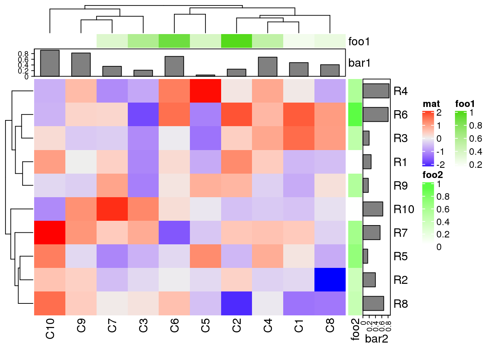

Or assign as bottom annotation and left annotation.


```r
Heatmap(mat, name = "mat", bottom_annotation = column_ha, left_annotation = row_ha)
```

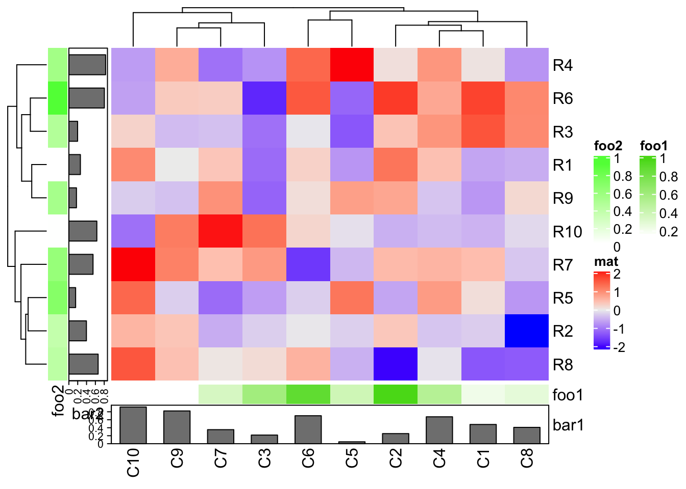

In above examples, `column_ha` and `row_ha` both have two annotations where
`foo1` and `foo2` are numeric vectors and `bar1` and `bar2` are barplots. The
vector-like annotation is called _"simple annotation"_ here and the barplot
annotation is called _"complex annotation"_. You can already see the
annotations must be defined as name-value pairs (e.g. `foo = ...`).

Heatmap annotations can also be independent of the heatmaps. They can be
concatenated to the heatmap list by `+` if it is horizontal or `%v%` if it is
vertical. Chapter \@ref(a-list-of-heatmaps) will discuss how to concatenate
heatmaps and annotations.


```r
# code only for demonstration
Heatmap(...) + rowAnnotation() + ...
Heatmap(...) %v% HeatmapAnnotation(...) + ...
```

`HeatmapAnnotation()` returns a `HeatmapAnnotation` class object. The object
is usually composed of several annotations. If following sections of this
chapter, we first introduce settings for individal annotation, and later we
show how to put them toghether.

You can see the information of the `column_ha` and `row_ha` objects:


```r
column_ha
```

```
## A HeatmapAnnotation object with 2 annotations
##   name: heatmap_annotation_0 
##   position: column 
##   items: 10 
##   width: 1npc 
##   height: 15.3514598035146mm 
##   this object is subsetable
##   5.92288888888889mm extension on the left 
##   9.4709mm extension on the right 
## 
##  name   annotation_type color_mapping height
##  foo1 continuous vector        random    5mm
##  bar1    anno_barplot()                 10mm
```

```r
row_ha
```

```
## A HeatmapAnnotation object with 2 annotations
##   name: heatmap_annotation_1 
##   position: row 
##   items: 10 
##   width: 15.3514598035146mm 
##   height: 1npc 
##   this object is subsetable
##   9.96242222222222mm extension on the bottom 
## 
##  name   annotation_type color_mapping width
##  foo2 continuous vector        random   5mm
##  bar2    anno_barplot()                10mm
```

In following examples in this chapter, we will only show the graphics for the
annotations with no heatmap, unless it is necessary. If you want to try it
with a heatmap, you just assign the `HeatmapAnnotation` object which we always
name as `ha` to `top_annotation`, `bottom_annotation`, `left_annotation` or
`right_annotation` arguments.

Settings are basically the same for column annotations and row annotations. If
there is nothing specicial, we only show the column annotation as examples. If
you want to try row annotation, just add `which = "row"` to
`HeatmapAnnotation()` or directly change to `rowAnnotation()` function.

## Simple annotation {#simple-annotation}

A so-called _"simple annotation"_ is the most used style of annotations which
is heatmap-like or grid-like graphics where colors are used to map to the
anntation values. To generate a simple annotation, you just simply put the
annotation vector in `HeatmapAnnotation()` with a specific name.


```r
ha = HeatmapAnnotation(foo = 1:10)
```

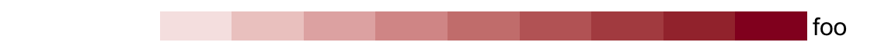

Or a discrete annotation:


```r
ha = HeatmapAnnotation(bar = sample(letters[1:3], 10, replace = TRUE))
```

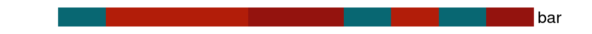

You can use any strings as annotation names except those pre-defined arguments
in `HeatmapAnnotation()`.

If colors are not specified, colors are randomly generated. To set the colors
for annotation, `col` needs to be set as a named list. For continuous values,
the color mapping should be a color mapping function generated by
`circlize::colorRamp2()`.


```r
library(circlize)
col_fun = colorRamp2(c(0, 5, 10), c("blue", "white", "red"))
ha = HeatmapAnnotation(foo = 1:10, col = list(foo = col_fun))
```

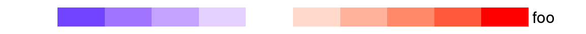

And for discrete annotations, the color should be a named vector where names
correspond to the levels in the annotation.


```r
ha = HeatmapAnnotation(bar = sample(letters[1:3], 10, replace = TRUE),
    col = list(bar = c("a" = "red", "b" = "green", "c" = "blue")))
```


If you specify more than one vectors, there will be multiple annotations
(`foo` and `bar` in following example). Also you can see how `col` is set when
`foo` and `bar` are all put into a single `HeatmapAnnotation()`. Maybe now you
can understand the names in the color list is actually used to map to the
annotation names. Values in `col` will be used to construct legends for simple
annotations.


```r
ha = HeatmapAnnotation(
    foo = 1:10, 
    bar = sample(letters[1:3], 10, replace = TRUE),
    col = list(foo = col_fun,
               bar = c("a" = "red", "b" = "green", "c" = "blue")
    )
)
```

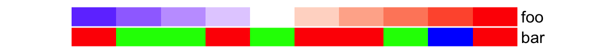

The color for `NA` value is controlled by `na_col` argument.


```r
ha = HeatmapAnnotation(
    foo = c(1:4, NA, 6:10), 
    bar = c(NA, sample(letters[1:3], 9, replace = TRUE)),
    col = list(foo = col_fun,
               bar = c("a" = "red", "b" = "green", "c" = "blue")
    ),
    na_col = "black"
)
```

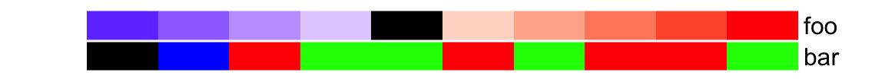

`gp` mainly controls the graphic parameters for the borders of the grids.


```r
ha = HeatmapAnnotation(
    foo = 1:10, 
    bar = sample(letters[1:3], 10, replace = TRUE),
    col = list(foo = col_fun,
               bar = c("a" = "red", "b" = "green", "c" = "blue")
    ),
    gp = gpar(col = "black")
)
```

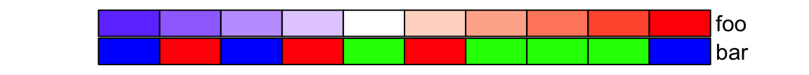

The simple annotation can also be a matrix (numeric or character) that all the
columns in the matrix share a same color mapping schema. **Note columns in the
matrix correspond to the rows in the column annotation.** Also the column
names of the matrix are used as the annotation names.


```r
ha = HeatmapAnnotation(foo = cbind(a = runif(10), b = runif(10)))
```

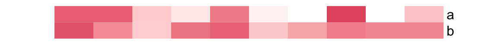

If the matrix has no column name, the name of the annotation is still used, but drawn
in the middle of the annotation.


```r
ha = HeatmapAnnotation(foo = cbind(runif(10), runif(10)))
```

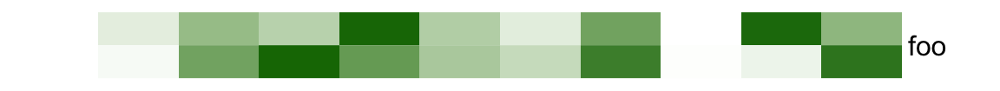


As simple annotations can be in different modes (e.g. numeric, or character),
they can be combined as a data frame and send to `df` argument. Imaging in your
project, you might already have an annotation table, you can directly set it by
`df`.


```r
anno_df = data.frame(foo = 1:10,
    bar = sample(letters[1:3], 10, replace = TRUE))
ha = HeatmapAnnotation(df = anno_df,
    col = list(foo = col_fun,
               bar = c("a" = "red", "b" = "green", "c" = "blue")
    )
)
```

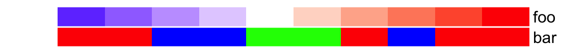

Single annotations and data frame can be mixed. In following example, colors
for `foo2` is not specified, random colors will be used.


```r
ha = HeatmapAnnotation(df = anno_df,
    foo2 = rnorm(10),
    col = list(foo = col_fun,
               bar = c("a" = "red", "b" = "green", "c" = "blue")
    )
)
```

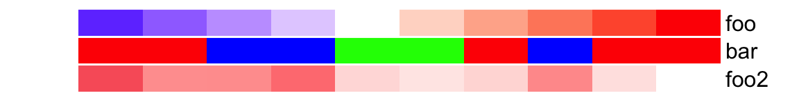

`border` controls the border of every single annotation.


```r
ha = HeatmapAnnotation(
    foo = cbind(1:10, 10:1),
    bar = sample(letters[1:3], 10, replace = TRUE),
    col = list(foo = col_fun,
               bar = c("a" = "red", "b" = "green", "c" = "blue")
    ),
    border = TRUE
)
```

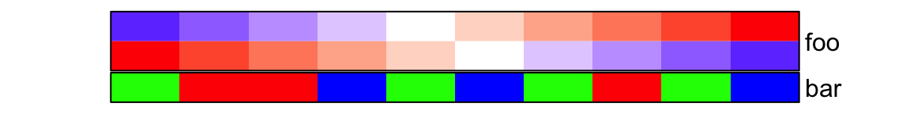

The height of the simple annotation is controlled by `simple_anno_size`
argument. Since all single annotations have same height, the value of
`simple_anno_size` is a single `unit` value. Note there are arguments like
`width`, `height`, `annotation_width` and `annotation_height`, but they are
used to adjust the width/height for the complete heamtap annotations (which
are always mix of several annotations). The adjustment of these four arguments
will be introduced in Section \@ref(multiple-annotations).


```r
ha = HeatmapAnnotation(
    foo = cbind(a = 1:10, b = 10:1), 
    bar = sample(letters[1:3], 10, replace = TRUE),
    col = list(foo = col_fun,
               bar = c("a" = "red", "b" = "green", "c" = "blue")
    ),
    simple_anno_size = unit(1, "cm")
)
```

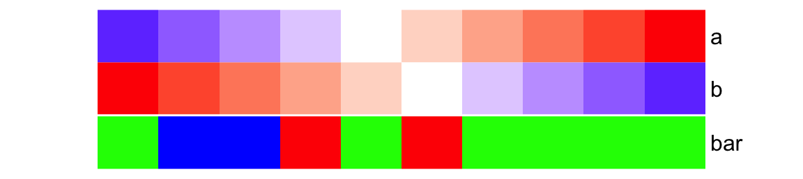

When you have multiple heatmaps and it is better to keep the size of simple
annotations on all heatmaps with the same size. `ht_opt$simple_anno_size` can
be set to control the simple annotation size globally (It will be introduced
in Section \@ref(change-parameters-globally)).

## Simple annotation as an annotation function {#simple-annotation-as-an-annotation-function}

`HeatmapAnnotation()` supports _"complex annotation"_ by setting the
annotation as a function. The annotation function defines how to draw the
graphics at a certain position corresponding to the column or row in the
heatmap. There are quite a lot of annotation functions predefined in
**ComplexHeatmap** package. In the end of this chapter, we will introduce how
to construct your own annotation function by the `AnnotationFunction` class.

For all the annotation functions in forms of `anno_*()`, if it is specified in
`HeatmapAnnotation()` or `rowAnnotation()`, you don't need to do anything
explicitly on `anno_*()` to tell whether it should be drawn on rows or
columns. `anno_*()` automatically detects whether it is a row annotation
environment or a column annotation environment.

The simple annotation shown in previous section is internally constructed by
`anno_simple()` annotation function. Directly using `anno_simple()` will not
automatically generate legends for the final plot, but, it can provide more
flexibility for more annotation graphics (note In Chapter
\@ref(legends) we will show, although `anno_simple()` cannot automatically generate the
legends, the legends can be controlled and added to the final plot manually).

For an example in previous section:


```r
# code only for demonstration
ha = HeatmapAnnotation(foo = 1:10)
```

is actually identical to:


```r
# code only for demonstration
ha = HeatmapAnnotation(foo = anno_simple(1:10))
```

`anno_simple()` makes heatmap-like annotations (or the simple annotations).
Basically if users only make heatmap-like annotations, they do not need to
directly use `anno_simple()`, but this function allows to add more symbols on
the annotation grids.

`anno_simple()` allows to add "points" or single-letter symbols on top of the
annotation grids. `pch`, `pt_gp` and `pt_size` control the settings of the
points. The value of `pch` can be a vector with possible `NA` values.


```r
ha = HeatmapAnnotation(foo = anno_simple(1:10, pch = 1, 
    pt_gp = gpar(col = "red"), pt_size = unit(1:10, "mm")))
```


Set `pch` as a vector:


```r
ha = HeatmapAnnotation(foo = anno_simple(1:10, pch = 1:10))
```


Set `pch` as a vector of letters:


```r
ha = HeatmapAnnotation(foo = anno_simple(1:10, 
    pch = sample(letters[1:3], 10, replace = TRUE)))
```


Set `pch` as a vector with `NA` values (nothing is drawn for `NA` pch values):


```r
ha = HeatmapAnnotation(foo = anno_simple(1:10, pch = c(1:4, NA, 6:8, NA, 10, 11)))
```


`pch` also works if the value for `anno_simple()` is a matrix. The length of
`pch` should be as same as the number of matrix rows or columns or even the
length of the matrix (the length of the matrix is the length of all data
points in the matrix).

Length of `pch` corresponds to matrix columns:


```r
ha = HeatmapAnnotation(foo = anno_simple(cbind(1:10, 10:1), pch = 1:2))
```

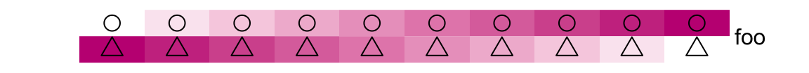

Lenght of `pch` corresponds to matrix rows:


```r
ha = HeatmapAnnotation(foo = anno_simple(cbind(1:10, 10:1), pch = 1:10))
```

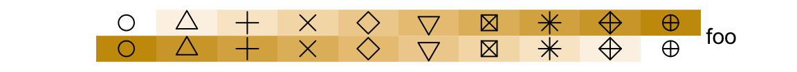

`pch` is a matrix:


```r
pch = matrix(1:20, nc = 2)
pch[sample(length(pch), 10)] = NA
ha = HeatmapAnnotation(foo = anno_simple(cbind(1:10, 10:1), pch = pch))
```

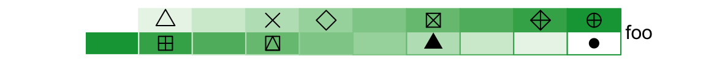

Till now, you might wonder how to set the legends of the symbols you've added
to the simple annotations. Here we will only show you a simple example and
this functionality will be discussed in Chapter \@ref(legends). In following
example, we assume the simple annotations are kind of p-values and we add `*`
for p-values less than 0.01.


```r
set.seed(123)
pvalue = 10^-runif(10, min = 0, max = 3)
is_sig = pvalue < 0.01
pch = rep("*", 10)
pch[!is_sig] = NA
# color mapping for -log10(pvalue)
pvalue_col_fun = colorRamp2(c(0, 2, 3), c("green", "white", "red")) 
ha = HeatmapAnnotation(
    pvalue = anno_simple(-log10(pvalue), col = pvalue_col_fun, pch = pch),
    annotation_name_side = "left")
ht = Heatmap(matrix(rnorm(100), 10), name = "mat", top_annotation = ha)
# now we generate two legends, one for the p-value
# see how we define the legend for pvalue
lgd_pvalue = Legend(title = "p-value", col = pvalue_col_fun, at = c(0, 1, 2, 3), 
    labels = c("1", "0.1", "0.01", "0.001"))
# and one for the significant p-values
lgd_sig = Legend(pch = "*", type = "points", labels = "< 0.01")
# these two self-defined legends are added to the plot by `annotation_legend_list`
draw(ht, annotation_legend_list = list(lgd_pvalue, lgd_sig))
```

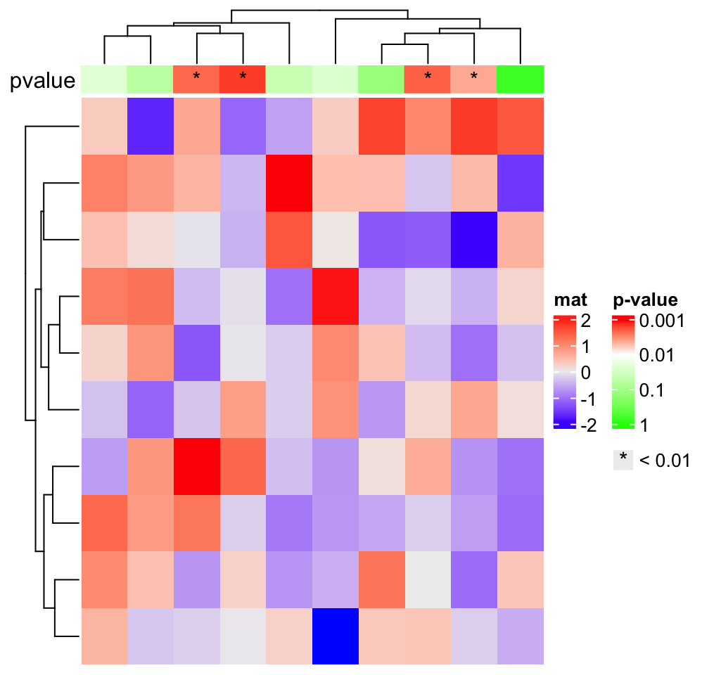

The height of the simple annotation can be controled by `height` argument or
`simple_anno_size` inside `anno_simple()`. `simple_anno_size` controls the
size for single-row annotation and `height`/`width` controls the total
height/width of the simple annotations. If `height`/`width` is set,
`simple_anno_size` is ignored.


```r
ha = HeatmapAnnotation(foo = anno_simple(1:10, height = unit(2, "cm")))
```

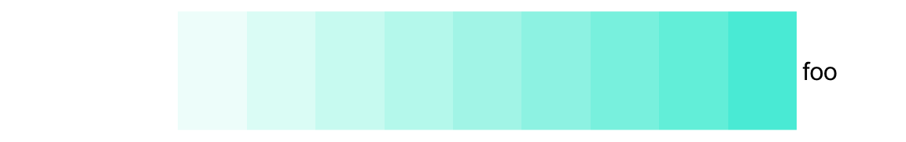


```r
ha = HeatmapAnnotation(foo = anno_simple(cbind(1:10, 10:1), 
    simple_anno_size = unit(2, "cm")))
```

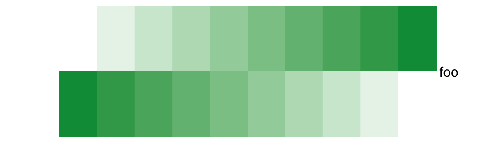

**For all the annotation functions we introduce later, the height or the width
for individual annotations should all be set inside the `anno_*()`
functions.**


```r
# code only for demonstration
anno_*(..., width = ...)
anno_*(..., height = ...)
```

Again, the `width`, `height`, `annotation_width` and `annotation_height`
arguments in `HeatmapAnnotation()` are used to adjust the size of multiple
annotations.


## Empty annotation {#empty-annotation}

`anno_empty()` is a place holder where nothing is drawn. Later user-defined
graphics can be added by `decorate_annotation()` function.


```r
ha = HeatmapAnnotation(foo = anno_empty(border = TRUE))
```


In Chapter \@ref(heatmap-decoration), we will introduce the use of the
decoration functions, but here we give a quick example. In gene expression
expression analysis, there are senarios that we split the heatmaps into
several groups and we want to highlight some key genes in each group. In this
case, we simply add the gene names on the right side of the heatmap without
aligning them to the their corresponding rows. (`anno_mark()` can align the
labels correclty to their corresponding rows, but in the example we show here,
it is not necessray).

In following example, since rows are split into four slices, the empty
annotation is also split into four slices. Basically what we do is in each
empty annotation slice, we add a colored segment and text.


```r
random_text = function(n) {
    sapply(1:n, function(i) {
        paste0(sample(letters, sample(4:10, 1)), collapse = "")
    })
}
text_list = list(
    text1 = random_text(4),
    text2 = random_text(4),
    text3 = random_text(4),
    text4 = random_text(4)
)
# note how we set the width of this empty annotation
ha = rowAnnotation(foo = anno_empty(border = FALSE, 
    width = max_text_width(unlist(text_list)) + unit(4, "mm")))
Heatmap(matrix(rnorm(1000), nrow = 100), name = "mat", row_km = 4, right_annotation = ha)
for(i in 1:4) {
    decorate_annotation("foo", slice = i, {
        grid.rect(x = 0, width = unit(2, "mm"), gp = gpar(fill = i, col = NA), just = "left")
        grid.text(paste(text_list[[i]], collapse = "\n"), x = unit(4, "mm"), just = "left")
    })
}
```


A second use of the empty annotation is to add complex annotation graphics
where the empty annotation pretends to be a virtual plotting region. You can
construct an annotation function by `AnnotationFunction` class for complex
annotation graphics, which allows subsetting and splitting, but still, it can
be a secondary choice to directly draw inside the empty annotation, which is
easier and faster for implementing (but less flexible and does not allow
splitting).

In following we show how to add a "complex version" of points annotation. The
only thing that needs to be careful is the location on x-axis (y-axis if it is
a row annotation) should correspond to the column index after column
reordering.


```r
ha = HeatmapAnnotation(foo = anno_empty(border = TRUE, height = unit(3, "cm")))
ht = Heatmap(matrix(rnorm(100), nrow = 10), name = "mat", top_annotation = ha)
ht = draw(ht)
co = column_order(ht)
value = runif(10)
decorate_annotation("foo", {
    # value on x-axis is always 1:ncol(mat)
    x = 1:10
    # while values on y-axis is the value after column reordering
    value = value[co]
    pushViewport(viewport(xscale = c(0.5, 10.5), yscale = c(0, 1)))
    grid.lines(c(0.5, 10.5), c(0.5, 0.5), gp = gpar(lty = 2),
        default.units = "native")
    grid.points(x, value, pch = 16, size = unit(2, "mm"),
        gp = gpar(col = ifelse(value > 0.5, "red", "blue")), default.units = "native")
    grid.yaxis(at = c(0, 0.5, 1))
    popViewport()
})
```

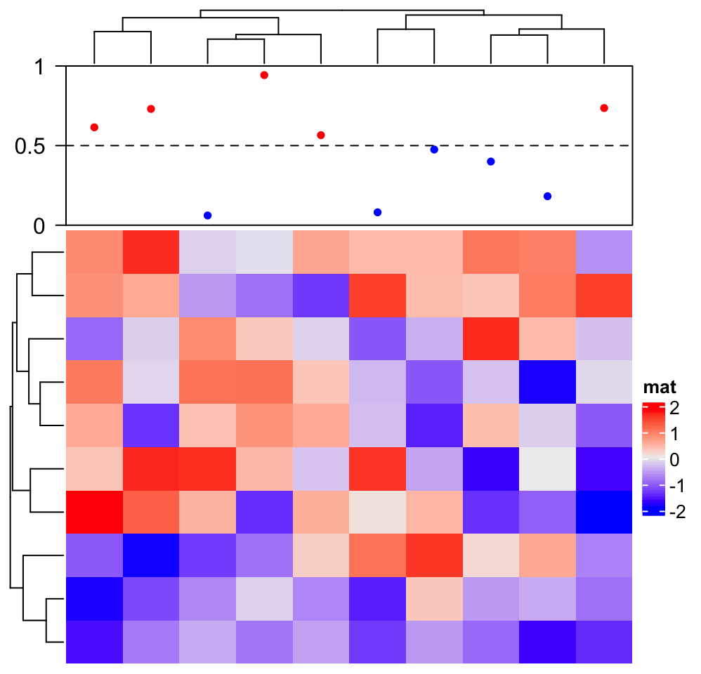

## Block annotation {#block-annotation}

The block annotation is more like a color block which identifies groups when
the rows or columns of the heatmap are split.


```r
Heatmap(matrix(rnorm(100), 10), name = "mat",
    top_annotation = HeatmapAnnotation(foo = anno_block(gp = gpar(fill = 2:4))),
    column_km = 3)
```

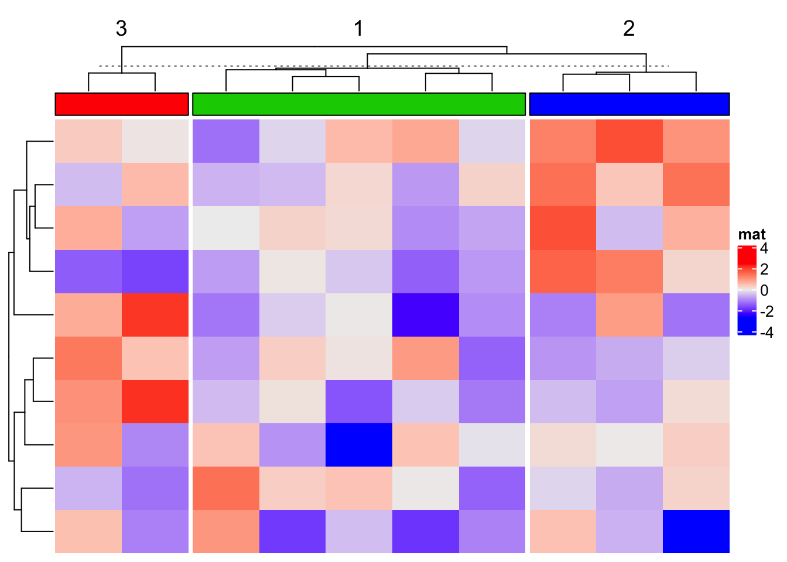

Labels can be added to each block.


```r
Heatmap(matrix(rnorm(100), 10), 
    top_annotation = HeatmapAnnotation(foo = anno_block(gp = gpar(fill = 2:4),
        labels = c("group1", "group2", "group3"), 
        labels_gp = gpar(col = "white", fontsize = 10))),
    column_km = 3,
    left_annotation = rowAnnotation(foo = anno_block(gp = gpar(fill = 2:4),
        labels = c("group1", "group2", "group3"), 
        labels_gp = gpar(col = "white", fontsize = 10))),
    row_km = 3)
```

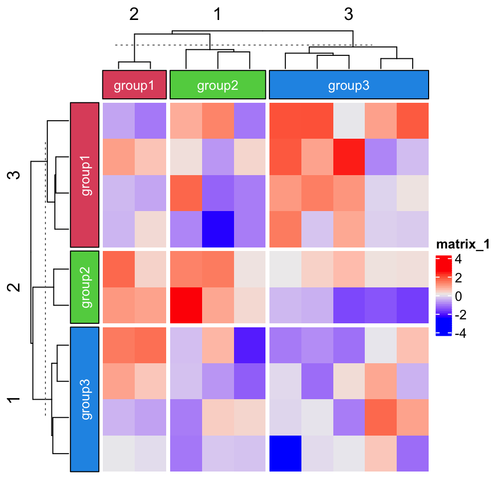

Note the length of `labels` or graphic parameters should have the same length
as the number of slices.

## Image annotation {#image-annotation}

Images can be added as annotations. `anno_image()` supports image in `png`,
`svg`, `pdf`, `eps`, `jpeg/jpg`, `tiff` formats. How they are imported as
annotations are as follows:

- `png`, `jpeg/jpg` and `tiff` images are imported by `png::readPNG()`,
  `jpeg::readJPEG()` and `tiff::readTIFF()`, and drawn by
  `grid::grid.raster()`.
- `svg` images are firstly reformatted by `rsvg::rsvg_svg()` and then imported
  by `grImport2::readPicture()` and drawn by `grImport2::grid.picture()`.
- `pdf` and `eps` images are imported by `grImport::PostScriptTrace()` and
  `grImport::readPicture()`, later drawn by `grImport::grid.picture()`.

The free icons for following examples are from
https://github.com/Keyamoon/IcoMoon-Free. A vector of image paths are set as
the first argument of `anno_image()`.


```r
image_png = sample(dir("IcoMoon-Free-master/PNG/64px", full.names = TRUE), 10)
image_svg = sample(dir("IcoMoon-Free-master/SVG/", full.names = TRUE), 10)
image_eps = sample(dir("IcoMoon-Free-master/EPS/", full.names = TRUE), 10)
image_pdf = sample(dir("IcoMoon-Free-master/PDF/", full.names = TRUE), 10)

# we only draw the image annotation for PNG images, while the others are the same
ha = HeatmapAnnotation(foo = anno_image(image_png))
```

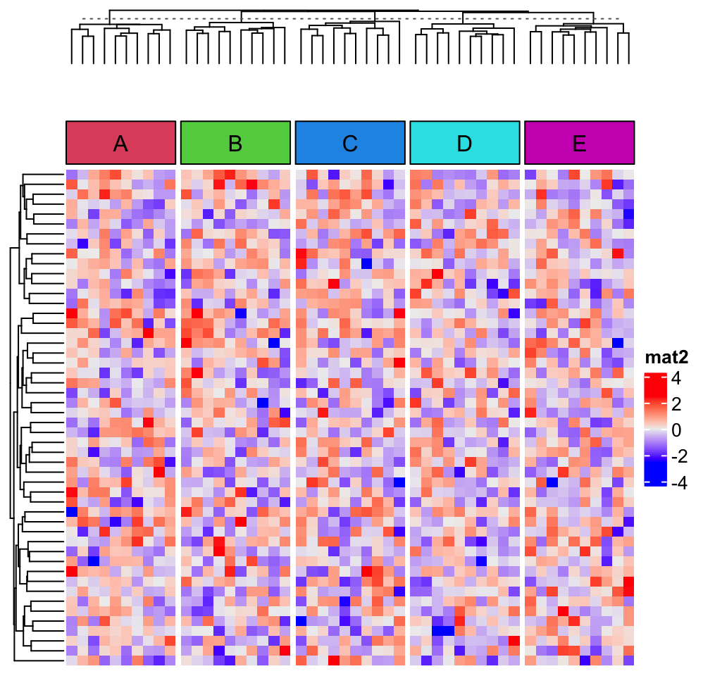

Different image formats can be mixed in the input vector.


```r
# code only for demonstration
ha = HeatmapAnnotation(foo = anno_image(c(image_png[1:3], image_svg[1:3], 
    image_eps[1:3], image_pdf[1:3])))
```

Border and background colors (if the images have transparent background) can
be set by `gp`.


```r
ha = HeatmapAnnotation(foo = anno_image(image_png, 
    gp = gpar(fill = 1:10, col = "black")))
```

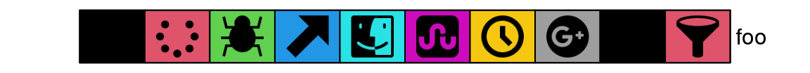

`border` controls the border of the whole annotation.


```r
# code only for demonstration
ha = HeatmapAnnotation(foo = anno_image(image_png, border = "red"))
```

Padding or space around the images is set by `space`.


```r
ha = HeatmapAnnotation(foo = anno_image(image_png, space = unit(3, "mm")))
```

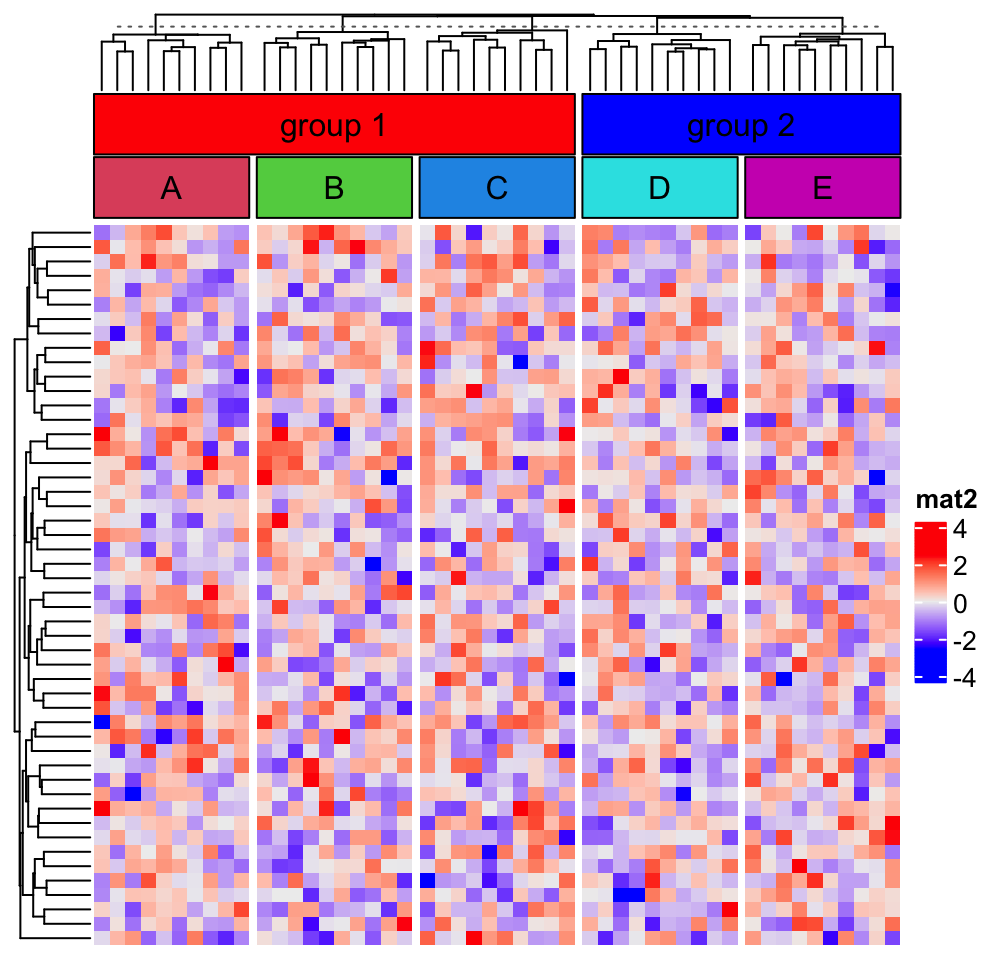

If only some of the images need to be drawn, the other elements in the `image`
vector can be set to `''` or `NA`.


```r
image_png[1:2] = ""
ha = HeatmapAnnotation(foo = anno_image(image_png))
```

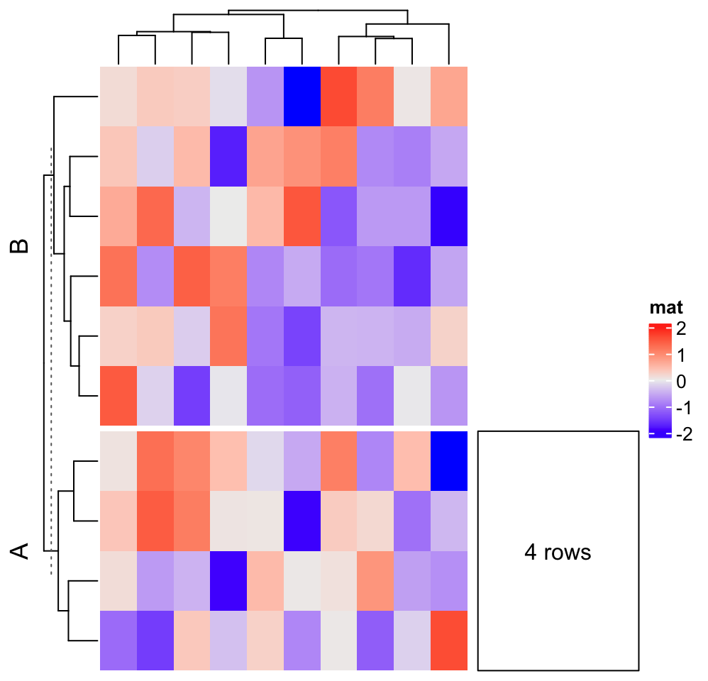

## Points annotation {#points-annotation}

Points annotation implemented as `anno_points()` shows distribution of a list
of data points. The data points object `x` can be a single vector or a matrix.
If it is a matrix, the graphic settings such as `pch`, `size` and `gp` can
correpspond to matrix columns. Note again, if `x` is a matrix, rows in `x`
correspond to columns in the heatmap matrix.


```r
ha = HeatmapAnnotation(foo = anno_points(runif(10)))
```

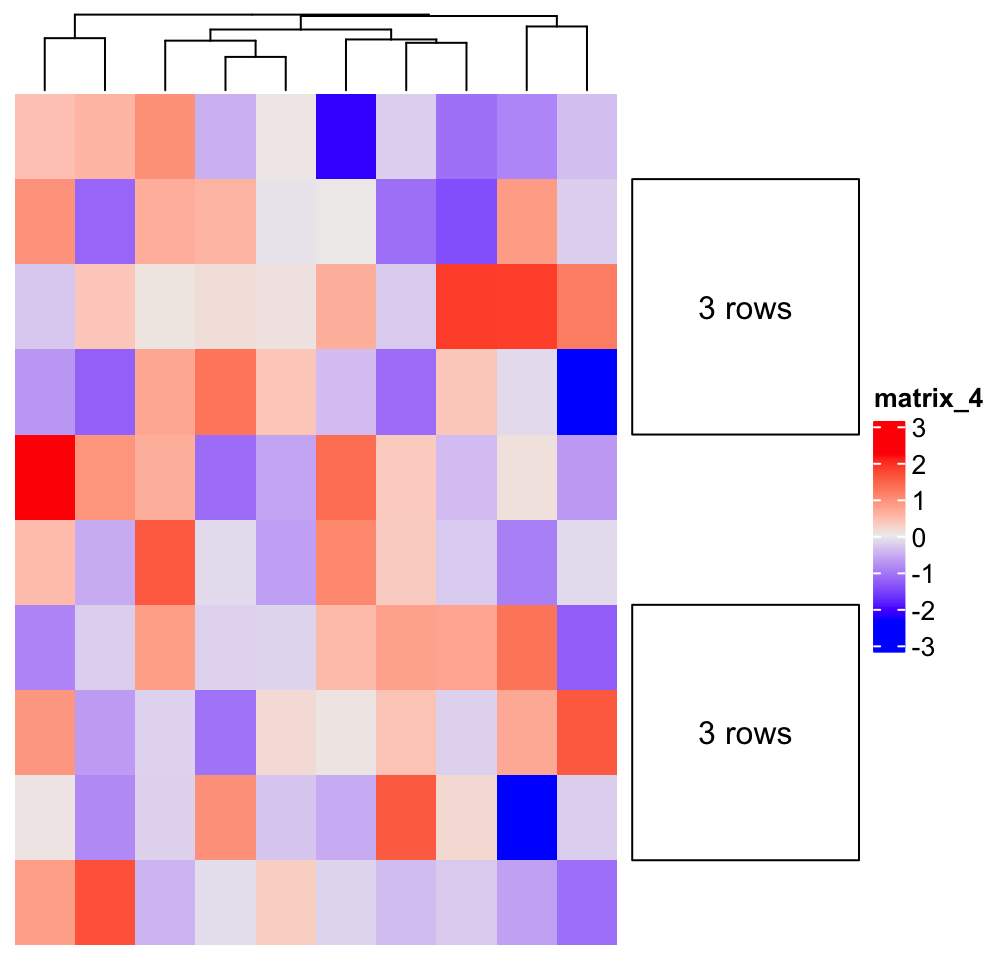


```r
ha = HeatmapAnnotation(foo = anno_points(matrix(runif(20), nc = 2), 
    pch = 1:2, gp = gpar(col = 2:3)))
```

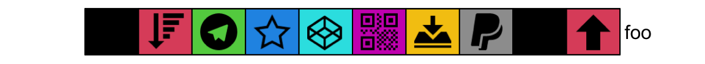

`ylim` controls the range on "y-axis" or the "data axis" (if it is a row
annotation, the data axis is horizontal), `extend` controls the extended space
on the data axis direction. `axis` controls whether to show the axis and
`axis_param` controls the settings for axis. The default settings for axis are:


```r
default_axis_param("column")
```

```
## $at
## NULL
## 
## $labels
## NULL
## 
## $labels_rot
## [1] 0
## 
## $gp
## $fontsize
## [1] 8
## 
## 
## $side
## [1] "left"
## 
## $facing
## [1] "outside"
## 
## $direction
## [1] "normal"
```
 
And you can overwrite some of them:


```r
ha = HeatmapAnnotation(foo = anno_points(runif(10), ylim = c(0, 1),
    axis_param = list(
        side = "right",
        at = c(0, 0.5, 1), 
        labels = c("zero", "half", "one")
    ))
)
```

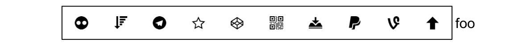

One thing that might be useful is you can control the rotation of the axis
labels.


```r
ha = rowAnnotation(foo = anno_points(runif(10), ylim = c(0, 1),
    width = unit(2, "cm"),
    axis_param = list(
        side = "bottom",
        at = c(0, 0.5, 1), 
        labels = c("zero", "half", "one"),
        labels_rot = 45
    ))
)
```

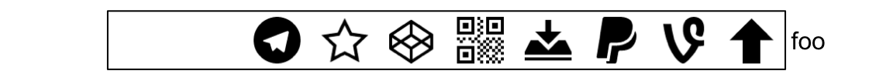

The configuration of axis is same for other annotation functions which have
axes.

The default size of the points annotation is 5mm. It can be controlled by
`height`/`width` argument in `anno_points()`.


```r
# code only for demonstration
ha = HeatmapAnnotation(foo = anno_points(runif(10), height = unit(2, "cm")))
```


## Lines annotation {#lines-annotation}

`anno_lines()` connects the data points by a list of segments. Similar as
`anno_points()`, the data variable can be a numeric vector:


```r
ha = HeatmapAnnotation(foo = anno_lines(runif(10)))
```


Or a matrix:


```r
ha = HeatmapAnnotation(foo = anno_lines(cbind(c(1:5, 1:5), c(5:1, 5:1)), 
    gp = gpar(col = 2:3), add_points = TRUE, pt_gp = gpar(col = 5:6), pch = c(1, 16)))
```


As shown above, points can be added to the lines by setting `add_points = TRUE`.

Smoothed lines (by `loess()`) can be added instead of the original lines by
setting `smooth = TRUE`, but it should be used with caution because the order of
columns in the heatmap is used as "x-value" for the fitting and only if you think
the fitting against the reordered order makes sense.

Smoothing also works when the input data variable is a matrix that the smoothing
is performed for each column separately.

If `smooth` is `TRUE`, `add_points` is set to `TRUE` by default.


```r
ha = HeatmapAnnotation(foo = anno_lines(runif(10), smooth = TRUE))
```


The default size of the lines annotation is 5mm. It can be controlled by
`height`/`width` argument in `anno_lines()`.


```r
# code only for demonstration
ha = HeatmapAnnotation(foo = anno_lines(runif(10), height = unit(2, "cm")))
```

## Barplot annotation {#barplot_annotation}

The data points can be represented as barplots. Some of the arguments in
`anno_barplot()` such as `ylim`, `axis`, `axis_param` are the same as
`anno_points()`.


```r
ha = HeatmapAnnotation(foo = anno_barplot(1:10))
```

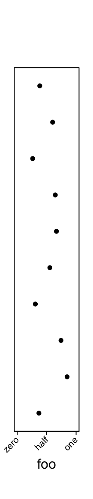

The width of bars is controlled by `bar_width`. It is a relative value to the 
width of the cell in the heatmap.


```r
ha = HeatmapAnnotation(foo = anno_barplot(1:10, bar_width = 1))
```


Graphic parameters are controlled by `gp`.


```r
ha = HeatmapAnnotation(foo = anno_barplot(1:10, gp = gpar(fill = 1:10)))
```

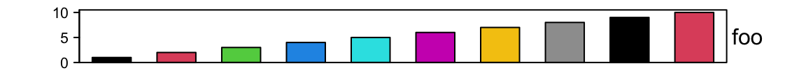

You can choose the baseline of bars by `baseline`.


```r
ha = HeatmapAnnotation(foo = anno_barplot(seq(-5, 5), baseline = "min"))
```


```r
ha = HeatmapAnnotation(foo = anno_barplot(seq(-5, 5), baseline = 0))
```

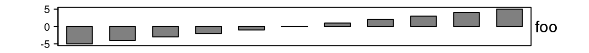

If the input value is a matrix, it will be stacked barplots.


```r
ha = HeatmapAnnotation(foo = anno_barplot(matrix(nc = 2, c(1:10, 10:1))))
```


And length of parameters in `gp` can be the number of the columns in the matrix:


```r
ha = HeatmapAnnotation(foo = anno_barplot(cbind(1:10, 10:1), 
    gp = gpar(fill = 2:3, col = 2:3)))
```

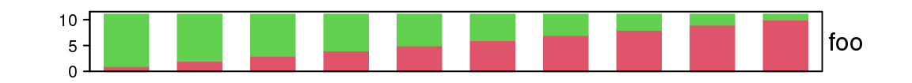

The default size of the barplot annotation is 5mm. It can be controlled by
`height`/`width` argument in `anno_barplot()`.


```r
# code only for demonstration
ha = HeatmapAnnotation(foo = anno_barplot(runif(10), height = unit(2, "cm")))
```

Following example shows a barplot annotation which visualizes a proportion
matrix (for which row sums are 1).


```r
m = matrix(runif(4*10), nc = 4)
m = t(apply(m, 1, function(x) x/sum(x)))
ha = HeatmapAnnotation(foo = anno_barplot(m, gp = gpar(fill = 2:5), 
    bar_width = 1, height = unit(6, "cm")))
```

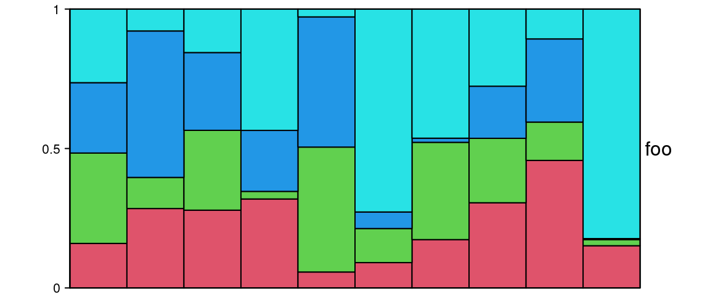

The direction of the axis can be reversed which is useful when the annotation
is put on the left of the heatmap.


```r
ha_list = rowAnnotation(axis_reverse = anno_barplot(m, gp = gpar(fill = 2:5), 
    axis_param = list(direction = "reverse"), 
    bar_width = 1, width = unit(4, "cm"))) +
rowAnnotation(axis_normal = anno_barplot(m, gp = gpar(fill = 2:5), 
    bar_width = 1, width = unit(4, "cm")))
draw(ha_list, ht_gap = unit(4, "mm"))
```

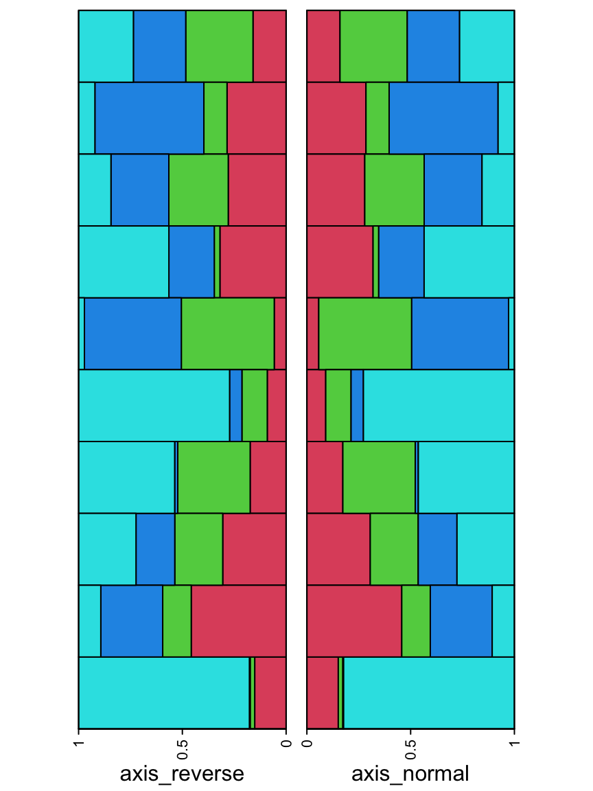

`direction = "reverse"` also works for other annotation functions which have
axes, but it is more commonly used for barplot annotations.

## Boxplot annotation {#box-annotation}

Boxplot annotation as well as the annotation functions which are introduced
later are more suitable for small matrice. I don't think you want to put
boxplots as column annotation for a matrix with 100 columns.

For `anno_boxplot()`, the input data variable should be a matrix or a list. If
`x` is a matrix and if it is a column annotation, statistics for boxplots are
calculated by columns, and if it is a row annotation, the calculation is done
by rows.


```r
set.seed(12345)
m = matrix(rnorm(100), 10)
ha = HeatmapAnnotation(foo = anno_boxplot(m, height = unit(4, "cm")))
```


Graphic parameters are controlled by `gp`.


```r
ha = HeatmapAnnotation(foo = anno_boxplot(m, height = unit(4, "cm"), 
    gp = gpar(fill = 1:10)))
```

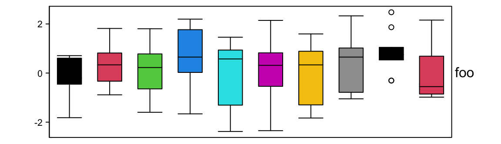

Width of the boxes are controlled by `box_width`. `outline` controls whether to
show outlier points.


```r
ha = HeatmapAnnotation(foo = anno_boxplot(m, height = unit(4, "cm"), 
    box_width = 0.9, outline = FALSE))
```


`anno_boxplot()` only draws one boxplot for one single row. Section
\@ref(add-multiple-boxplots-for-single-row) demonstrates how to define an annotation function which
draws multiple boxplots for a single row, and Section \@ref(zoom-annotation)
demonstrates how to draw one single boxplot for a group of rows.

## Histogram annotation {#histogram-annotation}

Annotations as histograms are more suitable to put as row annotations. The
setting for the data variable is the same as `anno_boxplot()` which can be a
matrix or a list.


Similar as `anno_boxplot()`, the input data variable should be a matrix or a list. If
`x` is a matrix and if it is a column annotation, histograms are
calculated by columns, and if it is a row annotation, histograms are calculated
by rows.


```r
m = matrix(rnorm(1000), nc = 100)
ha = rowAnnotation(foo = anno_histogram(m)) # apply `m` on rows
```


Number of breaks for histograms is controlled by `n_breaks`.


```r
ha = rowAnnotation(foo = anno_histogram(m, n_breaks = 20))
```

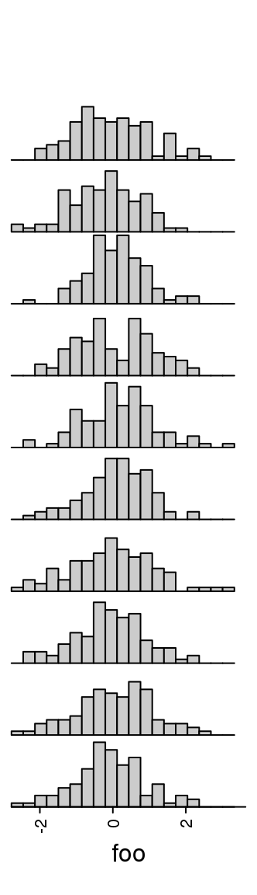

Colors are controlled by `gp`.


```r
ha = rowAnnotation(foo = anno_histogram(m, gp = gpar(fill = 1:10)))
```

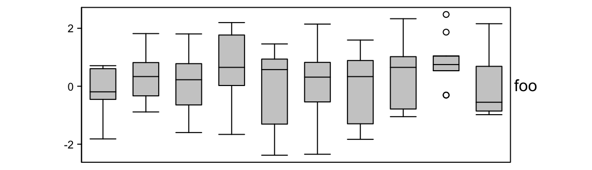

## Density annotation {#density-annotation}

Similar as histogram annotations, `anno_density()` shows the distribution
as a fitted curve.


```r
ha = rowAnnotation(foo = anno_density(m))
```

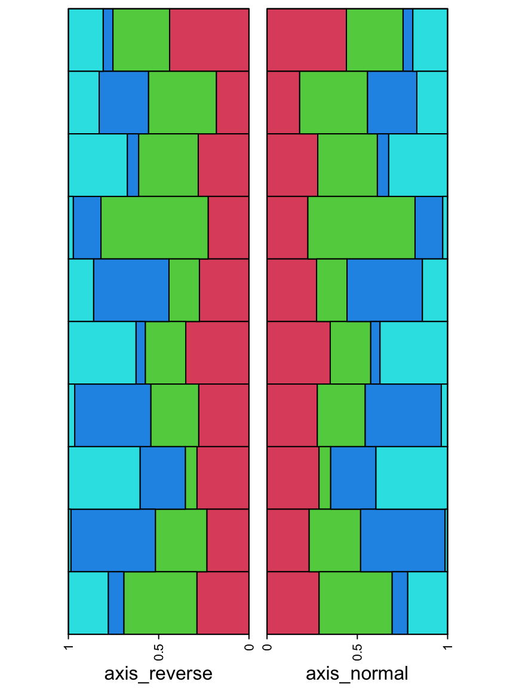

The height of the density peaks can be controlled to make the distribution
look like a ["joyplot"](http://blog.revolutionanalytics.com/2017/07/joyplots.html).


```r
ha = rowAnnotation(foo = anno_density(m, joyplot_scale = 2, 
    gp = gpar(fill = "#CCCCCC80")))
```

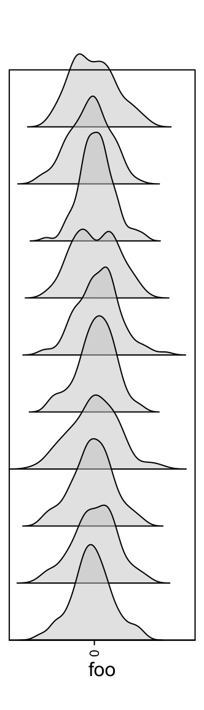

Or visualize the distribution as violin plot.


```r
ha = rowAnnotation(foo = anno_density(m, type = "violin", 
    gp = gpar(fill = 1:10)))
```

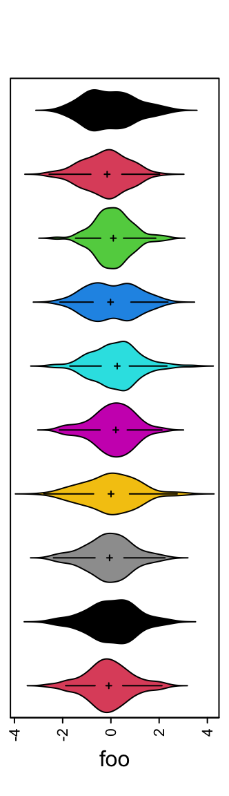

When there are too many rows in the input variable, the space for normal
density peaks might be too small. In this case, we can visualize the
distribution by heatmaps.


```r
m2 = matrix(rnorm(50*10), nrow = 50)
ha = rowAnnotation(foo = anno_density(m2, type = "heatmap", width = unit(6, "cm")))
```

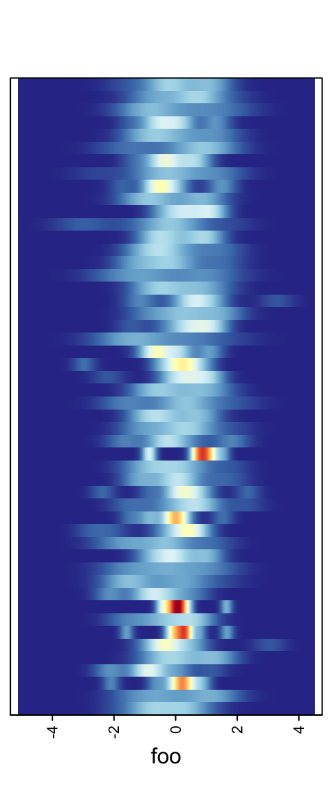

THe color schema for heatmap distribution is controlled by `heatmap_colors`.


```r
ha = rowAnnotation(foo = anno_density(m2, type = "heatmap", width = unit(6, "cm"), 
    heatmap_colors = c("white", "orange")))
```

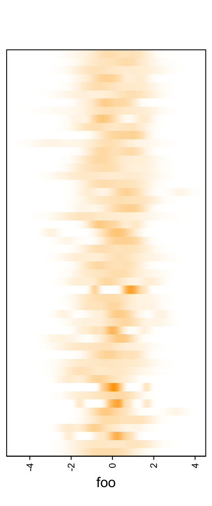

In **ComplexHeatmap** package, there is a `densityHeatmap()` function which
visualizes distribution as a heatmap. It will be introduced in Section
\@ref(density-heatmap).

## Joyplot annotation {#joyplot-annotation}

`anno_joyplot()` is specific for so-called joyplot (http://blog.revolutionanalytics.com/2017/07/joyplots.html).
The input data should be a matrix or a list.

Note `anno_joyplot()` is always applied to columns if the input is a matrix.
Because joyplot visualizes parallel distributions and the matrix is not a
necessary format while a list is already enough for it, if you are not sure
about how to set as a matrix, just convert it to a list for using it.


```r
m = matrix(rnorm(1000), nc = 10)
lt = apply(m, 2, function(x) data.frame(density(x)[c("x", "y")]))
ha = rowAnnotation(foo = anno_joyplot(lt, width = unit(4, "cm"), 
    gp = gpar(fill = 1:10), transparency = 0.75))
```

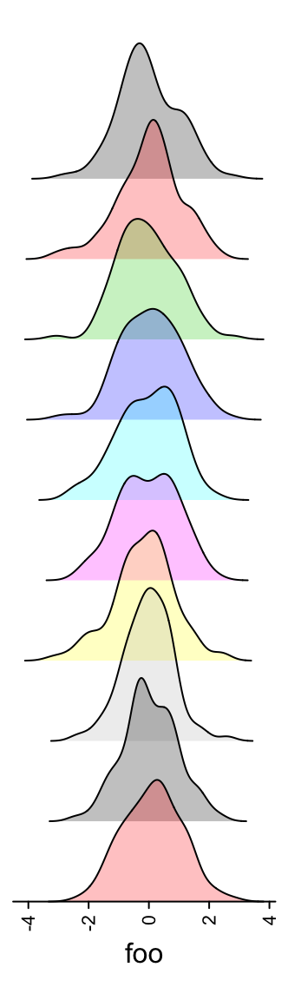

Or only show the lines (`scale` argument controls the relative height of the
curves).


```r
m = matrix(rnorm(5000), nc = 50)
lt = apply(m, 2, function(x) data.frame(density(x)[c("x", "y")]))
ha = rowAnnotation(foo = anno_joyplot(lt, width = unit(4, "cm"), gp = gpar(fill = NA), 
    scale = 4))
```


The format of the input variable is special. It can be one of the following
two:

1. a matrix (remember `anno_joyplot()` is always applied to columns of the
   matrix) where x coordinate corresponds to `1:nrow(matrix)` and each column
   in the matrix corresponds to one distribution in the joyplot.
2. a list of data frames where each data frame has two columns which
   correspond to x coordinate and y coordinate.

## Horizon chart annotation {#horizon-chart-annotation}

[Horizon
chart](https://flowingdata.com/2015/07/02/changing-price-of-food-items-and-horizon-graphs/)
as annotation can only be added as row annotation. The format of the input
variable for `anno_horizon()` is the same as `anno_joyplot()` which is
introduced in previous section.

The default style of horizon chart annotation is:


```r
lt = lapply(1:20, function(x) cumprod(1 + runif(1000, -x/100, x/100)) - 1)
ha = rowAnnotation(foo = anno_horizon(lt))
```

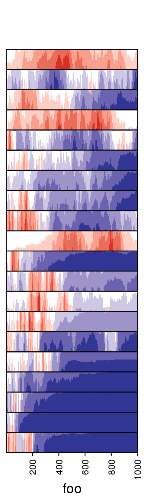

Values in each track are normalized by `x/max(abs(x))`.

Colors for positive values and negative values are controlled by `pos_fill`
and `neg_fill` in `gpar()`.


```r
ha = rowAnnotation(foo = anno_horizon(lt, 
    gp = gpar(pos_fill = "orange", neg_fill = "darkgreen")))
```


`pos_fill` and `neg_fill` can be assigned as a vector.


```r
ha = rowAnnotation(foo = anno_horizon(lt, 
    gp = gpar(pos_fill = rep(c("orange", "red"), each = 10),
              neg_fill = rep(c("darkgreen", "blue"), each = 10))))
```

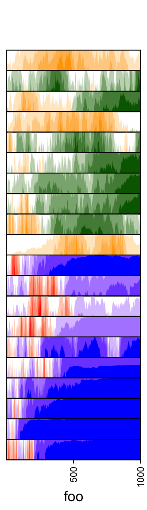

Whether the peaks for negative values start from the bottom or from the top.


```r
ha = rowAnnotation(foo = anno_horizon(lt, negative_from_top = TRUE))
```


The space between every two neighbouring charts.


```r
ha = rowAnnotation(foo = anno_horizon(lt, gap = unit(1, "mm")))
```

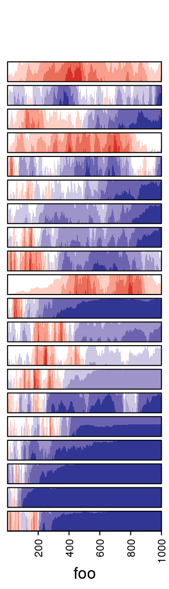

## Text annotation {#text-annotation}

Text can be used as annotations by `anno_text()`. Graphic parameters are controlled
by `gp`.


```r
ha = rowAnnotation(foo = anno_text(month.name, gp = gpar(fontsize = 1:12+4)))
```


Locationsn are controlled by `location` and `just`. Rotation is controlled by `rot`.


```r
ha = rowAnnotation(foo = anno_text(month.name, location = 1, rot = 30, 
    just = "right", gp = gpar(fontsize = 1:12+4)))
```


```r
ha = rowAnnotation(foo = anno_text(month.name, location = 0.5, just = "center"))
```


`location` and `just` are automatically calculated according the the position
of the annotations put to the heatmap (e.g. text are aligned to the left if it
is a right annotation to the heatmap and are aligned to the right it it is a
left annotation).

The width/height are automatically calculated based on all the text. Normally
you don't need to manually set the width/height of it.

Background colors can be set by `gp`. Here `fill` controls the filled
background color, `col` controls the color of text and the non-standard
`border` controls the background border color.

You can see we explicitly set `width` as 1.2 times the width of the longest
text.


```r
ha = rowAnnotation(foo = anno_text(month.name, location = 0.5, just = "center",
    gp = gpar(fill = rep(2:4, each = 4), col = "white", border = "black"),
    width = max_text_width(month.name)*1.2))
```

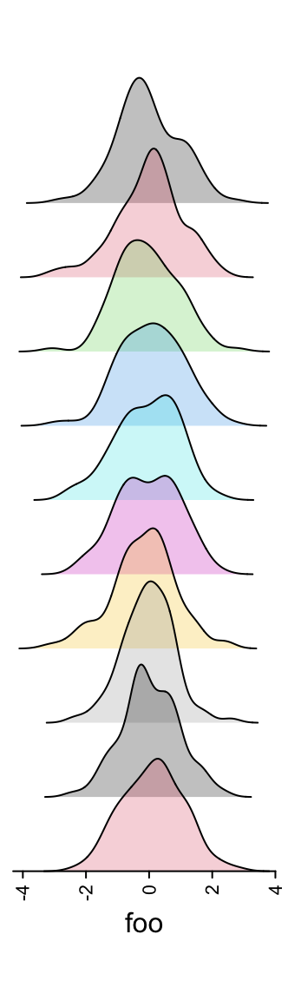


## Mark annotation {#mark-annotation}

Sometimes there are many rows or columns in the heatmap and we want to mark
some of them. `anno_mark()` is used to mark subset of rows or columns and
connect to labels with lines.

`anno_mark()` at least needs two arguments where `at` are the indices to the
original matrix and `labels` are the corresponding text.


```r
m = matrix(rnorm(1000), nrow = 100)
ha = rowAnnotation(foo = anno_mark(at = c(1:4, 20, 60, 97:100), labels = month.name[1:10]))
Heatmap(m, name = "mat", cluster_rows = FALSE, right_annotation = ha)
```

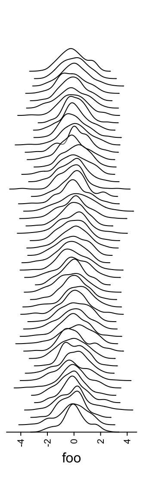

## Summary annotation {#summary-annotation}

There is one special annotation `anno_summary()` which only works with
one-column heatmap or one-row heatmap (we can say the heatmap only contains a
vector). It shows summary statistics for the vector in the heatmap. If the
corresponding vector is discrete, the summary annotation is presented as
barplots and if the vector is continuous, the summary annotation is boxplot.
`anno_summary()` is always used when the heatmap is split so that statistics
can be compared between heatmap slices.

The first example shows the summary annotation for discrete heatmap. The
barplot shows the proportion of each level in each slice. The absolute values
can already be seen by the height of the heatmap slice.

The color schema for the barplots is automatically extracted from the heatmap.


```r
ha = HeatmapAnnotation(summary = anno_summary(height = unit(4, "cm")))
v = sample(letters[1:2], 50, replace = TRUE)
split = sample(letters[1:2], 50, replace = TRUE)

Heatmap(v, name = "mat", col = c("a" = "red", "b" = "blue"),
    top_annotation = ha, width = unit(2, "cm"), row_split = split)
```

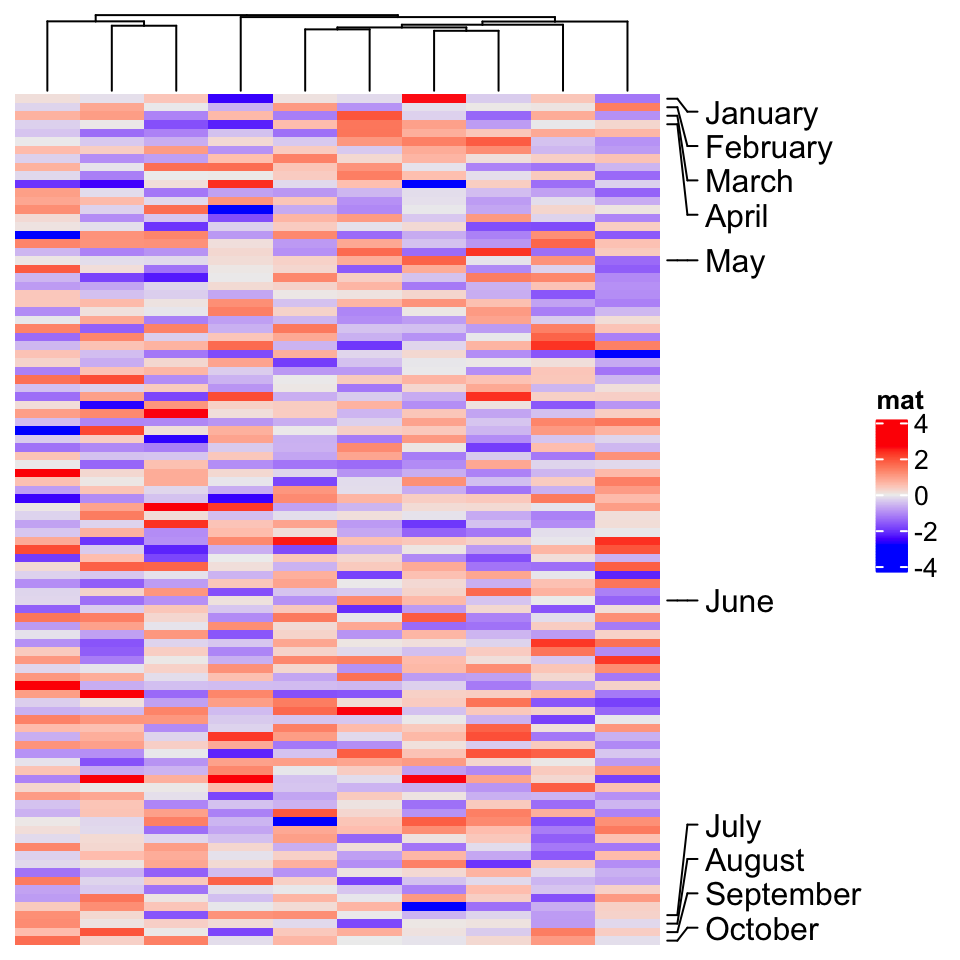

The second example shows the summary annotation for continuous heatmap. The
graphic parameters should be manually set by `gp`. The legend of the boxplot
can be created and added as introduced in Section \@ref(discrete-legends),
last second paragraph.


```r
ha = HeatmapAnnotation(summary = anno_summary(gp = gpar(fill = 2:3), 
    height = unit(4, "cm")))
v = rnorm(50)
Heatmap(v, name = "mat", top_annotation = ha, width = unit(2, "cm"), 
    row_split = split)
```

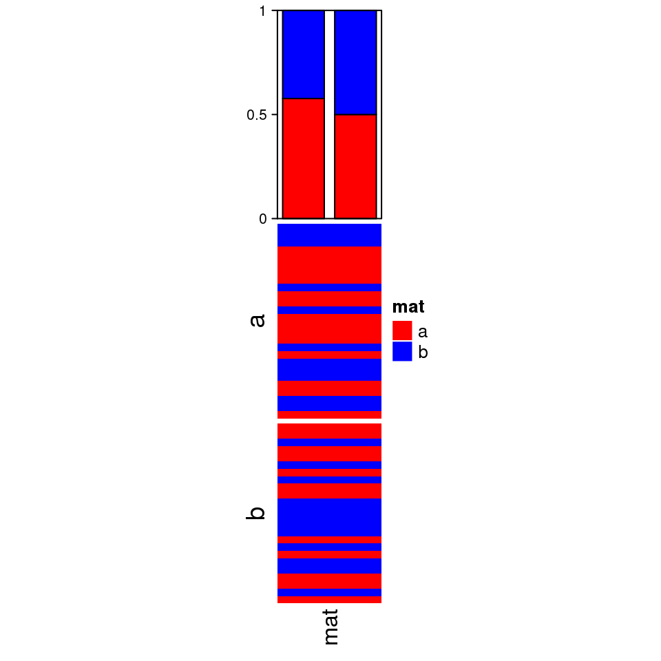

Normally we don't draw this one-column heatmap along. It is always combined
with other "main heatmaps". E.g. A gene expression matrix with a one-column
heatmap which shows whether the gene is a protein coding gene or a linc-RNA
gene.

In following, we show a simple example of a "main heatmap" with two one-column
heatmaps. The functionality of heatmap concatenation will be introduced in
Chapter \@ref(a-list-of-heatmaps).


```r
m = matrix(rnorm(50*10), nrow = 50)
ht_list = Heatmap(m, name = "main_matrix")

ha = HeatmapAnnotation(summary = anno_summary(height = unit(3, "cm")))
v = sample(letters[1:2], 50, replace = TRUE)
ht_list = ht_list + Heatmap(v, name = "mat1", top_annotation = ha, width = unit(1, "cm"))

ha = HeatmapAnnotation(summary = anno_summary(gp = gpar(fill = 2:3), 
    height = unit(3, "cm")))
v = rnorm(50)
ht_list = ht_list + Heatmap(v, name = "mat2", top_annotation = ha, width = unit(1, "cm"))

split = sample(letters[1:2], 50, replace = TRUE)
lgd_boxplot = Legend(labels = c("group a", "group b"), title = "group",
    legend_gp = gpar(fill = c("red", "blue")))
draw(ht_list, row_split = split, ht_gap = unit(5, "mm"), 
    heatmap_legend_list = list(lgd_boxplot))
```

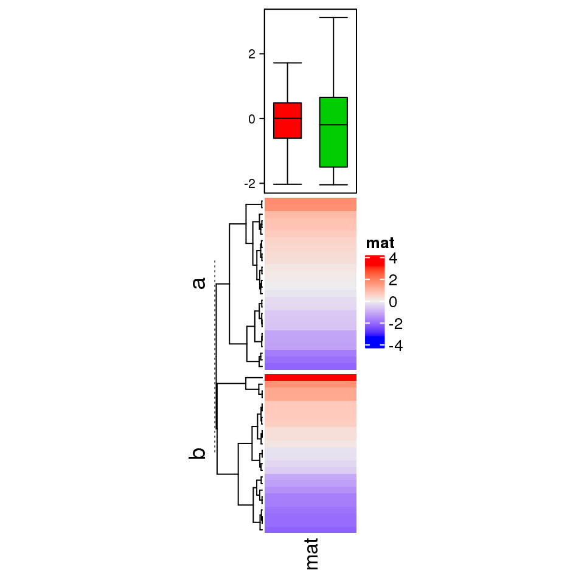

## Zoom/link annotation {#zoom-annotation}

It is very common scenario that we want to annotate subsets of rows/columns in
the heatmap. `anno_zoom()` helps to create plotting regions that correspond to
the original subsets of rows/columns in the heatmap. Since the height/width
are usually different from that from the orignal subsets in the heatmap, these
plotting regions created by `anno_zoom()` can be thought as "zoomings" of the
original heatmap.

Let's see following example where we make boxplot for each row group.


```r
set.seed(123)
m = matrix(rnorm(100*10), nrow = 100)
subgroup = sample(letters[1:3], 100, replace = TRUE, prob = c(1, 5, 10))
rg = range(m)
panel_fun = function(index, nm) {
    pushViewport(viewport(xscale = rg, yscale = c(0, 2)))
    grid.rect()
    grid.xaxis(gp = gpar(fontsize = 8))
    grid.boxplot(m[index, ], pos = 1, direction = "horizontal")
    popViewport()
}
anno = anno_zoom(align_to = subgroup, which = "row", panel_fun = panel_fun, 
    size = unit(2, "cm"), gap = unit(1, "cm"), width = unit(4, "cm"))
Heatmap(m, name = "mat", right_annotation = rowAnnotation(foo = anno), row_split = subgroup)
```

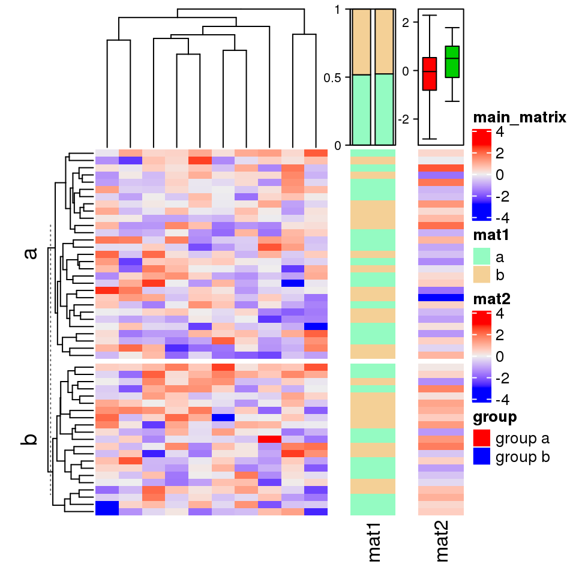

The important arguments for `anno_zoom()` are:

1. `align_to`: It defines how the plotting regions (or the boxes) correspond
   to the rows or the columns in the heatmap. If the value is a list of
   indices, each box corresponds to the rows or columns with indices in one
   vector in the list. If the value is a categorical variable (e.g. a factor
   or a character vector) that has the same length as the rows or columns in
   the heatmap, each box corresponds to the rows/columns in each level in the
   categorical variable.
2. `panel_fun`: A self-defined function that defines how to draw graphics in
   the box. The function must have a `index` argument which is the indices for
   the rows/columns that the box corresponds to. It can have a second argument
   `nm` which is the "name" of the selected part in the heatmap. The
   corresponding value for `nm` comes from `align_to` if it is specified as a
   categorical variable or a list with names.
3. `size`: The size of boxes. It can be pure numeric that they are treated as
   relative fractions of the total height/width of the heatmap. The value of
   `size` can also be absolute units.
4. `gap`: Gaps between boxes. It should be a `unit` object.

`anno_zoom()` also works for column annotations.

In previous example, box plots in the "zoom annotation" use the same data as in the
heatmap (they share using the same values in the matrix). In some other cases, the annotations 
do not have very strong relations to the matrix, except the information of which
rows from the matrix. In this case, the functionality is more proper
to be understanded as to provide linking between subsets of rows and
a list of graphic regions. Thus, there is an `anno_link()` function which is basically the same as `anno_zoom()`.
The two functions are exactly the same, just with different names, depends
how you understand. An example of using `anno_link()` is to correspond a list of text to a 
subset of rows, see examples from https://github.com/jokergoo/simplifyEnrichment.

<br>

## Multiple annotations {#multiple-annotations}

As mentioned before, to put multiple annotations in `HeatmapAnnotation()`,
they just need to be specified as name-value pairs. In `HeatmapAnnotation()`,
there are some arguments which controls multiple annotations. For these
arguments, they are specified as a vector which has same length as number of
the annotations, or a named vector with subset of the annotations.

The simple annotations which are specified as vectors, matrices and data
frames will automatically have legends on the heatmap. `show_legend` controls
whether to draw the legends for them. Note here if `show_legend` is a vector,
the value of `show_legend` should be in one of the following formats:

- A logical vector with the same length as the number of simple annotations.
- A logical vector with the same length as the number of totla annotations. The
  values for complex annotations are ignored.
- A named vector to control subset of the simple annotations.

For customization on the annotation legends, please refer to Section \@ref(heatmap-and-annotation-legends).


```r
ha = HeatmapAnnotation(foo = 1:10, 
    bar = cbind(1:10, 10:1),
    pt = anno_points(1:10),
    show_legend = c("bar" = FALSE)
)
Heatmap(matrix(rnorm(100), 10), name = "mat", top_annotation = ha)
```

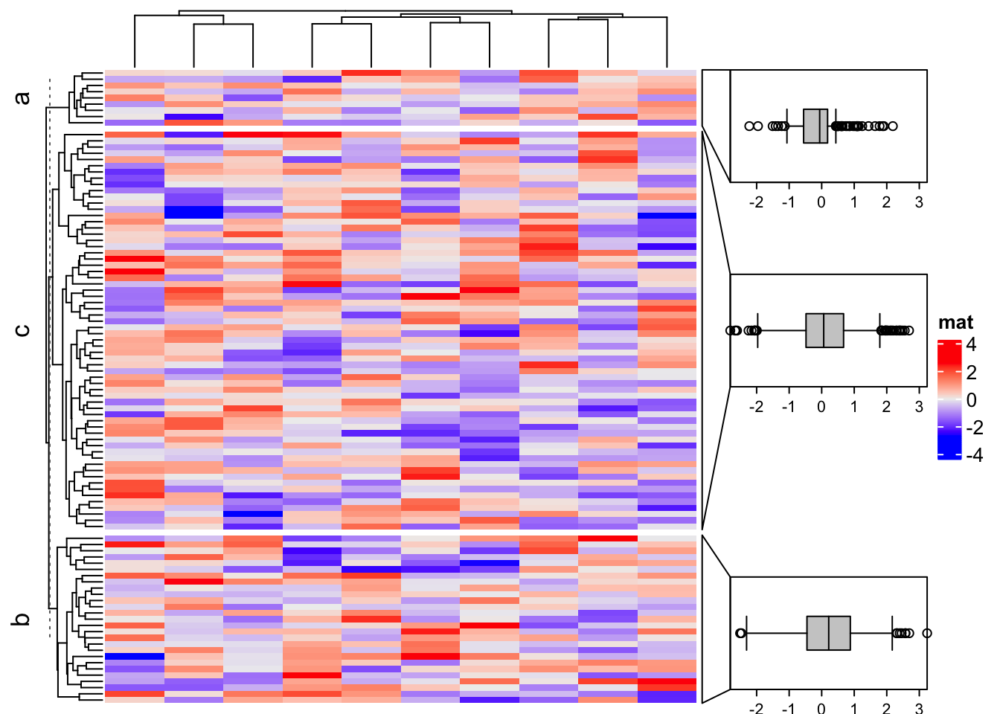

`gp` controls graphic parameters (except `fill`) for the simple annotatios,
such as the border of annotation grids.


```r
ha = HeatmapAnnotation(foo = 1:10, 
    bar = cbind(1:10, 10:1),
    pt = anno_points(1:10),
    gp = gpar(col = "red")
)
```

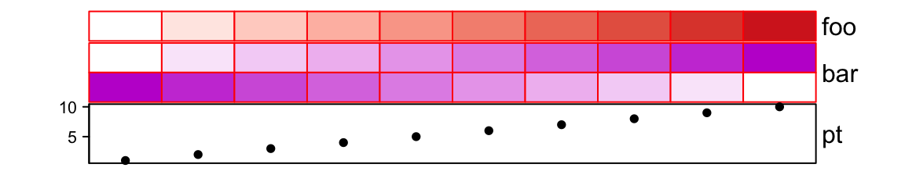


`border` controls the border of every single annotations.
`show_annotation_name` controls whether show annotation names. As mentioned,
the value can be a single value, a vector or a named vector.


```r
ha = HeatmapAnnotation(foo = 1:10, 
    bar = cbind(1:10, 10:1),
    pt = anno_points(1:10),
    show_annotation_name = c(bar = FALSE), # only turn off `bar`
    border = c(foo = TRUE) # turn on foo
)
```


`annotation_name_gp`, `annotation_name_offset`, `annotation_name_side` and
`annotation_name_rot` control the style and position of the annotation names.
The latter three can be specified as named vectors. If
`annotation_name_offset` is specified as a named vector, it can be specified
as characters while not `unit` objects: `annotation_name_offset = c(foo = "1cm")`.

`gap` controls the space between every two neighbouring annotations. The value
can be a single unit or a vector of units.


```r
ha = HeatmapAnnotation(foo = 1:10, 
    bar = cbind(1:10, 10:1),
    pt = anno_points(1:10),
    gap = unit(2, "mm"))
```

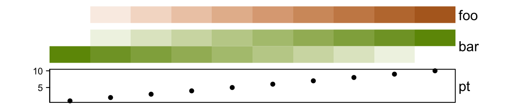


```r
ha = HeatmapAnnotation(foo = 1:10, 
    bar = cbind(1:10, 10:1),
    pt = anno_points(1:10),
    gap = unit(c(2, 10), "mm"))
```

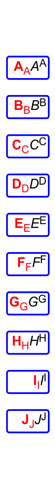

### Size of annotations {#size-of-annotations}

`height`, `width`, `annotation_height` and `annotation_width` control the
height or width of the complete heatmap annotations. Normally you don't need
to set them because all the single annotations have fixed height/width and the
final height/width for the whole heatmap annotation is the sum of them.
Resizing these values will involve rather complicated adjustment depending on
whether it is a simple annotation or complex annotation. The resizing of
heatmap annotations will also happen when adjusting a list of heatmaps. In
following examples, we take column annotations as examples and demonstrate
some scenarios for the resizing adjustment.

First the default height of `ha`:


```r
# foo: 1cm, bar: 5mm, pt: 1cm
ha = HeatmapAnnotation(foo = cbind(1:10, 10:1), 
    bar = 1:10,
    pt = anno_points(1:10))
```

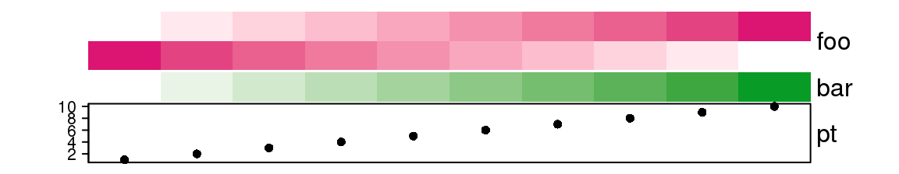

If `height` is set, the size of the simple annotation will not change, while
only the complex annotations are adjusted. If there are multiple complex
annotations, they are adjusted according to the ratio of their original size.


```r
# foo: 1cm, bar: 5mm, pt: 4.5cm
ha = HeatmapAnnotation(foo = cbind(1:10, 10:1), 
    bar = 1:10,
    pt = anno_points(1:10),
    height = unit(6, "cm"))
```

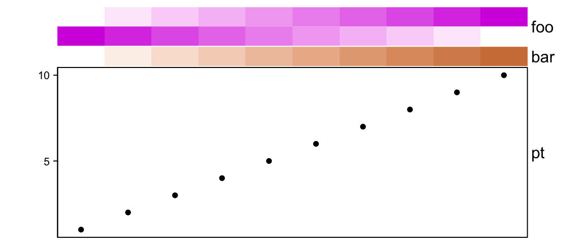

`simple_anno_size` controls the height of all simple annotations. Recall
`ht_opt$simple_anno_size` can be set to globally control the size of simple
annotations in all heatmaps.


```r
# foo: 2cm, bar:1cm, pt: 3cm
ha = HeatmapAnnotation(foo = cbind(1:10, 10:1), 
    bar = 1:10,
    pt = anno_points(1:10),
    simple_anno_size = unit(1, "cm"), height = unit(6, "cm"))
```

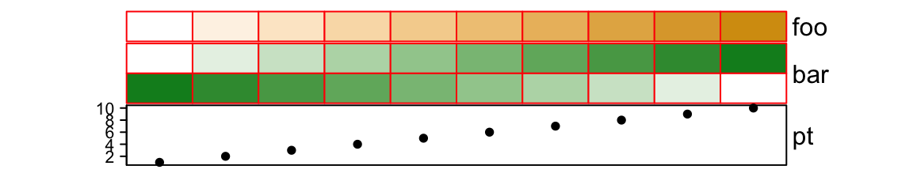

If `annotation_height` is set as a vector of absolute units, the height of all
three annotations are adjusted accordingly.


```r
# foo: 1cm, bar: 2cm, pt: 3cm
ha = HeatmapAnnotation(foo = cbind(1:10, 10:1), 
    bar = 1:10,
    pt = anno_points(1:10),
    annotation_height = unit(1:3, "cm"))
```

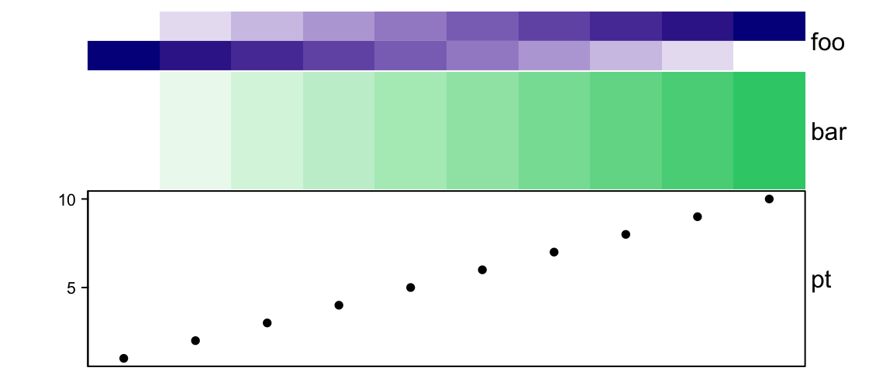

If `annotation_height` is set as pure numbers which is treated as relative
ratios for annotations, `height` should also be set as an absolute unit and
the size of every single annotation is adjusted by the ratios.


```r
# foo: 1cm, bar: 2cm, pt: 3cm
ha = HeatmapAnnotation(foo = cbind(1:10, 10:1), 
    bar = 1:10,
    pt = anno_points(1:10),
    annotation_height = 1:3, height = unit(6, "cm"))
```


`annotation_height` can be mixed with relative units (in `null` unit) and
absolute units.


```r
# foo: 1.5cm, bar: 1.5cm, pt: 3cm
ha = HeatmapAnnotation(foo = cbind(1:10, 10:1), 
    bar = 1:10,
    pt = anno_points(1:10),
    annotation_height = unit(c(1, 1, 3), c("null", "null", "cm")), height = unit(6, "cm")
)
```

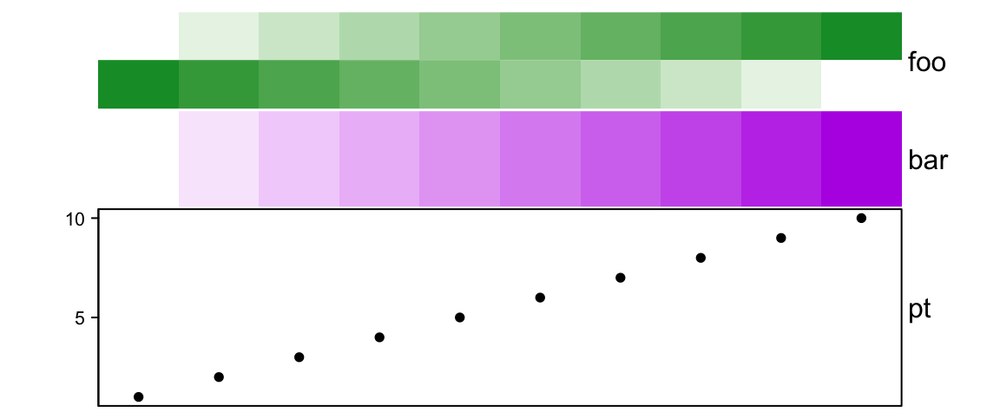


```r
# foo: 2cm, bar: 1cm, pt: 3cm
ha = HeatmapAnnotation(foo = cbind(1:10, 10:1), 
    bar = 1:10,
    pt = anno_points(1:10),
    annotation_height = unit(c(2, 1, 3), c("cm", "null", "cm")), height = unit(6, "cm")
)
```


If there are only simple annotations, simply setting `height` won't change the
height.


```r
# foo: 1cm, bar: 5mm
ha = HeatmapAnnotation(foo = cbind(1:10, 10:1), 
    bar = 1:10,
    height = unit(6, "cm"))
```

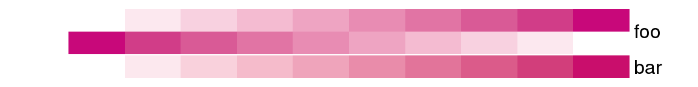

unless `simple_anno_size_adjust` is set to `TRUE`.


```r
# foo: 4cm, bar: 2cm
ha = HeatmapAnnotation(foo = cbind(1:10, 10:1), 
    bar = 1:10,
    height = unit(6, "cm"),
    simple_anno_size_adjust = TRUE)
```

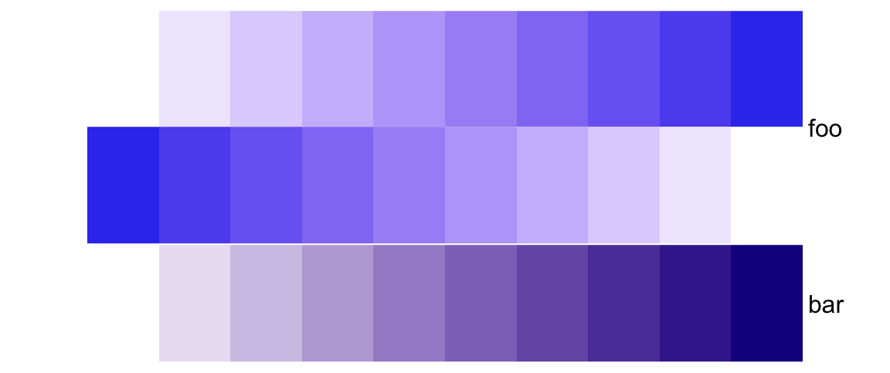

Section \@ref(annotations-as-components-are-adjusted) introduces how the
annotation sizes are adjusted among a list of heatmaps.

### Annotation labels

From version 2.3.3, alternative labels for annotations can be set by `annotation_label` argument:


```r
ha = HeatmapAnnotation(foo = 1:10, 
    bar = cbind(1:10, 10:1),
    pt = anno_points(1:10),
    annotation_label = c("Annotation_foo", "Annotation_bar", "Annotation_pt")
)
Heatmap(matrix(rnorm(100), 10), name = "mat", top_annotation = ha)
```

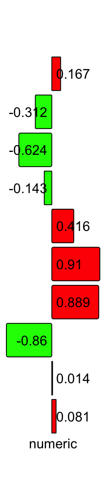


## Utility functions {#heatmap-annotation-utility-function}

There are some utility functions which make the manipulation of heatmap
annotation easier. Just see following examples.


```r
ha = HeatmapAnnotation(foo = 1:10, 
    bar = cbind(1:10, 10:1),
    pt = anno_points(1:10))
length(ha)
```

```
## [1] 3
```

```r
nobs(ha)
```

```
## [1] 10
```

Get or set the names of the annotations:


```r
names(ha)
```

```
## [1] "foo" "bar" "pt"
```

```r
names(ha) = c("FOO", "BAR", "PT")
names(ha)
```

```
## [1] "FOO" "BAR" "PT"
```

You can concatenate two `HeatmapAnnotation` objects if they contain same
number of observations and different annotation names.


```r
ha1 = HeatmapAnnotation(foo = 1:10, 
    bar = cbind(1:10, 10:1),
    pt = anno_points(1:10))
ha2 = HeatmapAnnotation(FOO = runif(10), 
    BAR = sample(c("a", "b"), 10, replace = TRUE),
    PT = anno_points(rnorm(10)))
ha = c(ha1, ha2)
names(ha)
```

```
## [1] "foo" "bar" "pt"  "FOO" "BAR" "PT"
```

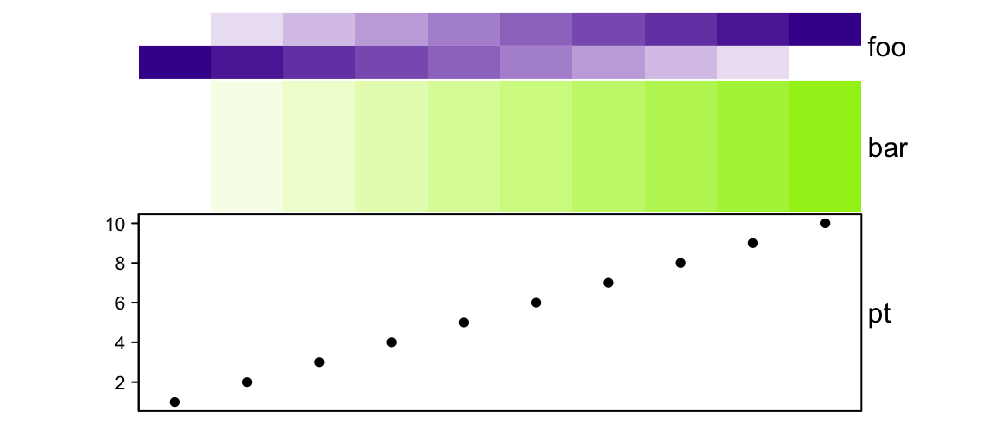

`HeatmapAnnoation` object sometimes is subsettable. The row index corresponds
to observations in the annotation and column index corresponds to the
annotations. If the annotations are all simple annotations or the complex
annotation created by `anno_*()` functions in **ComplexHeatmap** package, the
`HeatmapAnnotation` object is always subsettable.


```r
ha_subset = ha[1:5, c("foo", "PT")]
ha_subset
```

```
## A HeatmapAnnotation object with 2 annotations
##   name: heatmap_annotation_96 
##   position: column 
##   items: 5 
##   width: 1npc 
##   height: 15.3514598035146mm 
##   this object is subsetable
##   5.21733333333333mm extension on the left 
##   6.75733333333333mm extension on the right 
## 
##  name   annotation_type color_mapping height
##   foo continuous vector        random    5mm
##    PT     anno_points()                 10mm
```

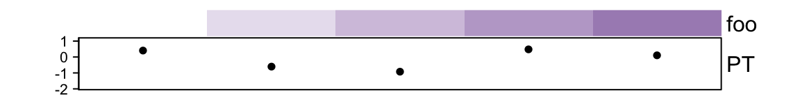

## Implement new annotation functions {#implement-new-annotation-functions}

All the annotation functions defined in **ComplexHeatmap** are constructed by
the `AnnotationFunction` class. The `AnnotationFunction` class not only stores
the "real R function" which draws the graphics, it also calculates the spaces
caused by the annotation axis, more importantly, it allows splitting the
annotation graphics according to the split of the main heatmap.

As expected, the main part of the `AnnotationFunction` class is a function
which defines how to draw at specific positions which correspond to rows or
columns in the heatmap. The function should have three arguments: `index`, `k`
and `n` (the names of the arguments can be arbitrary) where `k` and `n` are
optional. `index` corresponds to the indices of rows or columns of the
heatmap. The value of `index` is not necessarily to be the whole row indices
or column indices in the heatmap. It can also be a subset of the indices if
the annotation is split into slices according to the split of the heatmap.
`index` is reordered according to the reordering of heatmap rows or columns
(e.g. by clustering). So, `index` actually contains a list of row or column
indices for the current slice after row or column reordering.

As mentioned, annotation can be split into slices. `k` corresponds to the
current slice and `n` corresponds to the total number of slices. The
annotation function draws in every slice repeatedly. The information of `k`
and `n` sometimes can be useful, for example, we want to add axis in the
annotation, and if it is a column annotation and axis is drawn on the very
right of the annotation area, the axis is only drawn when `k == n`.

Since the function only allows `index`, `k` and `n`, the function sometimes
uses several external variables which can not be defined inside the function,
e.g. the data points for the annotation. These variables should be imported
into the `AnnotationFunction` class by `var_import` so that the function can
correctly find these variables.

One important feature for `AnnotationFunction` class is it can be subsetable,
which is the base for splitting. To allow subsetting of the object, users need
to define the rule for the imported variables if there is any. The rules are
simple functions which accpet the variable and indices, and return the subset
of the variable. The subset rule functions implemented in this package are
`subset_gp()`, `subset_matrix_by_row()` and `subset_vector()`. If the
subsetting rule is not provided, it is inferred by the type of the object.

We first construct an `AnnotationFunction` object which needs external
variable and supports subsetting.


```r
x = 1:10
anno1 = AnnotationFunction(
    fun = function(index, k, n) {
        n = length(index)
        pushViewport(viewport(xscale = c(0.5, n + 0.5), yscale = c(0, 10)))
        grid.rect()
        grid.points(1:n, x[index], default.units = "native")
        if(k == 1) grid.yaxis()
        popViewport()
    },
    var_import = list(x = x),
    n = 10,
    subsetable = TRUE,
    height = unit(2, "cm")
)
anno1
```

```
## An AnnotationFunction object
##   function: user-defined
##   position: column 
##   items: 10 
##   width: 1npc 
##   height: 2cm 
##   imported variable: x 
##   this object is subsetable
```

Then we can assign `anno1` in `HeatmapAnnotation()` function. Since `anno1` is
subsettable, you can split columns of the heatmap.


```r
m = rbind(1:10, 11:20)
Heatmap(m, top_annotation = HeatmapAnnotation(foo = anno1))
Heatmap(m, top_annotation = HeatmapAnnotation(foo = anno1), 
    column_split = rep(c("A", "B"), each = 5))
```

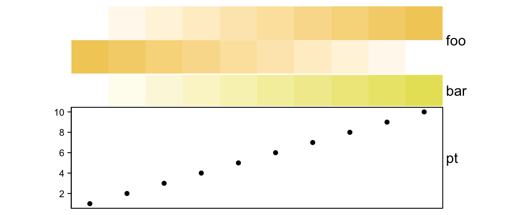

The second way is to put all data variables inside the function and no need to
import other variables.


```r
# code only for demonstration
anno2 = AnnotationFunction(
    fun = function(index) {
        x = 1:10
        n = length(index)
        pushViewport(viewport())
        grid.points(1:n, x[index])
        popViewport()
    },
    n = 10,
    subsetable = TRUE
)
```

The most compact way to only specify the function to the constructor.


```r
# code only for demonstration
anno3 = AnnotationFunction(
    fun = function(index) {
        x = 1:10
        n = length(index)
        pushViewport(viewport())
        grid.points(1:n, x[index])
        popViewport()
    }
)
```

All the `anno_*()` functions introduced in this section actually are not
really annotation functions, while they are functions generating annotation
functions with specific configurations. However, users don't need to be that
aware of.


```r
anno_points(1:10)
```

```
## An AnnotationFunction object
##   function: anno_points()
##   position: column 
##   items: 10 
##   width: 1npc 
##   height: 1cm 
##   imported variable: data_scale, axis_param, border, size, value, pch_as_image, axis, gp, axis_grob, pch 
##   subsetable variable: gp, value, size, pch 
##   this object is subsetable
##   5.13831111111111mm extension on the left
```

In most cases, you don't need to manually construct your `AnnotationFunction`
objects. The annotation function `anno_*()` implemented in **ComplexHeatmap**
are already enough for most of the analysis tasks. On the other hand, users
can also use `anno_empty()` and `decorate_annotation()` to quickly add
self-defined annotation graphics. E.g. we can re-implement previous heatmap
as:


```r
ht = Heatmap(m, top_annotation = HeatmapAnnotation(foo = anno_empty(height = unit(2, "cm"))), 
    column_split = rep(c("A", "B"), each = 5))
ht = draw(ht)
co = column_order(ht)
decorate_annotation("foo", slice = 1, {
    od = co[[1]]
    pushViewport(viewport(xscale = c(0.5, length(od) + 0.5), yscale = range(x)))
    grid.points(seq_along(od), x[od])
    grid.yaxis()
    popViewport()
})
decorate_annotation("foo", slice = 2, {
    od = co[[2]]
    pushViewport(viewport(xscale = c(0.5, length(od) + 0.5), yscale = range(x)))
    grid.points(seq_along(od), x[od])
    popViewport()
})
```

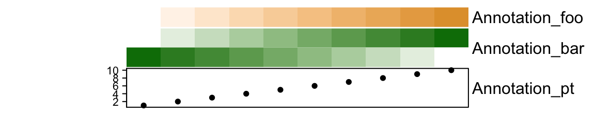
