# A List of Heatmaps {#a-list-of-heatmaps}

The main feature of **ComplexHeatmap** package is it supports to concatenate a
list of heatmaps and annotations horizontally or vertically so that it makes
it possible to visualize the associations from various sources of information.
In this chapter, we mainly introduce the horizontal concatenation because this
is the major case we will use in the analysis. In the end we show some
examples of vertical concatenation. The concept behind for horizontal and
vertical concatenation basically is similar.

For the horizontal concatenation, the number of rows for all heatmaps and
annotations should be the same. In following we first introduce the
concatenation of heatmaps and later we will show how to concatenate heatmaps
with annotations.

In following example, there are three matrices where the third heatmap is a
vector and it will be transformed as a one-column matrix. The one-column
heatmap is sometimes useful when you concatenate a list of heatmaps that it
can show e.g. annotations for each row or some scores of each row. E.g. if
rows are genes, the type of the genes (i.e. protein coding or not) can be
represented as a one-column character matrix, and the p-value or the fold
change from differential expression analysis can be represented as a
one-column numeric matrix, and be concatenated to the main expression heatmap.


```r
set.seed(123)
mat1 = matrix(rnorm(80, 2), 8, 10)
mat1 = rbind(mat1, matrix(rnorm(40, -2), 4, 10))
rownames(mat1) = paste0("R", 1:12)
colnames(mat1) = paste0("C", 1:10)

mat2 = matrix(runif(60, max = 3, min = 1), 6, 10)
mat2 = rbind(mat2, matrix(runif(60, max = 2, min = 0), 6, 10))
rownames(mat2) = paste0("R", 1:12)
colnames(mat2) = paste0("C", 1:10)

le = sample(letters[1:3], 12, replace = TRUE)
names(le) = paste0("R", 1:12)

ind = sample(12, 12)
mat1 = mat1[ind, ]
mat2 = mat2[ind, ]
le = le[ind]
```

To concatenate heatmaps, simply use `+` operator.


```r
ht1 = Heatmap(mat1, name = "rnorm")
ht2 = Heatmap(mat2, name = "runif")
ht3 = Heatmap(le, name = "letters")

ht1 + ht2 + ht3
```

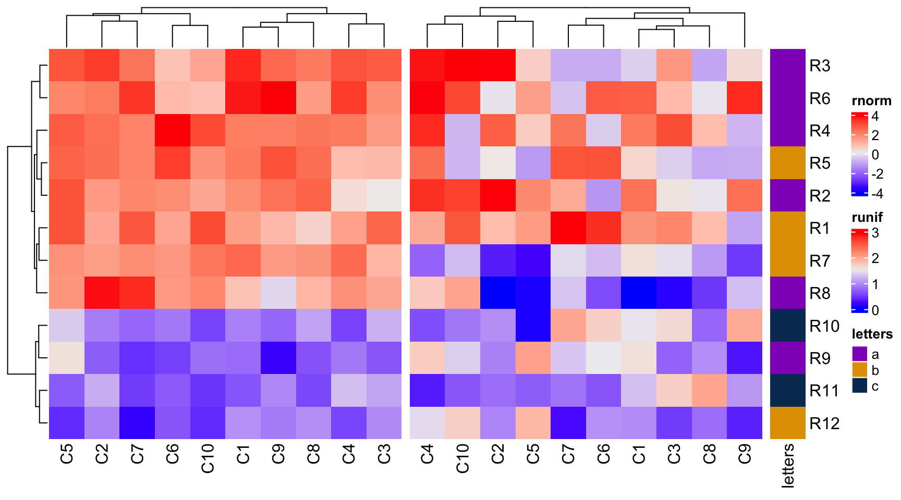

Under default mode, dendrograms from the second heatmap will be removed and
row orders will be the same as the first one. Also row names for the first two
heatmaps are removed as well.

The returned value of the concatenation is a `HeatmapList` object. Similar as
explained in Section \@ref(plot-the-heatmap), directly printing `ht_list` will
call `draw()` method with default settings. With explicitly calling `draw()`
method, you can have more controls on the heatmap list.


```r
ht_list = ht1 + ht2 + ht3
class(ht_list)
```

```
## [1] "HeatmapList"
## attr(,"package")
## [1] "ComplexHeatmap"
```

You can append any number of heatmaps to the heatmap list. Also you can append
a heatmap list to a heatmap list.


```r
# code only for demonstration
ht1 + ht_list
ht_list + ht1
ht_list + ht_list
```

`NULL` can be added to the heatmap list. It would be convinient when users
want to construct a heatmap list through a `for` loop.


```r
# code only for demonstration
ht_list = NULL  ## Heatmap(...) + NULL gives you a HeatmapList object
for(s in sth) {
    ht_list = ht_list + Heatmap(...)
}
```

You can also add heatmap annotations to the heatmap list, see more details in
Section \@ref(concatenate-with-annotations).

## Titles {#heatmap-list-titles}

A heatmap list also has title which is like a global title covering all
heatmaps. `row_title` and `column_title` should be set in the `draw()`
function.

From following example, we set different colors for each heatmap to make them
distinguishable.


```r
col_rnorm = colorRamp2(c(-3, 0, 3), c("green", "white", "red"))
col_runif = colorRamp2(c(0, 3), c("white", "orange"))
col_letters = c("a" = "pink", "b" = "purple", "c" = "blue")
ht1 = Heatmap(mat1, name = "rnorm", col = col_rnorm,
    row_title = "Heatmap 1", column_title = "Heatmap 1")
ht2 = Heatmap(mat2, name = "runif", col = col_runif,
    row_title = "Heatmap 2", column_title = "Heatmap 2")
ht3 = Heatmap(le, name = "letters", col = col_letters)
ht_list = ht1 + ht2 + ht3

draw(ht_list, row_title = "Three heatmaps, row title", row_title_gp = gpar(col = "red"),
    column_title = "Three heatmaps, column title", column_title_gp = gpar(fontsize = 16))
```

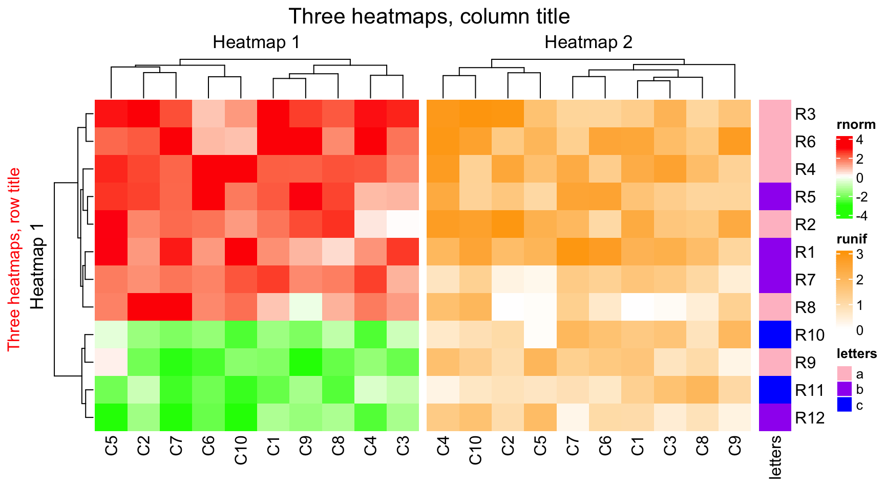

You can use `gt_render()` to construct complicated text, see Section \@ref(gridtext).

## Size of heatmaps {#size-of-heatmaps}

The width for some heatmaps can be set to absolute units. Note `width`
controls the width of the heatmap body.


```r
ht2 = Heatmap(mat2, name = "runif", col = col_runif, width = unit(4, "cm"))
ht3 = Heatmap(le, name = "letters", col = col_letters, width = unit(5, "mm"))
ht1 + ht2 + ht3
```

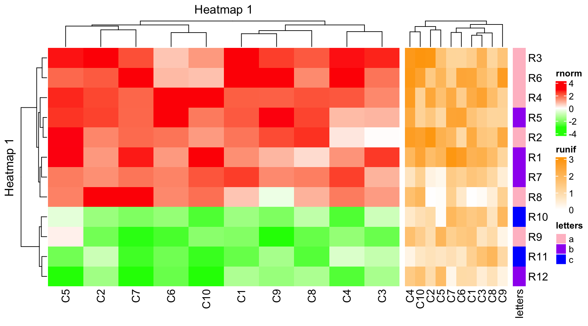

The width of all heatmaps can be set as absolute units.


```r
ht1 = Heatmap(mat1, name = "rnorm", col = col_rnorm, width = unit(4, "cm"))
ht2 = Heatmap(mat2, name = "runif", col = col_runif, width = unit(6, "cm"))
ht3 = Heatmap(le, name = "letters", col = col_letters, width = unit(1, "cm"))
ht1 + ht2 + ht3
```

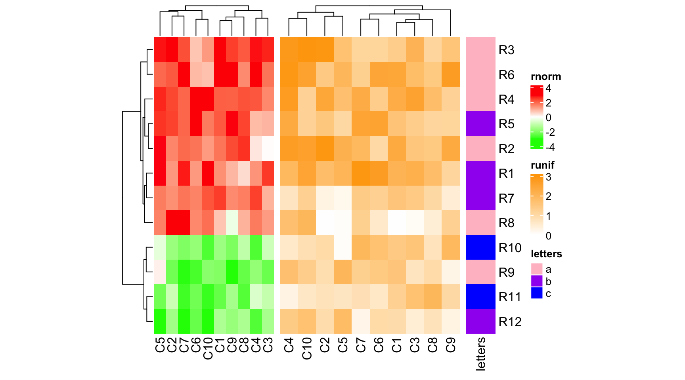

If `width` is numeric, it is converted as a `null` unit.


```r
ht1 = Heatmap(mat1, name = "rnorm", col = col_rnorm, width = 6)
ht2 = Heatmap(mat2, name = "runif", col = col_runif, width = 4)
ht3 = Heatmap(le, name = "letters", col = col_letters, width = 1)
ht1 + ht2 + ht3
```

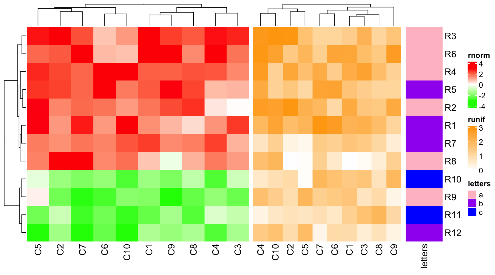

`heatmap_width` also can control the width of the heatmap, but it is the total
width of the heatmap body plus the heatmap components.

## Gap between heatmaps {#gap-between-heatmaps}

`ht_gap` controls the space between heatmaps. The value can be a single unit
or a vector of units.


```r
ht1 = Heatmap(mat1, name = "rnorm", col = col_rnorm)
ht2 = Heatmap(mat2, name = "runif", col = col_runif)
ht3 = Heatmap(le, name = "letters", col = col_letters)
ht_list = ht1 + ht2 + ht3
draw(ht_list, ht_gap = unit(1, "cm"))
```

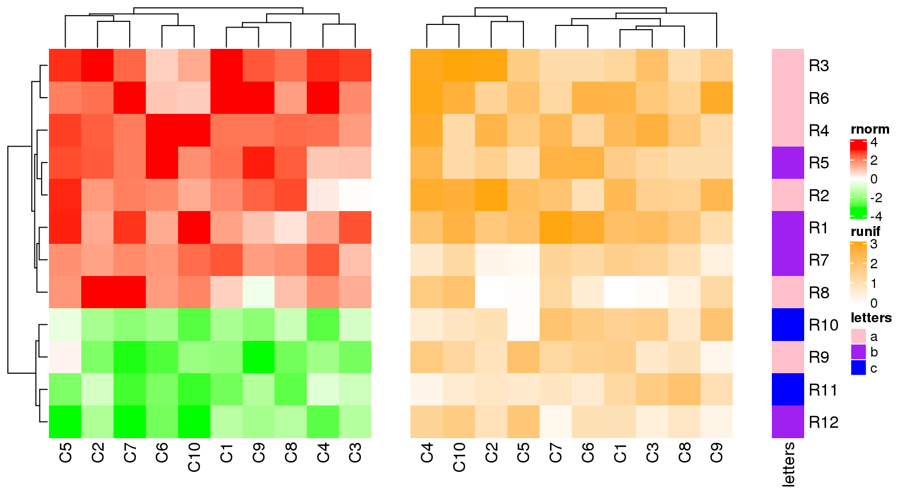

```r
draw(ht_list, ht_gap = unit(c(3, 10), "mm"))
```

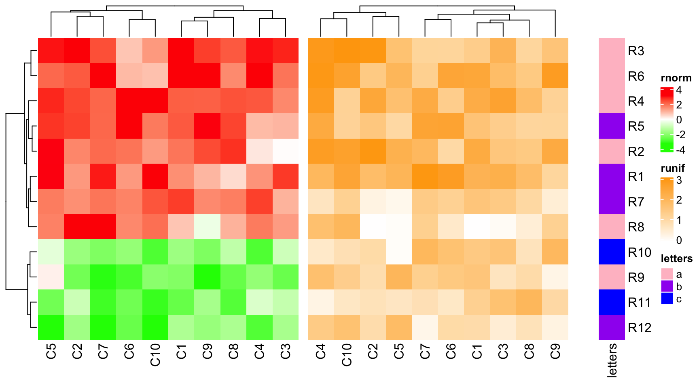

## Automatic adjustment to the main heatmap {#automatic-adjustment-to-the-main-heatmap}

There is always a main heatmap in the heatmap list that controls the global
row ordering. All the other heatmaps are automatically adjusted according to
the settings in the main heatmap. For these non-main heatmaps, the adjustments
are:

- No row clustering is performed and they all take the row ordering of the
  main heatmap.
- Row titles are removed.
- If the main heatmap is split by rows, all other heatmaps will also be split
  by same levels as the main heatmap.
- The height of the main heatmap are taken as the height of all heatmaps.

By default, the first heatmap is taken as the main heatmap.


```r
ht1 = Heatmap(mat1, name = "rnorm", col = col_rnorm, row_km = 2)
ht2 = Heatmap(mat2, name = "runif", col = col_runif)
ht3 = Heatmap(le, name = "letters", col = col_letters)
ht2 + ht1 + ht3 # ht2 is the main heatmap and row_km in ht1 is ignored
```

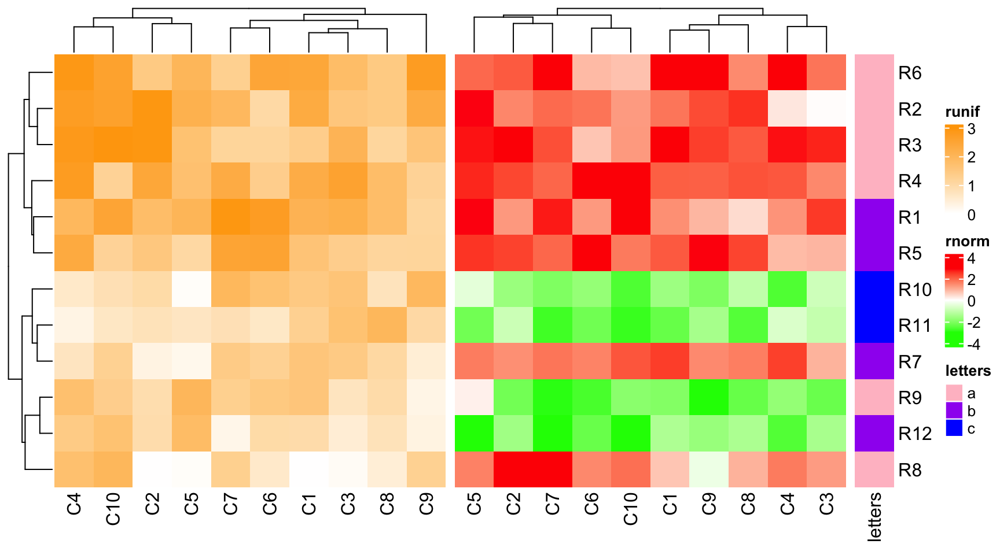

The main heatmap can be specified by `main_heatmap` argument. The value can be
a numeric index or the name of the heatmap (of course, you need to set the
heatmap name when you create the `Heatmap` object). In following example,
although `ht1` is the second heatmap, we can set it as the main heatmap.


```r
ht_list = ht2 + ht1 + ht3
draw(ht_list, main_heatmap = "rnorm")
```

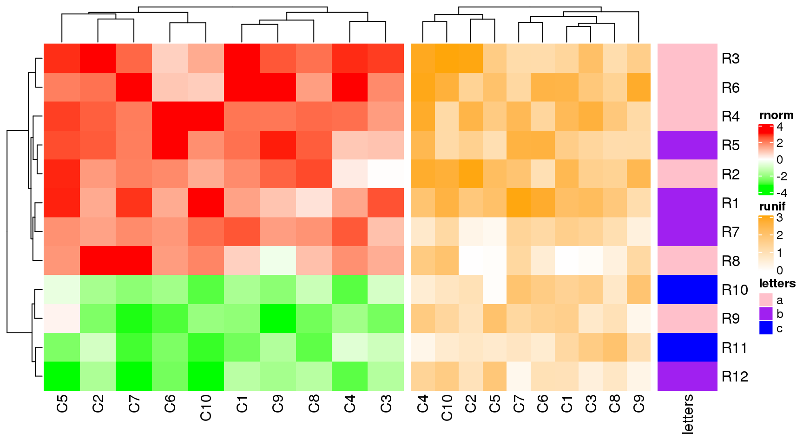

By default, the dendrogram and the row title are plotted just beside the main
heatmap, just to emphasize the clustering or the splitting is calculated from
the main heatmap while not other heatmaps. However, the position of the
dendrogram and row title of the main heatmap can be controlled by
`row_dend_side` and `row_sub_title_side` in `draw()` function.


```r
ht_list = ht2 + ht1 + ht3
draw(ht_list, main_heatmap = "rnorm", row_dend_side = "right", row_sub_title_side = "left")
```


Similarly, if there is no row clustering in the main heatmap, all other
heatmaps are not clustered neither.


```r
ht1 = Heatmap(mat1, name = "rnorm", col = col_rnorm, cluster_rows = FALSE)
ht2 = Heatmap(mat2, name = "runif", col = col_runif)
ht3 = Heatmap(le, name = "letters", col = col_letters)
ht1 + ht2 + ht3
```

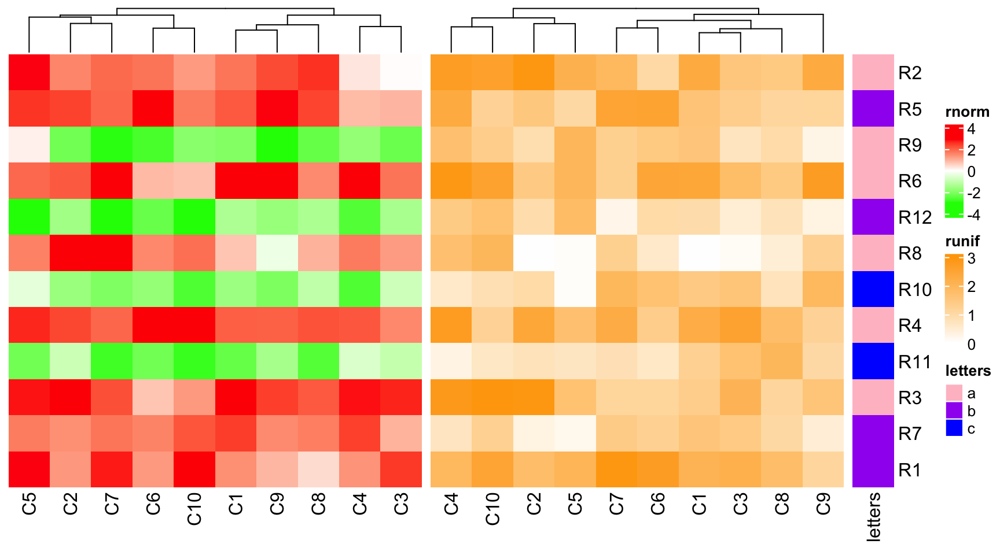

As you may have observed, all the row names between heatmaps are removed from
the plot. You can show them by setting `auto_adjust = FALSE`.


```r
ht1 = Heatmap(mat1, name = "rnorm", col = col_rnorm)
ht2 = Heatmap(mat2, name = "runif", col = col_runif)
ht3 = Heatmap(le, name = "letters", col = col_letters)
ht_list = ht1 + ht2 + ht3
draw(ht_list, auto_adjust = FALSE)
```

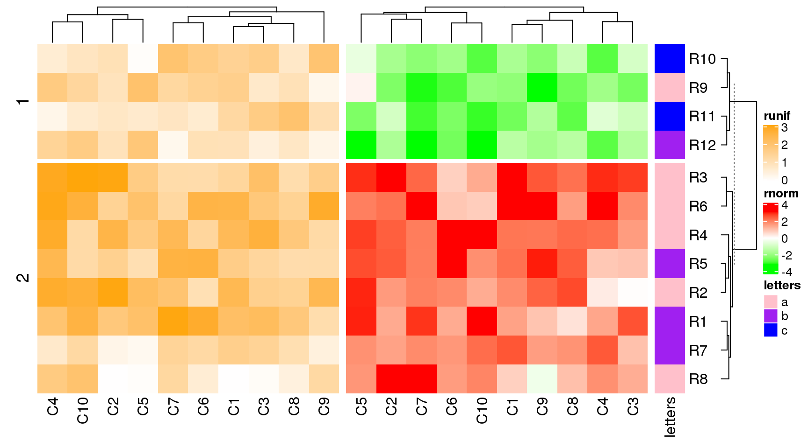

## Control main heatmap in draw() function {#control-main-heatmap-in-draw-function}

Settings of the main heatmap can be controlled in the main `Heatmap()`
function. To make it convinient, settings that affect heatmap rows can also be
directly set in `draw()`. If some of these settings are set, corresponding
settings in the main `Heatmap()` will be overwritten.

In `draw()` function, following main heatmap settings control row orders of
all heatmaps.

- `cluster_rows`
- `clustering_distance_rows`
- `clustering_method_rows`
- `row_dend_width`
- `show_row_dend`
- `row_dend_reorder`
- `row_dend_gp`
- `row_order`

Following settings control the row slices. 

- `row_gap`
- `row_km`
- `row_km_repeats`
- `row_split`

Following settings control the heatmap height.

- `height`
- `heatmap_height`

In following example, `row_km = 2, cluster_rows = FALSE` for `ht1` is
overwritten in `draw()`.


```r
ht1 = Heatmap(mat1, name = "rnorm", col = col_rnorm, row_km = 2, cluster_rows = FALSE)
ht2 = Heatmap(mat2, name = "runif", col = col_runif)
ht3 = Heatmap(le, name = "letters", col = col_letters)
ht_list = ht1 + ht2 + ht3
draw(ht_list, row_km = 1, row_split = le, cluster_rows = TRUE)
```

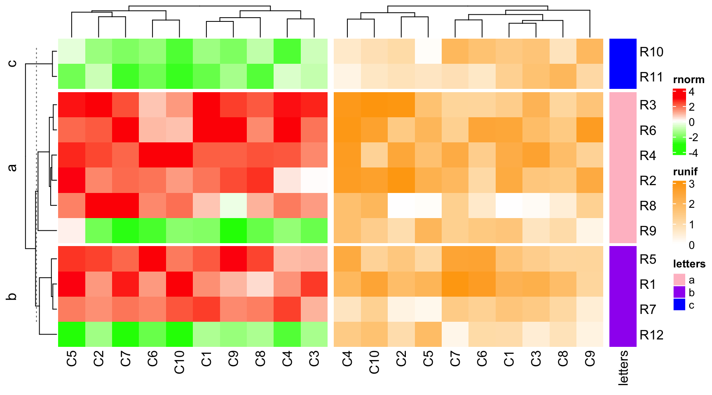

## Annotations as components are adjusted {#annotations-as-components-are-adjusted}

If some of the heatmaps in the heatmap list have annotations, in most of the
cases, the heights of the heatmap annotations are different for different
heatmaps. There are automatic adjustment for heatmap annotations, and this
adjustment will also involve adjustment of dendrograms.

Normally, the size of simple annotations will not change in the adjustment. In
following example, the dendrogram for the second heatmap is adjusted. Note you
still can change the size of simple annotation by setting `anno_simple_size`
in `HeatmapAnnotation()` or globally set `ht_opt$anno_simple_size`.


```r
ha1 = HeatmapAnnotation(foo1 = 1:10, annotation_name_side = "left")
ht1 = Heatmap(mat1, name = "rnorm", col = col_rnorm, top_annotation = ha1)
ht2 = Heatmap(mat2, name = "runif", col = col_runif)
ht3 = Heatmap(le, name = "letters", col = col_letters)
ht1 + ht2 + ht3
```

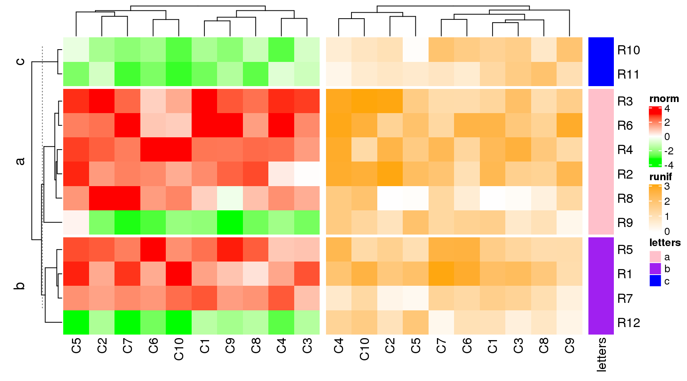

If the first two heatmaps all have annotations, since the size of simple
annotations keep unchanged, the size of complex annotations will be adjusted
to make the total heights of the two heatmap annotations the same.


```r
ha1 = HeatmapAnnotation(foo1 = 1:10, bar1 = anno_points(1:10), 
    annotation_name_side = "left")
ha2 = HeatmapAnnotation(bar2 = anno_barplot(1:10))
ht1 = Heatmap(mat1, name = "rnorm", col = col_rnorm, top_annotation = ha1)
ht2 = Heatmap(mat2, name = "runif", col = col_runif, top_annotation = ha2)
ht3 = Heatmap(le, name = "letters", col = col_letters)
ht_list = ht1 + ht2 + ht3
draw(ht_list, ht_gap = unit(c(6, 2), "mm"))
```

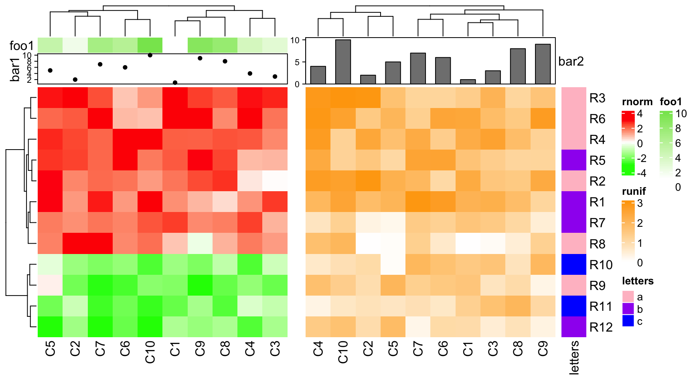

Similarly, if the first heatmap only contains simple annotatins, dendrogram
will be adjusted.


```r
ha1 = HeatmapAnnotation(foo1 = 1:10, annotation_name_side = "left")
ha2 = HeatmapAnnotation(bar2 = anno_barplot(1:10, height = unit(2, "cm")))
ht1 = Heatmap(mat1, name = "rnorm", col = col_rnorm, top_annotation = ha1)
ht2 = Heatmap(mat2, name = "runif", col = col_runif, top_annotation = ha2)
ht3 = Heatmap(le, name = "letters", col = col_letters)
ht_list = ht1 + ht2 + ht3
draw(ht_list, ht_gap = unit(c(6, 2), "mm"))
```

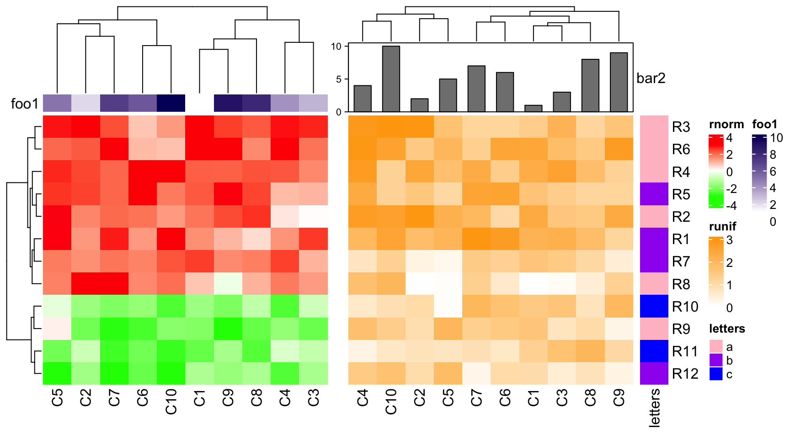

If the both heatmaps only contain simple annotations but with unequal number,
dendrogram will be adjusted.


```r
ha1 = HeatmapAnnotation(foo1 = 1:10, annotation_name_side = "left")
ha2 = HeatmapAnnotation(bar2 = cbind(b1 = 1:10, b2 = 11:20, b3 = 21:30))
ht1 = Heatmap(mat1, name = "rnorm", col = col_rnorm, top_annotation = ha1)
ht2 = Heatmap(mat2, name = "runif", col = col_runif, top_annotation = ha2)
ht3 = Heatmap(le, name = "letters", col = col_letters)
ht_list = ht1 + ht2 + ht3
draw(ht_list)
```

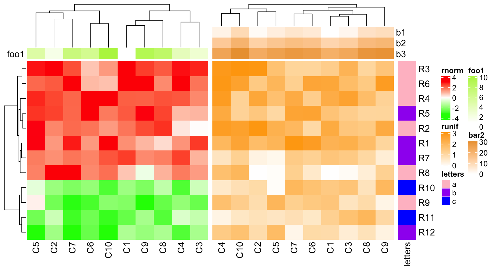

If you also want to automatically adjust the size of simple annotations, set
`simple_anno_size_adjust = TRUE` in every `HeatmapAnnotation()` calls.

If the second heatmap has no bottom annotation, column names for the second
heatmap are adjusted to be put directly below the heatmap body.


```r
ha1 = HeatmapAnnotation(foo1 = 1:10, bar1 = anno_points(1:10), annotation_name_side = "left")
ht1 = Heatmap(mat1, name = "rnorm", col = col_rnorm, bottom_annotation = ha1)
ht2 = Heatmap(mat2, name = "runif", col = col_runif)
ht3 = Heatmap(le, name = "letters", col = col_letters)
ht_list = ht1 + ht2 + ht3
draw(ht_list)
```

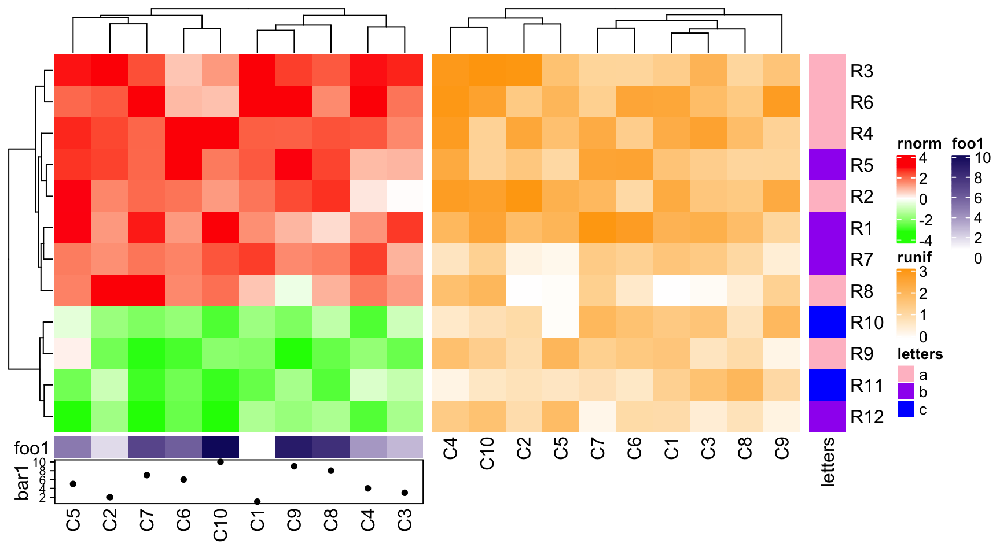

## Concatenate with annotations {#concatenate-with-annotations}

Row annotations can be concatenated to the horizontal heatmap list, while not
only a component of the heatmap. See following examples which are very
straightforward.


```r
ha1 = rowAnnotation(foo = 1:12, bar = anno_barplot(1:12, width = unit(4, "cm")))
ht1 = Heatmap(mat1, name = "rnorm", col = col_rnorm, row_km = 2)
ht1 + ha1
```

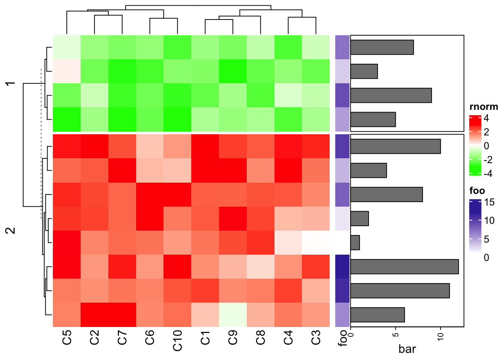

The `foo` and `bar` annotations can be defined in two separated
`rowAnnotation()` calls.


```r
Heatmap(mat1, name = "rnorm", col = col_rnorm, row_km = 2) + 
    rowAnnotation(foo = 1:12) +
    rowAnnotation(bar = anno_barplot(1:12, width = unit(4, "cm")))
```

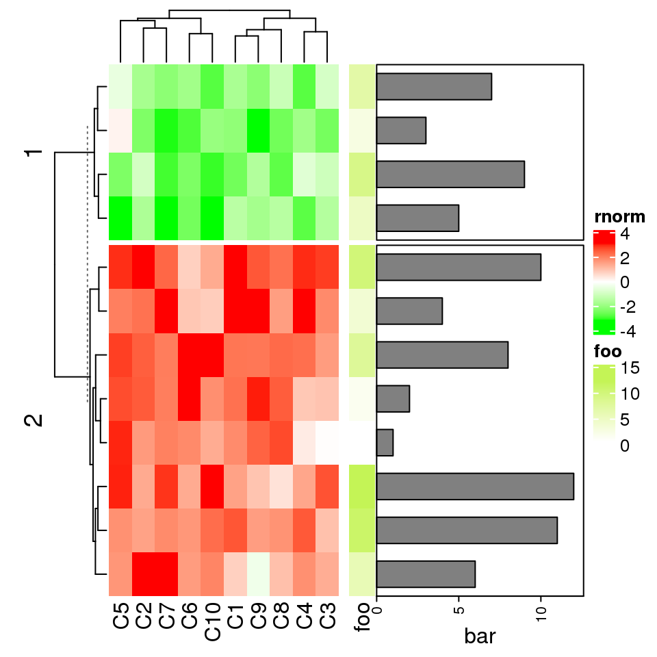

You may wonder how to recover the row names of `mat1`. There are two ways. 

1. you can set the row annotation as the "right annotation" of the heatmap and
   put the heatmap as the last one.


```r
Heatmap(mat1, name = "rnorm", col = col_rnorm, row_km = 2, right_annotation = ha1)
```

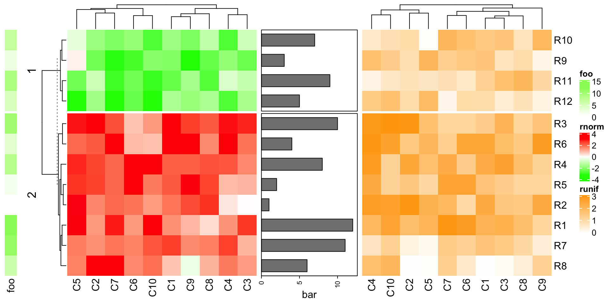

```r
# or using the previous variable
# attach_annotation(ht1, ha1, side = "right")
```

2. add the row names by adding a text annotation:


```r
ht1 + ha1 + rowAnnotation(rn = anno_text(rownames(mat1), 
    location = unit(0, "npc"), just = "left"))
```

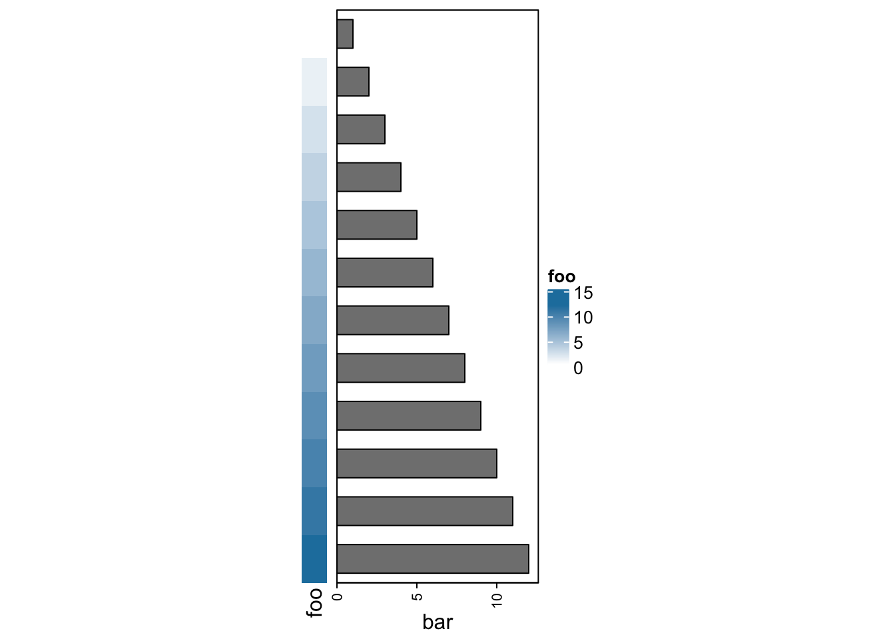

Basically heatmaps and row annotations can be concatenated arbitarily.


```r
rowAnnotation(foo = 1:12) +
    Heatmap(mat1, name = "rnorm", col = col_rnorm, row_km = 2) + 
    rowAnnotation(bar = anno_barplot(1:12, width = unit(4, "cm"))) +
    Heatmap(mat2, name = "runif", col = col_runif)
```

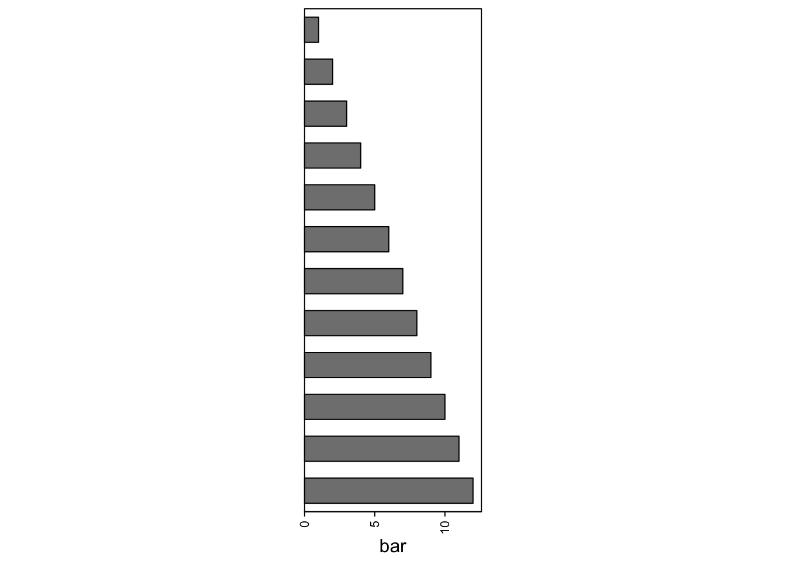

As mentioned in previous chapters, row annotations can also be heatmap
components as left annotations or right annotations. The difference of row
annotations as independent ones and as heatmap components is discussed in
Section \@ref(vertical-concatenation).

## Concatenate only the annotations {#concatenate-only-the-annotations}

The concatenation can be done without any heatmap.


```r
rowAnnotation(foo = 1:12) +
    rowAnnotation(bar = anno_barplot(1:12, width = unit(4, "cm")))
```

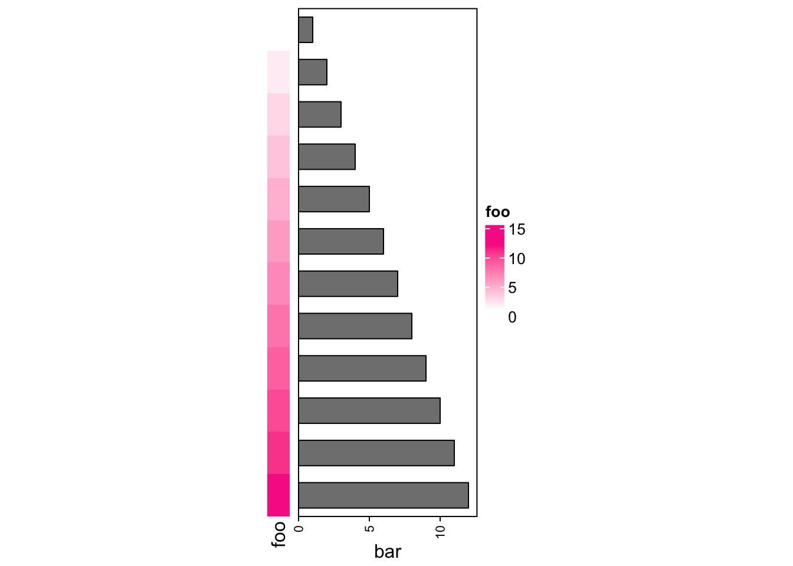

If there is only one `HeatmapAnnotation` object, you must concatenated with `NULL`.


```r
rowAnnotation(bar = anno_barplot(1:12, width = unit(4, "cm"))) + NULL
```

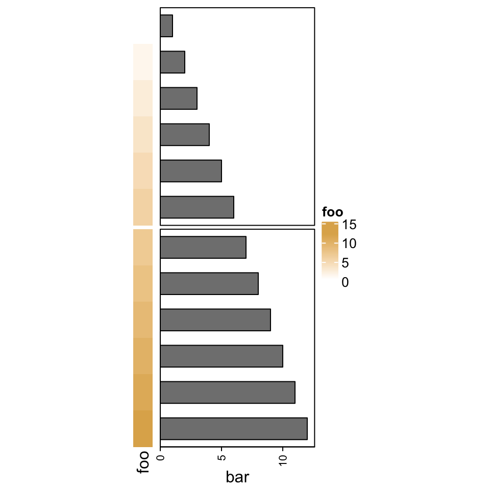

The annotation list is actually also a `HeatmapList` object.


```r
anno_list = rowAnnotation(foo = 1:12) +
    rowAnnotation(bar = anno_barplot(1:12, width = unit(4, "cm")))
class(anno_list)
```

```
## [1] "HeatmapList"
## attr(,"package")
## [1] "ComplexHeatmap"
```

Thus, you can use some functionalities of the `draw()` function for the
annotation list, such as row splitting.


```r
draw(anno_list, row_split = rep(c("A", "B"), each = 6))
```

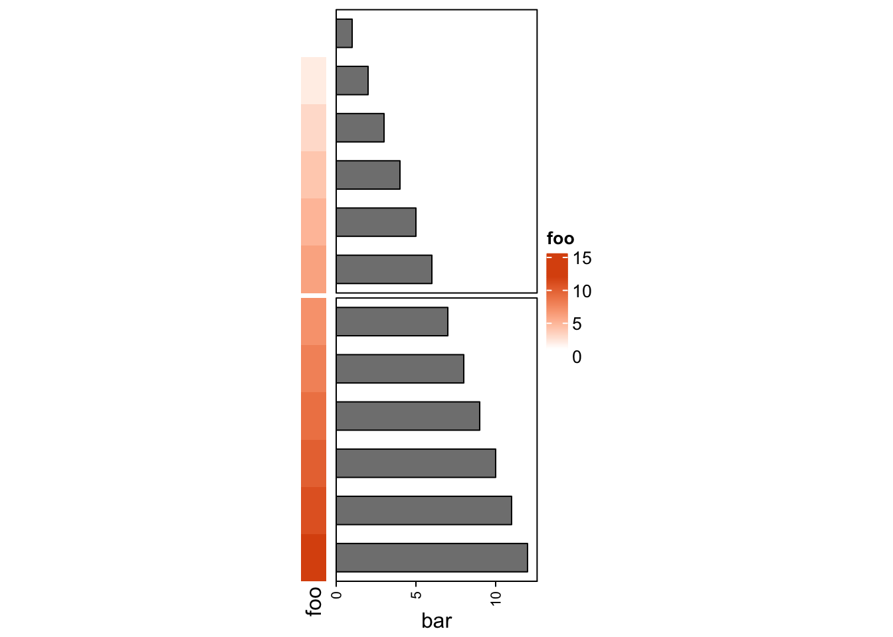

In Section \@ref(stacked-summary-plot), we will show how to use a list of
annotations to visualize multiple summary statistics.

## Vertical concatenation {#vertical-concatenation}

Heatmaps and annotations (now it is column annotation) can be concatenated
vertically by the `%v%` operator. All the relatated settings and adjustments
are very similar as the horizontal concatenation. Please check following
examples.


```r
mat1t = t(mat1)
mat2t = t(mat2)
ht1 = Heatmap(mat1t, name = "rnorm", col = col_rnorm, row_title = "rnorm")
ht2 = Heatmap(mat2t, name = "runif", col = col_runif, row_title = "runif")
ht3 = Heatmap(rbind(letters = le), name = "letters", col = col_letters)
ht_list = ht1 %v% ht2 %v% ht3
draw(ht_list)
```


```r
draw(ht_list, column_km = 2)
```

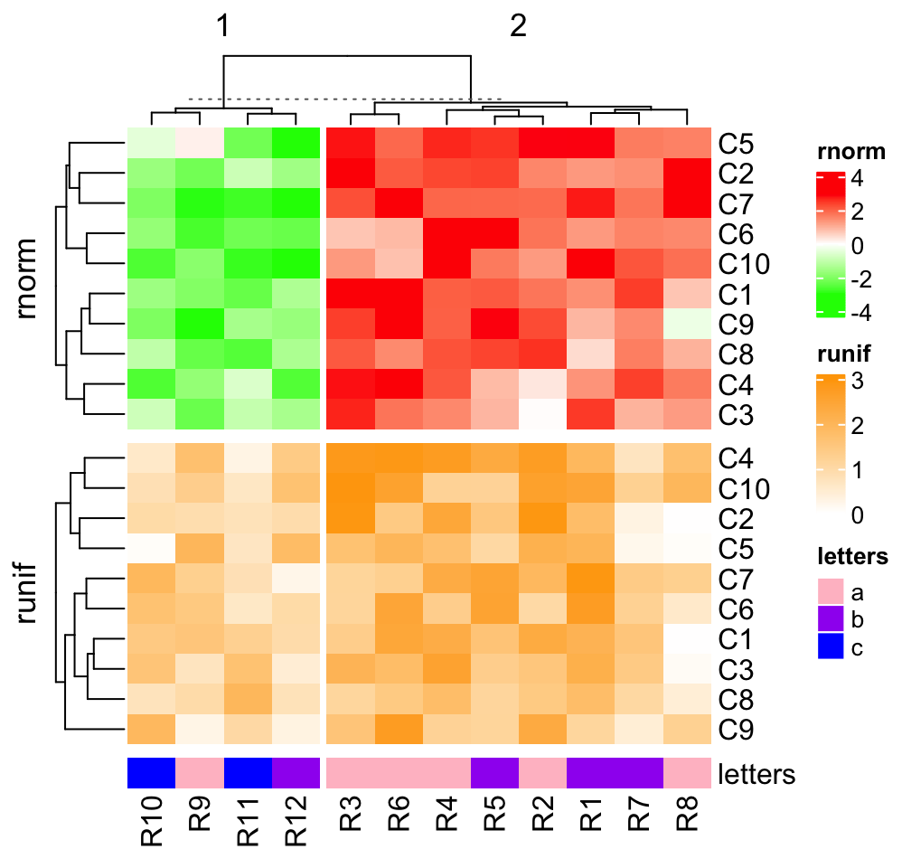


```r
ha = HeatmapAnnotation(foo = anno_barplot(1:12, height = unit(2, "cm")))
ht_list = ht1 %v% ha %v% ht2 %v% ht3
draw(ht_list, column_km = 2)
```

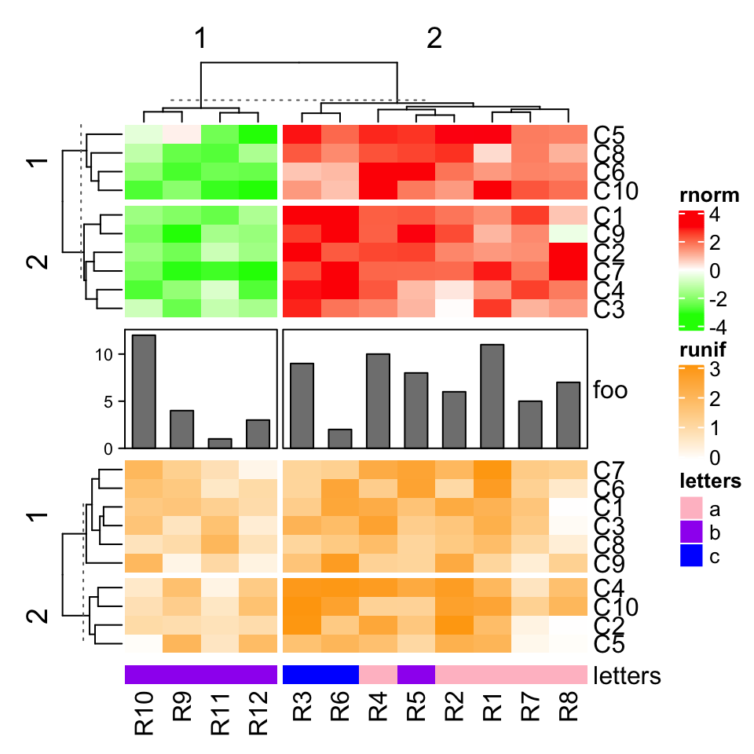


```r
ht1 = Heatmap(mat1t, name = "rnorm", col = col_rnorm, row_km = 2)
ht2 = Heatmap(mat2t, name = "runif", col = col_runif, row_km = 2)
ht3 = Heatmap(rbind(letters = le), name = "letters", col = col_letters)
ha = HeatmapAnnotation(foo = anno_barplot(1:12, height = unit(2, "cm")))
ht_list = ht1 %v% ha %v% ht2 %v% ht3
draw(ht_list, column_km = 2)
```

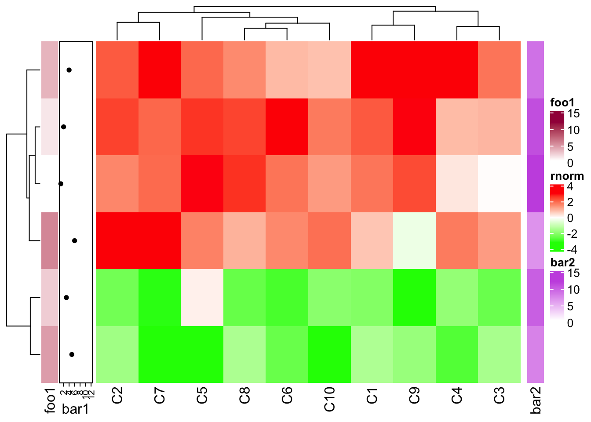

For the vertical heatmap list, now row annotations should be the heatmap
components (by `right_annotation` and `left_annotation`) and they are adjusted
just like column annotations for the horizontal heatmap list.


```r
ht1 = Heatmap(mat1t, name = "rnorm", col = col_rnorm, row_km = 2,
    left_annotation = rowAnnotation(foo1 = 1:10, bar1 = anno_barplot(1:10)))
ha = HeatmapAnnotation(foo = anno_barplot(1:12, height = unit(2, "cm"), 
    axis_param = list(side = "right")))
ht2 = Heatmap(mat2t, name = "runif", col = col_runif, row_km = 2,
    left_annotation = rowAnnotation(foo2 = 1:10))
ht3 = Heatmap(rbind(letters = le), name = "letters", col = col_letters)
ht_list = ht1 %v% ha %v% ht2 %v% ht3
draw(ht_list, column_km = 2)
```

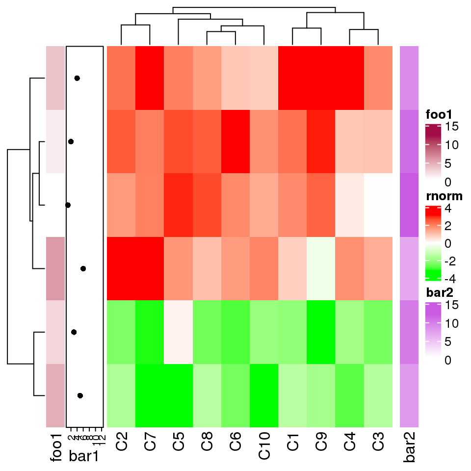

Since `rowAnnotation()` allows arbitary number of annotations, the way showed
above is the only way to expand the heatmap list horizontally and vertically
at the same time.

## Subset the heatmap list {#subset-heatmap-list}

Similar as subsetting the `Heatmap` object (Section \@ref(subset-a-heatmap)),
the heatmap list can also be subsetted by providing row index and column
index. For horizontal heatmap list, row index correspond to rows in all
heatmaps and annotations, while column index only corresponds to a subset of
heatmaps and annotations. For vertical heatmap list, it's the other way
around.

In following we use horizontal heatmap list as example.


```r
ht1 = Heatmap(mat1, name = "rnorm", col = col_rnorm, 
    left_annotation = rowAnnotation(foo1 = 1:12, bar1 = anno_points(1:12)))
ht2 = Heatmap(mat2, name = "runif", col = col_runif)
ha = rowAnnotation(foo2 = anno_barplot(1:12), bar2 = 12:1)
ht_list = ht1 + ht2 + ha
names(ht_list)
```

```
## [1] "rnorm" "runif" "foo2"  "bar2"
```

```r
ht_list[1:6, c("rnorm", "bar2")]
```

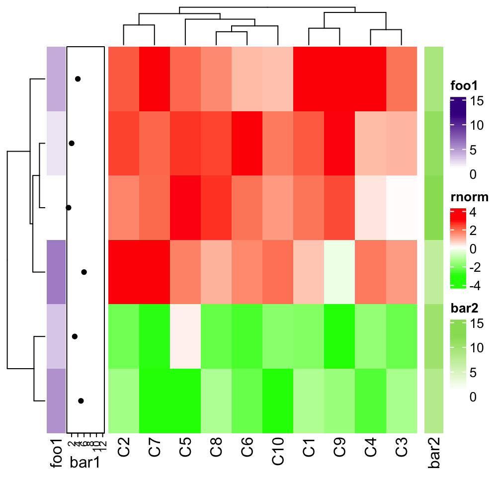

`foo1` and `bar` are components of heatmap `rnorm`, so they can not be
selected in the subset function, while `foo2` and `bar2` are independent row
annotations and they can selected to take subset of them.

## Plot the heatmap list {#plot-the-heamtap-list}

Similar as described in Section \@ref(plot-the-heatmap), directly entering the
HeatmapList object in interactive R session calls the `show()` method which
calls the `draw()` method internally. When there is no plot after you entering
the object, you should use `draw()` explicitly:


```r
# code only for demonstration
draw(ht_list, ...)
```

## Get orders and dendrograms {#get-orders-and-dendrograms-from-a-list-of-heatmaps}

`row_order()`, `column_order()`, `row_dend()` and `column_dend()` can be used
to retrieve corresponding information from the heatmap list. The usage is
straightforward by following examples. But remember you need to apply these
functions on the object returned by `draw()`.


```r
ht1 = Heatmap(mat1, name = "rnorm", col = col_rnorm)
ht2 = Heatmap(mat2, name = "runif", col = col_runif)
ht_list = ht1 + ht2
ht_list = draw(ht_list)
row_order(ht_list)
```

```
##  [1] 10  4  8  2  1 12 11  6  7  3  9  5
```

```r
column_order(ht_list)
```

```
## $rnorm
##  [1]  5  2  7  6 10  1  9  8  4  3
## 
## $runif
##  [1]  4 10  2  5  7  6  1  3  8  9
```

If rows or columns are split, the returned values will also be a list.


```r
ht1 = Heatmap(mat1, name = "rnorm", col = col_rnorm)
ht2 = Heatmap(mat2, name = "runif", col = col_runif, column_km = 2)
ht_list = ht1 + ht2
ht_list = draw(ht_list, row_km = 2)
row_order(ht_list)
```

```
## $`1`
## [1] 7 3 9 5
## 
## $`2`
## [1] 10  4  8  2  1 12 11  6
```

```r
column_order(ht_list)
```

```
## $rnorm
## $rnorm[[1]]
##  [1]  5  2  7  6 10  1  9  8  4  3
## 
## 
## $runif
## $runif$`2`
## [1]  4 10  2  5
## 
## $runif$`1`
## [1] 7 6 1 3 8 9
```

You can specify a certain heatmap for the column order.


```r
column_order(ht_list, name = "runif")
```

```
## $`2`
## [1]  4 10  2  5
## 
## $`1`
## [1] 7 6 1 3 8 9
```

The logic is the same for extracting dendrograms and also the same for vertical
heatmap list, so we don't show more examples here.

## Change parameters globally {#change-parameters-globally}

`ht_opt()` is an option function which controls some parameters globally. You
can set some parameters for all heatmaps/annotations simultaneously by this
global function. Please note you should put it before your heatmap code and
reset all option values after drawing the heatmaps to get rid of affecting
next heatmap.


```r
ht_opt
```

```
##  Option                       Value             
##  ----------------------------:--------------------
##  heatmap_row_names_gp         NULL              
##  heatmap_column_names_gp      NULL              
##  heatmap_row_title_gp         NULL              
##  heatmap_column_title_gp      NULL              
##  legend_title_gp              NULL              
##  legend_title_position        NULL              
##  legend_labels_gp             NULL              
##  legend_grid_height           NULL              
##  legend_grid_width            NULL              
##  legend_border                NULL              
##  legend_gap                   4mm, 4mm          
##  heatmap_border               NULL              
##  annotation_border            NULL              
##  fast_hclust                  FALSE             
##  show_parent_dend_line        TRUE              
##  verbose                      FALSE             
##  message                      TRUE              
##  show_vp                      FALSE             
##  simple_anno_size             5mm               
##  DENDROGRAM_PADDING           0.5mm             
##  DIMNAME_PADDING              1mm               
##  TITLE_PADDING                NULL              
##  COLUMN_ANNO_PADDING          1mm               
##  ROW_ANNO_PADDING             1mm               
##  HEATMAP_LEGEND_PADDING       2mm               
##  ANNOTATION_LEGEND_PADDING    2mm               
##  save_last                    FALSE             
##  validate_names               TRUE              
##  raster_temp_image_max_width  30000             
##  raster_temp_image_max_height 30000             
##  COLOR                        blue, #EEEEEE, red
```

There are following parameters to control all heatmaps:

- `heatmap_row_names_gp`: set `row_names_gp` in all `Heatmap()`.
- `heatmap_column_names_gp`: set `column_names_gp` in all `Heatmap()`.
- `heatmap_row_title_gp`: set `row_title_gp` in all `Heatmap()`.
- `heatmap_column_title_gp`: set `column_title_gp` in all `Heatmap()`.
- `heatmap_border`: set `border` in all `Heatmap()`.

Following parameters control the legends:

- `legend_title_gp`: set `title_gp` in all heatmap legends and annotation
  legends.
- `legend_title_position`: set `title_position` in all heatmap legends and
  annotation legends.
- `legend_labels_gp`: set `labels_gp` in all heatmap legends and annotation
  legends.
- `legend_grid_width`: set `grid_width` in all heatmap legends and annotation
  legends.
- `legend_grid_height`: set `grid_height` in all heatmap legends and
  annotation legends.
- `legend_border`: set `border` in all heatmap legends and annotation legends.

Following parameters control heatmap annotations:

- `annotation_border`: set `border` in all `HeatmapAnnotation()`.
- `anno_simple_size`: set size for the simple annotation.

Following parameters control the space between heatmap components:

- `DENDROGRAM_PADDING`: space bewteen dendrograms and heatmap body.
- `DIMNAME_PADDING`: space between row/column names and heatmap body.
- `TITLE_PADDING`: space between row/column titles and heatmap body.
- `COLUMN_ANNO_PADDING`: space between column annotations and heatmap body.
- `ROW_ANNO_PADDING`: space between row annotations and heatmap body.

Other parameters:

- `fast_hclust`: whether use `fastcluster::hclust()` to speed up clustering?
- `show_parent_dend_line`: when heatmap is split, whether to add a dashed line
  to mark parent dendrogram and children dendrograms?

You can get or set option values by the traditional way (like
`base::options()`) or by `$` operator:


```r
ht_opt("heatmap_row_names_gp")
ht_opt$heatmap_row_names_gp

# to set option values
ht_opt("heatmap_row_names_gp" = gpar(fontsize = 8))
ht_opt$heatmap_row_names_gp = gpar(fontsize = 8)
```

Reset to the default values by:


```r
ht_opt(RESET = TRUE)
```

Following example shows to control some graphic parameters globally.


```r
ht_opt(heatmap_column_names_gp = gpar(fontface = "italic"), 
    heatmap_column_title_gp = gpar(fontsize = 10),
    legend_border = "black",
    heatmap_border = TRUE,
    annotation_border = TRUE
)
ht1 = Heatmap(mat1, name = "ht1", column_title = "Heatmap 1",
    top_annotation = HeatmapAnnotation(foo = 1:10))
ht2 = Heatmap(mat2, name = "ht2", column_title = "Heatmap 2",
    top_annotation = HeatmapAnnotation(bar = 1:10))
ht1 + ht2
```

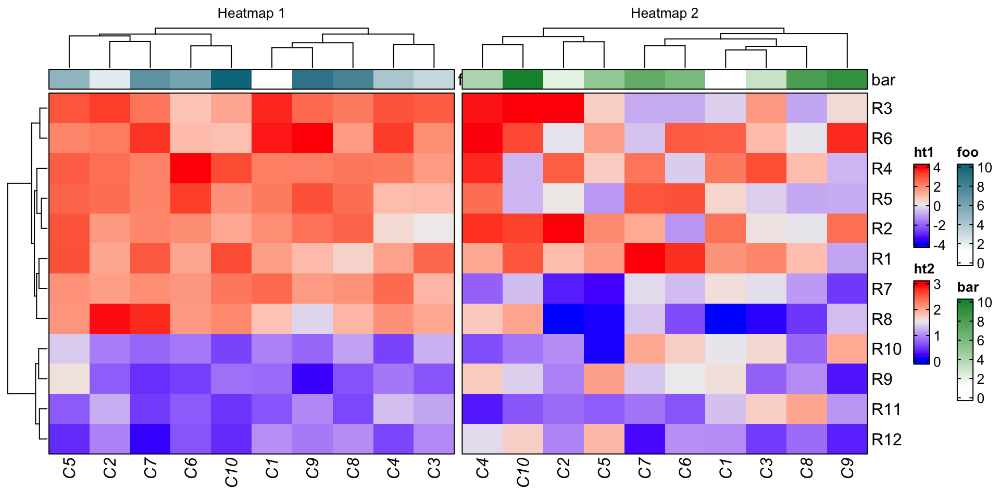

```r
ht_opt(RESET = TRUE)
```

These global parameters can also be set in the `draw()` function to
temporarily change the global parameters, and they are reset back after the
plot is made. Please check the help page of `draw,HeatmapList-method`.

## Adjust blank space caused by annotations {#adjust-blank-space-caused-by-annotations}

Heatmap annotations may have annotation names and axes, for which the spaces
are also taken into account when arranging heatmap components in the final
layout. Sometimes, this adjustment is not smart that you may see blank areas
in the plot that are not necessary.

One scenario is for a matrix with no row names, the space to the right of the
heatmap is determined by the size of annotation name, which results in blank
space between the heatmap and the legend. Also the heatmap list level row
title is plotted to the left of the annotation axis, which gives blank area if
there is no row dendrogram.

`adjust_annotation_extension` controls whether to take account of the space of
annotation names and axes for the layout. Compare following two plots.


```r
m = matrix(rnorm(100), 10)
ht = Heatmap(m, name = "mat",
    top_annotation = HeatmapAnnotation(foo = anno_points(1:10)),
    show_row_dend = FALSE)
draw(ht, row_title = "fooooooooooo", adjust_annotation_extension = TRUE,  # default
    column_title = "adjust_annotation_extension = TRUE")
draw(ht, row_title = "fooooooooooo", adjust_annotation_extension = FALSE,
    column_title = "adjust_annotation_extension = FALSE")
```

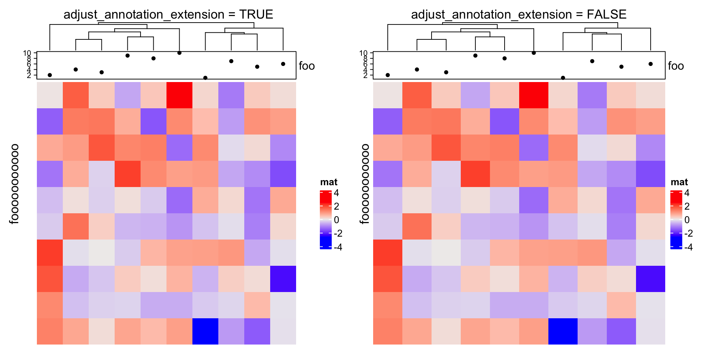

Another way to partially solve the space problem is to move the annotation name
to the left and use heamtap-level row title.


```r
Heatmap(m, name = "mat",
    top_annotation = HeatmapAnnotation(foo = anno_points(1:10),
        annotation_name_side = "left"),
    row_title = "fooooooooooo",
    show_row_dend = FALSE)
```

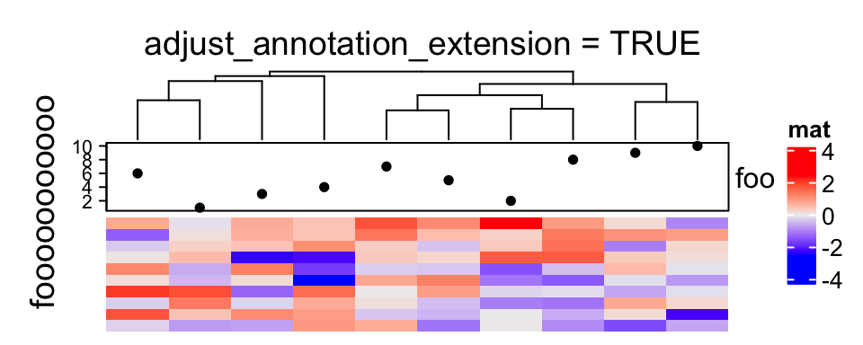

However, this adjustment for annotations sometimes is also necessary, e.g. when the heatmap is
very short:


```r
ht = Heatmap(m, name = "mat",
    top_annotation = HeatmapAnnotation(foo = anno_points(1:10)),
    show_row_dend = FALSE)
draw(ht, row_title = "fooooooooooo", adjust_annotation_extension = TRUE,
    column_title = "adjust_annotation_extension = TRUE")
```

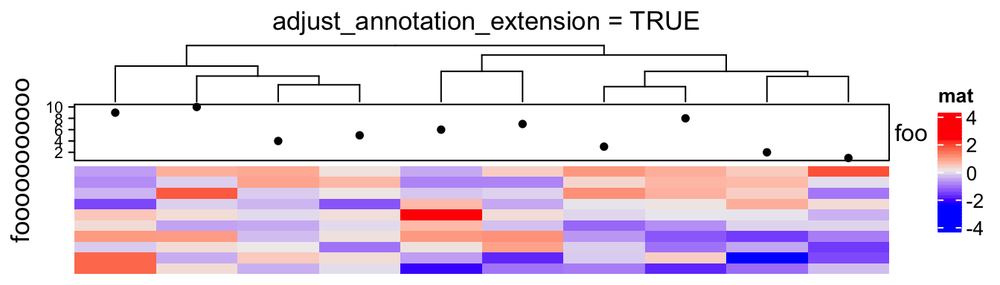

Therefore, we set `TRUE` as the default of `adjust_annotation_extension` and users can configure
it based on specific scenarios.


## Manually increase space around the plot {#manually-increase-space-around-the-plot}

The layout of the **ComplexHeatmap** is not perfect that it is still possible some of the text are
drawn out of the plotting region. In this case, you can manually set the `padding` argument in `draw()` function
to increase the blank areas around the final plot.

The value of `padding` should be a unit vector with length of four. The four values correspond to the space at
the bottom, left, top and right sides.

The following example is not a perfect example because the maximal width for row names can be controlled
by `max_row_name_width` argument, but we can still use it to demonstrate the use of `padding`.


```r
m2 = m
rownames(m2) = paste0("R", 1:10)
rownames(m2)[1] = "a long long long long long row name"
ht = Heatmap(m2, name = "mat", row_names_side = "left", show_row_dend = FALSE)
draw(ht, padding = unit(c(2, 20, 2, 2), "mm")) ## see right heatmap in following
```


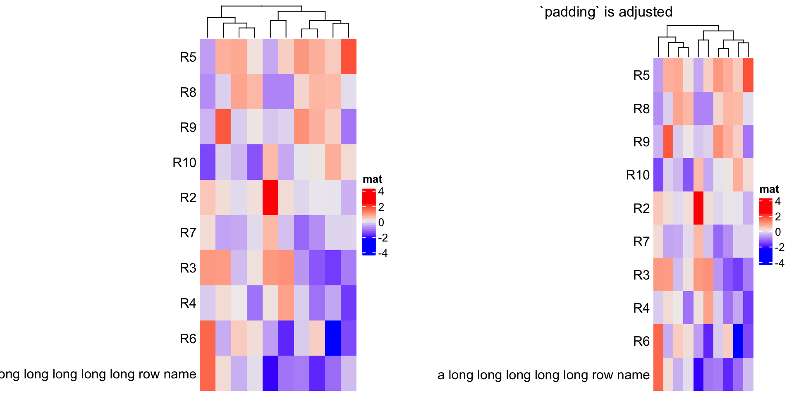


