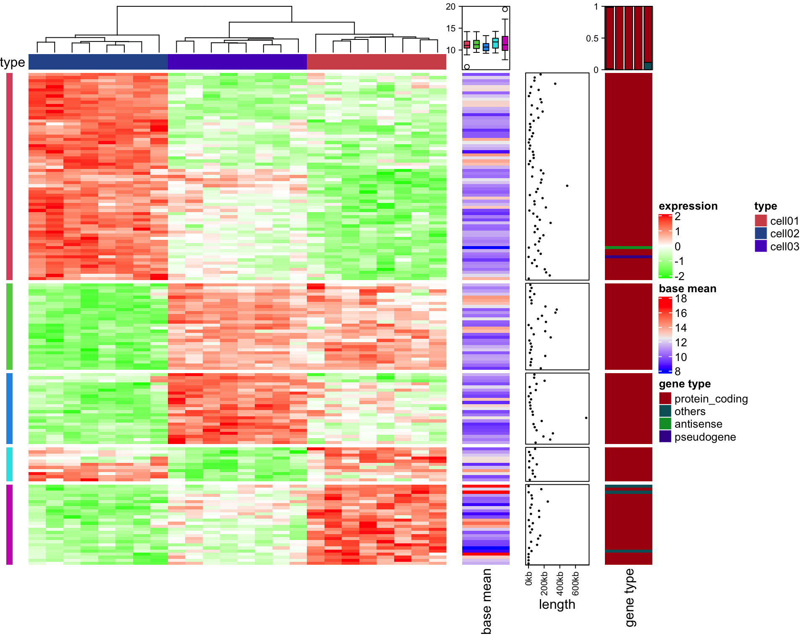
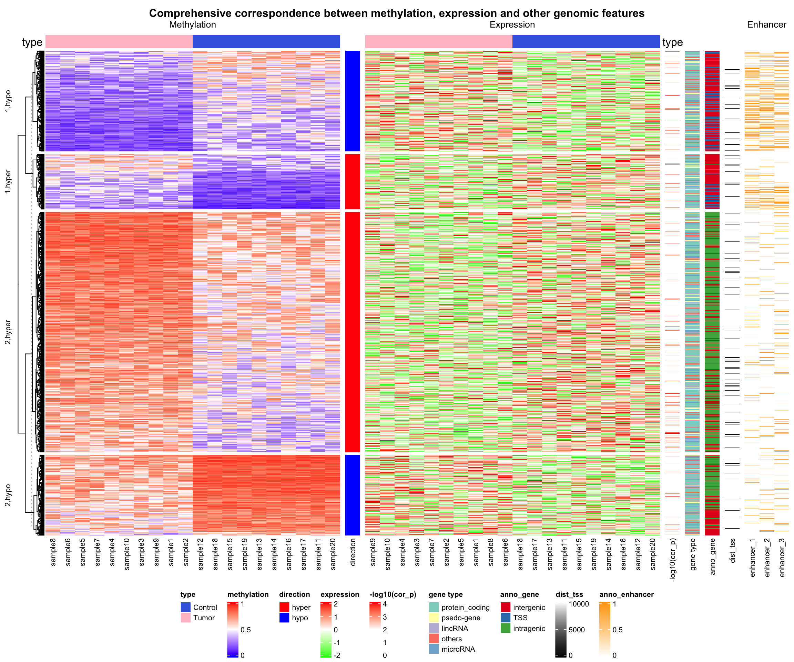
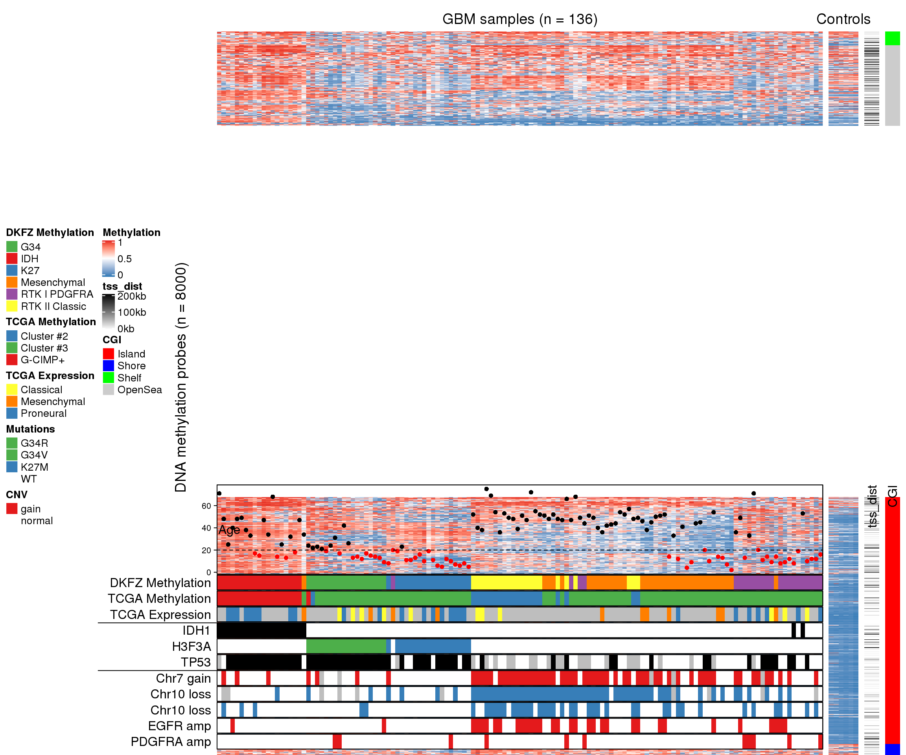
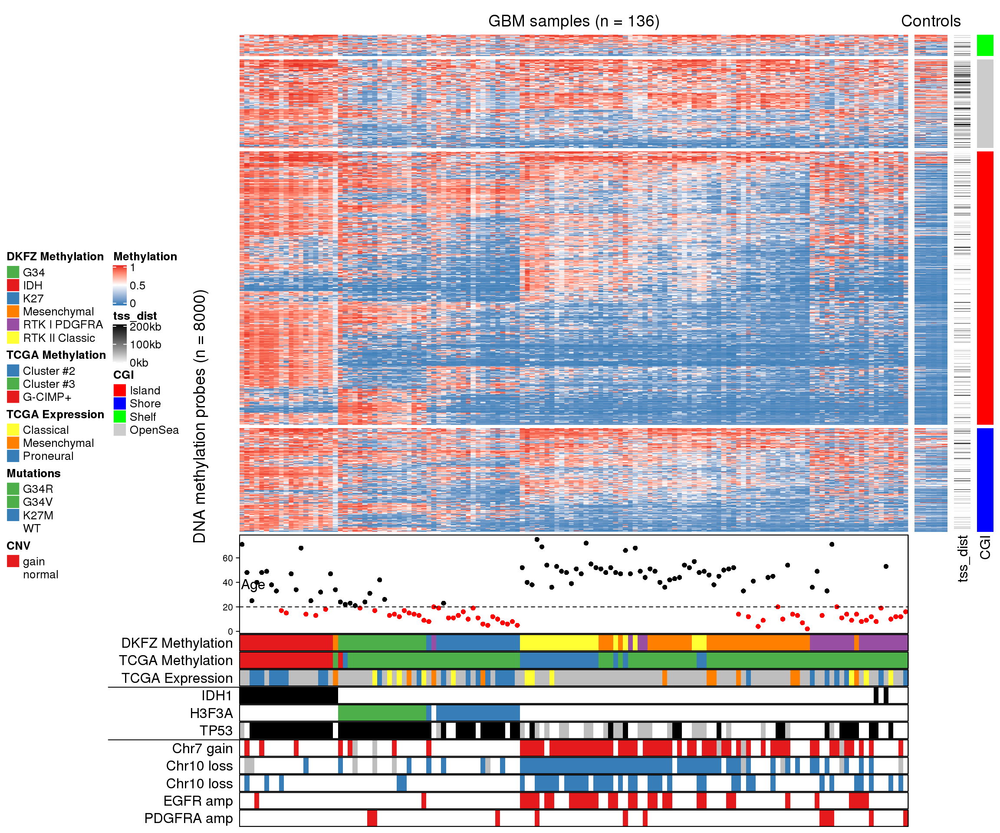

# More Examples {#more-examples}

## Add more information for gene expression matrix

Heatmaps are very popular to visualize gene expression matrix. Rows in the
matrix correspond to genes and more information on these genes can be attached
after the expression heatmap.

In following example, the big heatmap visualizes relative expression for genes
(expression for each gene is scaled). On the right we put the absolute
expression level of genes as a single-column heatmap. The gene length and gene
type (i.e. protein coding or lincRNA) are also put as heatmap annotations or
heatmaps.

On the very left of the heatmaps, there are colored rectangles drawn by
`anno_block()` to identify the five clusters from k-means clustering. On top
of the "base mean" and "gene type" heatmaps, there are summary plots (barplots
and boxplots) showing the statistics or distributions of the data points in
the five clusters.


```r
library(ComplexHeatmap)
library(circlize)

expr = readRDS(system.file(package = "ComplexHeatmap", "extdata", "gene_expression.rds"))
mat = as.matrix(expr[, grep("cell", colnames(expr))])
base_mean = rowMeans(mat)
mat_scaled = t(apply(mat, 1, scale))

type = gsub("s\\d+_", "", colnames(mat))
ha = HeatmapAnnotation(type = type, annotation_name_side = "left")

ht_list = Heatmap(mat_scaled, name = "expression", row_km = 5, 
    col = colorRamp2(c(-2, 0, 2), c("green", "white", "red")),
    top_annotation = ha, 
    show_column_names = FALSE, row_title = NULL, show_row_dend = FALSE) +
Heatmap(base_mean, name = "base mean", 
    top_annotation = HeatmapAnnotation(summary = anno_summary(gp = gpar(fill = 2:6), 
        height = unit(2, "cm"))),
    width = unit(15, "mm")) +
rowAnnotation(length = anno_points(expr$length, pch = 16, size = unit(1, "mm"), 
    axis_param = list(at = c(0, 2e5, 4e5, 6e5), 
        labels = c("0kb", "200kb", "400kb", "600kb")),
    width = unit(2, "cm"))) +
Heatmap(expr$type, name = "gene type", 
    top_annotation = HeatmapAnnotation(summary = anno_summary(height = unit(2, "cm"))),
    width = unit(15, "mm"))

ht_list = rowAnnotation(block = anno_block(gp = gpar(fill = 2:6, col = NA)), 
    width = unit(2, "mm")) + ht_list

draw(ht_list, ht_gap = unit(5, "mm"))
```



## The measles vaccine heatmap {#the-measles-vaccine-heatmap}

Following code reproduces the heatmap introduced [here](https://biomickwatson.wordpress.com/2015/04/09/recreating-a-famous-visualisation/) and [here](https://benjaminlmoore.wordpress.com/2015/04/09/recreating-the-vaccination-heatmaps-in-r/).


```r
mat = readRDS(system.file("extdata", "measles.rds", package = "ComplexHeatmap"))
ha1 = HeatmapAnnotation(
    dist1 = anno_barplot(
        colSums(mat), 
        bar_width = 1, 
        gp = gpar(col = "white", fill = "#FFE200"), 
        border = FALSE,
        axis_param = list(at = c(0, 2e5, 4e5, 6e5, 8e5),
            labels = c("0", "200k", "400k", "600k", "800k")),
        height = unit(2, "cm")
    ), show_annotation_name = FALSE)
ha2 = rowAnnotation(
    dist2 = anno_barplot(
        rowSums(mat), 
        bar_width = 1, 
        gp = gpar(col = "white", fill = "#FFE200"), 
        border = FALSE,
        axis_param = list(at = c(0, 5e5, 1e6, 1.5e6),
            labels = c("0", "500k", "1m", "1.5m")),
        width = unit(2, "cm")
    ), show_annotation_name = FALSE)
year_text = as.numeric(colnames(mat))
year_text[year_text %% 10 != 0] = ""
ha_column = HeatmapAnnotation(
    year = anno_text(year_text, rot = 0, location = unit(1, "npc"), just = "top")
)
col_fun = colorRamp2(c(0, 800, 1000, 127000), c("white", "cornflowerblue", "yellow", "red"))
ht_list = Heatmap(mat, name = "cases", col = col_fun,
    cluster_columns = FALSE, show_row_dend = FALSE, rect_gp = gpar(col= "white"), 
    show_column_names = FALSE,
    row_names_side = "left", row_names_gp = gpar(fontsize = 8),
    column_title = 'Measles cases in US states 1930-2001\nVaccine introduced 1961',
    top_annotation = ha1, bottom_annotation = ha_column,
    heatmap_legend_param = list(at = c(0, 5e4, 1e5, 1.5e5), 
        labels = c("0", "50k", "100k", "150k"))) + ha2
draw(ht_list, ht_gap = unit(3, "mm"))
decorate_heatmap_body("cases", {
    i = which(colnames(mat) == "1961")
    x = i/ncol(mat)
    grid.lines(c(x, x), c(0, 1), gp = gpar(lwd = 2, lty = 2))
    grid.text("Vaccine introduced", x, unit(1, "npc") + unit(5, "mm"))
})
```


## Visualize Cell Heterogeneity from Single Cell RNASeq


In this example, single cell RNA-Seq data for mouse T-cells is visualized to show the heterogeneity
of cells. The data (`mouse_scRNAseq_corrected.txt`) is from [Buettner et al.,
2015](http://www.nature.com/nbt/journal/v33/n2/full/nbt.3102.html), supplementary data 1, sheet
"**Cell-cycle corrected gene expr**". You can get `mouse_scRNAseq_corrected.txt` [here](https://jokergoo.github.io/ComplexHeatmap-reference/data/mouse_scRNAseq_corrected).

In following code, duplicated genes are removed.


```r
expr = read.table("data/mouse_scRNAseq_corrected.txt", sep = "\t", header = TRUE)
expr = expr[!duplicated(expr[[1]]), ]
rownames(expr) = expr[[1]]
expr = expr[-1]
expr = as.matrix(expr)
```

Genes that are not expressed in more than half of the cells are filtered out.


```r
expr = expr[apply(expr, 1, function(x) sum(x > 0)/length(x) > 0.5), , drop = FALSE]
```

The `get_correlated_variable_rows()` function is defined here. It extracts signature genes that are
variably expressed between cells and correlate to other genes.


```r
get_correlated_variable_genes = function(mat, n = nrow(mat), cor_cutoff = 0, n_cutoff = 0) {
    ind = order(apply(mat, 1, function(x) {
            q = quantile(x, c(0.1, 0.9))
            x = x[x < q[1] & x > q[2]]
            var(x)/mean(x)
        }), decreasing = TRUE)[1:n]
    mat2 = mat[ind, , drop = FALSE]
    dt = cor(t(mat2), method = "spearman")
    diag(dt) = 0
    dt[abs(dt) < cor_cutoff] = 0
    dt[dt < 0] = -1
    dt[dt > 0] = 1

    i = colSums(abs(dt)) > n_cutoff

    mat3 = mat2[i, ,drop = FALSE]
    return(mat3)
}
```

Signature genes are defined as a list of genes where each gene correlates to more than 20 genes with
an absolute correlation larger than 0.5.

`mat2` contains expression values scaled per gene, which means it contains relative expression
across cells for every gene. Since single cell RNASeq data is highly variable and outliers are
frequent, gene expression is only scaled within the 10th and 90th quantiles.


```r
mat = get_correlated_variable_genes(expr, cor_cutoff = 0.5, n_cutoff = 20)
mat2 = t(apply(mat, 1, function(x) {
    q10 = quantile(x, 0.1)
    q90 = quantile(x, 0.9)
    x[x < q10] = q10
    x[x > q90] = q90
    scale(x)
}))
colnames(mat2) = colnames(mat)
```

Load cell cycle genes and ribonucleoprotein genes. The cell cycle gene list is from [Buettner et
al., 2015](http://www.nature.com/nbt/journal/v33/n2/full/nbt.3102.html), supplementary table 1,
sheet "**Union of Cyclebase and GO genes**". Ribonucleoprotein genes are from
[GO:0030529](http://amigo.geneontology.org/amigo/term/GO:0030529). Gene list are stored in
`mouse_cell_cycle_gene.rds` and `mouse_ribonucleoprotein.rds`. The two files can be found
[here](https://jokergoo.github.io/ComplexHeatmap-reference/data/mouse_cell_cycle_gene.rds) and 
[here](https://jokergoo.github.io/ComplexHeatmap-reference/data/mouse_ribonucleoprotein.rds).


```r
cc = readRDS("data/mouse_cell_cycle_gene.rds")
ccl = rownames(mat) %in% cc
cc_gene = rownames(mat)[ccl]

rp = readRDS("data/mouse_ribonucleoprotein.rds")
rpl = rownames(mat) %in% rp
```

Since with scaling the expression values per gene the expression level of a gene relative to other
genes has been lost, we calculate the base mean as the mean expression of a gene throughout all
samples. The base mean can be used to compare expression levels between genes.


```r
base_mean = rowMeans(mat)
```

Now the following information is available:

1. scaled expression, `mat2`,
2. base mean, `base_mean`,
3. whether genes are ribonucleoprotein genes, `rpl`,
4. whether genes are cell cycle genes, `ccl`,
5. symbols for cell cycle genes, `cc_gene`,

In the next step, we can put the information together and visualize it as a list of heatmaps. A
gene-gene correlation heatmap is added at the end and defined to be the main_heatmap, meaning that
the row order of all heatmaps/row annotations are based on the clustering of this correlation
matrix.

For cell cycle genes with relatively high expression levels (larger than the 25% quantile of all
genes), the gene name is indicated as text labels. In the first heatmap, the column dendrogram is
underlaid with two different colours based in the two main groups derived by hierarchical clustering
to highlight the two subpopulations.


```r
library(GetoptLong)
ht_list = Heatmap(mat2, col = colorRamp2(c(-1.5, 0, 1.5), c("blue", "white", "red")), 
    name = "scaled_expr", column_title = qq("relative expression for @{nrow(mat)} genes"),
    show_column_names = FALSE, width = unit(8, "cm"),
    heatmap_legend_param = list(title = "Scaled expr")) +
    Heatmap(base_mean, name = "base_expr", width = unit(5, "mm"),
        heatmap_legend_param = list(title = "Base expr")) +
    Heatmap(rpl + 0, name = "ribonucleoprotein", col = c("0" = "white", "1" = "purple"), 
        show_heatmap_legend = FALSE, width = unit(5, "mm")) +
    Heatmap(ccl + 0, name = "cell_cycle", col = c("0" = "white", "1" = "red"), 
        show_heatmap_legend = FALSE, width = unit(5, "mm")) +
    rowAnnotation(link = anno_mark(at = which(ccl & base_mean > quantile(base_mean, 0.25)), 
        labels = rownames(mat)[ccl & base_mean > quantile(base_mean, 0.25)], 
        labels_gp = gpar(fontsize = 10), padding = unit(1, "mm"))) +
    Heatmap(cor(t(mat2)), name = "cor", 
        col = colorRamp2(c(-1, 0, 1), c("green", "white", "red")), 
        show_row_names = FALSE, show_column_names = FALSE, row_dend_side = "right", 
        show_column_dend = FALSE, column_title = "pairwise correlation between genes",
        heatmap_legend_param = list(title = "Correlation"))
ht_list = draw(ht_list, main_heatmap = "cor")
decorate_column_dend("scaled_expr", {
    tree = column_dend(ht_list)$scaled_expr
    ind = cutree(as.hclust(tree), k = 2)[order.dendrogram(tree)]

    first_index = function(l) which(l)[1]
    last_index = function(l) { x = which(l); x[length(x)] }
    x1 = c(first_index(ind == 1), first_index(ind == 2)) - 1
    x2 = c(last_index(ind == 1), last_index(ind == 2))
    grid.rect(x = x1/length(ind), width = (x2 - x1)/length(ind), just = "left",
        default.units = "npc", gp = gpar(fill = c("#FF000040", "#00FF0040"), col = NA))
})
```


The heatmap clearly reveals that the cells are separated into two sub-populations. The population on
the left in the first heatmap exhibits high expression of a subset of cell cycle genes (cell cycle
genes are indicated in "**cell_cycle**" heatmap). However, the overall expression level for these
genes is relatively low (see "**base_expr**" heatmap). The population on the right has higher
expression in the other signature genes. Interestingly, the signature genes which are higher
expressed in this subpopulation are enriched for genes coding for ribonucleoproteins (see
"**ribonucleoprotein**" heatmap). A subset of the ribonucleoprotein genes shows strong coexpression
(see correlation heatmap) and overall high expression levels ("**base_expr**" heatmap).


## Correlations between methylation, expression and other genomic features


In the following example, data is randomly generated based on patterns found in an unpublished analysis.
First we load the data. `meth.rds` can be found [here](https://jokergoo.github.io/ComplexHeatmap-reference/data/meth.rds).


```r
res_list = readRDS("data/meth.rds")
type = res_list$type
mat_meth = res_list$mat_meth
mat_expr = res_list$mat_expr
direction = res_list$direction
cor_pvalue = res_list$cor_pvalue
gene_type = res_list$gene_type
anno_gene = res_list$anno_gene
dist = res_list$dist
anno_enhancer = res_list$anno_enhancer
```

The different sources of information and corresponding variables are:

1. `type`: the label which shows whether the sample is tumor or normal.
2. `mat_meth`: a matrix in which rows correspond to differetially methylated regions (DMRs). The
   value in the matrix is the mean methylation level in the DMR in every sample.
3. `mat_expr`: a matrix in which rows correspond to genes which are associated to the DMRs (i.e. the
   nearest gene to the DMR). The value in the matrix is the expression level for each gene in each
   sample. Expression is scaled for every gene across samples.
4. `direction`: direction of the methylation change (hyper meaning higher methylation in tumor
   samples, hypo means lower methylation in tumor samples).
5. `cor_pvalue`: p-value for the correlation test between methylation and expression of the
   associated gene.
6. `gene_type`: type of the genes (e.g. protein coding genes or lincRNAs).
7. `anno_gene`: annotation to the gene models (intergenic, intragenic or TSS).
8. `dist`: distance from DMRs to TSS of the assiciated genes.
9. `anno_enhancer`: fraction of the DMR that overlaps enhancers.

The data only includes DMRs for which methylation and expression of the associated gene are
negatively correlated.

The clustering of columns for the methylation matrix are calculated first so that columns in the
expression matrix can be adjusted to have the same column order as in the methylation matrix.


```r
column_tree = hclust(dist(t(mat_meth)))
column_order = column_tree$order
```


```r
library(RColorBrewer)
meth_col_fun = colorRamp2(c(0, 0.5, 1), c("blue", "white", "red"))
direction_col = c("hyper" = "red", "hypo" = "blue")
expr_col_fun = colorRamp2(c(-2, 0, 2), c("green", "white", "red"))
pvalue_col_fun = colorRamp2(c(0, 2, 4), c("white", "white", "red"))
gene_type_col = structure(brewer.pal(length(unique(gene_type)), "Set3"), 
    names = unique(gene_type))
anno_gene_col = structure(brewer.pal(length(unique(anno_gene)), "Set1"), 
    names = unique(anno_gene))
dist_col_fun = colorRamp2(c(0, 10000), c("black", "white"))
enhancer_col_fun = colorRamp2(c(0, 1), c("white", "orange"))
```

We first define two column annotations and then make the complex heatmaps.


```r
ht_opt(
    legend_title_gp = gpar(fontsize = 8, fontface = "bold"), 
    legend_labels_gp = gpar(fontsize = 8), 
    heatmap_column_names_gp = gpar(fontsize = 8),
    heatmap_column_title_gp = gpar(fontsize = 10),
    heatmap_row_title_gp = gpar(fontsize = 8)
)

ha = HeatmapAnnotation(type = type, 
    col = list(type = c("Tumor" = "pink", "Control" = "royalblue")),
    annotation_name_side = "left")
ha2 = HeatmapAnnotation(type = type, 
    col = list(type = c("Tumor" = "pink", "Control" = "royalblue")), 
    show_legend = FALSE)

ht_list = Heatmap(mat_meth, name = "methylation", col = meth_col_fun,
    column_order= column_order,
    top_annotation = ha, column_title = "Methylation") +
    Heatmap(direction, name = "direction", col = direction_col) +
    Heatmap(mat_expr[, column_tree$order], name = "expression", 
        col = expr_col_fun, 
        column_order = column_order, 
        top_annotation = ha2, column_title = "Expression") +
    Heatmap(cor_pvalue, name = "-log10(cor_p)", col = pvalue_col_fun) +
    Heatmap(gene_type, name = "gene type", col = gene_type_col) +
    Heatmap(anno_gene, name = "anno_gene", col = anno_gene_col) +
    Heatmap(dist, name = "dist_tss", col = dist_col_fun) +
    Heatmap(anno_enhancer, name = "anno_enhancer", col = enhancer_col_fun, 
        cluster_columns = FALSE, column_title = "Enhancer")

draw(ht_list, row_km = 2, row_split = direction,
    column_title = "Comprehensive correspondence between methylation, expression and other genomic features", 
    column_title_gp = gpar(fontsize = 12, fontface = "bold"), 
    merge_legends = TRUE, heatmap_legend_side = "bottom")
```



```r
ht_opt(RESET = TRUE)
```

The complex heatmaps reveal that highly methylated DMRs are enriched in intergenic and intragenic
regions and rarely overlap with enhancers. In contrast, lowly methylated DMRs are enriched for
transcription start sites (TSS) and enhancers.

## Visualize Methylation Profile with Complex Annotations 

In this example, Figure 1 in [Strum et al., 2012](http://dx.doi.org/10.1016/j.ccr.2012.08.024)
is re-implemented with some adjustments.

Some packages need to be loaded firstly.


```r
library(matrixStats)
library(GenomicRanges)
```

Methylation profiles can be download from [GEO
database](http://www.ncbi.nlm.nih.gov/geo/query/acc.cgi?acc=GSE36278). The [**GEOquery**
package](http://bioconductor.org/packages/release/bioc/html/GEOquery.html) is used to retrieve
data from GEO.


```r
library(GEOquery)
gset = getGEO("GSE36278")
```


The methylation profiles have been measured by Illumina HumanMethylation450 BeadChip arrays.
We load probe data via the **IlluminaHumanMethylation450kanno.ilmn12.hg19** package.

Adjust row names in the matrix to be the same as the probes. 


```r
library(IlluminaHumanMethylation450kanno.ilmn12.hg19)
data(Locations)

mat = exprs(gset[[1]])
colnames(mat) = phenoData(gset[[1]])@data$title
mat = mat[rownames(Locations), ] 
```

`probe` contains locations of probes and also information whether the CpG sites overlap
with SNPs. Here we remove probes that are on sex chromosomes and probes that overlap with SNPs.


```r
data(SNPs.137CommonSingle)
data(Islands.UCSC)
l = Locations$chr %in% paste0("chr", 1:22) & is.na(SNPs.137CommonSingle$Probe_rs)
mat = mat[l, ]
```

Get subsets for locations of probes and the annotation to CpG Islands accordingly.


```r
cgi = Islands.UCSC$Relation_to_Island[l]
loc = Locations[l, ]
```

Separate the matrix into a matrix for tumor samples and a matrix for normal samples. Also modify
column names for the tumor samples to be consistent with the phenotype data which we will read
later.


```r
mat1 = as.matrix(mat[, grep("GBM", colnames(mat))])   # tumor samples
mat2 = as.matrix(mat[, grep("CTRL", colnames(mat))])  # normal samples
colnames(mat1) = gsub("GBM", "dkfz", colnames(mat1))
```

Phenotype data is from [Sturm et al., 2012](http://dx.doi.org/10.1016/j.ccr.2012.08.024),
supplementary table S1 and can be found [here](https://jokergoo.github.io/ComplexHeatmap-reference/data/450K_annotation.txt).

The rows of phenotype data are adjusted to be the same as the columns of the methylation matrix.


```r
phenotype = read.table("data/450K_annotation.txt", header = TRUE, sep = "\t", 
    row.names = 1, check.names = FALSE, comment.char = "", stringsAsFactors = FALSE)
phenotype = phenotype[colnames(mat1), ]
```

Please note that we only use the 136 samples which are from DKFZ, while in [Sturm et al., 2012](http://dx.doi.org/10.1016/j.ccr.2012.08.024), additional 74 TCGA samples have been used.

Extract the top 8000 probes with most variable methylation in the tumor samples, and also subset other
information correspondingly.


```r
ind = order(rowVars(mat1, na.rm = TRUE), decreasing = TRUE)[1:8000]
m1 = mat1[ind, ]
m2 = mat2[ind, ]
cgi2 = cgi[ind]
cgi2 = ifelse(grepl("Shore", cgi2), "Shore", cgi2)
cgi2 = ifelse(grepl("Shelf", cgi2), "Shelf", cgi2)
loc = loc[ind, ]
```

For each probe, find the distance to the closest TSS. `pc_tx_tss.bed` contains positions
of TSS from protein coding genes.


```r
gr = GRanges(loc[, 1], ranges = IRanges(loc[, 2], loc[, 2]+1))
tss = read.table("data/pc_tx_tss.bed", stringsAsFactors = FALSE)
tss = GRanges(tss[[1]], ranges = IRanges(tss[, 2], tss[, 3]))

tss_dist = distanceToNearest(gr, tss)
tss_dist = tss_dist@elementMetadata$distance
```

Because there are a few `NA` in the matrix (`sum(is.na(m1))/length(m1)` = 0.0011967) 
which will break the `cor()` function, we replace `NA` to the intermediate methylation (0.5).
Note that although **ComplexHeatmap** allows `NA` in the matrix, removal of `NA` will speed up the clustering.


```r
m1[is.na(m1)] = 0.5
m2[is.na(m2)] = 0.5
```

The following annotations will be added to the columns of the methylation matrix:

1. age
2. subtype classification by DKFZ
3. subtype classification by TCGA
4. subtype classification by TCGA, based on expression profile
5. IDH1 mutation
6. H3F3A mutation
7. TP53 mutation
8. chr7 gain
9. chr10 loss
10. CDKN2A deletion
11. EGFR amplification
12. PDGFRA amplification

In following code we define the column annotation in the `ha` variable. Also we customize colors, legends and height of the annotations.


```r
mutation_col = structure(names = c("MUT", "WT", "G34R", "G34V", "K27M"), 
    c("black", "white", "#4DAF4A", "#4DAF4A", "#377EB8"))
cnv_col = c("gain" = "#E41A1C", "loss" = "#377EB8", "amp" = "#E41A1C", 
    "del" = "#377EB8", "normal" = "white")
ha = HeatmapAnnotation(
    age = anno_points(phenotype[[13]], 
        gp = gpar(col = ifelse(phenotype[[13]] > 20, "black", "red")), 
        height = unit(3, "cm")),
    dkfz_cluster = phenotype[[1]],
    tcga_cluster = phenotype[[2]],
    tcga_expr = phenotype[[3]],
    IDH1 = phenotype[[5]],
    H3F3A = phenotype[[4]],
    TP53 = phenotype[[6]],
    chr7_gain = ifelse(phenotype[[7]] == 1, "gain", "normal"),
    chr10_loss = ifelse(phenotype[[8]] == 1, "loss", "normal"),
    CDKN2A_del = ifelse(phenotype[[9]] == 1, "del", "normal"),
    EGFR_amp = ifelse(phenotype[[10]] == 1, "amp", "normal"),
    PDGFRA_amp = ifelse(phenotype[[11]] == 1, "amp", "normal"),
    col = list(dkfz_cluster = structure(names = c("IDH", "K27", "G34", "RTK I PDGFRA", 
            "Mesenchymal", "RTK II Classic"), brewer.pal(6, "Set1")),
        tcga_cluster = structure(names = c("G-CIMP+", "Cluster #2", "Cluster #3"), 
            brewer.pal(3, "Set1")),
        tcga_expr = structure(names = c("Proneural", "Classical", "Mesenchymal"), 
            c("#377EB8", "#FFFF33", "#FF7F00")),
        IDH1 = mutation_col,
        H3F3A = mutation_col,
        TP53 = mutation_col,
        chr7_gain = cnv_col,
        chr10_loss = cnv_col,
        CDKN2A_del = cnv_col,
        EGFR_amp = cnv_col,
        PDGFRA_amp = cnv_col),
    na_col = "grey", border = TRUE,
    show_legend = c(TRUE, TRUE, TRUE, FALSE, TRUE, FALSE, TRUE, FALSE, FALSE, FALSE, FALSE),
    show_annotation_name = FALSE,
    annotation_legend_param = list(
        dkfz_cluster = list(title = "DKFZ Methylation"),
        tcga_cluster = list(title = "TCGA Methylation"),
        tcga_expr = list(title = "TCGA Expression"),
        H3F3A = list(title = "Mutations"),
        chr7_gain = list(title = "CNV"))
)
```

In the final plot, there are four heatmaps added. From left to right, there are

1. heatmap for methylation in tumor samples
2. methylation in normal samples
3. distance to nearest TSS
4. CpG Island (CGI) annotation.

The heatmaps are split by rows according to CGI annotations. 

After the heatmaps are plotted, additional graphics such as labels for annotations are added by
`decorate_*()` functions.


```r
col_fun = colorRamp2(c(0, 0.5, 1), c("#377EB8", "white", "#E41A1C"))
ht_list = Heatmap(m1, col = col_fun, name = "Methylation",
    clustering_distance_columns = "spearman",
    show_row_dend = FALSE, show_column_dend = FALSE,
    show_column_names = FALSE,
    bottom_annotation = ha, column_title = qq("GBM samples (n = @{ncol(m1)})"),
    row_split = factor(cgi2, levels = c("Island", "Shore", "Shelf", "OpenSea")), 
    row_title_gp = gpar(col = "#FFFFFF00")) + 
Heatmap(m2, col = col_fun, show_column_names = FALSE, 
    show_column_dend = FALSE, column_title = "Controls",
    show_heatmap_legend = FALSE, width = unit(1, "cm")) +
Heatmap(tss_dist, name = "tss_dist", col = colorRamp2(c(0, 2e5), c("white", "black")), 
    width = unit(5, "mm"),
    heatmap_legend_param = list(at = c(0, 1e5, 2e5), labels = c("0kb", "100kb", "200kb"))) + 
Heatmap(cgi2, name = "CGI", show_row_names = FALSE, width = unit(5, "mm"),
    col = structure(names = c("Island", "Shore", "Shelf", "OpenSea"), c("red", "blue", "green", "#CCCCCC")))
draw(ht_list, row_title = paste0("DNA methylation probes (n = ", nrow(m1), ")"),
    annotation_legend_side = "left", heatmap_legend_side = "left")

annotation_titles = c(dkfz_cluster = "DKFZ Methylation",
    tcga_cluster = "TCGA Methylation",
    tcga_expr = "TCGA Expression",
    IDH1 = "IDH1",
    H3F3A = "H3F3A",
    TP53 = "TP53",
    chr7_gain = "Chr7 gain",
    chr10_loss = "Chr10 loss",
    CDKN2A_del = "Chr10 loss",
    EGFR_amp = "EGFR amp",
    PDGFRA_amp = "PDGFRA amp")
for(an in names(annotation_titles)) {
    decorate_annotation(an, {
        grid.text(annotation_titles[an], unit(-2, "mm"), just = "right")
        grid.rect(gp = gpar(fill = NA, col = "black"))
    })
}
decorate_annotation("age", {
    grid.text("Age", unit(8, "mm"), just = "right")
    grid.rect(gp = gpar(fill = NA, col = "black"))
    grid.lines(unit(c(0, 1), "npc"), unit(c(20, 20), "native"), gp = gpar(lty = 2))
})
decorate_annotation("IDH1", {
    grid.lines(unit(c(-40, 0), "mm"), unit(c(1, 1), "npc"))
})
decorate_annotation("chr7_gain", {
    grid.lines(unit(c(-40, 0), "mm"), unit(c(1, 1), "npc"))
})
```




## Add multiple boxplots for single row {#add-multiple-boxplots-for-single-row}

The annotation function `anno_boxplot()` only draws one boxplot for a single row. When multiple
heatmaps are concatenated, or the groups for columns have already been defined, for each row, we
want to compare between heatmaps or column groups, thus, multiple boxplots need to be drawn for 
each single row. 

In following example, we demonstrate how to implement an annotation function which draws multiple
boxplots for single rows. The `grid.boxplot()` function is from **ComplexHeatmap** package which
makes it easy to draw boxplot under **grid** system.


```r
m1 = matrix(sort(rnorm(100)), 10, byrow = TRUE)
m2 = matrix(sort(rnorm(100), decreasing = TRUE), 10, byrow = TRUE)
nr = nrow(m1)

ht_list = Heatmap(m1, name = "m1") + Heatmap(m2, name = "m2")

rg = range(c(m1, m2))
rg[1] = rg[1] - (rg[2] - rg[1])* 0.02
rg[2] = rg[2] + (rg[2] - rg[1])* 0.02
anno_multiple_boxplot = function(index) {
    pushViewport(viewport(xscale = rg, yscale = c(0.5, nr + 0.5)))
    for(i in seq_along(index)) {
        grid.rect(y = nr-i+1, height = 1, default.units = "native")
        grid.boxplot(m1[ index[i], ], pos = nr-i+1 + 0.2, box_width = 0.3, 
            gp = gpar(fill = "red"), direction = "horizontal")
        grid.boxplot(m2[ index[i], ], pos = nr-i+1 - 0.2, box_width = 0.3, 
            gp = gpar(fill = "green"), direction = "horizontal")
    }
    grid.xaxis()
    popViewport()
}

ht_list = ht_list + rowAnnotation(boxplot = anno_multiple_boxplot, width = unit(4, "cm"), 
    show_annotation_name = FALSE)
lgd = Legend(labels = c("m1", "m2"), title = "boxplots",
    legend_gp = gpar(fill = c("red", "green")))
draw(ht_list, padding = unit(c(20, 2, 2, 2), "mm"), heatmap_legend_list = list(lgd))
```


