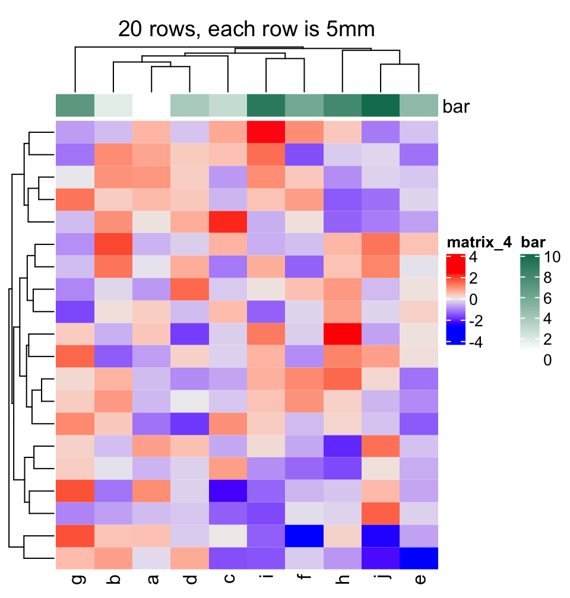
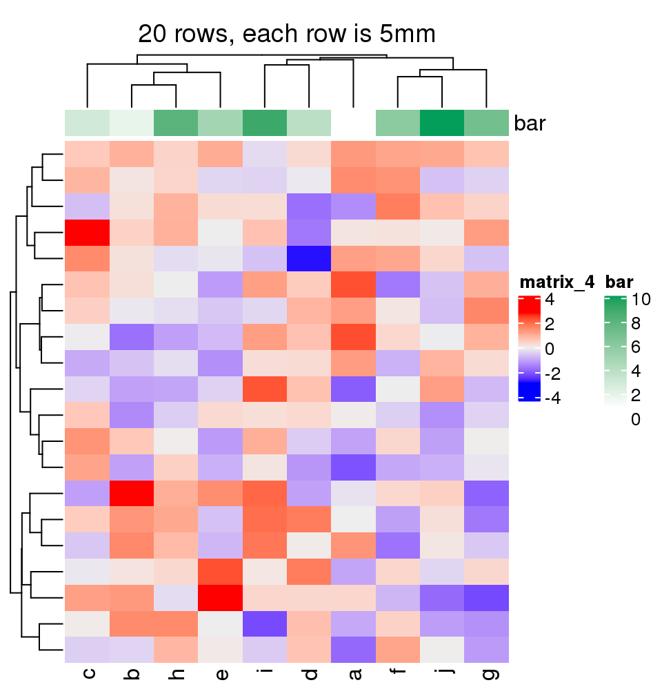
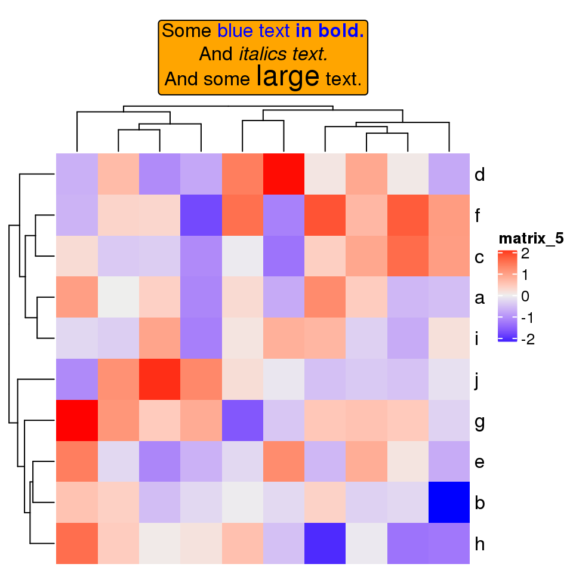
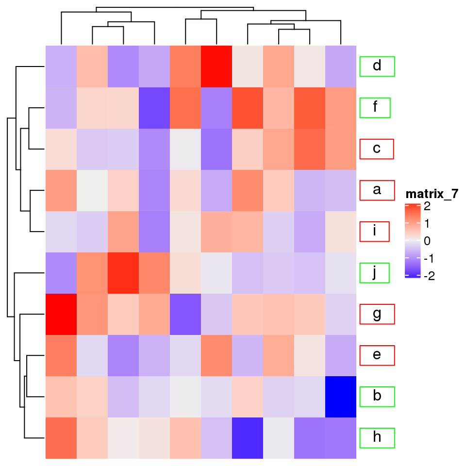
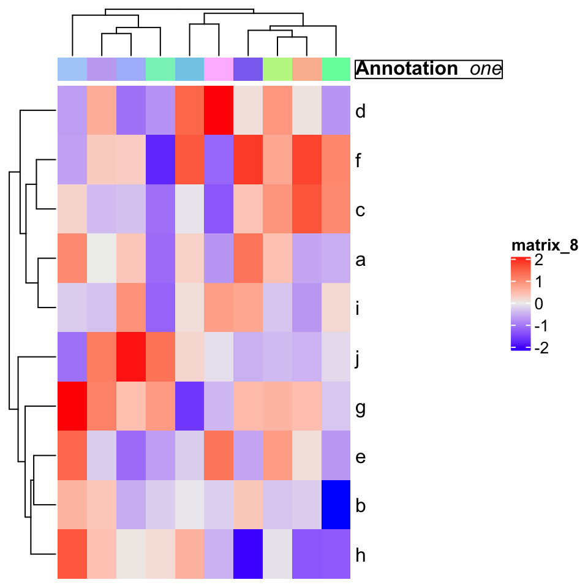
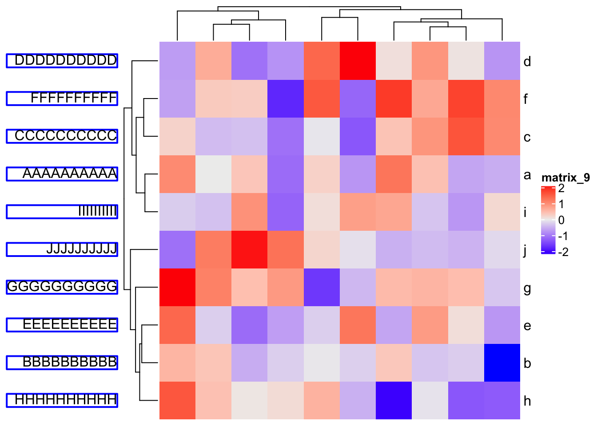
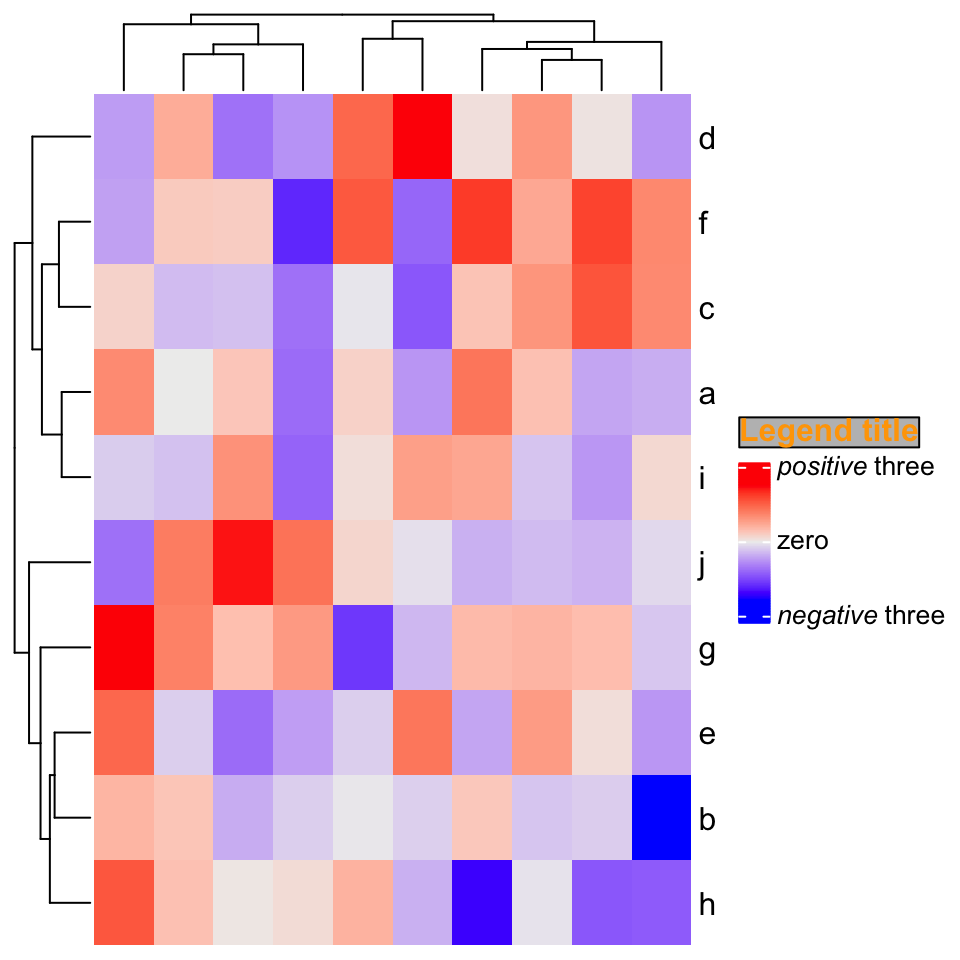

# Other Tricks {#other-tricks}

## Set the same cell size for different heatmaps with different dimensions

Assume you have a list of heatmaps/oncoPrints that you want to save as different e.g. png or pdf files, one
thing you might want to do is to make the size of each grid/cell in the heatmap identical across
heatmaps, thus, you need to calculate the size of png/pdf file according to the number of rows or
columns in the heatmap. In the heatmap generated by **ComplexHeatmap**, all the heatmap components
have absolute size and only the size of the heatmap body (or the size of the cells) is changable (or
in other words, if you change the size of the final graphic device, e.g. by draging the graphics
window if you plot in, only the size of the heatmap body is adjusted), which means, the size of the
whole plot is linearly related to the number of rows or columns in the heatmap. This implies we can
actually fit a linear model `y = a*x + b` where e.g. `y` is the height of the whole plot and `x` is
the number of rows.

In following example, we simply demonstrate how to establish the relation between the plot height
and the number of rows in the heatmap. We first define a function which generates a
10-column matrix with specific number of rows. Note the values in the matrix is of no importance
in this demonstration.


```r
random_mat = function(nr) {
    m = matrix(rnorm(10*nr), nc = 10)
    colnames(m) = letters[1:10]
    return(m)
}
```

Since the relation is absolutely linear, we only need to test two heatmaps with different number of
rows where the height of a single row is `unit(5, "mm")`. In the heatmap, there are also column title,
column dendrogram, column annotation and the column names.

There are several things that needs to be noted in following code: 

1. The heatmap object should be returned by `draw()` because the layout of the heatmap is calculated only
after the execution of `draw()`.
2. `component_height()` returns a vector of units which correspond to the height of all heatmap components
from top to bottom in the heatmap. (`component_width()` returns the width of heatmap components).
3. When calculating `ht_height`, we add `unit(4, "mm")` because on top and bottom of the final plot, 
there are `2mm` white borders.
4. `ht_height` needs to be converted to a simple unit in `cm` or `inch`.


In following, `y` contains values which are measured in `inch` unit.


```r
y = NULL
for(nr in c(10, 20)) {
    ht = draw(Heatmap(random_mat(nr), height = unit(5, "mm")*nr, 
        column_title = "foo", # one line text
        top_annotation = HeatmapAnnotation(bar = 1:10)))
    ht_height = sum(component_height(ht)) + unit(4, "mm")
    ht_height = convertHeight(ht_height, "inch", valueOnly = TRUE)
    y = c(y, ht_height)
}
```


Then we can fit a linear relation between `y` and the number of rows:


```r
x = c(10, 20)
lm(y ~ x)
```

```
## 
## Call:
## lm(formula = y ~ x)
## 
## Coefficients:
## (Intercept)            x  
##      1.3150       0.1969
```

This means the relation between the number of rows `x` and the height of the plot `y` is: `y = 0.1969*x + 1.3150`.

You can test whether the height of single rows are the same for heatmaps with different rows by following code.
Note all the heatmap configuations should be the same as the ones you prepare `y`.


```r
for(nr in c(10, 20)) {
    png(paste0("test_heatmap_nr_", nr, ".png"), width = 5, height = 0.1969*nr + 1.3150, 
        units = "in", res = 100)
    draw(Heatmap(random_mat(nr), height = unit(5, "mm")*nr, 
        column_title = "foo", # column title can be any one-line string
        top_annotation = HeatmapAnnotation(bar = 1:10)))
    dev.off()
}
```






## Integrate with gridtext package

[The **gridtext** package](https://github.com/wilkelab/gridtext) provides a nice and easy way
for rendering text under the **grid** system. From version 2.3.3 of **ComplexHeatmap**, text-related
elements can be rendered by **gridtext**.

For all text-related elements, the text needs to be wrapped by `gt_render()` function, which marks
the text and adds related parameters that are going to be processed by **gridtext**.

Currently **ComplexHeatmap** supports `gridtext::richtext_grob()`, so some of the parameters for 
`richtext_grob()` can be passed via `gt_render()`.


```r
gt_render("foo", r = unit(2, "pt"), padding = unit(c(2, 2, 2, 2), "pt"))
```

```
## [1] "foo"
## attr(,"class")
## [1] "gridtext"
## attr(,"param")
## attr(,"param")$r
## [1] 2pt
## 
## attr(,"param")$padding
## [1] 2pt 2pt 2pt 2pt
```

For each heatmap element, e.g. column title, graphic parameters can be set by the companion argument, 
e.g. `column_title_gp`. To make it simpler, all graphic parameters set by `box_gp` are merged with `*_gp`
by adding `box_` prefix, e.g.:


```r
..., column_title = gt_render("foo"), column_title_gp = gpar(col = "red", box_fill = "blue"), ...
```

Graphic parameters can also be specified inside `gt_render()`. Following is the same as the one above:


```r
..., column_title = gt_render("foo", gp = gpar(col = "red", box_fill = "blue")), ...
```

### Titles


```r
set.seed(123)
mat = matrix(rnorm(100), 10)
rownames(mat) = letters[1:10]
Heatmap(mat, 
    column_title = gt_render("Some <span style='color:blue'>blue text **in bold.**</span><br>And *italics text.*<br>And some <span style='font-size:18pt; color:black'>large</span> text.", 
        r = unit(2, "pt"), 
        padding = unit(c(2, 2, 2, 2), "pt")),
    column_title_gp = gpar(box_fill = "orange"))
```



If heatmap is split:


```r
Heatmap(mat, 
    row_km = 2, 
    row_title = gt_render(c("**title1**", "_title2_")), 
    row_title_gp = gpar(box_fill = c("yellow", "blue")))
```



### Row/column names

Rendered row/column names should be explicitly specified by `row_labels`/`column_labels`


```r
Heatmap(mat, 
    row_labels = gt_render(letters[1:10], padding = unit(c(2, 10, 2, 10), "pt")),
    row_names_gp = gpar(box_col = rep(c("red", "green"), times = 5)))
```



### Annotation labels

`annotation_label` argument should be as rendered text.


```r
ha = HeatmapAnnotation(foo = letters[1:10],
    annotation_label = gt_render("**Annotation** _one_",
        gp = gpar(box_col = "black")),
    show_legend = FALSE)
Heatmap(mat, top_annotation = ha)
```



### Text annotation


```r
rowAnnotation(
    foo = anno_text(gt_render(sapply(LETTERS[1:10], strrep, 10), align_widths = TRUE), 
                    gp = gpar(box_col = "blue", box_lwd = 2), 
                    just = "right", 
                    location = unit(1, "npc")
    )) + Heatmap(mat)
```



### Legend


```r
Heatmap(mat, 
    heatmap_legend_param = list(
        title = gt_render("<span style='color:orange'>**Legend title**</span>"), 
        title_gp = gpar(box_fill = "grey"),
        at = c(-3, 0, 3), 
        labels = gt_render(c("*negative* three", "zero", "*positive* three"))
    ))
```


